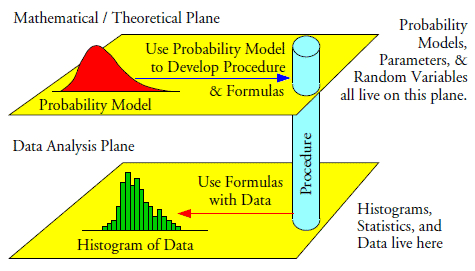
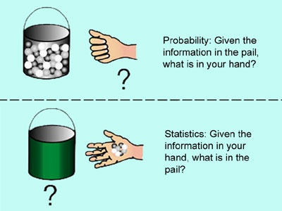

# (PART) Introduction {-}

# What is statistics? {-}

**Statistics** is a [scientific]{.ul} subject on
collecting and analysing data.

-   **Collecting** means designing experiments, designing
    questionnaires, designing sampling schemes, administration of data
    collection.

-   **Analysing** means modelling, estimation, testing, forecasting.

Statistics is an [application-oriented]{.ul} mathematical subject; it is
particularly useful or helpful in answering questions such as:

-   Does a certain new drug prolong life for AIDS sufferers?

-   Is global warming really happening?

-   Are O-level and A-level examinations standard declining?

-   Is the house market in Brunei oversaturated?

-   Is the Chinese yuan undervalued? If so, by how much?


##  Learning statistics {-}

There are three aspects to learning statistics:

1. **Ideas and concepts**. Understanding why statistics is needed, and what you are able to do and not do with statistics.

2. **Methods**. Knowing "how to do" (applied) statistics.

3. **Theory**. Knowing the "why" of statistics and understanding why things are the way they are. Very mathematics focused.


In this course, there is an emphasis on the **theory** aspect of statistics.


> *Students who analyze data, or who aspire to develop new methods for analyzing data, should be well grounded in basic probability and mathematical statistics. Using fancy tools like neural nets, boosting, and support vector machines without understanding basic statistics is like doing brain surgery before knowing how to use a band-aid. ---Larry Wasserman (in All of Statistics)*

## Population, sample and parametric models {-}

### Two practical situations {-}


1. BMW M Division has proudly unveiled the successor to their current "king of sedans", the new BMW M3 Competition (G80), sporting a 503 bhp twin-turbo 3.0 litre inline-six S58 engine with a claimed acceleration rate of 0-100 km/h in 3.9 seconds.


2. The Authority for Info-communications Technology Industry of Brunei Darussalam (AITI) conducted the Household ICT Survey in 2018 and reported that 95% percent of individuals personally use the internet on a daily basis, a slight decrease from 97% in the year 2016. Estimates are accurate within 2% margin of error with 95% confidence.

Your immediate thought should be "how can I trust these figures?"

### Population vs sample {-}

In both cases, the conclusion is drawn on a *population* (i.e. all of
the subjects concerned) based on the information from a *sample* (i.e.
a subset of the population).


1. For BMW M Division, it is **impossible** to measure the entire population (obtain the acceleration rates), constituting all BMW M3 (G80) cars that have been made and are yet to be made.

2. For AITI, while possible, it is (economically) infeasible to measure the entire population, i.e. to ask everyone in Brunei whether or not they use the internet on a daily basis.

The *population* is an entire set of the objects concerned, and those objects are typically represented by some numbers. We [do not know]{.ul} the entire population in practice.
A *sample* is a randomly selected subset of a population, and is a set of [known data]{.ul} in practice.


### Parametric models {-}

For a given problem, we typically assume a population
to follow a *probability distribution* with pdf/pmf $f(x|\theta)$.

-   The form of the distribution i.e. $f(\cdot|\theta)$ is known (e.g.
    normal, Poisson, exponential, etc.).

-   The "specifics" of the distribution is (assumed to be) **not
    known**, but potentially knowable if data were available.


The unknown characteristics of the distribution are represented by $\theta$ (such as the mean, variance, rate, etc.). 
We call $\theta$ the parameter(s) of the model.
Such an assumed distribution is called a **parametric model**.
For the two earlier examples,

1. Let $X =$ acceleration of BMW M3 G80 vehicles. Assume $X\sim\N(\mu,\sigma^2)$. Here  $\btheta = (\mu,\sigma^2)^\top$, where $\mu$ is the 'true' acceleration rate.

2. Let $\{0,1\} \ni X =$ someone in Brunei uses the internet daily. Assume $X\sim\Bern(p)$. Here $\theta = p$, the 'true' proportion of daily internet users in Brunei.



### A sample: a set of data or random variables?--A duality {-}

A sample of size $n$, $\{X_1,\dots,X_n\}$, is also called a *random* sample. It consists of $n$ concrete numbers in a practical problem.
The word 'random' captures the characteristic of the sample (of the same
size) being different.

- The sample may be taken by different people or entities.
- The sample may be obtained  under different circumstances.
- etc.
Essentially, they would be different subsets of a population.

Furthermore, a sample is also viewed as $n$ independent and identically
distributed (iid) random variables, when we assess the performance of a
statistical method.

###  Variability of estimates {-}

- For the BMW M example, suppose a sample of $n=38$ used gave the sample mean
$$\bar X_n = \frac{1}{n}\sum_{i=1}^n X_i = 3.9$$

- A different sample may well give a different sample mean.
Example: 29 YouTubers and other social media "influencers" were given access to the new M3 on a race track, and their sample mean yielded $\bar X_n = 3.4$.

-  Is the sample mean $\bar X_n$ a good estimator for the unknown
'true' acceleration $\mu$? Obviously, we cannot use the concrete number
3.9 to assess how good this estimator is, as a different sample may
give a different average value.

::: {.rmdnote}
By treating $X_1,\dots,X_n$ as random variables, $\bar X_n$ is
also a random variable, so has a distribution. If the distribution of
$\bar X_n$ concentrates closely around the unknown $\mu$, then it is a
good estimator!
:::


- For the AITI example, there is that statement *'...accurate to within 2% margin of error with 95% confidence'*. This statement alludes to the variability of the estimate, if another random sample was obtained.

- The estimate in this case was also the sample mean,
\[
\hat p = \bar X_n = \frac{1}{n}\sum_{i=1}^n X_i.
\]

- Mathematically, the confidence statement reads
\[
  \Pr(|\hat p - p| \leq 0.02 ) = \Pr\big(p\in [\hat p-0.02, \hat p + 0.02]\big) = 0.95
\]
  that is, the true value is covered 95% of the time inside an interval of width 0.02 under repeated sampling. This statement is made possible due to the *randomness* of the estimator $\hat p$.

## Probability and statistics {-}

We've just implicitly described the three main activities concerning [statistical inference]{.ul}.

1. **Point estimation**

    *"What is $\mu$?"*


2. **Hypothesis testing**

    *"Is $p=0.95$ and not $p=0.97$?"*

3. **Interval estimation**

    *"What's an upper and lower bound estimate for $p$?"*

These three activities will be the main focus of this course, and we will formalise the notion of each one in turn.
Hopefully you can now appreciate how statistics is an inherently applied subject, making use of mathematics (probability in particular) to answer problems across a variety of fields.

### Probability vs statistics {-}

```{r, echo=FALSE, engine='tikz', out.width ="48%"}
\begin{tikzpicture}
\draw [fill=gray!30,very thick] (0,-1) rectangle (5,1);
\draw [very thick] (5, 0) -- (13,0);
\node [below] at (2,-1) {\large Hello};
\node [below, align=center] at (0,-1) {\large Two\\ lines};
\end{tikzpicture}
```

<!-- ```{r, echo=FALSE, engine='tikz', out.width ="48%"} -->
<!-- \definecolor{navyblue}{RGB}{0, 47, 92} -->
<!-- \definecolor{charcoal}{RGB}{54,69,79} -->
<!-- \definecolor{gray}{RGB}{128, 128, 128} -->
<!-- \definecolor{solidpink}{HTML}{8E3B46} -->
<!-- \definecolor{queenpink}{HTML}{EAD1D6} -->
<!-- \definecolor{orangecrayola}{HTML}{FFD166} -->
<!-- \definecolor{paradisepink}{HTML}{EF476F} -->
<!-- \definecolor{myrtlegreen}{HTML}{346B61} -->
<!-- \definecolor{lightcyan}{HTML}{CCE8E3} -->
<!-- \usetikzlibrary{fit,positioning,shapes.geometric,decorations.pathreplacing,calc} -->
<!-- \begin{tikzpicture}[scale=0.9, transform shape] -->
<!-- \tikzstyle{obsvar}=[rectangle, thick, minimum size = 10mm,draw =black!80, node distance = 1mm] -->
<!-- \tikzstyle{connect}=[-latex, thick] -->

<!-- \node[obsvar] (fx) [] {$\hspace{1em}f(x|\theta)\hspace{1em}$}; -->
<!-- \node (xx) [right=of fx] {\textcolor{myrtlegreen}{$\{X_1,\dots,X_n\}$}}; -->
<!-- \node (theta) [left=of fx] {\textcolor{solidpink}{$\theta$}}; -->
<!-- \node (d1) [below=of fx,yshift=9mm] {Model}; -->
<!-- \node (d2) [below=of xx,yshift=11mm] {\scriptsize \textcolor{myrtlegreen}{prob.}}; -->
<!-- \node (d3) [below=of theta,yshift=11mm] {\scriptsize \textcolor{solidpink}{param.}}; -->
<!-- \node (d1) [above=of fx,yshift=-5mm] {\underline{Probability}}; -->

<!-- \path (fx) edge [connect] (xx) -->
<!--       (theta) edge [connect] (fx); -->

<!-- \end{tikzpicture} -->
<!-- ``` -->
<!-- ```{r, echo=FALSE, engine='tikz', out.width ="48%"} -->
<!-- \definecolor{navyblue}{RGB}{0, 47, 92} -->
<!-- \definecolor{charcoal}{RGB}{54,69,79} -->
<!-- \definecolor{gray}{RGB}{128, 128, 128} -->
<!-- \definecolor{solidpink}{HTML}{8E3B46} -->
<!-- \definecolor{queenpink}{HTML}{EAD1D6} -->
<!-- \definecolor{orangecrayola}{HTML}{FFD166} -->
<!-- \definecolor{paradisepink}{HTML}{EF476F} -->
<!-- \definecolor{myrtlegreen}{HTML}{346B61} -->
<!-- \definecolor{lightcyan}{HTML}{CCE8E3} -->
<!-- \usetikzlibrary{fit,positioning,shapes.geometric,decorations.pathreplacing,calc} -->
<!-- \begin{tikzpicture}[scale=0.9, transform shape] -->
<!-- \tikzstyle{obsvar}=[rectangle, thick, minimum size = 10mm,draw =black!80, node distance = 1mm] -->
<!-- \tikzstyle{connect}=[-latex, thick] -->
<!-- \node[obsvar] (fx) [] {$\hspace{1em}f(x|\theta)\hspace{1em}$}; -->
<!-- \node (xx) [right=of fx] {\textcolor{solidpink}{$\{x_1,\dots,x_n\}$}}; -->
<!-- \node (theta) [left=of fx] {\textcolor{myrtlegreen}{$\hat\theta$}}; -->
<!-- \node (d1) [below=of fx,yshift=9mm] {Model}; -->
<!-- \node (d2) [below=of xx,yshift=11mm] {\scriptsize \textcolor{solidpink}{data}}; -->
<!-- \node (d3) [below=of theta,yshift=11mm] {\scriptsize \textcolor{myrtlegreen}{est.}}; -->
<!-- \node (d1) [above=of fx,yshift=-5mm] {\underline{Statistics}}; -->

<!-- \path (fx) edge [connect] (theta) -->
<!--       (xx) edge [connect] (fx); -->
<!-- \end{tikzpicture} -->
<!-- ``` -->

In probability, we ask questions like

- What is $\E(X)$?
- What is $\Pr(X > a)$?

Whereas in statistics, we are interested in questions like

- What is $\theta$?
- Is $\theta$ larger than $\theta_0$?
- How confident am I that $\theta \in (\theta_l,\theta_u)$?



## Explore more {-}


Really recommended:

- [All About that Bayes: Probability, Statistics, and the Quest to Quantify Uncertainty](https://youtu.be/eDMGDhyDxuY). Talk by Dr. Kristin Lennox on YouTube.


- https://www.qualitydigest.com/inside/standards-column/secret-foundation-statistical-inference-120115.html
