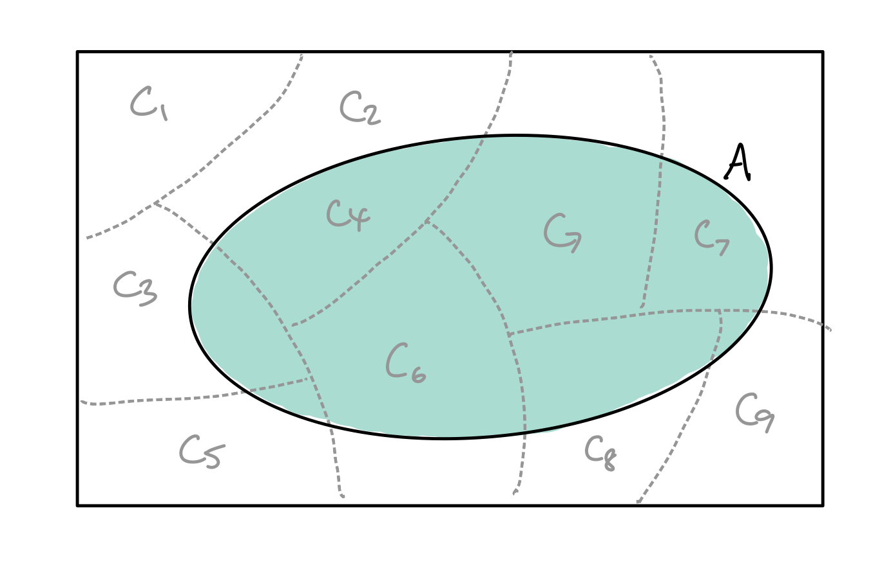
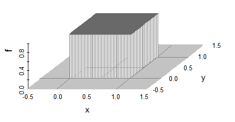

# (PART) Prepare {-}

# Probability theory primer

As I was looking for a rationale as to why we begin statistical inference with learning about probability theory, I notice that C&B couldn't have put it better:

> The subject of probability theory is the foundation upon which all statistics is built, providing a means for modeling populations, experiments, or almost anouthing else that could be considered a random phenomenon. Through these models, statisticians are able to draw inferences about populations, inferences based on examination of only a part of the whole. --- George Casella & Roger L. Berger in Statistical Inference

By right, probability theory and the mathematics of random events deserves one dedicate module of its own. For our purposes, it suffices to 'skim through the surface' as it were, and cover the basic and necessary ideas to move forward with statistical inference.

### Learning objectives {-}

::: {.learningobjectives}
By the end of this chapter, you will be able to:

- Compute probabilities of events by simple counting and application of various known probability results
- Understand the notion of conditional and independent events, leading up to the application of Bayes' Theorem
- Formalise mathematically the notion of random variables and make calculations using its distribution function 
- Compute expectations (and variances) including via the method of moment generating functions
:::

### Readings {-}

- Casella and Berger (2002)
    - All of Chapter 1 (skip sections 1.2.3 and 1.2.4).
    - Chapter 2, section 2.2 and 2.3 only.
    - Chapter 4, section 4.1, 4.2 and 4.5 only.
- Wasserman (2004)
    - All of Chapter 1.
    - Chapter 2, sections 2.1--2.2, 2.5--2.8.
    - Chapter 3, sections 3.1--3.5.
- Topics not covered: Counting and enumerating outcomes, moment generating functions (to be covered in the next topic), transformations of r.v., multivariate distributions (bivariate only).
- [YouTube video: The medical test paradox](https://www.youtube.com/watch?v=lG4VkPoG3ko)
- [YouTube video: Bayes theorem](https://www.youtube.com/watch?v=HZGCoVF3YvM)

## Elementary set theory

A discussion of probability theory is almost always begun by talking about the concept of 'sets'. 
As the term implies, sets are a collection of things. 
You're sure to come across sets before, such as the set of family members in your household, or the set of all natural numbers, or something even more funky like the set of all sets (the universal set^[Which, as it turns out, is a paradox: https://en.wikipedia.org/wiki/Russell%27s_paradox]).

When statisticians talk about sets it is usually in the context of conducting an "experiment"^[Although, we don't really mean it like how scientists mean experiments to be (we're not fiddling around with buttons or chemicals). I suppose it's more about the process of the (random) data generating mechanism itself.].
The important bits are:

- The sample space $\Omega$ is the set of possible outcomes of an experiment.
- Elements $\omega \in \Omega$ are called sample outcomes or realisations.
- Subsets of $E \subseteq \Omega$ are called events.

So whatever the context of the random process might be, we should be comfortable identifying what the sample space is, what its elements are, and what possible events might occur.

::: {.example}
In tossing a two-sided coin $n \geq 2$ times, let $H$ denote 'heads', while $T$ denote 'tails'. 
Let $\bomega = (\omega_1,\dots,\omega_n)$ be the results of these coin tosses. 
Then the sample space is \[
\Omega = \Big\{ \bomega \, \big|\, \omega_i \in \{H,T\} \Big\}.
\]
Let $E$ be the event that the first head appears on the second toss. Then this event can be mathematically described as
\[
E = \Big\{ \bomega \, \big|\, \omega_1 = T, \omega_2 = H, \omega_i \in \{H,T\} \text{ for } i > 2 \Big\}.
\]
:::

### Set operations

There are several things that we can do to sets much like we can do to numbers in arithmetic. Here is an abridged version of set operations.

- The **complement** of an event $A$, written $A^c$, is the set of all elements that are not in $A$: $A^c = \{\omega \mid \omega\not\in A \}$.
- The complement of $\Omega$ is the empty set $\emptyset = \{\}$.
- The  **union** of events $A$ and $B$ (thought of as "A or B or both") is defined
\[
A \cup B = \{\omega \in \Omega \,|\, \omega \in A \text{ or } \omega \in B \}.
\]
- The  **intersection** of events $A$ and $B$ (thought of as "A *and* B") is defined
\[
A \cap B = \{\omega \in \Omega \,|\, \omega \in A \text{ and } \omega \in B \}.
\]
- Unions and intersections on sets are **commutative**, **associative**, and **distributive**^[See C\&B Thm 1.14].

   - Commutativity: $A \cup B = B \cup A$ and $A \cap B = B \cap A$.
   
   - Associativity: $A \cup (B \cup C) = (A \cup B) \cup C$ and $A \cap (B \cap C) = (A \cap B) \cap C$.

   - Disributive laws: $A \cap (B \cup C) = (A \cap B) \cup (A \cap C)$ and $A \cup (B \cap C) = (A \cup B) \cap (A \cup C)$.

- DeMorgan's Laws: $(A \cup B)^c = A^c \cap B^c$ and $(A \cap B)^c = A^c \cup B^c$

::: {.mycheck}
It's pretty straightforward to prove the commutative, associative, distributive and DeMorgan's properties using the rules that precede them in the list. You may like to try this out yourself. Or you may have come across a kind of "sketch proof" involving **Venn diagrams**.
:::


The operations of unions and intersections can be extended to infinite collections of sets as well. 
If $A_1,A_2,A_3,\dots$ is collection of sets, all defined on a sample space $\Omega$, then
\begin{gather*}
\bigcup_{i=1}^\infty A_i = \{x \in \Omega \,|\, x\in A_i \text{ for some } i \}, \\
\bigcap_{i=1}^\infty A_i = \{x \in \Omega \,|\, x\in A_i \text{ for all } i \}.
\end{gather*}


::: {.example}
Let $\Omega=(0,1]$ and define $A_i=[1/i, 1]$. Then,
\begin{align*}
\bigcup_{i=1}^\infty A_i
&= \{1\} \cup [1/2, 1] \cup [1/3, 1] \cup \cdots = (0,1], \\
\bigcap_{i=1}^\infty A_i
&= \{1\} \cap [1/2, 1] \cap [1/3, 1] \cap \cdots = \{1\}.
\end{align*}
:::


### Partitions

We say that two events $A$ and $B$ are **disjoint** or **mutually exclusive** if $A \cap B = \{ \}$. Disjoint sets have no points in common.
Suppose that $A_1,A_2,\dots$ are events defined on $\Omega$ such that they are (pairwise) disjoint, i.e. 
$$
A_i \cap A_j = \{ \}, \text{ for } i \neq j.
$$
Then the collection $A_1,A_2,\dots$ forms a **partition** of $\Omega$.
Partitions divide the sample space into non-overlapping pieces.

 

::: {.example}
A deck of playing cards has four suits: $\clubsuit, \diamondsuit, \spadesuit, \heartsuit$. Let $A=\{\clubsuit,\diamondsuit\}$ and $B=\{\spadesuit, \heartsuit\}$. Then $A$ and $B$ form a partition of the sample space.
:::


::: {.example}
The set $\{\bbR_+, \bbR_{-}, \{0\}\}$ (ie the set of positive reals, negative reals, and zero respectively) is a partition of the real numbers $\bbR$ since 

- $\bbR_{+} \cup \bbR_{-} \cup \{0\}=\bbR$;
- $\bbR_{+} \cap \bbR_{-} = \bbR_{+} \cap  \{0\} = \bbR_{-} \cap  \{0\} = \{ \}$; and
- $\{\bbR_{+}$, $\bbR_{-}$, and $\{0\}\}$ are all non empty.

Note that $\{0\}$ is not an empty set. It contains exactly one element, the number zero.
:::

## Axiomatic probability

In principle, we can understand and easily grasp the notion of probability as the "frequency of an event occurring". 
But how do we operationalise this concept? That is, by what rules and mechanisms are we allowed to assign probabilities to events?
If we can overcome this task and are able to assign probabilities to (random) events in an experiment, then we can start to analyse them statistically!

### Probability as a measure

Let us take a measure-theoretic approach to defining probabilities. 
We will dive straight into the rigors of definitions before providing a somewhat apologetic rationale as to why such mathematical difficulties are required for probability theory.

As the name implies, measure theory is the theory about how we measure things (duh!).
Measure itself is a fundamental concept in mathematics, and it would be useful to come up with a mathematical framework for how we deal with everyday concepts like length, mass, area, volume, and so on.
Importantly, such a framework allow us to reliably measure in even higher dimensions or onto more abstract constructs not yet imaginable.

Intuitively, a measure is simply a function whose input is the thing we want to measure (let's call it a set), and whose output is a non-negative number. 
Don't worry, a formal definition will follow, but for now, call this function $\mu$. 
It would be fair to expect a measure $\mu$ to satisfy

- $A \subseteq B \Rightarrow \mu(A) \leq \mu(B)$
- $A \subseteq B \Rightarrow \mu(B-A)= \mu(B) - \mu(A)$
- If $\{A_1,A_2,\dots\}$ are mutually exclusive sets (disjoint), then $\mu\left(\cup_{i=1}^\infty A_i \right) = \sum_{i=1}^\infty \mu(A_i)$

The first property simply says that if $A$ is a subset of $B$, then the measure of $A$ is at most the measure of $B$.
The second property follows this up by saying that the measure of the set $B-A$, that is, the set that is obtained by starting with $B$ and taking away the parts that is contained in $A$, then the measure of this created set is the difference between the measures of $B$ and $A$.
Finally, the third property, also known as *countable additivity*, simply states that the measure of the whole is equal to the sum of the parts.
It turns out that the first and second properties follow from the third (and the fact that a measure cannot be negative)--see Definition \@ref(def:measure).

So we have this intuition about what the measure should be, but what about the stuff we want to measure?
For our purposes, we are interested in measuring subsets of $\Omega$.
We ask, are we able to measure all possible subsets of $\Omega$?
At a glance, perhaps if $\Omega$ is countable (e.g. $\Omega=\{1,2,3\}$), it is easy to describe the subsets of $\Omega$ through the power set^[For the example at hand, the power set is $\cP(\Omega)=\{ \{\}, \{1\}, \{2\}, \{3\}, \{1,2\}, \{1,3\}, \{2,3\}, \{1,2,3\}  \}$] $\cP(\Omega)$, which is the set of all possible subsets of $\Omega$, but what about when $\Omega$ is uncountable (e.g. an interval $\Omega=[0,1]\in\bbR$).
Given a sample space $\Omega$, we need to define the largest possible collection of subsets of $\Omega$ that can be observed and on which we can assign valid measure.

::: {.definition #sigmaalgebra name="\\(\sigma\\)-algebra"}
A collection $\cF$ of subsets of a set $\Omega$ is called a **$\sigma$-algebra** if it satisfies the following conditions:

i. If $A \in \cF$, then $A^c \in cF$ *[closed under complementation]*.
ii. If $A_1,A_2,\cdots \in \cF$, then $\cup_{i=1}^\infty A_i \in \cF$ *[closed under countable unions]*.
iii. $\{\} \in \cF$ *[contains the empty set]*.
:::

As a remark, condition iii. can be replaced with $\Omega\in\cF$ by virtue of condition i.. 
The $\sigma$-algebra is a collection of events or subsets of the sample space $\Omega$, including $\Omega$ itself and the empty set $\{\}$, which is closed under countable applications of set operations.
This is because DeMorgan's Law allows us to write the countable union property in iii. also as *countable intersections*: If $A_1,A_2,\cdots \in \cF$, then by i. $A_1^c,A_2^c,\cdots \in \cF$, and hence $\cup_{i=1}^\infty A_i\in\cF$ and also its complement. By DeMorgan's Law,
$$
\left( \cup_{i=1}^\infty A_i^c \right)^c = \cap_{i=1}^\infty A_i.
$$

Sets contained in $\cF$ are called **measurable sets**.

::: {.mynote}
The $\sigma$-algebra is an important condition for measure to not breakdown, because it helps draw a line as to which subsets of the sample space is measurable, and which is not. 
Out of interest, condition iii. in Definition \@ref(def:sigmaalgebra) is the condition that makes $\cF$ a $\sigma$-algebra (the $\sigma$ stands for countable [**s**]{.ul}um).
Without this condition, one ends up with just an *algebra* of sets, one that is most likely *too small*, failing to contain sets that we would like assign a measure.
:::

Let's take a look at some examples of $\sigma$-algebras.

::: {.example}
<br>

1. The trivial $\sigma$-algebra: $$\big\{ \{\}, \Omega \big\}.$$ This corresponds the case of no information. 

2. The power set of the sample space $\Omega$: $$\big\{ A \mid A \subseteq \Omega \big\}.$$ This corresponds the case of full information. 

3. The collection $\big\{ \{\}, A, A^c, \Omega \big\}$ is a $\sigma$-algebra, for any $A\subseteq \Omega$. 

4. Let $\Omega = \{a,b,c,d\}$. A possible^[You may notice that other $\sigma$-algebras are indeed possible, e.g. the power set of $\Omega$ in this case. There is a notion of the *smallest* $\sigma$-algebra containing the collection of "basic events". Luckily for us, the event space that we will usually be working with will be the smallest $\sigma$-algebra without much technicalities, so we shall not explore this concept any further.] $\sigma$-algebra is $$\big\{\{\}, \{a,b,c,d\}, \{a,b\}, \{c,d\} \big\}.$$ 

5. Define $B(s)$ to be a square of side length $s$. Let $\Omega$ be the collection of points in $(0,1)\times(0,1)\subset \bbR^2$ contained within the a unit square $B(1)$. Then $$\cF=\{ \text{Collection of points contained in the square } B(s) \text{ with } s \in (0,1) \}.$$ It should be clear there are uncountably many such squares that can be fit within the unit square.
:::

Just as a remark, most introduction to probability measure will deal with finite or countable sets when introducing $\sigma$-algebras, giving readers an impression that it's only possible to define $\sigma$-algebras on such sets. The fifth example above gives an example of a $\sigma$-algebra which is uncountable.

The twin $(\Omega,\cF)$ is called a *measurable space*. This sort of defines the "parts" of our problem which are measurable, as per Definition \@ref(def:sigmaalgebra). What's missing is a measure, i.e. the thing that actually tells us 'how long a piece of string is', so to speak^[https://idioms.thefreedictionary.com/How+long+is+a+piece+of+string%3F]. We now define a measure as follows.

::: {.definition #measure name="Measure"}
A *measure* $\mu$ is a non-negative real valued function defined on a $\sigma$-algebra, i.e. $\mu:\cF\to\bbR_{\geq 0}\cup\{\infty\}$, where $\bbR_{\geq 0}$ are the non-negative real numbers and $\cF$ a $\sigma$-algebra of subsets of $\Omega$. The measure $\mu$ satisfies the following properties:

i. $\mu(\{\})=0$.
ii. $\mu$ is countably additive, i.e. if $A_1,A_2,\dots$ are disjoint events, then $$\mu\left( \cup_{i=1}^\infty A_i \right) = \sum_{i=1}^\infty \mu(A_i).$$
:::

If, in addition the measure of the entire sample space is normalised (i.e. $\mu(\Omega)=1$), then $\mu$ is called a **probability measure**. We will see this in the next section.

The triplet $(\Omega,\cF,\mu)$ is called a *measure space* (note that without the measure it is called a measurable space).
This space simply tells us the parts needed for well-defined measure to take place on the subsets of $\Omega$.


<!-- ::: {.remark} -->
<!-- See Defn 1.2.1 in C&B and the following examples, as well as §1.9 in Wasserman. -->
<!-- ::: -->
<!-- ::: {.remark} -->
<!-- There are alternative formulations/approaches to defining probabilities, e.g. Cox's Theorem (logical probabilities). -->
<!-- ::: -->

::: {.example}
<br>

1. The counting measure. Let $\Omega$ be a countable set [You may be creative as you like here to make this less abstract, e.g. the books on your shelf or the members of your family, although the set need not be finite]. Let $\cF=\cP(\Omega)$ be the power set of $\Omega$. For all sets $A\in\cA$, define $$\mu(A) = \begin{cases} |A| & A \text{ has finitely many elements}\\ \infty &\text{otherwise} \end{cases}$$ where the operator $|\cdot|$ represents the *cardinality* of the set, i.e. the number of elements it contains (its size).
    
2. The Lebesgue measure in one dimension. Let $\Omega=\bbR$, and define $\cF$ to contain all sets of the form

   - [a,b], i.e. closed intervals,
   - (a,b), i.e. open intervals,
   - (a,b], i.e. open-closed intervals; and
   - [a,b), i.e. closed-open intervals.

   for all real numbers $a$ and $b$. We can deduce that the $\sigma$-algebra $\cF$ contains all possible "nice" intervals of the real line, including unbounded intervals and even singletons, which means any continuous partition of the real line can be measured (including a point, which should have measure zero). To see this, using the properties of $\sigma$-algebras,
   
   - unbounded intervals are in $\cF$, since, for instance $$(x,+\infty)=\cup_{i=1}^\infty(x,x+i).$$
   
   - singletons are in $\cF$, since $$\{x\}=\cap_{i=1}^\infty (x-1/i,x+1/i).$$
   
   This set $\cF$ has a special name, called the Borel $\sigma$-algebra. 
   
   All that's left is to define the measure. The Lebesgue measure $\mu$ assigns the usual concept of length to any continuous interval on $\bbR$ (to be precise, the Borel $\sigma$-algebra on $\bbR$): $$\mu\left(A\right)=b-a$$
   where $A$ is any interval of $\bbR$ of the above forms (closed, open, open-closed, closed-open). This measure works even for singleton sets or unbounded intervals.
:::

### Axioms of probability

In the previous section, we defined a measure space as the triplet $(\Omega,\cF,\mu)$. 
This formulation lets us work on the set of interest $\Omega$, and defines the possible measurable subsets $\cF\subseteq \Omega$, as well as the measuring device $\mu$.
This framework generalises the intutive notions of length, area, and volume to higher dimensions and more abstract notions.

In probability theory, we are interested in making use of measure theory to assign probabilities to events. So again in the context of conducting an "experiment",

- The sample space $\Omega$ is the set of possible outcomes $\{\omega_1,\omega_2,\dots\}$ of the experiment. 
- The $\sigma$-algebra $\cF\subseteq\Omega$ would define the set of possible outcomes that are measurable, and are able to be assigned probabilities. $\cF$ is known as the *event space*.

All that's left is to define a *probability measure* on the measurable space $(\Omega,\cF)$.

::: {.definition name="Axioms of Probability"}
Given a measurable space $(\Omega,\cF)$, a *probability measure* (or *probability function*) is a function $\bbP:\cF\to[0,1]$ that satisfies the following three conditions:

i. $\bbP(E) \geq 0, \forall E \in \cF$.
ii. $\bbP(\Omega) = 1$.
iii. For pairwise disjoint events $A_1,A_2,\dots$, $$\bbP\bigg( \bigcup_{i=1}^\infty A_i  \bigg) = \sum_{i=1}^\infty A_i.$$

These three conditions are commonly known as the *Axioms of Probability*, or *Kolmogorov Axioms*.
:::

This is pretty much similar to the definition of the measure $\mu$ for a measure space, except for the unitarity requirement $\bbP(\Omega)=1$. 
The first and second condition implicitly states that probabilities are always [finite]{.ul}, by the results of Theorem \@ref(thm:derivedprobres1) below.
In contrast, measure theory allows for infinite measure.

The second condition above states that the probability of *at least* one of the elementary events in the entire space will definitely occur. 
One common misunderstanding here is to read the statement as "the probability of all of possible events occurring is 1", which is a rarer thing in most situations.

As a remark, the above axioms does not tell us anything about what the functional form of $\bbP$ actually is.
It is pretty abstract, but the good thing is that any such function that satisfies the above three axioms is by definition a probability function.
At this point, there is still no notion of *randomness* in play.
All we are doing is providing the building blocks to be able to assign a numerical representation of (un)certainty of some particular event happening.

```{r kolmogorov, echo = FALSE, fig.align = "center", out.width = "50%", fig.cap = "Andrey Nikolaevich Kolmogorov 25 April 1903--20 October 1987. Widely considered to be the father of probability theory."}
knitr::include_graphics("figure/kolmogorov.jpg")
```

::: {.mynote}
As mentioned, any function abstract or concrete satisfying the Probability Axioms is regarded as a probability function. 
But what does the probability number represent, and what does it actually mean?
Broadly speaking, there are two main interpretation of probabilities. 

1. The **frequentist** interpretation is one that relies on "long run" frequencies. A probability of heads being 50% in a coin flip is interpreted to mean the following: If we flip the coin many times, then the proportion of heads that is observed will be 50\% in the long run.

2. The **subjectivist** or Bayesian interpretation is that the probability measures an observer's strength of belief that the event is true. Put a different way, it is the measure of ignorance on the observers part on what has happened. When a coin is flipped, it has landed either heads or tails, and this much is certain. What is uncertain is my *knowledge about the coin*, rather than the outcome of the coin itself. Setting a 50% probability for heads occuring implies that I am willing to bet at a 1:1 odds that the coin landed heads.
:::

::: {.example name="C\\&B 1.2.5"}
Consider the simple experiment of tossing a coin. 
Define the sample space to be $\Omega=\{H,T\}$, as representing the only two possible outcomes $H=$ heads or $T=$ tails.

What is the probability of heads occurring? 
The Axioms of Probability does not help us in this regard! (I mean, it does not give us a functional form for the probabilities)

Perhaps a function that assigns equal probability to either event would be a good place to start, so we require
\begin{equation}
\bbP(\{H\})=\bbP(\{T\}). (\#eq:headtail1)  
\end{equation}
At this point, we still don't know their values--the probabilities could be 0.1, 0.2, 0.3, or any other value.
Or could they?

Since $\Omega = \{H\} \cup \{T\}$, we know that by the Probability Axioms that
\begin{align}
1 = \bbP(\Omega) 
&= \bbP\left( \{H\} \cup \{T\} \right) \nonumber \\
&= \bbP(\{H\}) + \bbP(\{T\}) (\#eq:headtail2)
\end{align}
so the only possible value that satisfies both \@ref(eq:headtail1) and \@ref(eq:headtail2) is
$$
\bbP(\{H\})=\bbP(\{T\}) = 0.5.
$$

:::

Of course, without the restriction of equal probability in \@ref(eq:headtail1), then any two numbers satisfying \@ref(eq:headtail2) and the Probability Axioms would be valid, e.g. $\bbP(\{H\})= 0.8$ and $\bbP(\{T\}) = 0.2.$

::: {.example}
Two six-sided dice are thrown and the outcome for both dice are recorded. 

- As there are 36 possible outcomes, the sample space is 
$$
\Omega = \big\{ \omega_{ij}=\{i,j\} \mid i,j =1,\dots,6 \big\}
$$

- Suppose we are interested in the event $E$ defined to be *'the sum of the two scores is 6'*. These would be the events
  $$
  E := \big\{ \{1,5\}, \{2,4\}, \{3,3\}, \{4,2\}, \{5,1\} \big\}.
  $$
   One may easily construct a $\sigma$-algebra $\cF$ (for example, the power set of $\Omega$) and verify that the event $E$ is contained within it. So this is a measurable event.
   
So at this point, we might be thinking about a suitable probability function so that we may assign a probability to the event $E$.
Especially if the two dice are fair, it seems reasonable to assume that any of the outcome in $\omega_{ij}\in\Omega$ is equally likely to occur, so we set $\bbP(\omega_{ij}) = 1/36$ for any $i,j =1,\dots,6$.
In particular, the probability of any event should be proportional to the total number of outcomes in $\Omega$. 
As a quick exercise, you may check that such a probability function satisfies all the Kolmogorov Axioms.

\begin{align*}
\bbP(E) &= 
\bbP\left( \{1,5\} \cup \{2,4\} \cup \{3,3\} \cup \{4,2\} \cup \{5,1\} \right) \\
&= \bbP( \{1,5\}) + \bbP(\{2,4\}) + \bbP(\{3,3\}) \\
& \hspace{1em} + \bbP(\{4,2\}) + \bbP(\{5,1\}) \\
&= \frac{5}{36}
\end{align*}

Alternatively, we could have also easily argued that 
$$
\bbP(E) = \frac{|E|}{|\Omega|} = \frac{5}{36}.
$$
:::

As a remark, it would be very cumbersome to have to check the Kolmogorov Axioms every time we encounter a probability function.
For problems like the above, we won't run into any technical issues because the sample space is finite and/or countable^[See Theorem 1.2.6 in C&B.].
In general, most of the problems we will come across will satisfy the axioms automatically, especially with "nice" sample space and events, so we usually don't check axioms all the time.

::: {.mynote}
At this point, most textbooks go into a section about *counting*, namely using methods like combinations and permutations.
I'm sure you've encountered this previously in your statistics classes, and appreciate how useful they are when trying to calculate probabilities as being "the number of outcomes in the event space" divided by "the number of outcomes in the sample space". 
However, our focus for this course is to get to the inference section, and the topic of counting does not contribute much to that understanding, so I shall skip it.
:::

### Derived probability results

Let us now look at some useful probability results that can be derived from the probability axioms.

::: {.theorem #derivedprobres1}
Let $(\Omega,\cF,\bbP)$ be a probability space. For any $E\in\cF$,

i. $\bbP(\{\}) = 0$;
ii. $\bbP(E) \leq 1$; and
iii. $\bbP(E^c)=1-\bbP(E).$
:::

An important thing that we learn here is that probabilities are always finite and bounded within $[0,1]$, i.e. for any event $E$, $0 \leq \bbP(E) \leq 1$. 
So please, do not make the mistake of reporting *negative probabilities* or probabilities greater than one--they are mathematically impossible^[At least within the framework of the Kolmogorov Axioms. See: https://en.wikipedia.org/wiki/Negative_probability]!

::: {.mycheck}
The proof of Theorem \@ref(thm:derivedprobres1) is left an exercise. Try this out for yourself!
:::

Further results regarding two events in the sample space based on the Probability Axioms:

::: {.theorem}
Let $(\Omega,\cF,\bbP)$ be a probability space. For any $A,B \in\cF$,

i. $\bbP(B \cap A^c) = \bbP(B) - \bbP(A\cap B)$;
ii. $\bbP(A \cup B) = \bbP(A) + \bbP(B) - \bbP(A \cap B)$; and
iii. If $A \subseteq B$, then $\bbP(A) \leq \bbP(B)$.
:::

While these results are not so self-evident from the Probability Axioms, it may be useful to employ Venn diagrams to visualise the above statements.

```{r venn1, echo=FALSE, engine='tikz', out.width ="32%"}
\begin{tikzpicture}[scale=0.5]
\filldraw[fill=white] (-3,-2.5) rectangle (5,3);
\scope 
\fill[gray!50] (2,0) circle (2);
\fill[white] (0,0) circle (2);
\endscope
\draw (0,0) circle (2) (-1,1.9)  node [text=black,above] {$A$}
      (2,0) circle (2) (3,1.9)  node [text=black,above] {$B$}
      (-2.5,3) node [text=black,below] {i.};
\end{tikzpicture}
```
```{r venn2, echo=FALSE, engine='tikz', out.width ="32%"}
\begin{tikzpicture}[scale=0.5]
\filldraw[fill=white] (-3,-2.5) rectangle (5,3);
\scope 
\fill[gray!50] (2,0) circle (2);
\fill[gray!50] (0,0) circle (2);
\endscope
\draw (0,0) circle (2) (-1,1.9)  node [text=black,above] {$A$}
      (2,0) circle (2) (3,1.9)  node [text=black,above] {$B$}
      (-2.5,3) node [text=black,below] {ii.};
\end{tikzpicture}
```
```{r venn3, echo=FALSE, engine='tikz', out.width ="32%"}
\begin{tikzpicture}[scale=0.5]
\filldraw[fill=white] (-3,-2.5) rectangle (5,3);
\draw (0.5,0) circle (1) (0.2,1)  node [text=black,above] {$A$}
      (1,0) circle (2) (3,1)  node [text=black,above] {$B$}
      (-2.3,3) node [text=black,below] {iii.};
\end{tikzpicture}
```

::: {.proof}
<br>

i. Note that $B$ is composed of the two disjoint sets $B= \{B\cap A\} \cup \{ B \cap A^c\}$, so we have $$\bbP(B) = \bbP(B\cap A) + \bbP(B \cap A^c),$$ and the desired results is obtained after rearranging.

ii.  Using the identity $$A \cup B = (A \cup B) \cap \overbrace{(A \cup A^c)}^\Omega=A \cup \{B \cap A^c \},$$ we have that (since the two events are disjoint)
\begin{align*}
\bbP(A \cup B) &= \bbP(A) + \bbP(B \cap A^c) \\
&= \bbP(A) + \bbP(B \cap A^c) \\
&= \bbP(A) + \bbP(B) - \bbP(B\cap A).
\end{align*}

iii. Since $A \subseteq B$, $A \cap B = A$, using i. we get $$0 \leq \bbP(B \cap A^c) = \bbP(B) - \overbrace{\bbP(A\cap B)}^{\bbP(A)},$$ thus obtaining the desired result.
:::

::: {.theorem #lawoftotalprob name="Law of Total Probability"}
Let $(\Omega,\cF,\bbP)$ be a probability space. Let $A\in\cF$ and consider a (countably infinite) partition of the sample space $C_1,C_2,\dots$ such that $C_i\cap C_j = \{\}$ for any $i,j$ and $\bigcup_{i=1}^\infty C_i = \Omega$. Then
$$
\bbP(A) = \sum_{i=1}^\infty \bbP(A \cap C_i).
$$
:::

We may visualise the partitions of the sample space $C_i$ as well as the event $A$ of interest as follows:

```{r partitionsamplespace, echo = FALSE, fig.align = "center", out.width = "80%"}

```

Of course, we can only show a finite number of partitions for illustration, but this works for infinitely many countable partitions as well. We can see that the set $A$ is simply made up of the intersections of $A$ and the partitions.
Some of these intersections will be empty, but that's OK.

::: {.proof}
Write
$$
A = A \cap \Omega = A \cap \left(\bigcup_{i=1}^\infty C_i\right) = \bigcup_{i=1}^\infty(A \cap C_i)
$$
Evidently the events in the union on the right hand side of the equality are disjoint, since $C_i$ themselves are disjoint. 
Therefore,
\begin{align*}
\bbP(A) 
&= \bbP\left(\bigcup_{i=1}^\infty(A \cap C_i) \right) \\
&= \sum_{i=1}^\infty \bbP(A \cap C_i)
\end{align*}
as required.

:::


### Why measure theory?

*You may treat this section as optional, but it would deepen your understanding of probability theory.*

Consider the uniform distribution on a random variable $X$ on the unit interval, denoted $X\sim\Unif(0,1)$. You may have come across this before, and know that the probability that $X$ lies in any interval contained in $[0,1]$ is simply the length of the interval, i.e.
\begin{equation}
\bbP\big([a,b]\big) = \bbP\big([a,b)\big) = \bbP\big((a,b]\big) = \bbP\big((a,b)\big) = b-a, (\#eq:meas1)
\end{equation}
for $0 \leq a \leq b \leq 1$. This definition works fine for the degenerate case $\bbP(\{a\})=0$ for the singleton set $\{a|a\in(0,1)\}$.
In general, if $A$ and $B$ are disjoint subsets of $[0,1]$ then 
\begin{equation}
\bbP(A \cup B) = \bbP(A) + \bbP(B),
\end{equation}
and we can even extend this notion to that of *countable additivity*
\begin{equation}
\bbP\left( \cup_{i=1}^\infty A_i \right) = \sum_{i=1}^\infty \bbP(A_i), (\#eq:meas2)
\end{equation}
for disjoint sets $\{A_1,A_2,\dots\}$^[A concrete example of this is for the sets $A_1=(0,1/2)$, $A_2=(1/2, 3/4)$, $A_3=(3/4,7/8)$, and so on (adding half the interval at each iteration). One finds that the measure of the countable union is $\sum_{i=1}^\infty (1/2)^i=1$.].

For a uniform measure on $[0,1]$, one expects that the measure of some subset $A \subseteq [0,1]$ to be unaffected by "shifting" (with wrap-around) of that subset by some fixed amount $r\in[0,1]$.
Define the *$r$-shift* of $A\subseteq [0,1]$ by
$$
A \oplus r := \left\{ a + r \mid a \in A, a+r \leq 1 \right\} \cup \left\{ a + r - 1 \mid a \in A, a+r > 1 \right\}.
$$
Then we should have
\begin{equation}
\bbP(A \oplus r) = \bbP(A). (\#eq:meas3)
\end{equation}

```{r wraparoundmeasureanim, cache = TRUE, echo = FALSE, warning = FALSE, message = FALSE, fig.height = 2, gganimate = list(nframes = 30 * 3.5, fps = 30, rewind = TRUE), fig.cap = "An interval in [0,1] shifted by some fixed amount, with wrap-around, should have consistent length.", include = knitr::is_html_output()}
k <- 60
plot_df <- tibble(
  x1   = seq(0.2, 0.2 + 0.6, length = k),
  x2   = seq(0.6, 0.6 + 0.6, length = k),
  type = 1:k
) %>%
  mutate(over = x1 > 1 | x2 > 1)

over_df <-
  filter(plot_df, over == TRUE) %>%
  mutate(x2 = x2 - 1,
         x1 = ifelse(x2 < 0.4, 0, x2-0.4))

plot_df <- mutate(plot_df, x2 = ifelse(x2 > 1, 1, x2)) %>% filter(x1 < 1)

library(gganimate)
ggplot(bind_rows(plot_df, over_df), aes(x1, y = 1, xend = x2, yend = 1)) +
  geom_segment(size = 2) +
  scale_x_continuous(breaks = seq(0, 1, by = 0.1), limits = c(0, 1)) +
  labs(y = NULL, x = NULL) +
  theme(axis.text.y = element_blank(), axis.ticks.y = element_blank()) +
  transition_manual(type) -> p
# animate(p, fps = 30, nframes = 75, rewind = TRUE)
p
```
```{r wraparoundmeasurepdf, echo = FALSE, warning = FALSE, message = FALSE, fig.height = 2.5, fig.cap = "An interval in [0,1] shifted by some fixed amount, with wrap-around, should have consistent length.", include = !knitr::is_html_output()}
k <- 60
plot_df <- tibble(
  x1   = seq(0.2, 0.2 + 0.6, length = k),
  x2   = seq(0.6, 0.6 + 0.6, length = k),
  type = 1:k
) %>%
  mutate(over = x1 > 1 | x2 > 1)

over_df <-
  filter(plot_df, over == TRUE) %>%
  mutate(x2 = x2 - 1,
         x1 = ifelse(x2 < 0.4, 0, x2-0.4))

plot_df <- mutate(plot_df, x2 = ifelse(x2 > 1, 1, x2)) %>% filter(x1 < 1)

bind_rows(plot_df, over_df) %>%
  filter(type %in% c(1, 25, 60)) %>%
  mutate(type = factor(type, labels = c("Original", "Shift", "Wraparound"))) %>%
  ggplot(aes(x1, y = 1, xend = x2, yend = 1)) +
  geom_segment(size = 2) +
  scale_x_continuous(breaks = seq(0, 1, by = 0.1), limits = c(0, 1)) +
  labs(y = NULL, x = NULL) +
  theme(axis.text.y = element_blank(), axis.ticks.y = element_blank()) +
  facet_grid(type ~ .)
```

At this point you might notice that all of this resonates with the previous example on the Lebesgue measure, except perhaps the shifting part, and indeed that is the case. 
Suppose that we dispense with measure theory and do not define things like the $\sigma$-algebra on the $[0,1]$ or the triplet $(\Omega,\cF,\bbP)$, and only use the above probability definitions given in \@ref(eq:meas1), \@ref(eq:meas2), and \@ref(eq:meas3).
How far can we push the boundaries of such probability definitions before things start to breakdown?
 
Consider these questions:

- What is the probability that $X$ is rational?
- What is the probability that $X^n$ is rational for some positive integer $n$?
- What is the probability that $X$ is *algebraic*^[An algebraic number is a number that is a root of a non-zero polynomial in one variable with integer coefficients.]?

All seemingly fair and interesting questions, but are they well defined? Can we actually measure them and assign probabilities to such events? Taking a step back further, we ask:

> Are all possible subsets $A\subseteq [0,1]$ measurable? Does $\bbP(A)$ even make *sense* for any event $A$ we can think of?

It turns out the answer is no, and can be proven by contradiction with the help of equivalence relations.
This shows the need for the heavy machinery that is measure theory for assigning probabilities to events^[Or at least, for cases where "not so nice" events need to be measured.].


<!-- Before we go there, there's one helpful property of measures that we should expect it to have (at least, when considering lengths of intervals such as in the uniform distribution above): *translation invariance*. -->
<!-- What we mean by this is that the measure of a set should remain unchanged even if it is subjected to fixed amount of "shift". -->
<!-- In particular, this is reflected in a more general form of the uniform distribution on an interval $(c,d)$, where -->
<!-- \begin{equation} -->
<!-- \bbP([a,b]) = \frac{b-a}{d-c} = \Pr\big(Y\in[a,b] \big\mid Y\sim\Unif(c,d)\big), (\#eq:uniformshift) -->
<!-- \end{equation} -->
<!-- for $c\leq a\leq b\leq d$.  -->
<!-- If our random variable $X\sim\Unif(0,1)$ is shifted by some amount $k\in\bbR$, then the values of $c$ and $d$ in \@ref(eq:uniformshift) are $c=r$ and $d=1+r$, whence  -->
<!-- $$ -->
<!-- \Pr\big(Y\in[a,b]  \big\mid Y\sim\Unif(r,1+r)\big) = b-a = \Pr\big(X\in[a,b]  \big\mid X\sim\Unif(0,1)\big). -->
<!-- $$ -->


::: {.proposition}
There does not exist a definition of $\bbP(A)$, defined for all subsets $A\subseteq[0,1]$, satisfying \@ref(eq:meas1), \@ref(eq:meas2), and \@ref(eq:meas3).
:::

::: {.proof}
All we need to show is the existence of one such subset of $[0,1]$ whose measure is undefined. The set we are about to construct is called the Vitali set^[https://en.wikipedia.org/wiki/Vitali_set], after Giuseppe Vitali who described it in 1905.

Define an equivalence relation on $[0,1]$ by the following: 
$$x\sim y \Rightarrow y-x \in \bbQ$$
That is, two real numbers $x$ and $y$ are deemed to be the same if their difference is a rational number. We would like to separate all the real numbers $x\in[0,1]$ by this equivalence relation, and collect them into groups called equivalence classes, denoted by $[x]$. Here, $[x]$ is the set $\{y \in [0,1] \mid x \sim y\}.$ For instance, 

- The equivalence class of $0$ is the set of real numbers $x$ such that $x \sim 0$, i.e. $[0] = \{y \in [0,1] \mid y-0\in\bbQ \}$, which is the set of all rational numbers in $[0,1]$.

- The equivalence class of an irrational number $z_1\in[0,1]$ is clearly not in $[0]$, thus would represent a different equivalent class $[z_1]=\{y \in [0,1] \mid y-z_1 \in \bbQ \}$.

- Yet another irrational number $z_2\not\in [z_1]$ would exist, i.e. a number $z_2\in[0,1]$ such that $z_2-z_1 \not\in\bbQ$, and thus would represent another equivalence class $[z_2]$.

- And so on... The equivalence classes may be represented by $[0],[z_1],[z_2],\dots$ where $z_i$ are all irrational numbers that differ by an irrational number, and there are uncountably many such numbers and therefore classes. 

Construct the Vitali set $V$ as follows: Take precisely one element from each equivalent class, and put it in $V$. As a remark, such a $V$ must surely exist by the Axiom of Choice^[Given a collection of non-empty sets, it is always possible to construct a new set by taking one element from each set in the original collection. See https://brilliant.org/wiki/axiom-of-choice/]. 

Consider now the union of shifted Vitali sets by some rational value $r\in[0,1]$,
$$
\bigcup_{r} (V \oplus r)
$$
As a reminder, the set of rational numbers is countably infinite^[https://www.homeschoolmath.net/teaching/rational-numbers-countable.php]. We make a few observations:

- The equivalence relation partitions the interval $[0,1]$ into a disjoint union of equivalence classes. In other words, the sets $(V \oplus r)$ and $(V \oplus s)$ are disjoint for any rationals $r\neq s$, such that $r,s\in[0,1]$. If they were not disjoint, this would mean that there exists some $x,y\in[0,1]$ with $x+r\in(V \oplus r)$ and $y+s\in (V \oplus s)$ such that $x+r=y+s$. But then this means that $x-y=s-r\in\bbQ$ so $x$ and $y$ are in the same equivalent class, and this is a contradiction.

- Every point in $[0,1]$ is contained in the union $\bigcup_{r} (V \oplus r)$. To see this, fix a point $x$ in $[0,1]$. Note that this point belongs to some equivalent class of $x$, and in this equivalence class there exists some point $\alpha$ which belongs to $V$ as well by construction. Hence, $\alpha \sim x$, and thus $x-\alpha=r\in\bbQ$, implying that $x$ is a point in the Vitali set $V$ shifted by $r$. Therefore, $$[0,1] \subseteq  \bigcup_{r} (V \oplus r).$$ and we may write $$1 = \bbP([0,1]) \leq \bbP\left(\bigcup_{r} (V \oplus r)\right),$$ since the measure of any set contained in another must have smaller or equal measure. This relation is in fact implied by  \@ref(eq:meas2). Let $A$ and $B$ be such that $A \subseteq B$. Then we may write $B = A \cup (B-A)$ where the sets $A$ and $B-A$ are disjoint. Hence, $\bbP(B)=\bbP(A)+\bbP(B-A)$, and since measures are non-negative and in particular $\bbP(B-A)\in[0,1]$, we have that $\bbP(B)\geq \bbP(A)$. However since the probability measure cannot be greater than 1, it must be equal to 1.

- The disjoint union $\bigcup_{r} (V \oplus r)$ has probability measure (according to our definitions in \@ref(eq:meas1), \@ref(eq:meas2), and \@ref(eq:meas3))
   \begin{align*}
   \bbP\left(\bigcup_{r} (V \oplus r)\right) 
   &= \sum_r \bbP(V \oplus r) \\
   &= \sum_r \bbP(V) 
   \end{align*}
   
Putting these three observations together gives us
$$
1 = \bbP\left(\bigcup_{r} (V \oplus r)\right)  = \sum_r \bbP(V).
$$
This leads to the desired contradiction: A countably infinite sum of the same quantity repeated can only equal 0, $+\infty$, or $-\infty$, but it can never equal 1.
:::

In summary,

- Not all subsets of uncountable sets are measurable. Admitting all subsets of uncountable sets will break mathematics.
- $\sigma$-algebras are the patch that fixes mathematics. It gatekeeps the subsets of uncountable sets and disregards those which are not measurable.
- Actually, if you have been following along, you might realise that we are at risk of breaking mathematics when dealing with uncountable sets. Strictly speaking, we only need $\sigma$-algebras when working in a set with uncountable cardinality.

Finally, what on earth is an "unmeasurable" set? Wouldn't it be (even arbitrarily) possible to just define a measure for whatever set we can think of? If the above example hasn't convinced you enough, some other mathematicians have tried to resolve this but it seems it is not possible to do so without encountering paradoxes, such as the one below.

> The Banach–Tarski paradox states that a ball in the ordinary Euclidean space can be doubled using only the operations of partitioning into subsets, replacing a set with a congruent set, and reassembly.


To be clear, no rule of mathematics are broken in the Banach-Tarski paradox, but the result defies intuition. Another statement of this paradox is that *we can chop up a pea into finitely many pieces and reassemble it into the sun* (pea-sun paradox). If we don't lay out the foundations for measuring probabilities rigorously, we can end up with nonsensical answers!

This section was highly inspired by the following references:

- Rosenthal, J. (2006). A first look at rigorous probability.
- The discussion here: https://stats.stackexchange.com/q/199280 
- This YouTube video on Vitali Sets: https://youtu.be/ameugr-wjeI


## Conditioning and independence

In the previous section, the probabilities we encountered are *unconditional*, in the sense that the probabilities do not depend on any other external factors or information, and only on the (fixed) information in the sample space.
In contrast, we may talk about *conditional probabilities*.
If the sample space gets updated based on observation of new information, then this will sure impact probability calculations.

::: {.definition #condprob name="Conditional probabilities"}
Let $(\Omega,\cF,\bbP)$ be a probability space. For any $A,B \in\cF$ such that $\bbP(B)>0$, the *conditional probability* of $A$ given $B$, written $\bbP(A | B)$, is defined to be
\[
  \bbP(A | B) = \frac{\bbP(A \cap B)}{\bbP(B)}.
\]
:::

The event $B$ is known as the *conditioning event*. 
For all intents and purposes, we may view $\bbP(A | B)$ as "the probability that $A$ occurs, given that we know that $B$ has [already]{.ul} occurred".
In this sense, the given information forms an updated sample space (as $\bbP(B | B) = 1$): 
All further occurrences are calibrated with respect to their relation to $B$.
Thus, $\bbP(A | B)$ as *the fraction of times $A$ occurs among those in which $B$ occurs*.

Note that for mutually exclusive events $A$ and $B$, $\bbP(A | B)=\bbP(B | A)=0$ since $\bbP(A \cap B) = 0$. 
This makes sense because as the two events are disjoint, they have "nothing to do with each other".

::: {.myalert}
In general,  $$\bbP(A | B) \neq \bbP(A).$$ This is only true when dealing with independent events. Furthermore, in general $$\bbP(A | B) \neq \bbP(B | A).$$
:::


::: {.example}
A medical test for a disease $D$ has outcomes '$+$' and '$-$'. The probabilities are as follows:

|     | $D$ | $D^c$ |
|-----|:-----:|:-------:|
| $+$ | 0.009 | 0.099 |
| $-$ | 0.001 | 0.891 |

*note: each cell represents $\bbP(A \cap B)$.* 

From the definition of conditional probability,
\[
  \bbP(+|D) = \frac{\bbP(+ \cap D)}{\bbP(D)} = \frac{0.009}{0.009 + 0.001} = 0.90
\]
and
\[
  \bbP(-|D^c) = \frac{\bbP(- \cap D^c)}{\bbP(D^c)} = \frac{0.891}{0.099 + 0.891} \approx 0.90.
\]

Suppose you go for a test and get a positive result.
What is the probability you have the disease? 
Most will answer 0.90. 
Actually,
\[
  \bbP(D|+) = \frac{\bbP(D \cap +)}{\bbP(+)} = \frac{0.009}{0.009 + 0.099} = 0.08.
\]
:::

Notice that 

- $\bbP(D \cap +) = \bbP(+|D)\bbP(D)$ after some rearranging; and
- $\bbP(+) = \bbP(+ \cap D) + \bbP(+ \cap D^c)$ since $D$ and $D^c$ are disjoint.

We can therefore write
\[
\bbP(D|+) = \frac{\bbP(+|D)\bbP(D)}{\bbP(+|D)\bbP(D) + \bbP(+|D^c)\bbP(D^c)}.
\]
For $\bbP(D|+)$ to be large, it seems $\bbP(D)$ needs to be large in addition to $\bbP(+|D)$, i.e. disease is prevalent.

### Bayes Theorem

Following that previous example, and from the definitions of conditional probabilities, we have that, after some rearranging,
$$
\bbP(A | B)\bbP(B) = \bbP(A \cap B),
$$
and
$$
\bbP(B | A) \bbP(A)= \bbP(A \cap B).
$$
So equating the two together, one can relate the two conditional probabilities $\bbP(A | B)$ and $\bbP(B | A)$ by
$$
\bbP(A | B) = \frac{\bbP(B|A)\bbP(A)}{\bbP(B)}.
$$

Furthermore, by using the law of total probability, we can now state Bayes' Theorem.

::: {.theorem name="Bayes' Theorem"}
Let $(\Omega,\cF,\bbP)$ be a probability space, $A_1,A_2,\dots$ a partition of the sample space, and  $B$ be any set in $\cF$ such that $\bbP(B)>0$. 
Then, for each $i=1,2,\dots$,
\[
  \bbP(A_i|B) = \frac{\bbP(B|A_i)\bbP(A_i)}{\sum_{j=1}^\infty \bbP(B|A_j)\bbP(A_j)}.
\]
:::

The above rule provides a convenient way of computing conditional probability $\bbP(A|B)$ if  knowledge regarding the "reverse" conditional probability $\bbP(B|A)$ is readily available.

```{r revthomasbayes, echo = FALSE, fig.align = "center", out.width = "50%", fig.cap = "(Probably not) Rev. Thomas Bayes c. 1701--7 April 1761. This picture is commonly used to depict Thomas Bayes, but historians believe this not to be an accurate depiction."}
knitr::include_graphics("figure/bayes.jpg")
```

::: {.mynote}
Some will call $\bbP(A_i)$ the *prior probability*, and the $\bbP(A_i|B)$ *posterior probability*, especially in the context of Bayesian statistics. The terms refer to our state of knowledge before and after learning new information (respectively) that is used to update our beliefs.
:::

::: {.example}
In a certain selection of flower seeds, 2/3 have been treated to improve germination and 1/3 have been left untreated. 
For the purpose of this example, we may treat these numbers as probabilities of selecting a treated or untreated flower seed.

Furthermore, the seeds which have been treated have a probability of germination of 0.8, whereas the untreated seeds have a probability of germination of 0.5.

Let's calculate the probability that a seed, selected at random:

(a)  will germinate (assuming the seeds were sown and given time to germinate).
(b) a germinated seed had been treated.

First, let us define the following events:

- $T=$ a seed has been treated
- $T^c=$ a seed has not been treated
- $G=$ a seed has germinated
- $G^c=$ a seed has not germinated

We note that the events $T$ and $T^c$ are disjoint and partitions the sample space (a seed can either be treated or not), and so too the case with $G$ and $G^c$.
After some careful reading of the question, we are actually presented with the probabilities $\bbP(G|T)=0.8$ and $\bbP(G|T^c)=0.5$.

To answer a., we require $\bbP(G)$, which is obtained using the law of total probability:
\begin{align*}
\bbP(G) 
&= \bbP(G \cap T) + \bbP(G\cap T^c) \\
&= \bbP(G |T)\bbP(T) + \bbP(G|T^c)\bbP(T^c) \\
&= 2/3 \times 0.8 + 1/3 \times 0.5 = 0.7
\end{align*}

In answering b., we realise that we are after the quantity $\bbP(T|G)$. Using Bayes' Theorem,
\begin{align*}
\bbP(T|G)
&= \frac{\bbP(G|T)\bbP(T)}{\bbP(G)} \\
&= \frac{0.8 \times 2/3}{0.7} \\
&= 0.762
\end{align*}

:::

It's important to note here that $\bbP(G|T) \neq 1 - \bbP(G|T^c)$, and this is true in most cases. We cannot take complements with respect to the conditioning event!

### Independence

In some cases, the occurrence of a particular event $B$ has *no effect* on the probability of another event $A$. Mathematically, we can denote this as
\[
  \bbP(A | B) = \bbP(A).
\]
If this were true, we can use the relationship $\bbP(A \cap B) = \bbP(A | B)\bbP(B)$ to derive the following definition.

::: {.definition}
Two events $A$ and $B$ are *statistically independent* if and only if
\[
  \bbP(A \cap B) = \bbP(A)\bbP(B).
\]
:::

What's nice about this definition is that in order to check whether to events are independent, it is sufficient to check whether their probabilities multiply out in the manner above.
Note that (and it is easily checked!) that if $A$ and $B$ are independent then so too are

- $A$ and $B^c$;
- $A^c$ and $B$; and
- $A^c$ and $B^c$.

Here's an experiment we can do to examine the concept of independent events. 
Consider tossing a fair die.
Let $A = \{2, 4, 6\}$ and $B = \{1,2,3,4\}$.
You should be able to work out, using the above probability results and the definition of conditional probabilities, that  $\bbP(A)=1/2$, $\bbP(B)=2/3$, and $\bbP(A \cap B)=1/3$.
Hence, we deduce that $A$ and $B$ are independent, since the product of each probability event is the probability of their intersection.

If you were feeling bored and had a lot of time to spare, you could verify this empirically using an actual die. 
While this would be an afternoon well spent, let's use `R` to simulate some draws from the sample space $\Omega = \{1,2,3,4,5,6\}$, and count the number of times each events $A$, $B$ and $A \cap B$ occurs.

```{r diceexp1, echo = -1}
set.seed(123)
# Throw a dice 10 times
sample(1:6, size = 10, replace = TRUE)
```

From the above, $n(A) = 6$, $n(B)=6$, and $n(A \cap B)=3$.
Here I've used the notation $n(\cdot)$ to mean the count of the event.
Do this 1,000 times, and count events automatically using the following code.

```{r diceexp2, echo = TRUE}
x <- sample(1:6, size = 1000, replace = TRUE)
head(x, 100)  # show the first 100 outcomes
```

```{r diceexp3, echo = TRUE}
nA <- sum(x %in% c(2, 4, 6))  # counts the frequency of 2, 4, 6
nB <- sum(x %in% c(1, 2, 3, 4))  # counts the frequency of 1, 2, 3, 4
nAB <- sum(x %in% c(2, 4))  # counts the frequency of 2, 4

# Results
c(A = nA, B = nB, AnB = nAB) / 1000
```

Empirically, we have $\hat{\bbP}(A)\hat{\bbP}(B) =$ `r nA/1000` $\times$  `r nB/1000`$=$ `r nA * nB / 1000 ^ 2`.
This matches with the value of $\hat{\bbP}(A \cap B)$ in the table, as well as the theoretical value of 1/3.

## Random variables

Consider the following problem:
Ask (randomly) 50 people whether they like (code this as "1") or dislike (code this as "0") learning statistics.
What is the sample space for this experiment?
This would be all 1/0 combinations such as

\begin{align*}
\overbrace{1000101\cdots 10001}^{50}
\end{align*}
Specifically, $\Omega = \big\{(X_1,X_2,\dots,X_{50}) \,|\, X_i \in \{0,1\} \big\}$. Realise that $|\Omega| = 2^{50}$. This is huge^[For context, the average American, working full-time, would have to work 25 billion years to earn 1 quadrillion dollars.]! 


```{r}
2 ^ {50}
```

Is it practical to work with such a large sample space?
Possibly not, even with fancy counting techniques.

But what if we instead defined a variable $Y = \sum_{i=1}^{50} X_i$?
Here, $Y$ is the count of the number of people who like learning statistics from this sample of 50, since it only counts the values of '1's occuring.
Further, the minimum value for $Y$ is 0, and the maximum is 50. 
So the new sample space associated with $Y$ is $S=\{0,1,2,\dots,50\}$--much easier to deal with!

$Y$ is defined to be a mapping from the original sample space $\Omega$ to the new space $S$ (usually a set of real numbers).
Such a mapping is called a **random variable**.

::: {.definition name="Random variable"}
A *random variable* $X$ (abbreviated r.v.) on a probability space $(\Omega,\cF,\bbP)$ is a *measurable function*^[A measurable function is simply a function between the underlying sets of two measurable spaces. This will help preserve the structure of the spaces and allow things to be measured. See Wasserman, Appendix 2.13.] from $(\Omega,\cF)$ to $\bbR$, i.e. $X:\Omega\to\bbR$.
:::

This is much easier exaplained with an example.

::: {.example}
Flip a coin twice and let $X$ be the number of heads.
The sample space of the coin flips is $\Omega = \{\text{HH}, \text{HT}, \text{TH}, \text{TT} \}$.
The sample space of $X$ is $S = \{0,1,2 \}$.
The mapping of the random variable is illustrated as follows:

```{r, echo=FALSE, engine='tikz', out.width ="48%"}
\usetikzlibrary{shapes.geometric,fit}

\begin{tikzpicture}

\node[inner sep=.5pt] (TT) at (0,1) {TT};
\node[inner sep=.5pt] (TH) at (0,1.5) {TH};
\node[inner sep=.5pt] (HT) at (0,2) {HT};
\node[inner sep=.5pt] (HH) at (0,2.5) {HH};
\node[inner sep=.5pt] (Omega) at (0,-0.1) {$\Omega$};
\node[fit=(HH) (HT) (TH) (TT),ellipse,draw,minimum width=1cm] {}; 

\node[inner sep=.5pt] (zero) at (3,1.25) {0};
\node[inner sep=.5pt] (one) at (3,1.75) {1};
\node[inner sep=.5pt] (two) at (3,2.25) {2};
\node[inner sep=.5pt] (SS) at (3,0.25) {$S$};
\node[fit=(zero) (one) (two),ellipse,draw,minimum width=1cm] {}; 

\node[inner sep=.5pt] (X) at (1.5,2.7) {$X$};

\draw[-latex] (HH) -- (two);
\draw[-latex] (TT) -- (zero);
\draw[-latex] (HT) -- (one);
\draw[-latex] (TH) -- (one);
\end{tikzpicture}

```


:::

::: {.mynote}
The qualifier *random* to the term 'random variable' implies that its value is not known before observing it.
Random variables are conventionally denoted with uppercase letters, and the realised values of the variable will be denoted by the corresponding lowercase letters. Thus, the random variable $X$ can take the value $x$.
:::

We can see that a r.v. $X$  assigns a real number $X(\omega)$ to each outcome $\omega$. 
Can we still calculate probabilities of events? Yes.
\[
  \bbP(X=x) = \bbP\big(X^{-1}(x)\big) = \bbP\big(\{ \omega \in \Omega \,|\, X(\omega) = x\} \big)
\]
More generally,
\[
  \bbP(X\in S) = \bbP\big(X^{-1}(x)\big) = \bbP\big(\{ \omega \in \Omega \,|\, X(\omega) \in S \} \big)
\]

::: {.example #coinflip}
For the previous example, the random variable $X$ can be summarised as follows:

| $\omega$ | $\bbP(\{\omega\})$ | $X(\omega)$ |
|:--------:|:------------------:|:-----------:|
| TT | 1/4 | 0 |
| TH | 1/4 | 1 |
| HT | 1/4 | 1 |
| HH | 1/4 | 2 |

| $x$ | $\bbP(X = x)$ | $X^{-1}(x)$|
|:--------:|:------------------:|:-----------:|
| 0 | 1/4 | TT |
| 1 | 1/2 | TH, HT |
| 2 | 1/4 | HH |

In either case, the sum of the probabilities, whether in the original event space $\Omega$ or in the range of the random variable $S$, is equal to one.

:::

### Distribution functions

With every random variable $X$, we associate a function called the cumulative distribution function of $X$.

::: {.definition}
The *cumulative distribution function (cdf)* of a r.v. $X$, denoted $F_X$, is the function $F_X:\bbR\to[0,1]$ defined by
\[
  F_X(x) = \bbP(X \leq x), \text{ for all } x.
\]
The cdf is sometimes just referred to as the *distribution function*.
When there is no ambiguity regarding which random variable the cdf is referring to, we may drop the subcript in $F_X$.
:::

Equivalently, the distribution function is written
$$
F_X(x) = \bbP\left(\{\omega \in \Omega \mid X(\omega) \leq x \} \right).
$$

We make some observations regarding the distribution function:

- $\lim_{x\to-\infty} F(x) = 0$ and $\lim_{x\to+\infty} F(x) = 1$.
- $F(x)$ is non-decreasing, i.e. $x_1 < x_2 \Rightarrow F(x_1) \leq F(x_2)$. In other words, drawing the function from left to right, it must either increase or stay the same value, but not decrease in value.
- $F(x)$ is right-continuous: for every $x_0$, $\lim_{x \downarrow x_0} F(x) = F(x_0)$. This means "the solid dots will be on the left of the distribution function".
- $F$ itself *can be discontinuous* (see the next example). This is associated with whether the r.v. $X$ is continuous or not. That is,
   - $F_X(x)$ is a continuous function $\Rightarrow$ $X$ is continuous.
   - $F_X(x)$ is a step function $\Rightarrow$ $X$ is discrete.

```{r generalcdf, echo = FALSE, warning = FALSE, message = FALSE, fig.cap = "A general sketch of a (continuous) cdf.", fig.height = 3}
x <- seq(-6, 6, length = 10)
tibble(
  x = x,
  y = iprobit::expit(x)
) %>%
  ggplot(aes(x, y)) +
  geom_smooth(method = "glm", se = FALSE, color = "black",
              method.args = list(family = "quasibinomial")) +
  geom_hline(yintercept = 1, linetype = "dashed", col = "grey") +
  geom_hline(yintercept = 0, linetype = "dashed", col = "grey") +
  labs(y = expression(F[X](x))) +
  theme(axis.text.x = element_blank(), axis.ticks.x = element_blank())
```

::: {.mynote}
Once again, the definition above does not give a functional form for the cdf, but the good news is that any function satisfying the above properties is a cdf. For proofs of these facts, see the reference textbooks. 
:::

 

::: {.example}
From Example \@ref(exm:coinflip), we have that 
\[
F_X(x)=
\begin{cases}
0   &x < 0 \\
0.25  &0 \leq x < 1 \\
0.75  &1 \leq x < 2 \\
1  &x \geq 2 \\
\end{cases}
\]

This can be sketched as follows: 

```{r distfn, echo = FALSE, warning = FALSE, fig.height = 4}
plot.df <- tibble(
  x = c(-1.5, 0,   1, 2, 3.5),
  y = c(0, 0.25, 0.75, 1, 1)
)
plot.df$xend <- c(plot.df$x[2:nrow(plot.df)], NA)
plot.df$yend <- plot.df$y
ggplot(plot.df, aes(x, y, xend = xend, yend = yend)) +
  geom_segment() +
  geom_point(data = plot.df[-c(1, 5), ]) +
  geom_point(data = plot.df[-c(4, 5), ], aes(x = xend, y = y), shape = 1) +
  labs(y = expression(F[x](x)))
```

:::


### Identically distributed r.v.

::: {.definition name="Identically distributed r.v."}
Let $X$ have cdf $F$ and let $Y$ have cdf $G$.
If $F(x)=G(x)$ for all $x$, then $\bbP(X\in A) = \bbP(Y \in A)$ for all (measurable) sets $A$.
$X$ and $Y$ are said to be *identically distributed*.
:::


::: {.myalert}
Note that two identically distributed r.v. are not necessarily equal in value, only the probabilities of observing the same values are identical.
Think about two independent coin flips. The probability of H/T in each flip is the same, but the outcome may not be.
:::

::: {.example}
Consider again the experiment of tossing a coin twice.
Define the random variables $X$ and $Y$ to be the number of heads and tails observed, respectively.
The distribution of $X$, as we calculated previously, is

| $x$ | 0 | 1 | 2 |
|:---:|:-:|:-:|:-:|
| $\bbP(X=x)$ | 1/4 | 1/2 | 1/4 |

One can easily verify that the distribution of $Y$ is 

| $y$ | 0 | 1 | 2 |
|:---:|:-:|:-:|:-:|
| $\bbP(Y=y)$ | 1/4 | 1/2 | 1/4 |

Thus, for each $k=0,1,2$, $\bbP(X=k)=\bbP(Y=k)$, so $X$ and $Y$ are identically distributed.
:::

## Probability functions

Going forward, we will be concentrating more on random variables and their distributions, rather than working in a probability space.
While this is the case, hopefully you appreciate the probability theory that is going on behind the scenes.

Associated with a random variable $X$ and its cdf $F_X$ is another function, called either the probability density function (pdf) if it is continuous, or the probability mass function (pmf) if it is discrete. 
We shall look at both in turn.

### Probability mass function

::: {.definition name="Probability mass function"}
A [discrete]{.ul} random variable $X$ may only take countably many values $\cX = \{x_1, x_2,\dots \}$.
Its *probability mass function (pmf)* is defined to be
\[
f_X(x) = \bbP(X=x), \text{ for all } x \in \cX.
\]
:::

The pmf is a function which takes input possible values that a random variable may take, and outputs the probability that the random variable takes that value.
An example is given below.

::: {.example}
The pmf from Example \@ref(exm:coinflip) (the two coin flips) is given by

\[
f_X(x) = \begin{cases}
1/4&x=0 \\
1/2&x=1 \\
1/4& x=2\\
0 &\text{otherwise}\\
\end{cases}
\]

```{r, echo = FALSE, fig.height = 2}
plot.df <- tibble(
  x = c(0, 1, 2),
  y = c(0.25, 0.5, 0.25)
)
ggplot(plot.df, aes(x, y = 0, xend = x, yend = y)) +
  geom_segment() +
  geom_point(aes(x = x, y = y)) +
  labs(y = expression(f[X](x)))
```

:::

Pmfs measure "point probabilities". Since outcomes of discrete random variables are countable, we can add up probabilities over all the points in the event.
That is, for any $a$, $b$ both in $\cX$ such that $a \leq b$, we have that 
\begin{align*}
\bbP(a \leq X \leq b) 
&= \bbP(X=a) + \cdots + \bbP(X=b) \\
&= \sum_{x=a}^b f_X(x) 
\end{align*}

As a special case we get
\begin{equation}
\bbP(X \leq b) = \sum_{x\leq b} f_X(x) = F_X(b). (\#eq:discretecdfpmf)
\end{equation}

Consequently, we notice that each $f_x(x) \geq 0$ for all $x$ (since they are probabilities), and that $\sum_{x} f_x(x) = 1$, as this is summing over the entire sample space of $X$.

### Probability density functions

We would like to translate the very same idea of "point probabilities" over from the discrete case to the continuous case, but in doing so must exercise caution.
Let $X$ be a continuous random variable. i.e. $X$ is a random variable whose cdf is continuous.
If such a probability function $f_X$ exists for $X$, then the analogous procedure would be to consider
\[
  \bbP(X \leq x) = F_X(x) = \int_{-\infty}^x f_X(x) \dint \tilde x,
\]
as this would be like summing over all possible values of $f_X(x)$ such that $X\leq x$ on a continuous scale^[The Riemann integral is defined as the limit of the sum of the areas of bars dividing the area under the curve, as the number of bars gets larger and larger (and hence the width of the bars get smaller and smaller).], as per \@ref(eq:discretecdfpmf).
In essence, the cdf $F_X$ acts to "add up" all the "point probabilities" $f_X$ within a required interval.

::: {.definition name="Probability density function"}
A [continuous]{.ul} random variable $X$ takes any numerical value within in an interval or collection of intervals (having an uncountable range).
Its *probability density function (pdf)* is the function $f_X(x)$ that satisfies
\[
F_X(x) = \int_{-\infty}^x f_X(\tilde x) \dint \tilde x, \text{ for all } x.
\]
:::

Geometrically speaking, the cdf computes the area under the pdf up to a point $x$, as shown in the diagram below:

```{r areaunderpdf, echo = FALSE, fig.height = 3, fig.cap = "Illustration of the cdf as being the area under the pdf curve.", fig.align = "center"}
x <- seq(-4, 5, length = 250)
my_fun <- function(x) x^3 + 2 * x ^ 2 - 10 * x + 4
y <- my_fun(x)
dat <- data.frame(
  x = x,
  y = y
)
ggplot(dat, aes(x, y)) +
  geom_line() +
  geom_segment(x = 2, xend = 2, y = 0, yend = 0.2 - 0.02 * 2, 
               linetype = "dashed") +
  geom_segment(x = 6, xend = 6, y = 0, yend = 0.2 - 0.02 * 6, 
               linetype = "dashed") +
  geom_path(data = tibble(x = c(4, 4.5, 4.5, 4, 4), 
                          y = c(-37, -37, my_fun(4), my_fun(4), -37)), 
            col = "blue") +
  geom_ribbon(data = filter(dat, x < 4), 
              aes(x = x, y = y, ymin = -100, ymax = y),
              alpha = 0.3) +
  geom_segment(x = 4.5, xend = 4.5, yend = -Inf, y = my_fun(4.5), col = "blue", 
               linetype = "dashed") +
  annotate("text", x = 4.7, y = max(y), label = "f(x)") +
  annotate("text", x = 1, y = -18, label = "Area = F(x)") +
  coord_cartesian(xlim = c(-3, 5), ylim = c(-30, max(y))) +
  scale_x_continuous(breaks = c(4, 4.5), labels = c("x", "x+h")) +
  labs(y = NULL, x = NULL) +
  theme_classic() + 
  theme( axis.text.y = element_blank(), axis.ticks.y = element_blank())
```

Consider the area under the curve up to the point $x+h$. 
This is given by $F(x+h)$, but may also be approximated as $F(x+h) \approx F(x) + A_{blue}$, where $A_{blue}=f(x)\cdot h$ is the area of the blue rectangle.
This might be a poor approximation, and is only ever a good one when $h$ is small.
With a little rearranging, we get
$$
f(x) \approx \frac{F(x+h)-F(x)}{h}
$$
and argue that the RHS approaches the quantity $f(x)$ as $h$ tends to zero, i.e.
$$
f(x) = \lim_{h\to 0} \frac{F(x+h)-F(x)}{h},
$$
which is the definition of the derivative. 
This is the idea of the Fundamental Theorem of Calculus, which tells us that
\[
  f_X(x) = \frac{\ddif}{\ddif x}F_X(x).
\]

Several observations regarding the probability density function:

- $f_X(x) \geq 0$ for all $x$. The curve of the pdf cannot dip below the $x$-axis.
- $\int_{-\infty}^\infty f_X(x) \dint x = 1$, which is essentially saying $\bbP(\Omega)=1$.
- Point probabilities have no weight in the continuous case: $$\bbP(X=x) = \int_x^x f(\tilde x) \dint \tilde x = 0.$$ In effect, we can be less strict about the use of inequalities, since
    - $\bbP(X \leq b) = \bbP(X <b) + \cancel{\bbP(X=b)}$; and thus
    - $\bbP(a \leq X \leq b) = \bbP(a \leq X < b) = \bbP(a < X \leq b) = \bbP(a < X < b)$.
- To calculate probabilities within an interval, we can do the following:
    - $\bbP(a<X<b) = F(b) - F(a)$ (be careful, this is not true for discrete r.v.)
    - $\bbP(X > a) = 1 - F(a)$


::: {.myalert}
It's wrong to think of pdfs $f(x)$ as probability functions--this only holds for discrete r.v..
Continuous pdfs do not give us probabilities unless we perform definite integrals on them.
Read Wasserman (Warning after Example 2.13 on p.24) for more on this.
:::

::: {.example}
Suppose that $X$ is uniformly distributed on the interval $(a,b) \subset \bbR$.
Its pdf is given by
\[
f_X(x) = \begin{cases}
\frac{1}{b-a} & a < x < b \\
0 & \text{otherwise}
\end{cases}
\]

When $a < x < b$, the cdf is 
\begin{align*}
F_X(x) 
= \int_{-\infty}^x f_X(\tilde x) \dint \tilde x 
&=\cancelto{0}{\int_{-\infty}^a f_X(\tilde x) \dint \tilde x}  + \int_{a}^x \frac{1}{b-a} \dint \tilde x \\
&= \left[ \frac{\tilde x}{b-a} \right]_a^x = \frac{x-a}{b-a},
\end{align*}
while $F_X(x) = 0$ for $x<a$, and $F_X(x)=1$ for $x>b$.

```{r, echo = FALSE, fig.height = 2.5, warning = FALSE}
# pdf 
plot.df <- tibble(
  x = c(0, 2, 6, 8),
  y = c(0, 1, 0, 0)
)
plot.df$xend <- c(plot.df$x[2:nrow(plot.df)], NA)
plot.df$yend <- plot.df$y
ggplot(plot.df, aes(x = x, y = y, xend = xend, yend = yend)) +
  geom_segment() +
  geom_segment(x = 2, xend = 2, y = 0, yend = 1, linetype = "dotted", col = "gray") +
  geom_segment(x = 6, xend = 6, y = 0, yend = 1, linetype = "dotted", col = "gray") +
  labs(y = expression(f[x](x)), title = "Plot of pdf") +
  scale_x_continuous(breaks = c(2, 6), labels = c("a", "b")) +
  scale_y_continuous(breaks = c(0, 1), labels = c(0, "1/(b-a)")) 
```

```{r, echo = FALSE, fig.height = 2.5}
# cdf 
plot.df <- tibble(
  x = c(0, 2, 6, 8),
  y = c(0, 0, 1, 1)
)
ggplot(plot.df, aes(x = x, y = y)) +
  geom_line() +
  labs(y = expression(F[x](x)), title = "Plot of cdf") +
  scale_x_continuous(breaks = c(2, 6), labels = c("a", "b")) +
  scale_y_continuous(breaks = c(0, 1), labels = c(0, "         1")) 
```

:::

Just some remarks on notation:

1. We write $X \sim F_X(x)$ to mean that "$X$ has a distribution given by $F_X(x)$". 
The symbol '$\sim$' is read "is distributed as". 
Sometimes writing it with the pdf $X \sim f_X(x)$ is also clear in meaning.
If we are dealing with a commonly used probability distribution, we would use their specially given name, e.g. $X\sim \Unif(a,b)$. 
If $X$ and $Y$ are identically distributed, then we write $X\sim Y$.


2. Sometimes we just write $\int f(x) \dint x$ to mean $\int_{-\infty}^{\infty} f(x) \dint x$.

::: {.mynote}
In case you were wondering, random variables with mixed distributions do exist, but we won't really encounter them in this course.
Here's some food for thought. 
Let $X$ be a discrete random variable (e.g. one that follows the two coin flip distribution), and let $Y$ be a continuous random variable (e.g. a uniform distribution on the interval $[0,1]$).
Construct a new random variable $Z$ by flipping a fair coin and define
$$
Z = \begin{cases}
X & \text{coin lands Heads} \\
Y & \text{coin lands Tails}
\end{cases}
$$
Since the probability of a coin toss is 50-50, in symbols we can write $\bbP(Z=X)=\bbP(Z=Y)=0.5$.
The question is, what sort of random variable is $Z$? 
If it is discrete, then how can it take on uncountably many different values when the coin lands tails?
If it is continuous, then how come the point probability $\bbP(Z=X)=1/2$ is non-zero?

The good news here is that categorising a random variable as discrete or continuous is purely arbitrary and convenient, but not required at all when measure theoretic foundations are used.
There is no issue at all when dealing with such random variables, as the measure space will be well defined.
:::

<!--  -->


## Transformations

In statistics, it is often the case that given a random variable $X$, we are also interested in transformations of this random variable.
For example, if $X$ is made to represent the gross domestic product (GDP) of a country, then we may be interested to study the logarithm of the GDP instead.

If $X\sim F_X(x)$ is a random variable, then a transformation of $X$ by any function, $g(X)$ say, is also a random variable.
Writing $Y=g(X)$, we may describe the probabilistic behaviour of $Y$ in terms of that of X:
\begin{equation}
\bbP(Y\in A) = \bbP(g(X)\in A). (\#eq:probtransform1)
\end{equation}
Sometimes we may write this expression explicitly, but is this always the case?
It really depends on the transformation $g$.

Formally, $g$ defines a mapping a from the original sample space of $X$ (let's denote this $\cX$) to a new sample space $\cY$ for $Y$.
We can write $g:\cX\to\cY$.
For random variable $X$ and its transformed version $Y=g(X)$, these sets are 
$$
\cX = \{ x \mid f_X(x) > 0\} \hspace{1em}\text{and}\hspace{1em} \cY = \{y \mid y=g(x) \text{ for } x\in\cX \}.
$$
The set $\cX$ is called the *support* of the random variable $X$; the points at which the distribution is valid.
We associate with $g$ an *inverse mapping* denoted by $g^{-1}:\cY\to\cX$, defined by
$$
g^{-1}(A) = \{ x \in \cX \mid g(x) \in A \}.
$$
Then the probability in \@ref(eq:probtransform1) can be written as
$$
\bbP(Y\in A) = \bbP\big(X\in g^{-1}(A)\big).
$$

For discrete random variables, this is relatively straightforward, as seen in the following example.

::: {.example}
Let $X$ be a random variable with a discrete uniform distribution on the set $\{-1,0,1\}$. That is,
$$
f_X(x) = \begin{cases}
1/3 & x \in \{-1,0,1\} \\
0 & \text{otherwise.}
\end{cases}
$$
Consider the transformation $Y=X^2$. Then the values of $Y$ are
$$
Y = \begin{cases}
0 & X=0\\
1 & X =-1,1\\
\end{cases}
$$
and they take these values with probabilities
$$
\bbP(Y=0) = \bbP(X=0) = 1/3,
$$
and
$$
\bbP(Y=1) = \bbP(X=-1) + \bbP(X=1) = 1/3 + 1/3 = 2/3.
$$
As a remark, $Y$ takes fewer values than $X$ because the transformation is not one-to-one.

:::

The continuous case is harder, and we need to consider the type of function and also keep track of the sample space.
Suppose $x \mapsto g(x)$ represents a strictly monotonic transformation from $\cX$ to $\cY$.
This means that $g$ is both *injective* (one-to-one) and *surjective* (onto); meaning that $g$ is *bijective*.
Importantly, $g$ can be **inverted**.

```{r bijective, echo = FALSE, fig.align = "center", out.width = "60%", fig.cap = "Injective vs surjective functions."}

```

We can work out the cdf of $Y$ when $g$ is increasing:
\begin{align}
F_Y(y) 
&= \bbP(Y \leq y) \nonumber \\
&= \bbP\big(g(X) \leq y\big)  \nonumber \\
&= \bbP\big(X \leq g^{-1}(y)\big)  \nonumber \\
&= F_X\big(g^{-1}(y)\big) (\#eq:cdftransform1)
\end{align}

On the other hand, when $g$ is decreasing:
\begin{align}
F_Y(y) 
&= \bbP(Y \leq y)  \nonumber \\
&= \bbP\big(g(X) \leq y\big) \nonumber \\
&= \bbP\big(X > g^{-1}(y)\big) \hspace{1em} \rlap{\text{note the sign reversal}}  \nonumber \\
&= 1 - F_X\big(g^{-1}(y)\big) (\#eq:cdftransform2)
\end{align}

The above is somewhat of an informal derivation of the cdf of the transformed variable $Y$.
For more mathematical details, please see C&B Section 2.1.
The main message here is that we need to keep track of the set $A_y=\{x \in \cX \mid g(x) \leq y \}$, and it depends on whether or not $g$ is increasing or decreasing.
From here, the pdf of $Y$ can be obtained by differentiating the cdf (in the continuous case).
The following theorem formalises this approach.

::: {.theorem name="Pdf of continuous transformations"}
Let $X$ have pdf $f_X(x)$ and let $Y=g(X)$ be a strictly monotone function, i.e. $g$ is strictly increasing or decreasing.
Suppose also that $f_X(x)$ is continuous on the support of $X$, and that the inverse $g^{-1}(y)$ has a continuous derivative on the support of $Y$.
Then the pdf of $Y$ is given by
$$
f_Y(y) = \begin{cases}
f_X\big(g^{-1}(y)\big) \left| \frac{\ddif}{\ddif y}g^{-1}(y) \right| & y \in \{y\mid y=g(x) \text{ s.t. } f_X(x)>0\} \\
0 &\text{otherwise}
\end{cases}
$$


:::

Note that the pdf of $Y$ is valid everywhere the inverse transformation is valid on the pdf of $X$. 
For example, if $X$ has support $\bbR$, then $Y=X^2$ has support only on $[0,\infty)$.

::: {.proof}
Differentiate and apply the chain rule to \@ref(eq:cdftransform1) and \@ref(eq:cdftransform2):

$$
f_Y(y)=\frac{\ddif}{\ddif y} = \begin{cases}
f_X\big(g^{-1}(y)\big)  \frac{\ddif}{\ddif y}g^{-1}(y) &g \text{ increasing} \\
-f_X\big(g^{-1}(y)\big)  \frac{\ddif}{\ddif y}g^{-1}(y) &g \text{ decreasing.}
\end{cases}
$$
:::

<br>

::: {.example}
Let $X\sim\Unif(-1,1)$ (continuous). The pdf of $X$ is given by
$$
f_X(x) = \begin{cases}
1/2 & x \in (-1,1) \\
0 & \text{otherwise.}
\end{cases}
$$
Let $Y=X^2$.
By symmetry, $|X|\sim\Unif(0,1)$; and $Y=|X|^2$ is a smooth, invertible function of $|X|$. Hence
\begin{align*}
f_Y(y) 
&= f_{|X|}(\sqrt y)\left| \frac{\ddif}{\ddif y} \sqrt y \right| \\
&= 1 \cdot \frac{1}{2\sqrt y}
\end{align*}
for $0<y<1$. 
Note however, $Y=X^2$ is not uniformly distributed anymore.
:::

### Probability integral transform

A special and very useful kind of transformation is the *probability integral transform (PIT)*.
Suppose $X$ is continuous, and let $Y=F_X(X)$.
Here, $Y$ is transformed using the cdf of $X$, and is considered a random variable still because it's a function of a random variable.
Then, the distribution of $Y$ is uniform on $(0,1)$!

::: {.theorem name="Probability integral transform (PIT)"}
Let $X$ have continuous cdf $F_X(x)$ and define the random variable $Y$ as $Y=F_X(X)$. Then $Y$ is uniformly distributed on $(0,1)$, that is, $Y\sim\Unif(0,1)$ and 
$$
f_Y(y) = \begin{cases}
1 & 0<y<1\\
0 & \text{otherwise} \\
\end{cases}
$$
with $\bbP(Y\leq y)=y=F_Y(y)$ for $y\in(0,1)$.
:::

::: {.proof}
For $Y=F_X(X)$ we have, for $0<y<1$,
\begin{align*}
\bbP(Y \leq y)
&= \bbP\big(F_x(X) \leq y\big) \\
&= \bbP\big(X \leq F^{-1}_X(y) \big) \\
&= F_X\big( F^{-1}_X(y) \big) \\
&= y.
\end{align*}

At the endpoints we have $\bbP(Y \leq y) = 1$ for $y\geq 1$ and $\bbP(Y \leq y) = 0$ for $y\leq 0$, since there is zero probability outside the interval $(0,1)$.
Thus $Y$ has a uniform distribution.

Note that in the above proof, we used the fact that $F_X$ is a monotone increasing function, and thus the equality 
$$
\bbP\big(F^{-1}_X(F_X(X)) \leq F^{-1}_X(y) \big) = \bbP\big(X \leq F^{-1}_X(y) \big)
$$
holds. There are two cases:

- Suppose $F_X$ is strictly increasing. Then it is true that $F^{-1}_X(F_X(x))=x$, since the inverse is uniquely defined.

- Suppose $F_X$ is increasing but with "flat" parts. Then there are regions $A$ of the cdf where the inverse is not uniquely defined. But for $x\in A$, the above equality still holds true because $\bbP(X\leq x) = \bbP(X \leq x^*) = y^*$, where $x^* = \inf\{x | x\in A, F_X(x) = y^* \}$. In essence, the flat cdf denotes a region of 0 probability. For instance, suppose the region $A=[x_1,x_2]$. Then $\bbP(X\leq x) = \bbP(X \leq x_1)$ for any $x \in A$.

```{r pitflatcdf, echo = FALSE, message = FALSE, warning = FALSE, out.width = "100%", fig.height = 3.5, fig.cap = "(a) a strictly increasing cdf has a unique inverse; while (b) a non-decreasing cdf has regions in which there is zero probability, so the cdf inverse is the infimum of the \\(x\\) in that range."}
x <- seq(-6, 6, length = 10)
tibble(
  x = x,
  y = iprobit::expit(x)
) %>%
  ggplot(aes(x, y)) +
  geom_smooth(method = "glm", se = FALSE, color = "black", size = 1,
              method.args = list(family = "quasibinomial")) +
  geom_hline(yintercept = 1, linetype = "dashed", col = "grey") +
  geom_hline(yintercept = 0, linetype = "dashed", col = "grey") +
  geom_segment(col = "red3", x = -Inf, xend = -1, y = iprobit::expit(-1), 
               yend = iprobit::expit(-1), size = 0.5, linetype = "dotted") +  
  geom_segment(col = "red3", x = -1, xend = -1, y = iprobit::expit(-1), 
               yend = -Inf, size = 0.5, linetype = "dotted") +    
  labs(y = expression(F[X](x)))  +
  scale_y_continuous(breaks = c(0, iprobit::expit(-1), 1), labels = c(0, "y", 1)) +
  scale_x_continuous(breaks = -1, labels = expression(x)) -> p1

x <- seq(-6, 6, length = 200)
my_cdf <- function(z) ifelse(z < -1, iprobit::expit(z), ifelse(z < 2, iprobit::expit(-1), iprobit::expit(z-3)))
tibble(
  x = x,
  y = my_cdf(x) 
) %>%
  ggplot(aes(x, y)) +
  geom_line(size = 1) +
  geom_hline(yintercept = 1, linetype = "dashed", col = "grey") +
  geom_hline(yintercept = 0, linetype = "dashed", col = "grey") +
  geom_segment(col = "red3", x = -Inf, xend = -1, y = iprobit::expit(-1), 
               yend = iprobit::expit(-1), size = 0.5, linetype = "dotted") +
  geom_segment(col = "red3", x = -1, xend = -1, y = iprobit::expit(-1), 
               yend = -Inf, size = 0.5, linetype = "dotted") +  
  geom_segment(col = "red3", x = 2, xend = 2, y = iprobit::expit(-1), 
               yend = -Inf, size = 0.5, linetype = "dotted") +    
  labs(y = expression(F[X](x))) +
  scale_y_continuous(breaks = c(0, iprobit::expit(-1), 1), labels = c(0, "y", 1)) +
  scale_x_continuous(breaks = c(-1, 2), labels = c(expression(x[1]), expression(x[2]))) -> p2

cowplot::plot_grid(p1, p2, nrow = 1, labels = c("(a)", "(b)"))
```
:::

The PIT is useful for various statistical purposes, both theoretical and practical. 
A particular application of note is the *simulation* of an arbitrary random variable $X$ on a computer^[Also called *inverse transform sampling*].

::: {.example}
Let $X$ be a random variable with an exponential distribution with unit mean.
Its cdf is $F_X(x) = 1 - e^{-x}$ for $x>0$.
By the PIT, we have that $U=1-e^{-X}$ is uniformly distributed on $(0,1)$.

Working a bit backwards, with $U\sim\Unif(0,1)$ suppose there is (strictly) monotone transformation $T:[0,1]\to\bbR$ such that $T(U) := X$. We notice that
\begin{align*}
F_X(x) &= \bbP(X \leq x) \\
&= \bbP\big(T(U) \leq x \big)\\
&= \bbP\big(U \leq T^{-1}(x)\big) \\
&= T^{-1}(x)
\end{align*}
where the last step follows since $U$ is uniformly distributed on $(0,1)$.
Therefore, $F_X$ is the inverse function of $T$, or equivalently $T(u)=F_X^{-1}(u)$ for $u\in[0,1]$.
It is then possible to generate $X\sim\Exp(1)$ using the algorithm below:

1. Generate $\bU = \{U_1,\dots,U_n\} \sim\Unif(0,1)$.
2. Transform the samples $\bU \mapsto \bX$ using the function $T(u) = F_X^{-1}(u) = -\log(1-u)$.
3. Then $\bX = \{X_1,\dots,X_n\}$ is a sample from $\Exp(1)$.

The `R` code below shows how to implement this in practice. As we can see, the PIT method and the 'direct' method using `R`'s built in function `rexp()` generates very similar results.

```{r pitexample}
set.seed(2911)
n <- 1000

# Generate Unif(0,1) r.v.
U <- runif(n, min = 0, max = 1) %>% sort()
head(U)

# Generate Exp(1) r.v. using PIT
X <- -log(1-U)
head(X)

# Generate Exp(1) r.v. using R built in function
Z <- rexp(n, rate = 1) %>% sort()
head(Z)
```

```{r pitexampleplot, echo = FALSE, message = FALSE, warning = FALSE, fig.height = 3.5, fig.cap = "Comparison of histogram and frequency polygon of the samples generated using PIT and the 'direct' method in R."}
plot_df <- bind_rows(
  tibble(x = X, type = "PIT"),
  tibble(x = Z, type = "Direct")
)
ggplot(plot_df, aes(x)) +
  geom_histogram(data = filter(plot_df, type == "PIT"), alpha = 0.4,
                 fill = iprior::gg_col_hue(2)[2]) +
  geom_histogram(data = filter(plot_df, type == "Direct"), alpha = 0.4,
                 fill = iprior::gg_col_hue(2)[1]) +  
  geom_freqpoly(aes(col = type), size = 1) +
  labs(fill = NULL, col = NULL, x = "Samples", y = "Count")
```

:::

## Multiple random variables

In the real world, data collection often involves more than one variable, so methods to analyse these kinds of data do exist.
In particular, probability models may well be extended to involve more than one random variable.
These are known as *multivariate models*.


### Bivariate distributions

Consider the simplest kind, where we deal with only two random variables in each the discrete and continuous case.

::: {.definition name="Joint mass function"}
Given a pair of discrete r.v. $X$ and $Y$, the joint mass function or joint pmf is defined by
\[
f_{X,Y}(x,y) = \bbP(X=x,Y=y).
\]
:::

::: {.definition name="Joint density function"}
A function $f_{X,Y}:\bbR^2\to\bbR$ is called a joint probability density function (pdf) of the continuous random vector $(X,Y)$ if for any set  $A\subseteq\bbR^2$,
\[
  \bbP((X,Y) \in A) = \iint_{A} f_{X,Y}(x,y)\dint x \dint y.
\]
:::

To be clear, bivariate random variables occur in **pairs**, so that $(X,Y)$ is treated as one entity.
Luckily, all the univariate properties carry over to the bivariate (and even multivariate) case, such as:

- $f_{X,Y}(x,y) \geq 0$ for all $(x,y) \in \bbR^2$
- $\sum_x\sum_y f(x,y) = 1$ if discrete, $\iint f(x,y)\dint x \dint y = 1$ if continuous
- The joint cdf is defined as 
\begin{align*}
F_{X,Y}(x,y) &=  \bbP(X\leq x, Y\leq y) \\
&= \begin{cases}
\sum_{u\leq x}\sum_{v\leq x} f_{X,Y}(u,v) &\text{discrete case} \\
\int_{u\leq x}\int_{v\leq x} f_{X,Y}(u,v) \dint u \dint v &\text{continuous case} \\
\end{cases}
\end{align*}


::: {.example}
A bivariate distribution for two discrete random variable $X$ and $Y$ each taking values 0 or 1 can be summarised in the $2\times 2$ table below.

|       | $Y=0$ | $Y=1$ |
|-------:|:-------:|:------:|
| $X=0$ | 1/9   | 2/9   |
| $X=1$ | 2/9   | 4/9   |

For instance, $\bbP(X=1,Y=1) = f(1,1) = 4/9$.

A different way of expressing the above table is by explicitly listing out the probabilities, as follows:
$$
f(x,y) = \begin{cases}
1/9 & x=0,y=0 \\
2/9 & x=0,y=1 \\
2/9 & x=1,y=0 \\
4/9 & x=1,y=1 \\
\end{cases}
$$
:::

::: {.example #unitsquare}
Consider a uniform distribution on the unit square $[0,1] \times [0,1]$. It has pdf given by
$$
f(x,y) = \begin{cases}
  1 &0\leq x \leq 1, 0\leq y \leq 1 \\
  0 &\text{otherwise}
\end{cases}
$$  
This is a well-defined pdf, as $f\geq 0$ and $\int\int f(x,y)\dint x \dint y = 1$.
Suppose we want to find $\bbP(X<1/2, Y<1/2)$ and $\bbP(X + Y < 1)$.

For the first probability, we integrate in the set $\{(x,y) \mid 0 < x <1/2,0< y<1/2\}$:
\begin{align*}
\bbP(X<1/2, Y<1/2) &= \int_0^{1/2} \int_0^{1/2} \dint x \dint y \\
&= \left[ \left[ xy \right]_{0}^{1/2} \right]_{0}^{1/2} = 1/4.
\end{align*}

For the second probability, note that the set $\{(x,y) \mid x+y<1\}$ corresponds to $\{(x,y) \mid 0<y<1, 0<x < 1-y\}$. So 
\begin{align*}
  \bbP(X+Y<1) &= \int_0^{1} \dint y \int_0^{1-y}  \dint x \\
  &= \int_0^{1} \dint y [x]_0^{1-y} \\
  &= \int_0^{1} (1-y) \dint y = \big[y - y^2/2\big]_0^1 = 1/2.
\end{align*}


:::

Another way of understanding these probabilities is by thinking about them geometrically.
If we plot the pdf surface, it would look something like the following sketch:

```{r, echo = FALSE, fig.align = "center", out.width = "80%", fig.cap = "Pdf surface plot of the uniform distribution on the unit square."}

```

Any probability of interest would be calculated by finding the volume of interest. 
For instance, consider again the probability $\bbP(X + Y < 1)$.
Viewing the surface from above effectively concentrates on the two dimensions of $x$ and $y$.
It's straightforward to realise that the region of interest is anything occuring below the line $y=x$.

```{r bivariateprob, echo = FALSE, fig.align = "center", out.width = "60%", fig.cap="View of the pdf surface from above, focussing on the X and Y axis.", fig.height = 4, fig.width = 4}
ggplot() +
  geom_rect(aes(xmin = 0, xmax = 1, ymin = 0, ymax = 1), fill = NA, col = "black") +
  geom_abline(slope = -1, intercept = 1, linetype = "dashed") +
  geom_polygon(aes(x = c(0, 1, 0), y = c(0, 0, 1)), alpha = 0.3) +
  labs(x = "x", y = "y") + 
  scale_x_continuous(breaks = c(0, 0.5, 1), limits = c(-0.2, 1.2)) +
  scale_y_continuous(breaks = c(0, 0.5, 1), limits = c(-0.2, 1.2)) 
```

Correspondingly, we ask what is the volume of this wedge? 
It is the area of the shaded region (half of the unit square) multiplied by the height of the surface (1), so we get the same answer of 1/2.

### Marginal distributions

We may think of multivariate distributions as several random variables "stitched" together, whose distribution as a whole is dependent on each of the components.
Having said this, it is possible recover the distribution for one of the components in a bivariate (or multivariate) model by summing or integrating over the remaining probability distribution, depending on whether or not the other components are discrete or continuous.

::: {.definition name="Marginal distribution"}
For a bivariate random variable $(X,Y)$, the marginal distributions of $X$ and $Y$ may be obtained respectively as
$$
f_X(x) = 
\begin{cases}
  \sum_y f_{X,Y}(x,y) &\text{if $Y$ is discrete} \\
  \int_y f_{X,Y}(x,y) \dint y &\text{if $Y$ is continuous} \\    
\end{cases}
$$
$$
f_Y(y) = 
\begin{cases}
  \sum_x f_{X,Y}(x,y) &\text{if $X$ is discrete} \\
  \int_x f_{X,Y}(x,y) \dint x &\text{if $X$ is continuous} \\    
\end{cases}
$$
:::

A note to say that since the joint cdf is defined to be
\[
  F(x,y) = \bbP(X \leq x, Y\leq y),
\]
the *marginal cdfs* can be obtained from the joint cdf for $X$ by summing over all the components of $Y$ in the joint cdf, i.e.
\begin{align*}
F_X(x) 
&= \sum_{k\leq x} \left( \sum_y f_{X,Y}(k,y) \right) \\
&= \bbP(X \leq x, Y \leq \infty) \\
&=F_{X,Y}(x,\infty)
\end{align*}
Similarly, we sum up over the components of $X$ to obtain the marginal cdf for $Y$, $F_Y(y)=F_{X,Y}(\infty,y)$.
Note that for continuous random variables, we integrate instead: $F_X(x)  = \int_{-\infty}^x \left(\int  f_{X,Y}(\tilde x,y) \dint y \right) \dint \tilde x$.

::: {.example}
Define a joint pdf by
$$
f(x,y) = \begin{cases}
cxy^2 & 0<x<1, 0<y<1\\
0 &\text{otherwise}
\end{cases}
$$
Let's compute the marginal distributions of $X$ and $Y$.
We'll have to use integration here since the geometry of the pdf surface in 3-dimensions is a bit complex to work with.

Firstly, we need to find the *normalising constant* $c$, such that the joint integral of the pdf is 1.
That is, we need to find the value of $c$ satisfying
$$
\int_{x=0}^1 \int_{y=0}^1 cxy^2 \dint x \dint y = c\left[ \left[ \frac{x^2y^3}{6} \right]_{0}^{1} \right]_{0}^{1} = 1.
$$
We work out that $c=6$.

To work out the marginal distribution of $X$, we integrate the pdf over all possible values of $Y$, i.e.
\begin{align*}
f_X(x) &= \int_{y=0}^1 6xy^2 \dint y \\
&= \left[\frac{6xy^3}{3} \right]_0^1 \\
&= 2x.
\end{align*}
Note that $f_X(x)=2x$ for $0<x<1$ is indeed a valid pdf (it integrates to 1, and also satisfies all the properties of a pdf). 
We can now use this to calculate probabilities involving only $X$, for instance
$$
\bbP\left(\frac{1}{2} < X < \frac{3}{4}\right) = \int_{1/2}^{3/4} 2x \dint x = \frac{5}{16}.
$$

:::


::: {.example}
Here's a trickier example.
Consider the joint pdf defined by 
$$
f(x,y) = \begin{cases}
e^{-y} & 0<x<y<\infty \\
0 & \text{otherwise.}
\end{cases}
$$
At first glance, it does not seem that the pdf depends on $x$ at all. 
But actually, it does.
If we look at the values at which this pdf is non-zero, it is conditional on the positive values of $x$ such that it is lesser than $y$.
To put it more precisely, we could write the pdf as
$$
f(x,y) = \ind_{[\{(u,v) | 0<u<v<\infty\}]}(x,y) e^{-y}
$$
so we can clearly see the dependence of the pdf on both $x$ and $y$.
Here, we have used the *indicator function* $\ind_A(x)$ defined as
$$
\ind_A(x) = \begin{cases}
1 & x\in A \\
0 & x\not\in A.
\end{cases}
$$

To calculate the joint cdf of this bivariate distribution, we compute the integral
$$
F_{X,Y}(x,y) = \int_{u=0}^x \int_{v=u}^y e^{-v} \dint u \dint v 
$$
The limits of integration are obtained as follows: For the random variable $X$ (using the integrating variable $u$) we start at the smallest value it can take ($u=0$) and proceed upwards to some arbitrary point $u=x$. For $Y$ (using the $v$ as the variable of integration), the smallest possible value it can take is $v=u$, since $x<y<\infty$ and the integration depends on what happens to $X$. From here, proceed upwards to some arbitrary point $v=y$.
Working through this integral gives us
$$
F_{X,Y}(x,y) = 1 - (e^{-x}+xe^{-y}), \hspace{2em} 0<x<y<\infty.
$$
This is a valid cdf, since

- $\lim_{x,y\to 0} F(x,y) = 1-\left(\lim_{x,y\to 0}e^{-x} +  \lim_{x,y\to 0} xe^{-y} \right) = 1 - (1 + 0) = 0.$
- $\lim_{x,y\to \infty} F(x,y) = 1-\left(\lim_{x,y\to \infty}e^{-x} +  \lim_{x,y\to \infty} xe^{-y} \right) = 1 - (0 + 0) = 1.$
- $F(x,y)>0$ in that range.

From here, the marginal cdf of $X$ is obtained as $F_X(x)=F_{X,Y}(x,+\infty)= 1-e^{-x}$ for $0<x<\infty$.
Noting that the maximum value $x$ can take is $y$, we can similarly obtain the marginal cdf of $Y$ as $F_Y(y)=F_{X,Y}(+\infty,y) = F(+\infty,y)= F(y,y) = 1-(e^{-y}+ye^{-y})$ for $0<y<\infty$. 
It's easily checked that both of these functions are indeed cdfs.
:::

::: {.mynote}
In the continuous case, the joint cdf of $(X,Y)$  is related to the joint pdf by the relationship
$$
F_{X,Y}(x,y) = \int_{-\infty}^x \int_{-\infty}^y f_{X,Y}(u,v) \dint u \dint v.
$$
By the (bivariate) Fundamental Theorem of Calculus, this implies that
$$
\frac{\partial^2}{\partial x \partial y}F_{X,Y}(x,y) = f_{X,Y}(x,y).
$$

:::


### Conditional distributions

Oftentimes when two r.v. $(X,Y)$ are observed, the values of the two variables are "related".
What we mean by this is that knowledge about the value of $Y$ gives us some information about the value of $X$ and vice versa. 
Some examples:

- Height ($X$) and weight ($Y$) of a person;
- A level points score ($X$) and socio-economic status ($Y$);
- Heart rate ($X$) and oxygen saturation levels ($Y$).

To make this idea a little more concrete, think about what values the heart rate ($X$) of an individual can take.
For a healthy individual, this might be anywhere between 40 bpm to 200 bpm (depending on their age, what activity they are doing, and so on). 
On average, $X$ is 72 bpm.
Oxygen saturation levels on the other hand are usually between 95 and 100 percent, but drops below this range when an intense activity is performed.
Consequently, if we were to guess what the heart rate $X$ value would be given $Y<0.95$, it would make more sense to guess that $X=160$ rather than $X=72$.
This concept should sound familiar!

Define the conditional distributions for discrete and continuous random variables as follows.

:::{.definition name="Conditional distributions, discrete"}
If $X$ and $Y$ are discrete, the *conditional pmf* of $X$ given $Y=y$ is
\[
  f_{X|Y}(x|y) = \bbP(X=x|Y=y) = \frac{\bbP(X=x, Y=y)}{\bbP(Y=y)} = \frac{f_{X,Y}(x, y)}{f_Y(y)},
\]
:::

:::{.definition name="Conditional distributions, continuous"}
If $X$ and $Y$ are continuous, the *conditional pdf* of $X$ given $Y=y$ is
\[
  f_{X|Y}(x|y) =  \frac{f_{X,Y}(x, y)}{f_Y(y)}.
\]
:::

In the discrete case, the conditional distribution is derived in a similar way to how the conditional probabilities were (see Definition \@ref(def:condprob)).
Interestingly in the continuous case, the definition still looks familiar but it should be noted that plugging $x$ and $y$ values into the definition will not yield probabilities--one still requires integration over a set:
$$
\bbP(X \in A|Y=y) = \int_A f_{X|Y}(x|y) \dint x. 
$$

Note that as a function of $x$, $f_{X|Y}(x|y)$ is indeed a pdf, since in the discrete case
$$
\sum_x f_{X|Y}(x|y) = \sum_x \frac{\bbP(X=x, Y=y)}{\bbP(Y=y)} = \frac{\bbP(Y=y)}{\bbP(Y=y)} = 1,
$$
and in the continuous case,
$$
\int f_{X|Y}(x|y) \dint x = \int \frac{f_{X,Y}(x, y)}{f_Y(y)} \dint x = \frac{f_Y(y)}{f_Y(y)} = 1.
$$

Finally, it's convenient to note that, just like as we saw for conditional probabilities, we can rearrange the equations to yield $$f_{X|Y}(x|y)f_Y(y)=f_{Y|X}(y|x)f_X(x).$$

::: {.example}
Let $X$ and $Y$ have the joint pdf $f(x,y)=x+y$ for $0\leq x,y\leq 1$.
Suppose $Y=a$ has been observed, where $a\in[0,1]$.
Firstly, the the pdf of $Y$ is
\[
f_Y(y) = \int_0^1 (x+y) \dint x = \left[xy +y^2/2\right]_0^1 = y + 1/2.
\]

The conditional pdf for $X$ is
\[
f_{X|Y}(x|Y=a) = \frac{f_{X,Y}(x,Y=a)}{f_Y(a)} = \frac{x+a}{a + 1/2}.
\]

We can compute $\bbP(X<1/4|Y=1/3)$ by
\begin{align*}
\bbP(X<1/4|Y=1/3) = (1/3 + 1/2)^{-1} \int_{0}^{1/4} (x+1/3) \dint x = 11/80.
\end{align*}

:::

It is possible to also describe *conditional cdfs*.
If we treat the conditional pmf/pdf $f(x|y)$ as a new pmf/pdf $g(x)$, then the cdf can be easily obtained in the usual way: $F(x|y)=G(x)=\bbP(X\in A|y)$.

### Independent random variables

Previously we came across the concept of independence of probabilistic events.
We can extend this notion to random variables using the conditional pmf/pdf definitions.

:::{.definition name="Independece of r.v."}
Two random variables $X$ and $Y$ are independent if and only if for every $x\in\bbR$ and $y\in\bbR$, 
\[
  f_{X,Y}(x,y) = f_X(x)f_Y(y).
\]
We write $X \perp Y$.
:::

Apparently, if there exists functions $g(x)$ and $h(y)$ (not necessarily pdfs) such that $f(x,y)=g(x)h(y)$ for all $x,y$, then $X$ and $Y$ are independent. 
This is proven in Lemma 4.2.7 of C&B.
Hence, verifying whether two random variables are independent is made easier, since we only need to separate out the components of $x$ and $y$ in the joint pdf without needing to check whether or not the components themselves are pdfs.

The assumption of independence is used very often in statistical inference as it simplifies calculations quite a lot.
We'll circle back to this thought when we talk about likelihood estimation.

::: {.example}

Recall the bivariate distribution on the unit square (c.f. Example \@ref(exm:unitsquare)).
Note that the pdf of $X$ is $f_X(x) = \int_0^1 \dint y = 1$, and similarly $f_Y(y)=1$.
It is easy to see that $X$ and $Y$ are independent, since
\[
f_{X,Y}(x,y) = 1 = f_X(x)f_Y(y).
\]
As a consequence, to generate a random sample from $(X,Y)$, one can randomly sample values $X\sim\Unif(0,1)$, and independently sample $Y\sim\Unif(0,1)$.
:::

## Expectations

The expected value, or expectation, of a random variable $X$ is its average value _weighted_ according to the probability distribution.
Simply put, it signifies the *arithmetic mean* of a large number of independent realisations of $X$.

::: {.definition name="Expectation"}
The *expected value* or *mean* of a random variable $X$, denoted $\E(X)$, is defined to be
\[
\E(X) = \begin{cases}
  \sum_x x f_X(x) = \sum_x x \bbP(X=x) &\text{if $X$ is discrete} \\
  \int x f_X(x) \dint x &\text{if $X$ is continuous} \\  
\end{cases}
\]
provided that the integral or sum exists (is finite). 
:::

The symbol '$\mu$' is often used to denote the expected value. It may be represented by $\E X$, $\E[X]$ or even using $\bbE$ instead of $\E$.

::: {.myalert}
The expectation of a random variable is **not to be confused** with the *sample mean* of a set of observations $\{x_1,\dots,x_n \}$, i.e. $\bar x_n = \frac{1}{n} \sum_{i=1}^n x_i$.
The expectation is a purely theoretical value based on probabilities and pdfs.
The sample mean incorporates *randomness* into the calculations, by virtue of the randomness of the observed set of sample values.
:::


::: {.example}
Let $X \in \{0,1\}$ take value 1 with probability $p$, and 0 with probability $1-p$.
$X$ is called a Bernoulli random variable, and we write $X \sim \Bern(p)$.
Then,

\[
\E(X) = \sum_x x\bbP(X = x) = 1\cdot p + 0 \cdot (1-p) = p.
\]
:::


::: {.example}
Let $X$ be a continuous random variable with pdf $f(x)=\frac{1}{b-a}$, where $a,b\in\bbR$ and $a<b$.
$X$ has what is called a uniform distribution on the interval $(a,b)$, and we write $X\sim\Unif(a,b)$. The mean of $X$ is

\[
\E(X) = \int_a^b  \frac{x}{b-a} = \frac{a+b}{2},
\]

the midpoint of the interval $(a,b)$! This reveals some intuition regarding uniformity of the distribution.
:::

Do all random variables have expectations?

::: {.example}


```{r cauchy, echo = FALSE, fig.height = 2}
plot.df <- tibble(x = seq(-3, 3, by = 0.01))
plot.df$y <- dcauchy(plot.df$x)
ggplot(plot.df, aes(x, y)) +
  geom_line() +
  labs(y = expression(f[X](x)))
```

Let $X$ be a continuous random variable with pdf $f(x)=\{ \pi(1+x^2) \}^{-1}$ with support over $\bbR$. 
This is the Cauchy distribution^[Named after the French mathematician Augustin Cauchy, although in physics, it is often known by the Lorentz distribution after the Dutch Nobel Laureate Hendrik Lorentz.] with location and scale parameter 0 and 1 respectively.
Let's calculate the mean.

Using the substitution $u = x^2 + 1$ and $\dint u/2 = x \dint x$, we find that
\begin{align*}
\E(X) 
&= \int_{-\infty}^\infty \frac{x \dint x}{\pi(1+x^2)} \\
&= \int_{-\infty}^0 \frac{x \dint x}{\pi(1+x^2)} + \int_{0}^\infty \frac{x \dint x}{\pi(1+x^2)} \\
&= \frac{1}{2\pi} \int_{u=\infty}^{u=1} \frac{\dint u}{u} + \frac{1}{2\pi} \int_{u=1}^{u=\infty} \frac{\dint u}{u} \\
&= \frac{1}{2\pi} \left[\log u \right]_{\infty}^{1} + \frac{1}{2\pi} \left[\log u \right]^{\infty}_{1} \\
&= \frac{1}{2\pi} (\infty - \infty) = \ ???
\end{align*}


The mean of the Cauchy distribution is undefined. 
This seems a bit weird, since we can see that the pdf is somewhat bell-shaped with its peak at 0, so wouldn't we expect the mean to be zero?
Not quite. 
The highest peak of the bell curve is known as the *mode* of the distribution, and that indeed is well defined and is zero.
The *median* is also well-defined, as this is the point at which half the distribution lies below, and half lies above it--the median is zero.
The median exists because the area under the pdf curve must necessarily be equal to 1, a finite value.

On the other hand, if we look at the plot of $xf(x)$ on the positive side of the real line, we see that the tail end does not drop fast enough for the area under the curve to be a finite number.

```{r cauchy2, echo = FALSE, fig.height = 2}
plot.df <- tibble(x = seq(0, 20, by = 0.01))
plot.df$y <-plot.df$x * dcauchy(plot.df$x)
ggplot(plot.df, aes(x, y)) +
  geom_line() +
  geom_hline(yintercept = 0, linetype = "dotted", col = "grey30") +
  labs(y = expression(xf[X](x)))
```

:::

### Expectations of functions of r.v.


Realise that if $X$ is a r.v., then any function of $X$, $g(X)$, is also a random variable^[We can even describe the distribution for any transformation of $X$, see  C\&B Sec 2.1.].
Often time we will want to know the mean of $g(X)$.

::: {.theorem}
Let $X$ be a r.v. with pdf $f_X(x)$, and let $Y=g(X)$. Then
\[
\E(Y) = \int g(x)f_X(x)\dint x.
\]
:::

In particular, the $k$th **moment** of $X$ for $k\in\bbZ$ is defined to be
\[
\E(X^k) = \int x^kf_X(x)\dint x.
\]
The $k$th central moment is defined as $\E((X-\mu)^k)$, where $\mu:=\E(X)$.

### Properties of expectations

Let $X$ be a r.v., and $a,b,c\in\bbR$ be constants.
Here are some important properties of expectations. 

- $\E(aX +bX +c) = a\E(X) + b\E(X) + c$ (linearity of expectations)
- If $Y$ is a r.v. s.t. $X\perp Y$, then $\E(XY) = \E(X)\E(Y)$
- If $X\geq 0$ for all $x$, then $\E(X)\geq 0$
- If $a \leq X \leq b$ for all $x$, then $a \leq \E(X) \leq b$
- $\E(X) = \min_b \E((X-b)^2)$^[See Example 2.2.6 C\&B.]

Note that the above properties work for any transformations of $X$ too.
For instance,  $\E(ag(X) +bg(X) +c) = a\E(g(X)) + b\E(g(X)) + c$. Just think of $Y=g(X)$ as a new random variable. 

::: {.myalert}
If $X$ and $Y$ are [not]{.ul} independent, then $\E(XY) \neq \E(X)\E(Y)$.
:::

::: {.mynote}
The last property above implies that the mean of a random variable is the minimiser of the (expected) quadratic loss function:
The closer $b$ is to $X$, then the smaller the value of $(X-b)^2$.
We can also ask what is the expected value of $b$ which minimises this quantity, and the answer is the mean of $X$.
The interpretation here is that $\E(X)$ is a good guess of the value of $X$! At least, as measured by this quadratic loss function.
:::


As a corollary to the linearity property, if $X_1,\dots,X_n$ are r.v. and $a_1,\dots,a_n$ are constants, then
\[
\E\left(\sum_{i=1}^n a_iX_i \right) = \sum_{i=1}^n a_i\E(X_i).
\]
Additionally, if $X_1,\dots,X_n$ are **independent**,
\[
\E\left(\prod_{i=1}^n a_iX_i \right) = \prod_{i=1}^n \E(X_i).
\]

::: {.mycheck}
These properties are used extensively throughout statistics, so please take the time to memorise and learn these.
It will make tackling questions in the later chapter much easier!
:::

### Variance

Aside from the mean of a random variable (its first central moment), another important concept is the second central moment, more commonly known as the variance.

::: {.definition name="Variance"}
Let $X$ be a r.v. with mean $\mu$. The *variance* of $X$ is defined
\[
\Var(X) = \E\big[(X-\mu)^2\big],
\]
assuming this expectation exists. The *standard deviation* is $\text{sd}(X) = \sqrt{\Var(X)}$.
:::

The symbol $\sigma^2$ is often used to denote the variance, and $\sigma$ the standard deviation.
An alternative (and arguably easier) formula for the variance is $$\sigma^2 = \E(X^2) - \{\E(X)\}^2$$.
But take caution, that this formula can be less precise than the one given in the definition above.
Especially when $X$ takes very large (or very small) values, then correspondingly $\E(X^2)$ and $\E(X)$ will be very large (very small) too.
Computationally, there is a limited number of integers the computer can store (its single-precision floating point), and once this is exceeded the numbers get less precise.
On the other hand, the formula in the definition avoids this issue because the difference between $X$ and its mean is "tamed" in a way--the expected value is zero!

::: {.myalert}
This variance is **not to be confused** with the *sample variance() of a set of observations $\{x_1,\dots,x_n\}$, i.e. $s^2 = \frac{1}{n}\sum_{i=1}^n (x_i-\bar x_n)^2$. However, do inspect the two formulae for similarities!
:::

The variance measures the spread of a distribution, that is, how far apart or close together the "mass" of a distribution are.
To illustrate this, have a look at the following $\N(0,\sigma^2)$ pdfs for different values of $\sigma^2$.

```{r normaldist, echo = FALSE, fig.height = 3}
plot.df <- tibble(x = seq(-15, 15, by = 0.1))
plot.df$`1` <- dnorm(plot.df$x, sd = 1)
plot.df$`5` <- dnorm(plot.df$x, sd = sqrt(5))
plot.df$`10` <- dnorm(plot.df$x, sd = sqrt(20))
plot.df <- reshape2::melt(plot.df, id = "x")
ggplot(plot.df, aes(x, value, group = variable, col = variable)) +
  geom_line() +
  labs(col = expression(sigma^2), y = expression(f[X](x)))
```

Larger values of $\sigma$ indicate a wider spread (away from the mean), and conversely, smaller values indicate a smaller spread, where values are close together near the mean.
The variance will become an important criterion when determining how good or bad an parameter estimator is.
More on this in Chapter 4!

### Covariance and correlation

Suppose we had two random variables, and we wanted to see how each random variable behaves in their respective domains, but also together.
That is, are larger values of $X$ associated with larger or smaller values of $X$, or is there no relationship at all?
We introduce the concept of covariance and correlation, both of which measure how strong the *linear relationship* is between $X$ and $Y$.

::: {.definition name="Covariance"}
For two random variables $X$ and $Y$ with finite means $\mu_X$ and $\mu_Y$ respectively, the covariance between $X$ and $Y$ is 

\[
\Cov(X,Y) = \E\big[(X-\mu_X)(Y-\mu_Y) \big],
\]
assuming this expectation exists.
If the variances of the two random variables are finite, then the covariance between them exists.
:::

As with the variance formula, there is also an alternative formula for the covariance given by $$\Cov(X,Y) = \E(XY) -\E(X)\E(Y).$$
This formula is also susceptible to catastrophic cancellation, and should be avoided in computer programs^[See this article: https://en.wikipedia.org/wiki/Covariance#Numerical_computation].
Note that the covariance of $X$ with itself is $\sigma^2$, which can be seen by plugging in $X$ for $Y$ in the formula above.

The magnitude of the covariance by itself does not reflect how strong the relationship between $X$ and $Y$ is, so this is where correlation comes in.

::: {.definition name="Correlation"}
For two r.v. $X$ and $Y$ with finite means $\mu_X$ and $\mu_Y$ resp., and variances $\sigma^2_X$ and $\sigma^2_Y$ resp., the correlation between $X$ and $Y$ is the number $\rho\in[-1,1]$ defined by

\[
\rho_{XY} :=  \frac{\Cov(X,Y)}{\sigma_X\sigma_Y}
\]
:::

The value $\rho_{XY}=0$ implies that there is no linear relationship at all between $X$ and $Y$.
On the other hand, $\rho_{XY}=1$  ($\rho_{XY}=-1$) implies a perfect  positive (negative) linear relationship.
In fact, $|\rho_{XY}=1|$ if and only if $\exists a\neq 0,b\in\bbR$ such that $\bbP(Y=aX+b)=1$. 
If $a>0$ then $\rho_{XY}=1$, and if $a<0$ then $\rho_{XY}=-1$.

The relationship between covariance/correlation with independence is the following: If $X$ and $Y$ are independent, then $\Cov(X,Y) =\rho_{XY}=0$. This can easily be proven using properties of expectations.

::: {.myalert}
The converse however is not true!
If $\Cov(X,Y)=\rho_{XY}=0$, then $X$ and $Y$ are **not necessarily** independent.
The reverse statement is true for normal random variables, but not in general. 
This is one of the properties of normal distributions which we'll cover in the next chapter.
:::

What does *linear* relationship mean? 
As the name implies, a strong covariance/correlation allows us to draw a straight line through the points plotted in a 2-dimensional scatterplot.
Let's take a look.

Let $X,Y\iid\N(0,1)$.
We can draw some random values in `R`, and produce a scatterplot to see the relationship between them.

```{r corr1, fig.height = 4, fig.width = 4, out.width = "60%", fig.align = "center"}
set.seed(789)
X <- rnorm(n = 100, mean = 0, sd = 1)
Y <- rnorm(n = 100, mean = 0, sd = 1)
qplot(X, Y, geom = "point")
```

Since the objects `X` and `Y` are drawn separately, they are independent of each other.
If we were to draw a straight line through the data points above, how would we draw such a line?
There does not seem to be a "right" way of doing it.
This illustrates the concept of zero correlation.

Now suppose $Y=2X + Z$, where $Z\sim\N(0,1)$.
Now, $\Cov(X,Y)= 2$, and $\Var(Y)=2$--try and work this out yourself!
Theoretically, $\rho_{XY}=2/\sqrt{1\cdot 2}\approx 0.71$. 

```{r corr2, fig.height = 4, fig.width = 4, out.width = "60%", fig.align = "center"}
Z <- rnorm(n = 100, mean = 0, sd = 1)
Y <- 2 * X + Z
cor(X, Y)  # calculate sample correlation
qplot(X, Y, geom = "point")
```

As the two random variables are positively correlated, a pattern emerges in the scatterplot, where it seems natural to draw a straight line between the points.
Positive correlation suggests that higher values of $X$ are associated with higher values of $Y$, and vice versa.

### Properties of variances and covariances

In this section, we shall state some properties of variances and covariances without proof. 
You may work this out for yourself, or refer to the textbooks for proofs.
While the properties for variance and covariances look similar, there are subtle differences between them. 
Make sure you note these differences, and study them properly, and preferably commit them to memory so we can make use of these in later calculations.

Let $X$ and $Y$ be random variables, and $a\neq0,b\in\bbR$ be constants.

- $\Var(aX + b) = a^2\Var(X)$
- $\Var(X \pm Y) = \Var(X) + \Var(Y) \pm 2\Cov(X,Y)$
- If $X$ and $Y$ are independent, then $\Var(X \pm Y) = \Var(X) + \Var(Y)$


As a corollary, let $X_1,\dots,X_n$ be r.v. Then,
\[
\Var \left(\sum_{i=1}^nX_i \right) = \sum_{i=1}^n \Var(X_i) + \sum_{i\neq j}\Cov(X_i,X_j)
\]

Let $X,Y,W,V$ be r.v., and $a,b,c,d\in\bbR$. Then

- $\Cov(X,Y) = \Cov(Y,X)$
- $\Cov(X,b) = 0$
- $\Cov(aX,Y) = a\Cov(X,Y)$
- $\Cov(aX+b,cY+d)=ac\Cov(X,Y)$
- $\Cov(X+Y,W+V)=\Cov(X,Y) + \Cov(X, V) + \Cov(Y,W) + \Cov(Y,V)$

::: {.example}
Let $X\sim\N(0,1)$, and $Y=2X+1$. Then $$\Var(Y)=\Var(2X+1)=4\Var(X) = 4.$$ Further, $$\Cov(X,Y)=\Cov(X,2X+1)=2\Cov(X,X)=2\Var(X)=2.$$
:::

### Multivariate means and covariances

In the previous section, we discussed bivariate and multivariate random variables.
Let's take a look briefly at how one would define expectations and variances for these types of variables.
We'll study the more general $p$-dimensional random variable, and hopefully you'll be able to interpolate to bivariate cases yourself.

Consider a random vector $\bX = (X_1,\dots,X_p)^\top$ with pdf given by $f_{\bX}(\bx)$ and support over $\bbR^p$.
We define the mean of this random vector as the component-wise mean of the random variables.

::: {.definition name="Mean vector"}
Let $\bX\in\bbR^p$ be a random vector as described. The *mean vector* of $\bX$ is 
$$
\bmu = (\mu_1,\dots,\mu_p)^\top,
$$
where each $\mu_k$ is the mean of each component of the random vector, i.e.
$$
\mu_k = \E(X_k) = \begin{cases}
\sum_x x\bbP(X_k=x) & \text{discrete case} \\
\int_x xf_{X_k}(x) \dint x & \text{continuous case} \\
\end{cases}
$$
This is assuming that each of these mean components $\mu_k$ are finite.
:::

In order to calculate the mean vector from scratch, we need the marginal distributions of each of the components of $\bX$.

In a similar manner we may define the *variance-covariance* matrix.
That is, we compute each of the variance of the components of the random vector and collect them into a matrix. 
Additionally, we have to compute each pairwise covariance to complete populating the matrix.

::: {.definition name="Variance-covariance matrix"}
Let $\bX\in\bbR^p$ be a random vector as described. The *variance-covariance matrix* of $\bX$ is the $p \times p$ square, symmetric matrix $\bSigma=(\sigma_{ij})$ where each entry is defined by
\begin{align*}
\sigma_{ij} 
&= \E\big[(X_i-\mu_i)(X_j-\mu_j) \big] 
\end{align*}
for all $i,j=1,\dots,p$.
:::

Realise that to compute the variance-covariance matrix, one requires the pairwise joint pdfs of the components of $\bX$.
For illustration, we can see that the $\bSigma$ matrix looks something like this:

\[
\bSigma = \begin{pmatrix}
\Var(X_1)   &\Cov(X_1,X_2) &\cdots &\Cov(X_1,X_p) \\
\Cov(X_2,X_1)   &\Var(X_2) &\cdots &\Cov(X_2,X_p) \\
\vdots &\vdots &\ddots&\vdots \\
\Cov(X_p,X_1)   &\Cov(X_p,X_2) &\cdots &\Var(X_p) \\
\end{pmatrix}
\]

The $p$ diagonal entries of $\bSigma$ are the variances of each $X_k$, which there are $p$ of them.
The off-diagonal entries are the covariances.
It is symmetric because $\Cov(X_i,X_j)=\Cov(X_j,X_i)$.

The correlation matrix is similar in structure to the above, with the difference that each entry in the matrix is 
$$
\sigma_{ij} = \frac{\E\big[(X_i-\mu_i)(X_j-\mu_j) \big]}{\sigma_i\sigma_j} = \rho_{X_iX_j},
$$
where $\sigma_k$ is the standard deviation of each of the components $X_k$.
As a result, the correlation matrix has all diagonals equal to 1, and the off-diagonals represent the correlations between the random variables.

::: {.mynote}
An important type of correlation matrix is the identity matrix $\bI_p$, where all the diagonals are 1 and the off-diagonals are 0. 
As we discussed, this does not necessarily imply that the components of $\bX$ are independent.
However, in the special case of the (multivariate) normal distribution, the identity matrix correlation matrix implies $p$ independent unit variance normal variates.
:::

::: {.example}
Here we'll look at a bivariate random variable $\bX=(X_1,X_2)^\top\in[0,1]^2$, whose pdf is given by
$$
f_{X_1,X_2}(x_1,x_2) = \frac{1}{2} + \frac{3}{4}(x_1^2 + x_2^2).
$$
The pdf can be visualised as follows.

```{r bivariateexample, echo = FALSE}
library(plotly)
allxy <- expand.grid(x1 = seq(0, 1, len = 100),
                     x2 = seq(0, 1, len = 100))
allxy$z <- 0.5 + 0.75 * (allxy$x1 ^ 2 + allxy$x2 ^ 2)

f <- reshape2::acast(allxy, x1 ~ x2, value.var = "z")

x <- y <- as.numeric(rownames(f))
plot_ly(z = f, type = "surface", x = x, y = y) %>%
  # add_surface(contours = list(
  #   z = list(show = TRUE, usecolormap = TRUE, highlightcolor="#ff0000", 
  #            project = list(z=TRUE))
  # )) %>%
  layout(scene = list(
    zaxis = list(title = "f(x1,x2)"),
    xaxis = list(title = "x1"),
    yaxis = list(title = "x2"))
  )
```

Let's compute the means and variances of each components $X_1$ and $X_2$. For this, we need the marginal pdfs.
$$
f_{X_1}(x) = \int_{0}^1 \left(\frac{1}{2} + \frac{3}{4}(x^2 + y^2) \right) \dint y = \frac{3}{4}(x^2 + 1)
$$
and by symmetry,
$$
f_{X_2}(x) = \frac{3}{4}(x^2 + 1).
$$
Both of these pdfs are valid, since they both integrate to 1 in the unit interval region of integration.
Since they are identically distributed, $\E(X_1)=\E(X_2)$ and $\Var(X_1)=\Var(X_2)$.
We compute these in turn.

\begin{align*}
\E(X_1) &= \int_0^1 x\frac{3}{4}(x^2 + 1) \dint x = \frac{9}{16} = \E(X_2),
\end{align*}
and
\begin{align*}
\Var(X_1) &= \int_0^1 \left(x - \frac{9}{16}\right)^2 \frac{3}{4}(x^2 + 1) \dint x = 0.0836 = \Var(X_2).
\end{align*}

As for the covariance, this is computed as follows.
\begin{align*}
\Cov(X_1,X_2) &= \int_0^1 \int_0^1 \left(x - \frac{9}{16}\right)\left(y - \frac{9}{16}\right) \left( \frac{1}{2} + \frac{3}{4}(x^2 + y^2) \right) \dint x \dint y \\
&= -0.00391
\end{align*}

Therefore, the mean vector for $(X,Y)$ is
$$
\bmu = \begin{pmatrix}
\mu_1\\
\mu_2
\end{pmatrix}
=
\begin{pmatrix}
9/16 \\
9/16
\end{pmatrix}
$$
while the variance-covariance matrix is
$$
\bSigma = \begin{pmatrix}
\Var(X_1) & \Cov(X_1,X_2) \\
\Cov(X_1,X_2) & \Var(X_2) \\
\end{pmatrix} 
=
\begin{pmatrix}
0.0836 & -0.00391 \\
-0.00391 & 0.0836 \\
\end{pmatrix}.
$$
If we were to convert the above $2\times 2$ matrix to a correlation matrix, we would need to divide each entry by $\sqrt{\Var(X_1)\Var(X_2)}=0.0836$, thus yielding the correlation matrix $\bPhi$
$$
\bPhi = \begin{pmatrix}
1 & \rho(X_1,X_2) \\
\rho(X_1,X_2) & 1 \\
\end{pmatrix} 
=
\begin{pmatrix}
1 & -0.05 \\
-0.05 & 1 \\
\end{pmatrix}.
$$
:::

### Conditional expectations and variance

In the previous section, we looked at conditional probability functions, both in the discrete and continuous case.
These conditional pmfs/pdfs are also useful for calculating *conditional expectations*, i.e. the "average" value of a random variable $X$ given some information about another random variable $Y$ which might affect it.
We define it as follows.

::: {.definition name="Conditional expectation"}
The *conditional expectation* of a function of a random variable $X$, $g(X)$ say, given a value of another random variable $Y=y$, is
\[
\E\left[g(X)|Y=y\right] =
\begin{cases}
\sum_x g(x)\overbrace{\bbP(X=x|Y=y)}^{f_{X|Y}(x|y)} &\text{if $X$ is discrete}\\
\int g(x)f_{X|Y}(x|y)\dint x &\text{if $X$ is continuous}\\
\end{cases}
\]
:::

In particular, we might be interested in $\E(X|Y)$, which is obtained using $g(X)=X$ in the above definition.
Notice that to calculate the conditional expectations, we require the conditional distributions.

::: {.mynote}
Conditional expectations behave quite like regular expectations, so that all of the properties of the usual expectations are applicable.
However, whereas $\E(X)$ is a number (non-random), $\E(X|Y=y)$ is a function of $y$. 
More importantly, if we have [not observed]{.ul} $Y$, then $\E(X|Y)$ is a **random variable**.
:::

There are some additional properties related to conditional expectations that are somewhat intuitive. 
We list them here for reference.

- $\E(g(X) | X) = g(X)$--"the given variable is a constant"

- $\E(g(X) Y | X) = g(X) \E(Y|X)$--since $g(X)$ given $X$ is a constant, we can pull it out of the expectation.

- If $X \perp Y$, then $\E(Y|X)=\E(Y)$--since the distribution of $Y$ does not depend on $X$.

Let's take a look at an example.

::: {.example}

Suppose we draw $Y\sim\Unif(0,1)$. 
After we observe $Y=y\in[0,1]$, we draw $X|(Y=y) \sim \Unif(y,1)$.
That is, conditional on the observed value of $Y$, we draw another uniform distribution whose value is at least $Y$ and at most $1$.
Intuitively, since this is a uniform distribution, we expect that $\E(X|Y=y)$ to be half-way between $y$ and 1, i.e. $(1+y)/2$.

In fact this is indeed the case, since $f_{X|Y}(x|y) = (1-y)^{-1}$, so
\begin{align*}
\E(X|Y=y) 
&= \int_y^1 xf_{X|Y}(x|y) \dint x \\ 
&= \frac{1}{1-y} \int_y^1  x \dint x  \\
&=\frac{1-y^2}{2(1-y)} \\
&= \frac{(1-y)(1+y)}{2(1-y)} \\
&=\frac{1+y}{2}.
\end{align*}

However, if $Y$ has not been observed yet, then $\E(X|Y)=(1+Y)/2$ is a random variable whose value is $\E(X|Y=y)=(1+y)/2$ once observed.

:::

If $\E(X|Y)$ is a random variable, then it must have a distribution.
Sometimes this is easy to figure out, but other times it is not so straightforward. 
However, we have a result to easily obtain the mean of this random variable $\E(X|Y)$.

::: {.theorem #lawoftotalexp name="Rule of iterated expectations/Law of total expectations"}
If $X$ and $Y$ are two random variables, then
\[
{\E}_Y\left[\E(X|Y)\right] = \E(X),
\]
provided the expectation exists.
More generally, $\E(g(X)) = \E\left[\E(g(X)|Y)\right]$ for any function $g$.
:::

::: {.mynote}
The interpretation of the above theorem is the following: The total average $\E(X)$ is the average of the case-by-case averages $\E(X|Y)$ over $Y$.
:::

::: {.proof}
We can show this for the continuous case, but the proof is easily adapted for the discrete case.
\begin{align*}
{\E}_Y\left[\E(X|Y)\right] 
&= \int \left( \int x f_{X|Y}(x|y)\dint x \right) f_Y(y)\dint y \\
&= \int \int x \cdot \overbrace{f_{X|Y}(x|y) f_Y(y)}^{f_{X,Y}(x,y)}  \dint y \dint x  \\
&= \int  x \cdot \overbrace{\int f_{X,Y}(x,y) \dint y}^{f_X(x)}   \dint x  \\
&= \E(X).
\end{align*}
:::

<br>

This is a nice example taken from [Wikipedia](https://en.wikipedia.org/wiki/Law_of_total_expectation) which intuitively explains the Rule of Iterated Expectations:

::: {.example}
Suppose that only two factories supply light bulbs to the market. Factory $X$'s bulbs work for an average of 5000 hours, whereas factory $Y$'s bulbs work for an average of 4000 hours. 
It is known that factory $X$ supplies 60% of the total bulbs available. 
What is the expected length of time $L$ that a purchased bulb will work for?

Without knowing anything about Theorem \@ref(thm:lawoftotalexp), we would intuitively work out that
$$
\E(L) = 5000 \times 0.6 + 4000 \times 0.4 = 4600.
$$
In fact, this is an application of the law of total expectations.
Let 

- $\bbP(X)=0.6$ be the probability that the purchased bulb was manufactured by factory $X$ (information given);
- $\bbP(X)=1-0.6=0.4$ be the probability that the purchased bulb was manufactured by factory $Y$ (deduced by law of total probability);
- $\E(L|X)=5000$ is the expected lifetime of a bulb manufactured by $X$ (information given);
- $\E(L|Y)=4000$ is the expected lifetime of a bulb manufactured by $Y$ (information given);

Then $\E(L)$, the expected length of time of a purchased bulb at random will be
$$
\E(L) = \E(L|X)\bbP(X) + \E(L|Y) \bbP(Y) = 4600.
$$
:::

A related concept is the "conditional variance" of a random variable, defined below.

::: {.definition name="Conditional variance"}
The *conditional variance* of a function of a random variable $X$, $g(X)$ say, given a value of another random variable $Y=y$, is
$$
\Var(g(X)|Y=y) = \E \left[ \left(g(X) - \E(g(X)|Y=y)\right)^2 \,\Big|\, Y=y\right],
$$
provided this expectation exists. 
:::

In particular, 
\[
\Var(X|Y=y) = \E \left[ \left(X - \E(X|Y=y)\right)^2 \,\Big|\, Y=y\right].
\]
There is an alternative formula for the conditional variance, similar to what we have seen in the regular variance case:
\[
\Var(X|Y=y) = \E \left(X^2 | Y=y\right) - \left\{ \E(X|Y=y) \right\}^2.
\]
The warnings about catastrophic cancellation applies here as well!

Similar to the law of total expectations, we have a result involving conditional variances.

::: {.theorem #lawoftotalvariance name="Law of total variance"}
If $X$ and $Y$ are two random variables, then
$$
\Var_Y(X) = {\E}_Y\left[\Var(X|Y) \right] + {\Var}_Y\left[\E(X|Y) \right].
$$
:::

The above theorem also works for more general functions of $X$.
Note that, in this context, both $\Var(X|Y)$ and $\E(X|Y)$ are random variables, as they depend on the (unknown) value of $Y$.
The law of total variance states that the total variability of $X$ is the sum of two parts:

1. The average of the variance of $X$ over all possible values of the r.v. $Y$. This is called the average *within-sample variance*.
2. The variance of the conditional expectation of $X$ given $Y$. This is called the *between-sample variance* (of the conditional averages).

The next section provides some additional explainers involving conditional expectations and variances, and also gives a proof for Theorem \@ref(thm:lawoftotalvariance).

::: {.mynote}
It is always advisable to keep track of which distribution the expectation is taken under.
For instance,
$$
\E_X(X) = \int x f_X(x) \dint x
$$
is the expectation of $X$ using the pdf of $X$. 
There is little ambiguity here so we needn't put a subscript for the expectation and it's fine to write it simply as $\E(X)$.
On the other hand,
$$
\E_Y(X) = \int X f_Y(y) \dint y = X \int f_Y(y) \dint y = X
$$
which makes sense because $X$ is constant in $Y$ so gets pulled out of the expectation.
Keeping track of expectations is even more important when using iterated expectations under the law of total expectations and total variance!

:::
<!-- See also: https://math.stackexchange.com/a/3377007 -->


<!-- ```{r, echo = FALSE, fig.align = "center", out.width = "80%"} -->
<!-- knitr::include_graphics("figure/lawoftotalvariance.png") -->
<!-- ``` -->

::: {.example}
Here's a problem faced by actuaries (in the field of insurance and actuarial science).
Insurance companies are interested in the *loss amount* of insuring their customers.
Those that are classified as "high risk" of course tend to have a higher loss amount compared to those classified as "low risk", and each category has its own distribution.

Let $U$ be the uniform distribution on the unit interval $(0,1)$.
Suppose that a large population of insureds is composed of "high risk" and "low risk" individuals.
The proportion of insured classified as "low risk" is $p\in(0,1)$.
Let the random loss amount $X$ of a "low risk" insured be $U$; and let the random loss amount $X$ of a "high risk" insured be $U$ shifted by a positive constant $w>0$, i.e. $U+w$.

> What is the variance of the loss amount of an insured randomly selected from this population?

For convenience, let $Y=1$ if a person is categorised as "high risk" and $Y=0$ if they are categorised as "low risk".
Then $Y$ is a Bernoulli random variable
$$
Y = \begin{cases}
1 & \text{w.p. } 1-p \\
0 & \text{w.p. } p
\end{cases}
$$
The information that we have is the following: $X|(Y=0)\sim \Unif(0,1)$, while $X|(Y=1)\sim \Unif(w,w+1)$.
This is because a random variable shifted by a constant is still uniform, and the endpoints are shifted by that constant.
Thus, we know (or at least we can check from Wikipedia!--don't worry though, we'll cover properties of commonly used distributions in the next chapter)
\begin{align*}
\E(X|Y=0)   &= \frac{1}{2}  &     \E(X|Y=1) &= w + \frac{1}{2} \\
\Var(X|Y=0) &= \frac{1}{12} &   \Var(X|Y=1) &= \frac{1}{12} \\
\end{align*}

The law of total variance gives us a way to compute the total variance $\Var(X)$:
\begin{align*}
\Var(X)
&= \E_Y\left[ \Var(X|Y) \right] + \Var_Y\left[\E(X|Y) \right] \\
&= \E_Y \left[ \frac{1}{12}\right ] + \Var_Y \left[  wY + \frac{1}{2} \right] \\
&= \frac{1}{12} + w^2 \Var(Y) \\
&= \frac{1}{12} + w^2p(1-p)
\end{align*}

In the above we made use of properties of expectations and variances to make computing the total variance easier.
For the first part of the sum, notice that the conditional variance of $Y$ is $1/12$ no matter the value of $Y$, hence it is a constant, and the expectation of a constant is that constant itself.
As for the second part, the conditional expectation $\E(X|Y)$ can be written as a function of $Y$ as $wY + 1/2$--if $Y=0$ then the expectation is $1/2$, but if it is $Y=1$ then the expectation is $w+1/2$.
Since $w$ is a constant, it is pulled out and squared, and the + 1/2 bit has zero variance.

Out of interest, the total expectation can be computed as 
$$
\E(X) = p\cdot \E(X|Y=0) + (1-p) \E(X|Y=1) = \frac{1}{2} + (1-p)w,
$$
but it would be wrong to do something similar to the variance.
That is,
$$
\Var(X) \neq p\cdot \Var(X|Y=0) + (1-p) \Var(X|Y=1) = \frac{1}{12}.
$$

It is not possible for the total variance to be the same as the conditional variances, because the mean loss in the two cases are different!
The uncertainty in the risk classes introduces additional varibility in the loss for a randomly selected insured individual, so should be higher than $1/12$.


:::


### Additional explainers

Let $(X,Y)$ be a bivariate random variable with some pdf $f(x,y)$.
To illustrate the concepts we've been talking about so far, consider drawing a random sample of size $n$ from this distribution.
The scatterplot is shown below, with values of $X$ on the vertical axis, and $Y$ on the horizontal axis.


```{r condexp1, echo = FALSE, warning = FALSE, message = FALSE, fig.height = 4, fig.cap = "Scatter plot of randomly sampled values from a bivariate distribution. We can see a U-shape relationship between the two random variables."}
set.seed(112)
n <- 1000
xmax <- 5
x <- runif(n, -xmax, xmax)
y <- rnorm(n, mean = x ^ 2, sd = xmax - abs(x))
plot_df <- tibble(x = x, y = y)

library(ggExtra)
ggplot(plot_df, aes(x, y)) +
  geom_point() +
  labs(x = "Y", y = "X") +
  scale_x_continuous(breaks = seq(-xmax, xmax, by = 1))
```

The first thing to note is that there is clearly a dependence between $X$ and $Y$.
In the region of $X>0$, values of $Y$ increase as $X$ increases, and we see a similar pattern in the opposite direction, i.e. in the region of $X<0$, values of $Y$ increase as $X$ decreases.
In other words, values of $Y$ increases as $|X|$ increases.
We say there is a *non-linear* dependence of $X$ on $Y$ (a straight line plotted through the points will not sufficiently capture the relationship between them).

Next, suppose we colour the the points by the values of $X$.
In the plot below, large values of $X$ are coloured on the yellow end of the spectrum, while small values of $X$ are coloured dark blue.
The marginal distribution of $X$ is akin to "flattening" the horizontal axis until every point lies in a straight vertical line.
The vertical histogram on the right side gives a representation of how distributed the points are along this flat vertical line. 
The *mass* of the distribution seems to lie in the middle, perhaps somewhere in between 0 and 5.
If we calculated the sample mean of all the observed $X$ values, this would given (an estimate) for the *marginal* expectation of $X$.
This is marked in the plot by the horizontal dashed line.


```{r condexp2, echo = FALSE, warning = FALSE, message = FALSE, fig.height = 4, fig.cap = "Illustration of the marginal distributions of \\(X\\) and \\(Y\\) together with their respective means."}
ggplot(plot_df, aes(x, y, col = y)) +
  geom_point() +
  geom_hline(yintercept = 8, linetype = "dashed", col = "grey70") +
  annotate("text", -4.8, 9, label = "E(X)", col = "grey70") +
  geom_vline(xintercept = 0, linetype = "dashed", col = "grey70") +
  annotate("text", -0.3, 24, label = "E(Y)", col = "grey70") +
  labs(x = "Y", y = "X") +
  scale_color_viridis_c() +
  scale_x_continuous(breaks = seq(-xmax, xmax, by = 1)) +
  theme(legend.position = "none") -> p

ggplot(plot_df, aes(y = y, fill = cut(y, 100))) +
  geom_histogram(show.legend = FALSE) +
  # scale_x_reverse() +
  scale_fill_viridis_d() +
  theme_void() +
  theme(plot.margin = unit(c(1, 0, 25, 0), "pt")) -> marghisty

ggplot(plot_df, aes(x = x, fill = cut(y, 100))) +
  geom_histogram(show.legend = FALSE) +
  # scale_x_reverse() +
  scale_fill_viridis_d() +
  theme_void() +
  theme(plot.margin = unit(c(0, 0, 0, 30), "pt")) -> marghistx

cowplot::plot_grid(marghistx, NULL, p, marghisty, nrow = 2, rel_widths = c(1, 0.1),
                   rel_heights = c(0.1, 1))
```

Similarly, we can get the marginal distribution for $Y$ as well as the marginal expectation of $Y$ by flattening the vertical axis.

::: {.mynote}
When we speak about "flattening" the horizontal axis, this is essentially what we do when we compute the marginal distribution, 
$$
f_X(x) = \int_y f_{X,Y}(x,y) \dint y
$$
as we are *marginalising* over the values of $Y$.
What results is the distribution of $X$!

From here, we can compute the *marginal* expectation of $X$, i.e.
$$
\E(X) = \int_x x \cdot \overbrace{\left( \int_y f_{X,Y}(x,y) \dint y \right)}^{f_X(x)} \dint x
$$
:::

Now, imagine that we concentrate on vertical strips of the scatterplot centred on various values of $Y$. 
When we concentrate on just one strip, the distribution of $X$ then changes, and thus the expected value *conditional on this value of $Y$* also changes.
We clearly see that the distribution changes depending on where we draw the vertical strip, i.e. what the value of $Y$ is.
This is the concept for *conditional distributions*.

From these conditional distributions, we can clearly visualise the and *conditional expectations* and *conditional variances* through the boxplots at different locations of $Y$ (see Figure \@ref(fig:condexp3)).
For instance, the boxplots at $Y=0$ are definitely wider than that at $Y=5$--there is more variability at $Y=0$ and less at $Y=5$.
Also, at $Y=0$, the mean of the points within the green strip is about 0--we can think of this as roughly representing $\E(X|Y=0)=0$.
The conditional mean changes for different locations of $Y$. 
For $Y=5$ for instance, the conditional mean of $X$ is about 20.


```{r condexp3, cache = TRUE, echo = FALSE, warning = FALSE, message = FALSE, fig.height = 4, gganimate = list(rewind = FALSE), fig.cap = "The distribution of \\(X\\) conditional on different values of \\(Y\\).", include = knitr::is_html_output()}
plot_df %>%
  mutate(scene = case_when(
    (x > -1.3) & (x < -0.7) ~ "-1",
    (x > 4.2) & (x < 4.8) ~ "4.5",
    (x > 1.7) & (x < 2.3) ~ "2",
    (x > -3.3) & (x < -2.7) ~ "-3",
    (x > -0.3) & (x < 0.3) ~ "0",
    TRUE ~ "else"
  )) -> plot_df

quadratic_df <- tibble(x = x, y = x ^ 2)

ggplot(filter(plot_df, scene != "else")) +
  geom_rect(aes(xmin = as.numeric(scene) - 0.3, xmax = as.numeric(scene) + 0.3,
                ymin = -Inf, ymax = Inf, col = scene, group = scene), fill = NA,
            linetype = "dotted") +
  geom_line(data = quadratic_df, aes(x, y)) +
  geom_boxplot(aes(as.numeric(scene), y, group = scene, col = scene),
               outlier.shape = NA, width = 0.5) +  
  geom_hline(yintercept = 8, linetype = "dashed", col = "grey70") +
  annotate("text", -4.8, 9, label = "E(X)", col = "grey70") +
  geom_point(aes(x, y, col = scene), alpha = 0.8) +
  geom_point(data = select(plot_df, x, y), aes(x, y), shape = 1, alpha = 0.3, 
             col = "black") +
  theme(legend.position = "none") +
  labs(x = "Y", y = "X") +
  scale_x_continuous(breaks = seq(-xmax, xmax, by = 1)) -> p
  
p + transition_states(scene, state_length = 10, transition_length = 1) +
  enter_fade() +
  exit_fade() +
  ease_aes('sine-in-out')
```
```{r condexp3pdf, cache = TRUE, echo = FALSE, warning = FALSE, message = FALSE, fig.height = 4, fig.cap = "The distribution of \\(X\\) conditional on different values of \\(Y\\).", include = !knitr::is_html_output()}
p
```
In Figure \@ref(fig:condexp3) as well we have drawn a quadratic line through the data points.
This line actually represents the curve $g(y)=\E(X|Y=y)$.
That is to say, the mean of $X$ conditional on the value of $Y=y$ is represented along this curve.
The relationship between the curve and the total expectation $\E(X)$ is that $\E(X)$ is the average of all values of the curve $\E(X|Y=y)$ weighted by the probability distribution of $Y$.
Since the distribution of $Y$ is pretty uniform (see Figure \ref@(fig:condexp2)), this explains why the dotted horizontal line is somewhere in the middle of the black curve.
This explains the law of total expectations.

We can also illustrate the law of total variance using this graphic.
Consider any point in this scatterplot, and its distance to the overall mean $\E(X)$.
It can be split into two parts, as follows:
\begin{equation}
\overbrace{X - \E(X)}^{\text{blue part}} = \overbrace{X - \E(X|Y)}^{\text{red part}} + \overbrace{\E(X|Y) - \E(X)}^{\text{green part}} (\#eq:condvariancebreakdown)
\end{equation}
This is illustrated in the following graphic:

```{r condexp4, echo = FALSE, warning = FALSE, message = FALSE, fig.height = 3.33, fig.width = 5, out.width = "100%", fig.cap = "The distance between any point and the grand mean is the sum of two parts: a) the distance between the point and the conditional mean; and b) the distance between the conditional mean and the grand mean."}
one_point_df <- filter(plot_df, x < -1, x >-2, y > 10)

library(ggbrace)
ggplot(plot_df, aes(x, y)) +
  geom_point(alpha = 0.15) +
  geom_line(data = quadratic_df, aes(x, y)) +
  geom_hline(yintercept = 8, linetype = "dashed", col = "grey70") +
  geom_segment(x = -1.69, xend = - 1.69, y = 13.1, yend = 1.69 ^ 2, linetype = "dotted") +
  # geom_segment(x = -1.69, xend = - 1.69, y = 8, yend = 1.69 ^ 2, col = "red3", size = 1) +
  geom_brace(aes(c(-1.6, -1.5), c(8, 13.1)), rotate = 90, inherit.aes = FALSE, 
             inherit.data = FALSE, col = "steelblue3", size = 1) +
  annotate("text", label = "X - E(X)", x = -1.1, y = 10.5, col = "steelblue3") +
  geom_brace(aes(c(-1.8, -1.9), c(1.69^2, 13.1)), rotate = 270, inherit.aes = FALSE, 
             inherit.data = FALSE, col = "red3", size = 1) +
  annotate("text", label = "X - E(X|Y)", x = -2.4, y = 8, col = "red3") +  
  geom_brace(aes(c(-1.6, -1.5), c(8, 1.69^2)), rotate = 90, inherit.aes = FALSE, 
             inherit.data = FALSE, col = "#50C878", size = 1) +
  annotate("text", label = "E(X)-E(X|Y)", x = -0.9, y = 5.4, col = "#50C878") +
  
  geom_point(data =one_point_df, size = 3, shape = 13, fill = "black") +
  annotate("text", -4.8, 8.6, label = "E(X)", col = "grey70") +  
  labs(x = "Y", y = "X") +
  scale_x_continuous(breaks = seq(-xmax, xmax, by = 1)) +
  coord_cartesian(xlim = c(-5, 0), ylim = c(0, 15))
```


If this is the case, using the formula for the variance as well as properties of expectations on \@ref(eq:condvariancebreakdown), we get the relationship
\begin{align*}
\{X - \E(X)\}^2 &= \left\{X - \E(X|Y) + \E(X|Y) - \E(X) \right\}^2 \\
&= \left\{X - \E(X|Y)\right\}^2 + \left\{\E(X|Y) - \E(X) \right\}^2 \\
&\hspace{2em}+ 2 \left\{X - \E(X|Y)\right\} \left\{\E(X|Y) - \E(X) \right\} \\
\Rightarrow \E\{X - \E(X)\}^2
&= E\left\{X - \E(X|Y)\right\}^2 + \E\left\{\E(X|Y) - \E(X) \right\}^2 \\
&\hspace{2em}+ \cancelto{0}{2 \E \left\{X - \E(X|Y)\right\} \left\{\E(X|Y) - \E(X) \right\}} \\
\Rightarrow \Var(X) &= \E\{\Var(X|Y) \} + \Var\{\E(X|Y)\}
\end{align*}

as required.
Some additional algebra to support the above:

\begin{align*}
\E\left\{X - \E(X|Y)\right\}^2 
&=\E\left\{\E\left[\left\{X - \E(X|Y)\right\}^2 \mid Y \right]\right\}\\
&\text{by the Law of Total Expectations} \\
&= \E\left\{\Var(X|Y) \right\}
\end{align*}

\begin{align*}
\E\left\{\E(X|Y) - \E(X) \right\}^2
&= \E\left\{\E(X|Y) - \E\big(\E(X|Y)\big) \right\}^2 \\
&- \Var\left\{ \E(X|Y) \right\}
\end{align*}

\begin{align*}
\E \bigg\{\big(X - \E(X|Y)\big) \overbrace{\big(\E(X|Y) - \E(X)\big)}^{g(Y)} \bigg\} 
&= \E\left\{g(Y) \big(X - \E(X|Y)\big) \right\}\\ 
&= \E_Y \left[ \E\left\{g(Y) \big(X - \E(X|Y)\big) \right\} \mid Y \right] \\
&= \E_Y \left[ g(Y) \left\{ \big(\E(X|Y) - \E(X|Y)\big) \right\} \mid Y \right] \\
&= 0
\end{align*}


## Moment generating functions

Interestingly, the concept of *moments* in statistics is borrowed from physics, in the sense that the moment of a function are measures relating to the shape of a function's graph.
Wikipedia states that if a function represents mass, the first moment is the center of the mass, and the second moment is the rotational inertia.
In statistics, we concern ourselves with moments of probability functions.


::: {.definition name="Moments"}
The $k$th *moment* of a random variable $X$ is 
$$
m_k = \E(X^2).
$$
The $k$th *central moment* of $X$ is
$$
\mu_k = \E\left[(X-\mu)^k \right],
$$
where $\mu=\mu_1'=\E(X)$. 
The $k$th *standardised moment* of $X$ is
$$
\tilde\mu_k = \E\left[\left(\frac{X-\mu}{\sigma}\right)^k \right],
$$
where $\sigma^2 = \mu_2$. 
:::

Some common moments of a random variable $X$ are as follows.

- The first moment is the *mean* or *expectation*.
- The second central moment is the *variance*.
- The third standardised moment is the *skewness*, a measure of asymmetry of the pdf about its mean.
- The fourth standardised moment is the *kurtosis*, a measure of "tailed-ness" of aa pdf.

### Moment generating functions

There is a function in statistics which is useful for finding moments of a random variable, called the *moment generating function*.

::: {.definition name="Moment generating function"}
Let $X\sim f_X(x)$. For $t\in\bbR$, the *moment generating function (mgf)* of $X$ is defined by
\[
M_X(t) = \E(e^{tX}) = \begin{cases}
\sum_x e^{tx} f_X(x) &\text{if $X$ discrete} \\
\int e^{tx} f_X(x) \dint x &\text{if $X$ continuous} \\
\end{cases}
\]
provided this expectation exists in "some neighbourhood of 0".
:::

While the primary use of the mgf is for finding moments of a random variable, it has also these other uses (read on further down for properties of mgfs):

- Characterising a distribution.
- Finding distributions of sums of random variables.
- As a tool in statistical proofs

How exactly does it "generate" moments? Consider finding the first derivative of $M_X(t)$ evaluated at $t=0$:

\begin{align}
\frac{\ddif}{\ddif t}M_X(t) \bigg|_{t=0}
&= \frac{\ddif}{\ddif t}  \E(e^{tX}) \bigg|_{t=0} \nonumber \\
&=  \E\left[  \frac{\ddif}{\ddif t}e^{tX} \right]\bigg|_{t=0} (\#eq:mgf)   \\
&= \E[Xe^{tX}] \Big|_{t=0}  \nonumber \\ 
&= \E(X). \nonumber
\end{align}

We get exactly the first moment.
These steps can be iterated to generate the $k$-th moment of $X$, i.e. by taking $k$ derivatives and setting $t=0$. 

::: {.theorem}
If $X$ has mgf $M_X(t)$, then 

\[
\E(X^k) = M_X^{(k)}(0) = \frac{\ddif^k}{\ddif t^k}M_X(t) \bigg|_{t=0}.
\]
That is, the $k$-th moment is equal to the $k$-th derivative of $M_X(t)$ evaluated at $t=0$.
:::

::: {.mynote}
There are two subtle things going on here when we use the mgf.
The first one is that obtaining moments relies on being able to *interchange the order of differentiation and integration*, because for continuous distributions,
$$
\frac{\ddif}{\ddif t}  \E(e^{tX}) = \frac{\ddif}{\ddif t} \left(\int e^{tx}f_X(x)\dint x \right)
$$
and in \@ref(eq:mgf) above, it is assumed we can interchange the order of differentiation and integration so that
$$
\frac{\ddif}{\ddif t}  \E(e^{tX}) = \int \left( \frac{\ddif}{\ddif t}  e^{tx} \right) f_X(x) \dint x = \E\left(Xe^{tX}\right).
$$
For "nice" and well-behaved random variables, there are generally no problems.
See Section 2.4 of C&B. 

The second thing is that statement about the expectation "existing in some neighbourhood of 0". 
This is so that when we plug in $t=0$ in the expression for the mgf, we get a valid expectation.
If this is not the case, then the moment does not exist.
:::

::: {.example}
Let $X\sim\Exp(1/r)$ with $f_X(x)=r e^{-r x}$ for $x\in[0,\infty)$. 
This is an exponential distribution with rate parameter $r$.
Then for $t<r$,
\begin{align*}
M_X(t) 
&= \int_0^\infty e^{tx}\cdot r e^{- r x} \dint x  \\
&= r \int_0^\infty e^{(t- r)x} \dint x \\
&= \frac{ r}{ r-  t}.
\end{align*}
Thus, $\E(X)=M_X'(t)\big|_{t=0}=\frac{r}{(r-t)^2}\Big|_{t=0}=1/r$.
Indeed, the expectation of the exponential distribution is given as the inverse rate.
We'll meet the exponential distribution in more detail in the next chapter.
:::

Here are some properties of mgfs that are worth noting.

- If $Y=aX+b$, then $M_Y(t)=e^{bt}M_X(at)$. 
- If $X_1,\dots,X_n$ are independent and $Y=\sum_{i=1}^n X_i$, then $M_Y(t)=\prod_{i=1}^n M_{X_i}(t)$.
- If $X$ and $Y$ are random variables s.t. $M_X(t)=M_Y(t)$ for all $t$ in an open interval around 0, then $F_X(x)=F_Y(x)$ for all $x$.

The mgf has the property that it uniquely defined a distribution. 
That is, if two distributions have identical mgfs then they have the same distribution.
This way, we can usually identify distributions from a recognisable mgf.
We'll see some examples of this in action in the later chapters.

## Exercises


1. Using only the three axioms of probability, prove the following statements:

   (a) $\Pr(\{\})=0$
   (b) If $A \subseteq B$ then $\Pr(A) \leq \Pr(B)$ *Hint: Write $B = A \cup (B \cap A^c)$*
   (c) $0 \leq \Pr(A) \leq 1$
   (d) $\Pr(A^c)=1-\Pr(A)$
   (e) If $A \cap B = \{\}$, then $\Pr(A\cup B) = \Pr(A) + \Pr(B)$
  

2. This is called the ``Monty Hall Problem''. A prize is placed at random behind one of three doors. You pick a door. To be concrete, let’s suppose you always pick door 1. Now Monty Hall chooses one of the other two doors, opens it and shows you that it is empty. He then gives you the opportunity to keep your door or switch to the other unopened door. Should you stay or switch? Intuition suggests it doesn’t matter. The correct answer is that you should switch. Prove it. 

   It will help to specify the sample space and the relevant events carefully. Thus write $\Omega = \big\{(\omega_1,\omega_2) \,|\, \omega_i \in \{1,2,3\}\big\}$ where $\omega_1$ is where the prize is and $\omega_2$ is the door Monty opens.
  
3. There are three cards. The first is green on both sides, the second is red on both sides and the third is green on one side and red on the other. We choose a card at random and we see one side (also chosen at random). If the side we see is green, what is the probability that the other side is also green? Many people intuitively answer 1/2. Show that the correct answer is 2/3.

4. 
   
   (a) For independent events $A_1,\dots,A_n$, show that 
$$\Pr(A_1 \cup \cdots \cup A_n) = 1 - \prod_{i=1}^n \big(1 - \Pr(A_i)\big).$$
   
   (b) A pair of dice is rolled $n$ times. How large must $n$ be so that the probability of rolling at least one double six is more than 1/2?  
  
5. The probability that a child has blue eyes is 1/4. Assume independence between children. Consider a family with 3 children.

 	 (a) If it is known that at least one child has blue eyes, what is the probability that at least two children have blue eyes?
   (b) If it is known that the youngest child has blue eyes, what is the probability that at least two children have blue eyes?

6. Prove the following statements.

   (a) If $A \perp B$, then $A^c \perp B^c$.
   (b) $\Pr(A \cap B \cap C) = \Pr(A| B \cap C)\Pr(B|C)\Pr(C)$.

7. Let $X$ be distributed according to
\[
f_X(x) = \begin{cases}
	1/4&0<x<1\\
	3/8&3<x<5 \\
	0&\text{otherwise}
\end{cases}
\]

   (a) Show that $f_X$ is indeed a probability density function.
   (b) Find the cumulative distribution function of $X$.

8. Suppose we toss a coin once and let $p$ be the probability of heads. Let $X$ denote the number of heads and let $Y$ denote the number of tails. Prove that $X$ and $Y$ are independent.
  
9. Let 
\[
f_{X,Y}(x,y) = \begin{cases}
	c(x+y^2) &0\leq x \leq 1, 0\leq y \leq 1 \\
	0&\text{otherwise}
\end{cases}
\]

   (a) Find the value of $c$.
   (b) Find $\Pr(X<1/2 | Y=1/2)$.

10. Consider a sequence of independent coin flips, each of which has probability $p$ of being heads. Define a random variable $X$ as the length of the run (of either heads or tails) started by the first trial. For example, $X=3$ if either $TTTH$ or $HHHT$ is observed. Find the distribution of $X$ and find $\E(X)$.
  
11. For a random variable $X$ with mean $\mu$ and variance $\Var(X)$ and any given constant $c\in\bbR$, prove that

    (a) $\Var(X) = \E(X^2) - \mu^2$.
    (b) $\Var(X) = \E\big(X(X-1)\big) +\mu -\mu^2$.
    (c) $\E\big((X-c)^2\big) = \Var(X) + (\mu-c)^2$ so that the minimum mean squared deviation occurs when $c=\mu$.
  
12. Suppose we play a game where we start with $c$ dollars. On each play of the game you either double or halve your money, with equal probability. What is your expected fortune after $n$ trials?

13. Let $X_1,\dots,X_n\iid \Unif(0,1)$ and let $Y_n=\max\{X_1,\dots,X_n\}$. Find $\E(Y_n)$. *Hint: Find out the distribution of $Y_n$ by looking at the cdf of $Y_n$.*
  
14. Let $X\Unif(0,1)$. Let $0<a<b<1$. Let
\[
 Y = \begin{cases}
 	1 & 0<x<b \\
 	0 &\text{otherwise}
 \end{cases}
\]
and let 
\[
 Z = \begin{cases}
 	1 & a<x<1 \\
 	0 &\text{otherwise}
 \end{cases}
\]

   (a) Are $Y$ and $Z$ independent? Why/why not?	
   (b) Find $\E(Y|Z)$. *Hint: What values $z$ can $Z$ take? Find first $\E(Y|Z=z)$.*

### Hand-in questions {-}

1. A certain river floors every year. Suppose that the low-water mark is set at 1 and the high-water mark $Y$ has distribution function
\[
F_Y(y) = \Pr(Y\leq y) = 1 - \frac{1}{y^2}, \hspace{2em} 1\leq y<\infty
\]

   (a) Verify that $F_Y(y)$ is a cdf. **[1 mark]**
   (b) Find $f_Y(y)$, the pdf of $Y$. **[2 marks]**
   (c) If the low-water mark is reset at 0 and we use a unit of measurement that is 1/10 of that given previously, the height water mark becomes $Z=10(Y-1)$. What is the expected value of $Z$? **[2 marks]**


2. A pdf is defined by 
\[
f_{X,Y}(x,y) = \begin{cases}
	c(x+2y) &0\leq x \leq 2, 0\leq y \leq 1 \\
	0&\text{otherwise}
\end{cases}
\]

   (a) Find the value of $c$. **[1 mark]**
   (b) Find the marginal distribution of $X$. **[2 marks]**
   (c) Find the joint cdf of $X$ and $Y$. **[2 marks]**


3. Suppose we generate a random variable $X$ in the following way. First we flip a fair coin.  If the coin is heads, take $X$ to have a $\Unif(0,1)$ distribution. If the coin is tails, take $X$ to have a $\Unif(3,4)$ distribution.

   (a) Find the mean of $X$. **[12 marks]**
   (b) Find the standard deviation of $X$. **[3 marks]**


  
  
  
  
  
  
  
  
  
  
  
  
