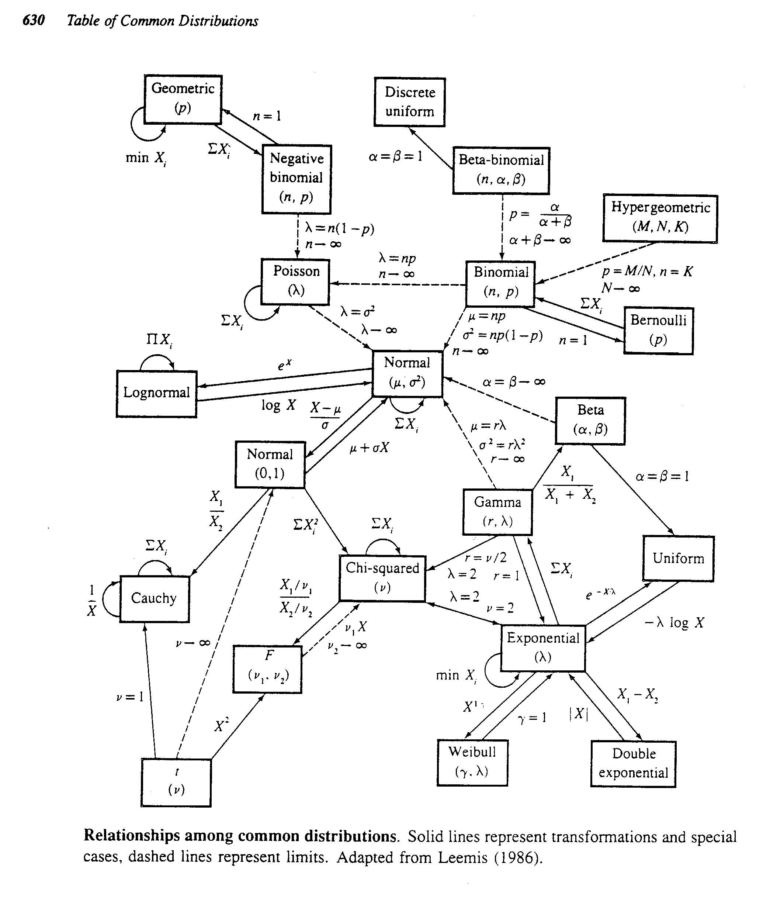
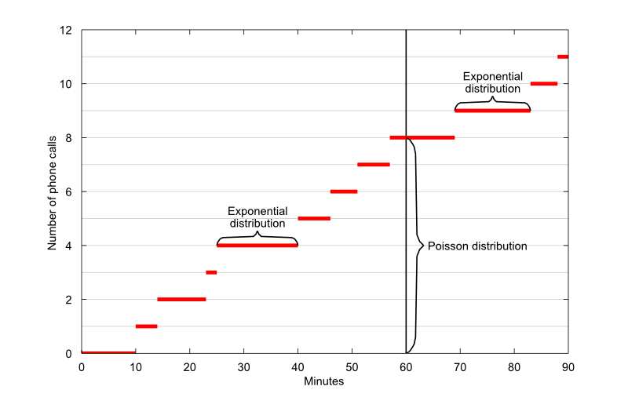

# Commonly-used probability models

Distributions in statistics serve two main purposes:

1. To describe the assumed behaviour of the observations made in an experiment, survey or other study;
2. To calibrate the values of derived statistics used in constructing confidence regions, hypothesis tests, etc.

Some distributions are much used for both purposes (the normal distribution being the prime example).


In this chapter, we will focus on some distributions used for the first purpose. 
Distributions used mainly for the second purpose (these include the $\chi^2$, $t$ and $F$ distributions) will be described later, in Chapter 3.

We will meet a *family* of distributions--a family which is indexed by one or more *parameters* (c.f. parametric family).
This allow us to vary certain characteristics of the distribution while staying with one functional form.
For example, consider several random variables $X_k\sim\N(k,1)$, for a couple of values of $k$.
That is, $X_k$ is a normal distribution with mean $k$ and variance 1.
These are distinct distributions (e.g., $\Pr(X_{10} < 0) \ll \Pr(X_0 < 0)$) yet have similar characteristics (e.g. they are all bell-shaped).

```{r normaldist_param, echo = FALSE, fig.height = 2}
plot.df <- tibble(x = seq(-10, 13, by = 0.1))
plot.df$`-5` <- dnorm(plot.df$x, mean = -5, sd = 1)
plot.df$`1` <- dnorm(plot.df$x, mean = 1, sd = 1)
plot.df$`3` <- dnorm(plot.df$x, mean = 3, sd = 1)
plot.df$`9` <- dnorm(plot.df$x, mean = 9, sd = 1)
plot.df <- reshape2::melt(plot.df, id = "x")
ggplot(plot.df, aes(x, value, group = variable, col = variable)) +
  geom_line() +
  theme_classic() +
  labs(col = expression(k), y = expression(f[X](x)))
```

::: {.mynote}
Starting from this chapter onwards, we will denote probability using the notation '$\Pr$' rather than the blackboard bold symbol '$\bbP$' as we did previously. 
Either symbol is fine, but I feel '$\bbP$' is used to denote the probability measure of an event, and is traditionally used in probability theory.
Of course when we write $\Pr(X<a)$ we really mean the probability measure of the event $\{ X < a\}$ so really the measure theoretic stuff is there regardless (or maybe we should write it $\bbP(\{X < a\})$ to be proper?).

The point is, write it any way you want. It should be fine. Just so you know, I'll be using '$\Pr$' from here on out.
:::

### Learning objectives {-}

::: {.learningobjectives}
By the end of this chapter, you will be:

- Familiar with commonly used discrete and continuous probability models, including their general properties and characteristics, and situations in which that distribution is used to model data.
- Able to compute probabilities involving normal distributions using the standard normal tables.
- Discovering some relationships between certain distributions, and how these relationships can be exploited in approximate calculations.
:::

### Readings {-}

- Casella and Berger (2002)
    - Chapter 3, sections 3.1 3.2 3.3
- Wasserman (2004)
    - Chapter 2, sections 2.3 and 2.4.
    - Chapter 3, section 3.6.
- Topics not covered: Cauchy, lognormal and double exponential (Laplace) distributions, exponential families, location and scale families

## Discrete models

In this section, we'll be describing commonly used **discrete** probability distributions.

### Point mass distribution

The random variable $X$ has a point mass distribution at $a$, written $X\sim \delta_a$, if $\Pr(X=a) = 1$, in which case
\[
F(x) = \begin{cases}
0 &x<a \\
1 &x\geq a.
\end{cases}
\]

The probability mass function is $f(x)=1$ for $x=a$, and 0 otherwise.

```{r pointmasspdfcdf, echo = FALSE, message = FALSE, warning = FALSE, fig.height = 3, fig.cap = "Pdf and cdf of the point mass distribution."}
plot.df <- tibble(
  x = 0,
  y = 1
)
ggplot(plot.df, aes(x, y = 0, xend = x, yend = y)) +
  geom_segment() +
  geom_point(aes(x = x, y = y)) +
  scale_x_continuous(breaks = 0, labels = "a") +
  labs(y = expression(f[X](x)), title = "Plot of pdf") -> p1

plot.df <- tibble(
  x = c(-1, 0,   1),
  y = c(0, 1, 1)
)
plot.df$xend <- c(plot.df$x[2:nrow(plot.df)], NA)
plot.df$yend <- plot.df$y
ggplot(plot.df, aes(x, y, xend = xend, yend = yend)) +
  geom_segment() +
  geom_point(x = 0, y = 0, shape = 1) +
  geom_point(x = 0, y = 1) +
  scale_x_continuous(breaks = 0, labels = "a") +
  # geom_point(data = plot.df[-c(1, 5), ]) +
  # geom_point(data = plot.df[-c(4, 5), ], aes(x = xend, y = y), shape = 1) +
  labs(y = expression(F[x](x)), title = "Plot of cdf") -> p2

cowplot::plot_grid(p1, p2, nrow = 1)
```


The mean and variance are trivial: $\E(X)=a$ and $\Var(X)=0$, because the "random" variable $X$ takes on the value $a$ with probability 1 (certainty).

There isn't much practical use for point mass distributions to be honest, but sometimes they are used to describe *mixture* distributions. 
For example, a random variable might be equal to $0$ half of the time, but may be normally distributed the other half of the time.


### Uniform distribution

Let $k>1$ be a given integer. The discrete uniform distribution on $\{1,\dots,k\}$ has pmf
\[
f(x) = \frac{1}{k}, \hspace{2em} x=1,\dots,k.
\]
We write $X\sim\Unif\{1,\dots,k\}$. Its mean and variance are

- $\E(X)=\frac{k+1}{2}$; and
- $\Var(X)=\frac{k^2-1}{12}$.

The mean of the discrete uniform is intuitive; it is the half-way point between 1 and $k$.
The discrete uniform (and the point mass) is appeallingly simple but has relatively few "real" statistical applications.

::: {.proof}
Using the arithmetic series formulae $\sum_{i=1}^n x = n(n+1)/2$ and $\sum_{i=1}^n x^2 = n(n+1)(2n+1)/6$, we have

\begin{align*}
\E(X) &= \sum_{x=1}^k \frac{x}{k}\\
&= \frac{k(k+1)}{2k}  \\
&= \frac{k+1}{2},
\end{align*}
and
\begin{align*}
\E(X^2) &= \sum_{x=1}^k  \frac{x^2}{k}\\
&= \frac{k(k+1)(2k+1)}{6k}  \\
&= \frac{(k+1)(2k+1)}{6},
\end{align*}
hence
\begin{align*}
\Var(X) &= \E(X^2) - \E^2(X) \\
&= \frac{(k+1)(2k+1)}{6} - \frac{(k+1)^2}{4} \\
&= \frac{2(k+1)(2k+1)-3(k+1)^2}{12} \\
&= \frac{k^2-1}{12}.
\end{align*}
:::

<br>

::: {.mynote}
If $k=1$, then it is the point mass distribution. But actually, we can use whatever labels we want for the values $1,2,\dots,k$. For example, suppose we are picking between 3 colours uniformly, then we can describe a uniform distribution on $\{1 = \text{red}, 2= \text{green}, 3=\text{blue} \}$.
:::

```{r uniformpdfcdf, echo = FALSE, message = FALSE, warning = FALSE, fig.height = 3, fig.cap = "Pdf and cdf of the discrete uniform distribution for \\(k=4\\)."}
plot.df <- tibble(
  x = c(1, 2, 3, 4),
  y = rep(1/4, 4)
)
ggplot(plot.df, aes(x, y = 0, xend = x, yend = y)) +
  geom_segment() +
  geom_point(aes(x = x, y = y)) +
  scale_x_continuous(breaks = 0:5) +
  scale_y_continuous(limits = c(0, 1)) +
  labs(y = expression(f[X](x)), title = "Plot of pdf") -> p1

plot.df <- tibble(
  x = 0:5,
  y = c(0, 0.25, 0.5, 0.75, 1, 1)
)
plot.df$xend <- c(plot.df$x[2:nrow(plot.df)], NA)
plot.df$yend <- plot.df$y
ggplot(plot.df, aes(x, y, xend = xend, yend = yend)) +
  geom_segment() +
  # geom_point(x = 0, y = 0, shape = 1) +
  # geom_point(x = 0, y = 1) +
  # scale_x_continuous(breaks = 1:4) +
  geom_point(data = plot.df[-c(1, 6), ]) +
  geom_point(data = plot.df[1:4, ], aes(x = xend, y = y), shape = 1) +
  labs(y = expression(F[x](x)), title = "Plot of cdf") -> p2

cowplot::plot_grid(p1, p2, nrow = 1)
```


### Bernoulli distribution

Suppose we are interested in the outcome of a (single) random trial, which can either be ["success"]{.myrtlegreen} or ["failure"]{.solidpink} only. Examples include

- A coin flip can land either [Heads]{.myrtlegreen} or [Tails]{.solidpink}.
- The colour of the suit of a randomly drawn card from a pack of playing cards can be either [Red]{.myrtlegreen} or [Black]{.solidpink}
- A dice roll outcome can  either be an [Even]{.myrtlegreen} or an [Odd]{.solidpink} number.
- Babies being born being [Girl]{.myrtlegreen}  or [Boy]{.solidpink}.

Typically we assign the value '1' to denote success, and '0' to denote failure.
This has no qualitative meaning whatsoever, the important thing is that there are only two distinct possible outcomes.
As a consequence, any discrete random variable that can take on only two possible outcomes is a Bernoulli random variable.

Let $X$ be the r.v. denoting the outcome of success ($X=1$) or failure ($X=0$) of a binary trial.
Further let the pmf for $X$ be 
\[
f(x|p) = \begin{cases}
p & x=1\text{ (success)}\\
1-p &x=0 \text{ (failure)}
\end{cases}
\]
We say that $X$ has a Bernoulli distribution written $X\sim\Bern(p)$.

- The expectation is
\[
\E(X) = \sum_x xf(x) = 1\cdot p + 0 \cdot (1-p) = p.
\]
- The variance is
\[
\Var(X) = \sum_x (x-\mu)^2f(x) = (1-p)^2\cdot p + (0-p)^2 \cdot (1-p) = p(1-p).
\]

Again the expectation is intuitive here.
If a proportion $p$ of the time we get success, then surely the expectation must be this proportion $p$.

::: {.mycheck}
The pmf for the Bernoulli distribution can also be written $f(x)=p^x(1-p)^{1-x}$. 
Try plugging in $x=1$ and $x=0$ into this function.
Do you get the appropriate probabilities?
:::


```{r bernoullipdfcdf, echo = FALSE, message = FALSE, warning = FALSE, fig.height = 3, fig.cap = "Pdf and cdf of the Bernoulli distribution."}
set.seed(1)
bernoullip <- runif(1)
plot.df <- tibble(
  x = c(0, 1),
  y = c(bernoullip, 1 - bernoullip)
)
ggplot(plot.df, aes(x, y = 0, xend = x, yend = y)) +
  geom_segment() +
  geom_point(aes(x = x, y = y)) +
  scale_x_continuous(limits = c(-0.5, 1.5), breaks = c(0, 1)) +
  scale_y_continuous(limits = c(0, 1), breaks = c(0, bernoullip, 1 - bernoullip, 1), 
                     labels = c(0, "1-p", "p", 1)) +
  labs(y = expression(f[X](x)), title = "Plot of pdf") -> p1

plot.df <- tibble(
  x = -1:2,
  y = c(0, bernoullip, 1, 1)
)
plot.df$xend <- c(plot.df$x[2:nrow(plot.df)], NA)
plot.df$yend <- plot.df$y
ggplot(plot.df, aes(x, y, xend = xend, yend = yend)) +
  geom_segment() +
  # geom_point(x = 0, y = 0, shape = 1) +
  # geom_point(x = 0, y = 1) +
  # scale_x_continuous(breaks = 1:4) +
  scale_y_continuous(breaks = c(0, bernoullip, 1), labels = c(0, "1-p", 1)) +
  geom_point(data = plot.df[-c(1, nrow(plot.df)), ]) +
  geom_point(data = plot.df[1:4, ], aes(x = xend, y = y), shape = 1) +
  labs(y = expression(F[x](x)), title = "Plot of cdf") -> p2

cowplot::plot_grid(p1, p2, nrow = 1)
```

### Binomial distribution

A related distribution to the Bernoulli is the binomial distribution.
It describes the distribution of the number of "successes" in $n$ independent and identical binary "trials". 
That is, suppose we have a situation such that

- A finite number $n$ trials are carried out.
- Each trial is independent of each other.
- The outcome of each trial is either success or failure (binary trials).
- The probability $0 \leq p\leq 1$ of a successful outcome is the same for each trial.

Let $X$ be the number of success outcomes in $n$ trials. Then $X$ has a binomial distribution, written $X\sim\Bin(n,p)$.
The pmf of $X$ is
\[
f(x|n,p) = {n \choose x}p^x (1-p)^{n-x}.
\]
$X$ has support (possible values it can take) over $\{0,1,2,\dots,n\}$. 
The mean and variance are $\E(X)=np$ and $\Var(X)=np(1-p)$.

::: {.proof}
Here's the proof for the mean. 
\begin{align*}
\E(X) 
&= \sum_{x=0}^n x \frac{n!}{x!(n-x)!} p^x (1-p)^{n-x} \\
&= \sum_{x=1}^n x \frac{n!}{x!(n-x)!} p^x (1-p)^{n-x} \\
&=\sum_{x=1}^n n \cdot \overbrace{\frac{(n-1)!}{(x-1)!(n-x)!}}^{{n-1 \choose x-1}} \cdot p^{x-1+1} (1-p)^{(n-1)-(x-1)} \\
&= np \overbrace{\sum_{x-1=0}^n  {n-1 \choose x-1} p^{x-1} (1-p)^{n-x}}^{=1} \\
&= np. 
\end{align*}
Obtaining the variance follows similar steps.
:::

::: {.mycheck}
Try to replicate the proof above and obtain $\E(X^2)$ for the binomial distribution. After that, you may obtain $\Var(X)$ using the usual formula.
An alternative way is to use mgfs--keep on reading.
:::

For the more astute of you, you might have realised that the binomial distribution is simply counting the number of successes in many independent Bernoulli trials.
Indeed, that is the case.

::: {.lemma}
Let $X_1,\dots,X_n\iid\Bern(p)$, then
\[
X = \sum_{i=1}^n X_i \sim \Bin(n,p)
\]
:::

::: {.mycheck}
The lemma is proven using mgfs, and is left to you as an exercise.
First, obtain the mgf for Bernoulli and binomial distributions.
Then use the sum property of the mgfs characterise the distribution of the sum. 
:::

Using the lemma above, we can more easily derive that
\[
\E(X) = \E\left(\sum_{i=1}^n X_i \right) = \sum_{i=1}^n \E(X_i) = np
\]
and
\[
\Var(X) = \Var\left(\sum_{i=1}^n X_i \right) = \sum_{i=1}^n \Var(X_i) = np(1-p)
\]
simply using properties of expectations and variances.

```{r binomialpdfcdf, echo = FALSE, message = FALSE, warning = FALSE, fig.height = 3, fig.cap = "Pdf and cdf of the binomial distribution with \\(p=0.3\\)."}
n <- 10
prob <- 0.3
plot.df <- tibble(
  x = 0:n,
  y = dbinom(0:n, n, prob = prob)
)
ggplot(plot.df, aes(x, y = 0, xend = x, yend = y)) +
  geom_segment() +
  geom_point(aes(x = x, y = y)) +
  scale_x_continuous(breaks = 0:n) +
  # scale_y_continuous(limits = c(0, 1)) +
  labs(y = expression(f[X](x)), title = "Plot of pdf") -> p1

plot.df <- tibble(
  x = -1:11,
  y = c(0, cumsum(dbinom(0:n, n, prob = prob)), 1)
)
plot.df$xend <- c(plot.df$x[2:nrow(plot.df)], NA)
plot.df$yend <- plot.df$y
ggplot(plot.df, aes(x, y, xend = xend, yend = yend)) +
  geom_segment() +
  # geom_point(x = 0, y = 0, shape = 1) +
  # geom_point(x = 0, y = 1) +
  scale_x_continuous(breaks = 0:n) +
  # scale_y_continuous(breaks = c(0, bernoullip, 1), labels = c(0, "1-p", 1)) +
  # geom_point(data = plot.df[-c(1, nrow(plot.df)), ]) +
  # geom_point(data = plot.df[1:4, ], aes(x = xend, y = y), shape = 1) +
  labs(y = expression(F[x](x)), title = "Plot of cdf") -> p2

cowplot::plot_grid(p1, p2, nrow = 1)
```


### Geometric distribution

The geometric distribution is a type of "waiting time" distribution. 
It involves counting the number of Bernoulli trials to get the first success.
Let $X$ be distributed geometrically, $X\sim\Geom(p)$, where $p$ is the probability of success. Clearly,
\[
  f(x|p)=(1-p)^{x-1}p.
\]
The support of $X$ is $\{1,2,3,\dots\}$; it is countably infinite.

This is a valid pmf since
\begin{align*}
\sum_{x=1}^\infty f(x|p) 
&= \sum_{x=1}^\infty (1-p)^{x-1}p  \\
&= \frac{p}{1-(1-p)} = 1.
\end{align*}

This required knowledge of the infinite geometric series $\sum_{k=0}^\infty ar^k = a/(1-r)$ for $|r|<1$.
The mean and variance of the geometric distribution are:

- $\E(X)=\frac{1}{p}$. The smaller the $p$, the longer we have to wait for a success.
- $\Var(X)=\frac{1-p}{p^2}$.

::: {.mywarning}
There is another formulation for the geometric distribution: Let $Y$ be the number of failures before the first success occurs. Then 
\[
f(y|p) = (1-p)^yp.
\]
$Y$ has support $\{0,1,2,\dots\}$. $X$ and $Y$ are related through $Y=X-1$. Thus it is easy to check
that
\[
\E(Y) = \frac{1-p}{p} \text{ and } \Var(Y)=\frac{1-p}{p^2}.
\]
We shall mainly use the first version of the geometric distribution in this course, but be aware of the alternative version as well.
:::

```{r geometricpdfcdf, echo = FALSE, message = FALSE, warning = FALSE, fig.height = 3, fig.cap = "Pdf and cdf of the geometric distribution with \\(p=0.4\\)."}
n <- 10
prob <- 0.4
my_dgeom <- function(x, prob) (1 - prob) ^ (x - 1) * prob
plot.df <- tibble(
  x = 1:n,
  y = my_dgeom(1:n, prob = prob)
)
ggplot(plot.df, aes(x, y = 0, xend = x, yend = y)) +
  geom_segment() +
  geom_point(aes(x = x, y = y)) +
  scale_x_continuous(breaks = 0:n) +
  # scale_y_continuous(limits = c(0, 1)) +
  labs(y = expression(f[X](x)), title = "Plot of pdf") -> p1

plot.df <- tibble(
  x = 0:11,
  y = c(0, cumsum(plot.df$y), 1)
)
plot.df$xend <- c(plot.df$x[2:nrow(plot.df)], NA)
plot.df$yend <- plot.df$y
ggplot(plot.df, aes(x, y, xend = xend, yend = yend)) +
  geom_segment() +
  # geom_point(x = 0, y = 0, shape = 1) +
  # geom_point(x = 0, y = 1) +
  scale_x_continuous(breaks = 0:n) +
  # scale_y_continuous(breaks = c(0, bernoullip, 1), labels = c(0, "1-p", 1)) +
  # geom_point(data = plot.df[-c(1, nrow(plot.df)), ]) +
  # geom_point(data = plot.df[1:4, ], aes(x = xend, y = y), shape = 1) +
  labs(y = expression(F[x](x)), title = "Plot of cdf") -> p2

cowplot::plot_grid(p1, p2, nrow = 1)
```

### Negative binomial

Suppose we count the number of Bernoulli trials required to get a fixed number of successes, $r$, each with probability of success $p$.
This leads to the negative binomial distribution.
Denote this by $X\sim\NBin(r,p)$. The pmf is
\[
  f(x|r,p)= {x-1 \choose r-1} p^r (1-p)^{x-r}.
\]

The pmf is easy to justify: In order to get $X=x$, a total of $r-1$ successes must have occurred in the previous $x-1$ number of trials. Then, the pmf follows directly from the binomial pmf.

Clearly, the support of $X$ is $\{r, r+1, r+2, \dots \}$.
The expectation and variance of $X$ are

- $\E(X)=\frac{r}{p}$.
- $\Var(X)=\frac{r(1-p)}{p^2}$.

Note that if $r=1$, then $X$ is the geometric distribution.

::: {.mynote}
The name 'negative binomial' comes from noting that $Y=X-r$, the number of failures seen before the $r$th success, has pmf
\[
  f(y|r,p) = (-1)^y{-r \choose y} p^r(1-p)^{r-y},
\]
which looks suspiciously close to the binomial pmf^[Details in C&B, p.95]. 
:::

```{r negbinomialpdfcdf, echo = FALSE, message = FALSE, warning = FALSE, fig.height = 3, fig.cap = "Pdf and cdf of the negative binomial distribution with \\(p=0.3\\) and \\(r=5\\)."}
n <- 15
prob <- 0.7
r <- 5
my_dnbinom <- function(x, prob, r) choose(x - 1, r - 1) * prob ^ r * (1 - prob) ^ (x - r)
plot.df <- tibble(
  x = r:n,
  y = my_dnbinom(r:n, prob = prob, r = r)
)
ggplot(plot.df, aes(x, y = 0, xend = x, yend = y)) +
  geom_segment() +
  geom_point(aes(x = x, y = y)) +
  scale_x_continuous(breaks = 0:n) +
  # scale_y_continuous(limits = c(0, 1)) +
  labs(y = expression(f[X](x)), title = "Plot of pdf") -> p1

plot.df <- tibble(
  x = (r-1):(n+1),
  y = c(0, cumsum(plot.df$y), 1)
)
plot.df$xend <- c(plot.df$x[2:nrow(plot.df)], NA)
plot.df$yend <- plot.df$y
ggplot(plot.df, aes(x, y, xend = xend, yend = yend)) +
  geom_segment() +
  # geom_point(x = 0, y = 0, shape = 1) +
  # geom_point(x = 0, y = 1) +
  scale_x_continuous(breaks = 0:n) +
  # scale_y_continuous(breaks = c(0, bernoullip, 1), labels = c(0, "1-p", 1)) +
  # geom_point(data = plot.df[-c(1, nrow(plot.df)), ]) +
  # geom_point(data = plot.df[1:4, ], aes(x = xend, y = y), shape = 1) +
  labs(y = expression(F[x](x)), title = "Plot of cdf") -> p2

cowplot::plot_grid(p1, p2, nrow = 1)
```

::: {.mywarning}
Just a caution to say that the negative binomial has many different parameterisations. 
It all depends whether 

- The random variable $X$ is counting the number of trials until a fixed success, or counting the number of successes before a fixed number of failures occur;
- $p$ denotes success or failure;
- $r$ denotes success or failure.

See here for more details: https://en.wikipedia.org/wiki/Negative_binomial_distribution#Alternative_formulations 
:::

### Poisson distribution

The Poisson is the most standard assumption for the distribution of a count of events that occur (separately and independently, by assumption) in time or space. Some examples:

- Amount of e-mails received in 24-hour period.
- Number of calls received by a call centre per hour.
- The number of photons hitting a detector in a particular time interval.
- The number of patients arriving in an emergency room between 10pm and 11pm.

Let $X$ be the number of occurrences in this interval, such that the mean number of occurrences $\lambda$ in the given interval (sometimes called the rate or intensity) is known and is finite. Then $X\sim\Pois(\lambda),$ and
\[
f(x|\lambda) = \frac{e^{-\lambda}\lambda^x}{x!},
\]
for $x=0,1,2,\dots$

To work out the mean, we make use of the Taylor series expansion.
Recall that $e^x=\sum_{k=0}^\infty \frac{x^k}{k!}$.
Using this fact we can derive the moments through the mgf.

\begin{align*}
M_X(t)
&= \sum_{x=0}^\infty \frac{e^{tx} e^{-\lambda}\lambda^x}{x!} \\
&= e^{-\lambda} \sum_{x=0}^\infty \frac{(\lambda e^t)^x}{x!} \\
&= e^{-\lambda}e^{\lambda e^t} = \exp\{\lambda(e^t - 1) \}.
\end{align*}

Hence $\E(X)=M_X'(0)=\lambda$ and $\E(X^2)=M_X''(0)=\lambda^2+\lambda$, so $\Var(X)=\E(X^2)-\E(X)=\lambda$.

The Poisson family is closed under addition.
If $X$ and $Y$ are independent Poisson r.v. with means $\lambda$ and $\mu$, then
\[
X+Y \sim \Pois(\lambda + \mu)
\]

The proof uses mgf and the characterizing property of the mgf. 

::: {.mycheck}
Have a go at the proof using properties of the mgf. 
:::

```{r poissonpdfcdf, echo = FALSE, message = FALSE, warning = FALSE, fig.height = 3, fig.cap = "Pdf and cdf of the negative binomial distribution with \\(\\lambda=3\\)."}
n <- 15
lambda <- 3
plot.df <- tibble(
  x = 0:n,
  y = dpois(0:n, lambda = lambda)
)
ggplot(plot.df, aes(x, y = 0, xend = x, yend = y)) +
  geom_segment() +
  geom_point(aes(x = x, y = y)) +
  scale_x_continuous(breaks = 0:n) +
  # scale_y_continuous(limits = c(0, 1)) +
  labs(y = expression(f[X](x)), title = "Plot of pdf") -> p1

plot.df <- tibble(
  x = -1:(n+1),
  y = c(0, cumsum(plot.df$y), 1)
)
plot.df$xend <- c(plot.df$x[2:nrow(plot.df)], NA)
plot.df$yend <- plot.df$y
ggplot(plot.df, aes(x, y, xend = xend, yend = yend)) +
  geom_segment() +
  # geom_point(x = 0, y = 0, shape = 1) +
  # geom_point(x = 0, y = 1) +
  scale_x_continuous(breaks = 0:n) +
  # scale_y_continuous(breaks = c(0, bernoullip, 1), labels = c(0, "1-p", 1)) +
  # geom_point(data = plot.df[-c(1, nrow(plot.df)), ]) +
  # geom_point(data = plot.df[1:4, ], aes(x = xend, y = y), shape = 1) +
  labs(y = expression(F[x](x)), title = "Plot of cdf") -> p2

cowplot::plot_grid(p1, p2, nrow = 1)
```

## Continuous models

In this section, we'll study commonly used continuous distributions.


### Continuous uniform distribution

The continuous uniform distribution is usually taken to have support on an interval, say $a \leq x \leq b$. Let $X\sim\Unif(a,b)$. The pdf is
\[
  f_X(x) = \frac{1}{b-a}
\]
for $x\in[a,b]$ and 0 otherwise.
The mean and variance are

- $\E(X)=\frac{a+b}{2}$.
- $\Var(X)=\frac{(a-b)^2}{12}$.

Note the similarities between the means and variances above and in the discrete case!

The plot of the pdf gives a "rectangular" shape, so probabilities can also be found geometrically, as we previously saw in [Chapter 1](#exm:unitsquare). 

```{r uniformctspdfcdf, echo = FALSE, message = FALSE, warning = FALSE, fig.height = 3, fig.cap = "Pdf and cdf of the negative binomial distribution with \\(p=0.3\\) and \\(r=5\\)."}
n <- 15
prob <- 0.7
r <- 5
my_dnbinom <- function(x, prob, r) choose(x - 1, r - 1) * prob ^ r * (1 - prob) ^ (x - r)
plot.df <- tibble(
  x = r:n,
  y = my_dnbinom(r:n, prob = prob, r = r)
)
ggplot(plot.df, aes(x, y = 0, xend = x, yend = y)) +
  geom_segment() +
  geom_point(aes(x = x, y = y)) +
  scale_x_continuous(breaks = 0:n) +
  # scale_y_continuous(limits = c(0, 1)) +
  labs(y = expression(f[X](x)), title = "Plot of pdf") -> p1

plot.df <- tibble(
  x = (r-1):(n+1),
  y = c(0, cumsum(plot.df$y), 1)
)
plot.df$xend <- c(plot.df$x[2:nrow(plot.df)], NA)
plot.df$yend <- plot.df$y
ggplot(plot.df, aes(x, y, xend = xend, yend = yend)) +
  geom_segment() +
  # geom_point(x = 0, y = 0, shape = 1) +
  # geom_point(x = 0, y = 1) +
  scale_x_continuous(breaks = 0:n) +
  # scale_y_continuous(breaks = c(0, bernoullip, 1), labels = c(0, "1-p", 1)) +
  # geom_point(data = plot.df[-c(1, nrow(plot.df)), ]) +
  # geom_point(data = plot.df[1:4, ], aes(x = xend, y = y), shape = 1) +
  labs(y = expression(F[x](x)), title = "Plot of cdf") -> p2

cowplot::plot_grid(p1, p2, nrow = 1)
```

### Exponential distribution

The exponential distribution is often used to describe the distribution of measured time intervals 'duration data' or 'waiting-time data'. E.g.

- the amount of time until an earthquake occurs.
- the time between two lightbulbs failing.
- the length (in minutes) of faculty staff meetings at UBD.
- the average waiting time at a hospital's A&E.

Let $X\sim\Exp(\lambda)$.
The pdf is
\[
f_X(x) = \frac{1}{\lambda} e^{-x/\lambda}.
\]

$X$ has support over $[0,\infty)$, and $\lambda >0$ is known as the "scale" parameter. The value $r=1/\lambda$ is known as the "rate". The mean and variance are:

- $\E(X)=\lambda$.
- $\Var(X)=\lambda^2$.

Since $\lambda$ is a scale parameter, the following property holds: $aX\sim\Exp(a\lambda)$ for $a>0$. 
What this is saying is that if we stretch (or contract) the scale of $X$ by some amount $a>0$, then the underlying distribution will still be the same.

The pdf experiences "exponential decay"--long wait times between two events occurring becomes more and more unlikely.

```{r expdist, echo = FALSE, fig.height = 3.3, fig.cap = "Pdf of the exponential distribution."}
plot.df <- tibble(x = seq(-1.5, 6, by = 0.01))
plot.df$`0.5` <- dexp(plot.df$x, rate = 0.5)
plot.df$`1` <- dexp(plot.df$x, rate = 1)
plot.df$`2` <- dexp(plot.df$x, rate = 2)
plot.df <- reshape2::melt(plot.df, id = "x")
ggplot() +
  geom_line(data = subset(plot.df, x > 0), aes(x = x, y = value, col = variable)) +
  geom_line(data = subset(plot.df, x <= 0), aes(x = x, y = value, col = variable),
            linetype = "dotted") +
  geom_line(data = subset(plot.df, x < 0), aes(x = x, y = value, col = variable)) +
  labs(y = expression(f[X](x)), col = expression(1/lambda))
```

The exponential distribution has a very special property: it is
memoryless, in the sense that for all $t>s>0$,
\[
\Pr(X > t+s|X>s) = \Pr(X > t)
\]

> Given that we have been waiting for an event to occur for $s$ units of time, the probability that we wait a further $t$ units of time is independent to the first fact!

For example\footnote{\footnotetext\url{https://perplex.city/memorylessness-at-the-bus-stop-f2c97c59e420?gi=3602158da66b}}, assume that bus waiting times are exponentially distributed. A memoryless wait for a bus would mean that the probability that a bus arrived in the next minute is the same whether you just got to the station or if you’ve been sitting there for twenty minutes already.

We can show that $X$ is a positive r.v. and memoryless if and only if it is exponentially distributed. 

::: {.mycheck}
You will prove the memoryless fact in one of the exercises for this chapter.
:::

### Gamma distribution

The gamma distribution generalises the exponential distribution.
It is also used for modelling durations (lengths of time intervals).
Let $X\sim\Gamma(\alpha,\beta)$.
The pdf is 
\[
  f_X(x) = \frac{1}{\Gamma(\alpha)\beta^\alpha} x^{\alpha-1} e^{- x/\beta}
\]
where  $\Gamma(\alpha)=\int_0^\infty y^{\alpha-1}e^{-y}\dint y$ is called the Gamma function.
Again here, $X$ has support over $[0,\infty]$. 
$\alpha>0$ is the "shape" parameter, and $\beta >0$ is the "scale" parameter. 
The mean and variance are as follows:

- $\E(X)=\alpha\beta$.
- $\Var(X)=\alpha\beta^2$.

Some other properties of the gamma distribution are:

- $\Gamma(1,\lambda) \equiv \Exp(\lambda)$.
- $aX\sim\Gamma(\alpha,a\beta)$ for $a>0$.
- If $X_i\sim\Gamma(\alpha_i,\beta)$, then $\sum_{i=1}^n X_i \sim \Gamma(\sum_{i=1}^n \alpha_i,\beta)$.

::: {.myalert}
Be aware that there is an alternative parameterisation of the exponential and gamma distribution using "scale" parameters:

- $Y \sim \Exp(\lambda)$, where $f_Y(y)=\frac{1}{\lambda}e^{-y/\lambda}$. Here $\lambda$ is the ...
- $Y \sim \Gamma(\alpha,s)$, where $f_Y(y)=\frac{1}{\Gamma(\alpha)s^\alpha} y^{\alpha-1} e^{-y/s}$. Here $s$ is the **scale** parameter. The shape parameter is obtained via $\beta=1/s$.
:::


```{r gammadist1, echo = FALSE, fig.height = 3.3, fig.cap = "Pdf of the gamma distribution."}
plot.df <- tibble(x = seq(-1.5, 6, by = 0.01))
plot.df$`(1,0.5)` <- dgamma(plot.df$x, shape = 1, scale = 0.5)
plot.df$`(2,0.5)` <- dgamma(plot.df$x, shape = 2, scale = 0.5)
plot.df$`(4,0.5)` <- dgamma(plot.df$x, shape = 4, scale = 0.5)
plot.df$`(10,0.5)` <- dgamma(plot.df$x, shape = 10, scale = 0.5)
plot.df <- reshape2::melt(plot.df, id = "x")
ggplot() +
  geom_line(data = subset(plot.df, x > 0), aes(x = x, y = value, col = variable)) +
  geom_line(data = subset(plot.df, x <= 0), aes(x = x, y = value, col = variable),
            linetype = "dotted") +
  geom_line(data = subset(plot.df, x < 0), aes(x = x, y = value, col = variable)) +
  labs(y = expression(f[X](x)), col = expression("(" * alpha * "," * beta *")"))
```

### Beta distribution

The beta distributions are distributions on the unit interval $[0,1]$, or on any other interval $[a,b]$ by transformation $X \mapsto X(b-a) + a$.
It is used to model the behaviour of random variables limited to intervals of finite length in a wide variety of disciplines.
Let $X\sim \Betadist(\alpha,\beta)$.
The pdf is 
\[
  f_X(x) = \frac{1}{B(\alpha,\beta)} x^{\alpha-1} (1-x)^{\beta-1}.
\]
where $B(\alpha,\beta)$ is the so-called beta function 
$$B(\alpha,\beta) = \frac{\Gamma(\alpha)\Gamma(\beta)}{\Gamma(\alpha+\beta)}.$$
The parameters $\alpha>0$ and $\beta>0$ are known as the "shape" parameters.
The mean and variance are

- $\E(X)=\frac{\alpha}{\alpha+\beta}$.
- $\Var(X)=\frac{\alpha\beta}{(\alpha+\beta)^2(\alpha+\beta+1)}$.

On interesting fact is that when $\alpha=\beta=1$, we have the uniform distribution.
I.e., $\Betadist(1,1)\equiv \Unif(0,1)$.

```{r betadist, echo = FALSE, fig.cap = "Pdf of the beta distribution."}
plot.df <- tibble(x = seq(0, 1, by = 0.01))
plot.df$`(0.5,0.5)` <- dbeta(plot.df$x, 0.5, 0.5)
plot.df$`(1,1)` <- dbeta(plot.df$x, 1, 1)
plot.df$`(2,5)` <- dbeta(plot.df$x, 1, 3)
plot.df$`(4,1)` <- dbeta(plot.df$x, 4, 1)
plot.df <- reshape2::melt(plot.df, id = "x")
ggplot(plot.df, aes(x = x, y = value, col = variable)) +
  geom_line() +
  scale_x_continuous(breaks = c(0, 1)) +
  labs(y = expression(f[X](x)), col = expression("(" * alpha * "," * beta *")"))
```

## Normal distribution

The normal distribution^[Here's a nice short exploration of the normal distribution: https://bookdown.org/cquirk/LetsExploreStatistics/lets-explore-the-normal-distribution.html] is arguably the most important distribution in statistics.
There are several reasons for this, including:

- Many naturally occurring phenomena can be modelled as following a normal distribution.
- The central limit theorem (CLT): The distribution of the mean of a sample tends to converge to a normal distribution, as more and more samples are collected.
- Often, the normal distribution is used for the error term in standard statistical models (e.g. linear regression).

Let us introduce the normal distribution.
Let $X$ be distributed according to a normal distribution with mean $\mu$ and variance $\sigma^2$. 
We write $X\sim\N(\mu,\sigma^2)$. 
The pdf of $X$ is
\[
f_X(x|\mu,\sigma^2)= \frac{1}{\sigma\sqrt{2\pi}}\exp\left[-\frac{(x-\mu)^2}{2\sigma^2} \right]
\]
$X$ has support over $\bbR$.


::: {.mynote}
The normal distribution is so important that all my previous teachers have made their students (including me) memorise the pdf of the normal distribution.
In continuing tradition, you should too!
:::

The normal distribution is **symmetric** about $\mu$.
The mode and median of $X$ is also $\mu$.

```{r normalpdf, echo = FALSE}
x <- seq(-3.5, 3.5, length = 250)
y <- dnorm(x)
dat <- data.frame(
  x = x,
  y = y
)
ggplot(dat, aes(x, y)) +
  geom_line() +
  geom_segment(x = 0, xend = 0, y = 0.02, yend = dnorm(0), 
               linetype = "dashed") +
  scale_x_continuous(breaks = 0, labels = expression(mu)) +
  labs(y = expression(f[X](x)), x = NULL) 
```

The celebrated mathematician Carl Friedrich Gauss has the honour of having the normal distribution named after him.
The normal distribution is often known as the Gaussian distribution.
Actually, it is named as such because the *kernel* (i.e. the insides) of the pdf contains a Gaussian function, i.e. functions of the form $f(x)=a\exp\left(- \frac{(x-b)^2}{2c^2} \right)$, which Gauss studied quite a lot.

```{r gauss, echo = FALSE, fig.align = "center", out.width = "60%", fig.cap = "Carl Friedrich Gauß. 30 April 1777 -- 23 February 1855."}
knitr::include_graphics("figure/gauss.jpg")
```

```{r deutschemark, echo = FALSE, fig.align = "center", out.width = "60%", fig.cap = "10 Deustche Mark banknote. You know you've made it far when your pdf (used to) appears on a country's banknote."}

```


### Location and scale parameter

The $\mu$ parameter is also called the "location" parameter, since it determines where the bell curve is placed.
Changing the location parameter changes the location of the bell curve.

```{r location_param, echo = FALSE, fig.height = 3.3}
plot.df <- tibble(x = seq(-8, 6, length = 200))
plot.df$`(-4, 1)` <- dnorm(plot.df$x, mean = -4)
plot.df$`(0, 1)` <- dnorm(plot.df$x, mean = 0)
plot.df$`(2, 1)` <- dnorm(plot.df$x, mean = 2)
ggplot(reshape2::melt(plot.df, id = "x"), 
       aes(x = x, y = value, col = variable)) +
  geom_line() +
  geom_segment(x = 0, xend = 0, y = 0, yend = dnorm(0), 
               linetype = "dashed",
               col = iprior::gg_col_hue(3)[2]) +
  geom_segment(x = -4, xend = -4, y = 0, yend = dnorm(0), 
               linetype = "dashed", 
               col = iprior::gg_col_hue(3)[1]) +  
  geom_segment(x = 2, xend = 2, y = 0, yend = dnorm(0), 
               linetype = "dashed", 
               col = iprior::gg_col_hue(3)[3]) +  
  scale_x_continuous(breaks = c(-4, 0, 2)) +
  labs(y = expression(f[X](x)), col = expression("("*mu*","*~sigma^2*")"))
```


The $\sigma^2$ parameter is also called the "scale" parameter, since it determines how spread out the curve is.
Here we see the effect of changing the scale parameter.

```{r scale_param, echo = FALSE, fig.height = 3.3}
plot.df <- tibble(x = seq(-12, 12, length = 200))
plot.df$`(0, 1)` <- dnorm(plot.df$x, sd = 1)
plot.df$`(0, 4)` <- dnorm(plot.df$x, sd = 2)
plot.df$`(0, 16)` <- dnorm(plot.df$x, sd = 4)
ggplot(reshape2::melt(plot.df, id = "x"), 
       aes(x = x, y = value, col = variable)) +
  geom_line() +
  labs(y = expression(f[X](x)), col = expression("("*mu*","*~sigma^2*")"))
```


### Linear transformations of normal random variables

For any constants $c, d \in \bbR$, the r.v. $Y=cX + d$ also has a normal distribution. 
This fact makes the normal distribution such a convenient distribution to work with.
Using the properties of expectations and variances,

- $\E(Y)=\E(cX+d)=c\mu + d$.
- $\Var(Y) = \Var(cX+d) = c^2 \sigma^2$.

::: {.mycheck}
The facts above are proven using mgf. See the exercises at the end of this chapter.
:::

In particular, a very important transformation is the *standardisation*
\[
  Z = \frac{X-\mu}{\sigma}
\]
resulting in the *standard normal distribution* $Z\sim\N(0,1)$. 
The standard normal has mean 0 and variance 1.
It has pdf
\[
\phi(z) = \frac{1}{\sqrt{2\pi}}e^{-\frac{z^2}{2}},
\]
specially denoted by the greek letter '$\phi$'.

### The normal cdf

The cdf of the normal distribution $X\sim\N(\mu,\sigma^2)$ is
\[
F_X(x) = \int_{-\infty}^x 
\frac{1}{\sigma\sqrt{2\pi}}e^{-\frac{(\tilde x-\mu)^2}{2\sigma^2}} \dint \tilde x =: \Phi\left(\frac{x-\mu}{\sigma} \right),
\]
where $\Phi(z)=\int_{-\infty}^z \phi(\tilde z) \dint \tilde z$ is the cdf of $Z=\frac{X-\mu}{\sigma}$.


Values of $\Phi(\cdot)$ must be read from a table^[Download the statistical tables from here: https://haziqj.ml/stat-tables/], as the integrals above are *intractable* (no closed form solution).
Some results worth noting:

- $\Pr(Z \leq -a)=\Phi(-a)=1-\Phi(a)$
- $\Pr(a \leq Z \leq b) = \Phi(b) - \Phi(a)$
- $P(-a \leq Z \leq b) = \Phi(a) + \Phi(b) - 1$
- $P(-a \leq Z \leq -b) = \Phi(b) - \Phi(a)$
- $P(|Z| \leq a) = P(-a \leq Z \leq a) = 2\Phi(a) - 1$
- $P(|Z| \geq a) = P(\{Z < -a\} \cup \{Z >a\}) = 2\big(1-\Phi(a)\big)$

Of course, we can use computers to calculate these probabilities as well.
In `R`, we do:

```{r normprob}
pnorm(1.96, mean = 0, sd = 1)
```


Some values of $\Phi(\cdot)$ worth remembering:

1. $\Phi(0) = 0.5$
2. $\Phi(1.64) \approx 0.95$
3. $\Phi(1.96) \approx 0.975$
4. $\Phi(2.33) \approx 0.99$
5. $\Phi(2.58) \approx 0.995$

These values often come up when doing confidence intervals or hypothesis-test type questions.
The third one, for example, says that 
\begin{align*}
\Pr(\mu- 1.96\sigma \leq X \leq \mu+ 1.96\sigma) 
&= \Pr\left( \left| \frac{X-\mu}{\sigma} \right| \leq 1.96 \right)\\
&= 2\Phi(1.96)-1\approx 0.95,
\end{align*}
giving us an approximate probability statement as follows:

> The probability that a standardised normal random variable is within $\pm 1.96$ in value is approximately 0.95.


### 68--95--99.7 Rule

Incidentally, there is a shorthand to remember the percentage of values that lie within a band around the mean in a normal distribution.

```{r empiricalrule, echo = FALSE, fig.height = 3.4, warning = FALSE}
plot.df <- tibble(x = seq(-4, 4, length = 250))
plot.df$ y <- dnorm(plot.df$x)
ggplot(plot.df, aes(x, y)) +
  geom_line() +
  geom_ribbon(data = subset(plot.df, x < 1 & x > -1),
              aes(x = x, ymax = y), ymin = 0, alpha = 0.5,
              fill = iprior::gg_col_hue(3)[1]) +
  geom_ribbon(data = subset(plot.df, x < -1 & x > -2), 
              aes(x = x, ymax = y), ymin = 0, alpha = 0.5,
              fill = iprior::gg_col_hue(3)[2]) +
  geom_ribbon(data = subset(plot.df, x < 2 & x > 1), 
              aes(x = x, ymax = y), ymin = 0, alpha = 0.5,
              fill = iprior::gg_col_hue(3)[2]) +
  geom_ribbon(data = subset(plot.df, x < -2 & x > -3), 
              aes(x = x, ymax = y), ymin = 0, alpha = 0.5,
              fill = iprior::gg_col_hue(3)[3]) +
  geom_ribbon(data = subset(plot.df, x < 3 & x > 2), 
              aes(x = x, ymax = y), ymin = 0, alpha = 0.5,
              fill = iprior::gg_col_hue(3)[3]) +
  geom_segment(aes(x = -3, xend = -3, y = 0, yend = 0.45),
               linetype = "dashed", col = "grey70") +
  geom_segment(aes(x = -2, xend = -2, y = 0, yend = 0.45),
               linetype = "dashed", col = "grey70") +
  geom_segment(aes(x = -1, xend = -1, y = 0, yend = 0.45),
               linetype = "dashed", col = "grey70") +
  geom_segment(aes(x = 3, xend = 3, y = 0, yend = 0.45),
               linetype = "dashed", col = "grey70") +
  geom_segment(aes(x = 2, xend = 2, y = 0, yend = 0.45),
               linetype = "dashed", col = "grey70") +
  geom_segment(aes(x = 1, xend = 1, y = 0, yend = 0.45),
               linetype = "dashed", col = "grey70") +
  geom_segment(aes(x = 0, xend = 0, y = 0, yend = 0.45),
               linetype = "dashed", col = "grey70") +
  scale_x_continuous(breaks = c(-3, -2, -1, 0, 1, 2, 3),
                     labels = c(
                       expression(mu - 3 * sigma),
                       expression(mu - 2 * sigma),
                       expression(mu - 1 * sigma),
                       expression(mu),
                       expression(mu + 1 * sigma),
                       expression(mu + 2 * sigma),
                       expression(mu + 3 * sigma)
                     )) + 
  geom_bracket(xmin = -1, xmax = 1, y.position = 0.47, label = "~68%",
               col = "grey50") +
  geom_bracket(xmin = -2, xmax = 2, y.position = 0.51, label = "~95%",
               tip.length = 0.1, col = "grey50") +  
  geom_bracket(xmin = -3, xmax = 3, y.position = 0.55, label = "~99.7%",
               tip.length = 0.175, col = "grey50") +    
  annotate("text", x = c(-0.5, 0.5), y = c(0.418, 0.418), label = "34.1%", 
           col = iprior::gg_col_hue(3)[1]) +
  annotate("text", x = c(-1.5, 1.5), y = c(0.418, 0.418), label = "13.6%", 
           col = iprior::gg_col_hue(3)[2]) +
  annotate("text", x = c(-2.5, 2.5), y = c(0.418, 0.418), label = "2.14%", 
           col = iprior::gg_col_hue(3)[3]) +
  labs(x = NULL, y = expression(f[X](x)), y = NULL)
```

## Some relationships

There are several interesting relationships between the various distributions we have encountered. 
Making use of these relationships allow us to find an alternative and possibly easier way of calculating required probabilities or expectations, although some relationships might only be approximate.
We discuss them below.



### Poisson-Binomial relationship

The Poisson distribution plays a useful approximation role for some of the other main discrete distributions. 
Let $X\sim\Bin(n,p)$.
Then
\[
X \approx \Pois(np)
\]
when $n$ is large and $p$ is small.
Typically the rule of thumb is $n>20$ and $np<5$ or $n(1-p)<5$.


```{r poisbin1, echo = FALSE, fig.height = 3, fig.cap = "When \\(n\\) is small, then the two distributions are not quite identical."}
n <- 8
p <- 0.5
the.title <- paste0("n = ", n, ", p = ", p)
plot.df <- tibble(x = 0:10)
plot.df$bin <- dbinom(plot.df$x, size = n, prob = p)
plot.df$poi <- dpois(plot.df$x, lambda = n * p)
plot.df <- reshape2::melt(plot.df, id = "x")
ggplot(plot.df, aes(x = x, y = value, col = variable, fill = variable)) +
  geom_bar(stat = "identity", position = "dodge") +
  scale_x_continuous(breaks = plot.df$x) +
  labs(y = "P(X=x)", col = NULL, fill = NULL, title = the.title)
```


```{r poisbin2, echo = FALSE, fig.height = 3, fig.cap = "When \\(n\\) is large but \\(p\\) is not small, then the approximation does not work."}
n <- 100
p <- 0.5
the.title <- paste0("n = ", n, ", p = ", p)
plot.df <- tibble(x = 0:10)
plot.df$bin <- dbinom(plot.df$x, size = n, prob = p)
plot.df$poi <- dpois(plot.df$x, lambda = n * p)
plot.df <- reshape2::melt(plot.df, id = "x")
ggplot(plot.df, aes(x = x, y = value, col = variable, fill = variable)) +
  geom_bar(stat = "identity", position = "dodge") +
  scale_x_continuous(breaks = plot.df$x) +
  labs(y = "P(X=x)", col = "", fill = "", title = the.title)
```


```{r poisbin3, echo = FALSE, fig.height = 3, fig.cap = "The two conditions (\\(n\\) large and \\(p\\) small) is required for the approximation to work."}
n <- 100
p <- 0.01
the.title <- paste0("n = ", n, ", p = ", p)
plot.df <- tibble(x = 0:10)
plot.df$bin <- dbinom(plot.df$x, size = n, prob = p)
plot.df$poi <- dpois(plot.df$x, lambda = n * p)
plot.df <- reshape2::melt(plot.df, id = "x")
ggplot(plot.df, aes(x = x, y = value, col = variable, fill = variable)) +
  geom_bar(stat = "identity", position = "dodge") +
  scale_x_continuous(breaks = plot.df$x) +
  labs(y = "P(X=x)", col = "", fill = "", title = the.title)
```

We'll attempt a kind of a sketch proof for this approximate relationship.
Let $\lambda=np$. Consider the limit of as $n\to\infty$ of the binomial pmf:

\begin{align*}
\lim_{n\to\infty} \Pr(X=x) 
&= \lim_{n\to\infty} \frac{n!}{x!(n-x)!}\left(\frac{\lambda}{n} \right)^x \left(1 - \frac{\lambda}{n} \right)^{n-x} \\
&= \frac{\lambda^x}{x!} \lim_{n\to\infty} 
\underbrace{\frac{n!}{n^x(n-x)!}}_{\to 1}
\,
\underbrace{\left(1 - \frac{\lambda}{n} \right)^n}_{\to e^{-\lambda}}
\,
\underbrace{\left(1 - \frac{\lambda}{n} \right)^{-x}}_{\to 1} \\
&=  \frac{e^{-\lambda}\lambda^x}{x!} \\
&= \Pr(Y=x), Y\sim\Pois(\lambda).
\end{align*}

In the above, the limit of the first time is 1 because:
\begin{align*}
\frac{n!}{n^x(n-x)!}
&= \frac{n(n-1)(n-2)\cdots 3\cdot 2 \cdot 1}{n \cdot n \cdots n \cdot (n-x)(n-x-1)\cdots 3\cdot 2 \cdot 1} \\
&= \frac{n}{n}\frac{n-1}{n} \cdots \frac{n-x+1}{n}
\end{align*}
and each term converges to 1 as $n\to\infty$.
Furthermore, the appearance of the exponential in the second term is through the very definition of exponentials, i.e.
\[
e^a = \lim_{n\to\infty }\left(1 + \frac{a}{n} \right)^n.
\]

### Poisson-Exponential

We discussed previously how 

- the Poisson distribution is used to model the number of occurences in a given unit of time (or space); and
- the exponential distribution is used to model the waiting time until occurence of an event.

The two are actually connected: The exponential distribution is the probability distribution of the time between events in a Poisson point process, i.e., a process in which events occur continuously and independently at a constant average rate.


```{r exppoissonprocess, echo = FALSE, fig.align = "center", out.width = "90%", fig.cap = "Poisson-exponential process."}

```

To see how they are related, consider the following example.
Let 

- $N_t$ be the number of phone calls during time period $t$; and
- $X_t$ be the waiting time (minutes) until the next phone call from one at $t$.

$N_t$ can be modelled using a Poisson distribution, and $X_t$ by an exponential distribution.
By definition, the two events are equivalent: $\{X_t > x \} \equiv \{N_t = N_{t+x}\}$.
What this is saying is that the event that I have to wait more than $x$ minutes for a phone call is the same as the event that there are no phone calls between time $t$ and $t+x$, for any given $t$.
If so, then $$\Pr(X_t \leq x) = 1 - \Pr(N_t - N_{t+x}=0).$$

Note that $\Pr(N_t - N_{t+x}=0)$ is also the same as saying that there are no calls in $x$ amount of time, $\Pr(N_x=0)$.
Assume that $N_t$ is a Poisson process with rate $\lambda$ per unit time $t$. 
So $N_x \sim \Pois(\lambda x)$ and $\Pr(N_x=0) = e^{-\lambda x}$.
Substituting this into the above, we get
\[
  \Pr(X_t \leq x) = 1 - e^{-\lambda x}
\]
which is the cdf of an $\Exp(\lambda)$ distribution.

### Poisson-Gamma 

Since the gamma distribution generalises the exponential, we also have a more general relationship between the Poisson and the gamma distribution.
Both are closely related when the gamma [shape parameter is an integer]{.ul}.
Specifically, if $X\sim\Gamma(\alpha,\beta)$, then for any $x>0$,
\[
\Pr(X>x) = \Pr(Y<\alpha),
\]
where $Y\sim\Pois(x/\beta)$.

The special case for the exponential distribution is easily seen: Set $\alpha=1$, then
\[
\Pr(X>x) = \Pr(Y<1) = \Pr(Y=0) = e^{-x/\beta}.
\]
So $X$ has an $\Exp(\beta)$ distribution (scale parameter $\beta$).

### Normal approximations

The normal family can be used--largely on account of the Central Limit Theorem--to approximate various other distributions.

- $\Pois(\lambda) \approx \N(\lambda,\lambda)$, for large values of $\lambda$.
- $\Bin(np) \approx \N(np,np(1-p))$, for large $n$ (and $p$ not too close to 0 or 1).
- $\Gamma(\alpha,\beta) \approx \N(\alpha\beta, \alpha\beta^2)$ for large values of $\alpha$.

::: {.mynote}
We will officially cover the central limit theorem in detail in the next chapter. For now, you may think of it as follows. Suppose that we're interested in the distribution of the sample mean (which, by now, you will agree is a random variable and hence has a distribution). The central limit theorem tells us precisely what the distribution of the sample mean will be when the number of samples we collect increases. It turns out to be the normal distribution! 
:::

When approximating a discrete distribution, the normal approximation is *much improved* by use of a 'continuity correction'.

::: {.example}
Let $X\sim\Bin(25, 0.6)$. So $\E(X)=25\times 0.6=15$ and $\Var(X)$ $=25\times0.6\times 0.4=6$. The normal approximation is $X \approx \N(15, 6)$.
A binomial probability such as
\[
\Pr(X\leq 13)=\sum_{x=0}^{13} {25 \choose x} 0.6^x0.4^{25-x}=0.267
\]
can be approximated as
\[
\Pr(X\leq 13)\approx \Pr\left(Z \leq \frac{13-15}{\sqrt 6}\right)=0.207, \hspace{1em} Z\sim\N(0,1)
\]

Evidently this is not a very good approximation. However, for discrete $X$, $\Pr(X\leq 13)$ and $\Pr(X\leq 13.5)$ are identical, and approximating the latter gives a better result:
\[
\Pr(X\leq 13.5)\approx \Pr\left(Z \leq \frac{13.5-15}{\sqrt 6}\right)=0.270, \hspace{1em} Z\sim\N(0,1).
\]
:::

```{r contcorr}
pbinom(13, size = 25, prob = 0.6)
pnorm(13.5, mean = 25 * 0.6, sd = sqrt(25 * 0.6 * 0.4))
```

::: {.myalert}
Apply these continuity corrections in your calculations!

| Discrete | Continous |
|:-----:|:-----:|
| $X=c$ | $c-0.5 < X < c + 0.5$ |
| $X<c$ | $X < c + 0.5$ |
| $X\leq c$ | $X < c + 0.5$ |
| $X>c$ | $X>c-0.5$ |
| $X\geq c$ | $X>c-0.5$ |
:::

## Exercises

1. The flow of traffic at certain street corners can sometimes be modelled as a sequence of Bernoulli trials by assuming that the probability of a car passing during any given second is a constant $p$ and that there is no interaction between the passing of cars at different seconds. If we treat seconds as indivisible time units (trials), the Bernoulli model applies. Suppose a pedestrian can cross the street only if no car is to pass during the next 3 seconds. Find the probability that the pedestrian has to wait for exactly 4 seconds before starting to cross.

2. A standard drug is known to be effective in 80\% of cases. A new drug is tested on 100 patients and found to be effective in 85 cases. Evaluate this apparent evidence that the new drug is superior. *Hint: calculate, using a normal approximation, the probability of getting 85 or more successes if in fact the new and old drugs are equally effective.*

3. Suppose that the number of chocolate chips in a certain type of cookie follows a Poisson distribution, and that we want the proportion of cookies containing at least two chocolate chips to be greater than 0.99. Find the smallest value of the mean of the distribution that ensures this probability.

4. A truncated discrete distribution is one in which a particular outcome or set of outcomes cannot be observed and is eliminated from the sample space. In particular, if $X$ has sample space $\{0,1,2,\dots\}$ but $0$ cannot be observed (e.g, $X$ might be the size of a group making a booking for the theatre, or the number of vehicles involved in a road accident) the zero-truncated random variable $X_T$ has pmf
\[
  \Pr(X_T=x) = \frac{\Pr(X=x)}{\Pr(X>0)}
\]
for $x=1,2,\dots$.
If $X\sim\Pois(\lambda)$, find the pmf, mean and variance of $X_T$.

5. Show that 
\[
  \int_x^\infty {\frac{1}{\Gamma(\alpha)}} z^{\alpha-1}e^{-z} \dint z = \sum_{y=0}^{\alpha-1} \frac{x^ye^{-x}}{y!}, \hspace{2em} \alpha=1,2,3,\dots
\]
*Hint: Use integration by parts, and the fact that $\Gamma(n)=(n-1)!$ for positive integers $n$.* Express this formula as a probabilistic relationship between Poisson and gamma random variables.

6. The *Pareto distribution*, with parameters $\alpha$ and $\beta$, has pdf
    \[
    f(x) = \frac{\beta\alpha^\beta}{x^{\beta+1}}, \hspace{2em} 0<\alpha < x < \infty, \ \ \ \beta >0.
    \]

   (a) Verify that $f(x)$ is a pdf.
   
	 (b) Derive the mean and variance of this distribution.
	 
	 (c) Prove that the variance does not exist if $\beta \leq 2$.

7. Show, using the mgf $M_X(t)=\exp[\lambda(e^t-1)]$, that if $X\sim\Pois(\lambda)$ then $\E(X)=\Var(X)=\lambda$.

8. Let $N\sim\Pois(\lambda)$ and suppose we toss a coin $N$ times, where $p$ is the probability that the coin lands heads up. Let $X$ and $Y$ be the number of heads and tails respectively. Show that $X$ and $Y$ are independent.

9. Let $X\sim\Pois(\lambda)$ and $Y\sim\Pois(\mu)$ and assume that $X$ and $Y$ are independent. Show that the distribution of $X$ given that $X+Y=n$ is $\Bin(n,\pi)$, where $\pi=\frac{\lambda}{\lambda + \mu}$.
*Use the following hints:*

	- *If $X\sim\Pois(\lambda)$ and $Y\sim\Pois(\mu)$, and $X$ and $Y$ are independent, then $X+Y\sim\Pois(\lambda + \mu)$.*
	
	- *$\{X=x,X+Y=n \}=\{X=x,Y=n-x \}$.*

10. Let $X_1,\dots,X_n\iid \Exp(\beta)$. Let $Y=\max\{X_1,\dots,X_n\}$. Find the pdf of $Y$. *Hint: $Y\leq y$ iff $X_i\leq y$ for $i=1,\dots,n$.*

11. In each of the following cases verify the expression given for the mgf, and in each case, use the mgf to calculate $\E(X)$ and $\Var(X)$.

	(a) $\Pr(X=x)=\frac{e^{-\lambda}\lambda^x}{x!}$, $M_X(t)=e^{\lambda(e^t - 1)}$, $x=0,1,2,\dots$, $\lambda>0$.
	
	(b) $\Pr(X=x)=p(1-p)^x$, $M_X(t)=\frac{p}{1-e^t(1-p)}$, $x=0,1,2,\dots$, $0<p<1$.
	
	(c) $f_X(x)=\frac{e^{-(x-\mu)^2/2\sigma^2}}{\sigma\sqrt{2\pi}}$, $M_X(t)=e^{\mu t+ \sigma^2t^2/2}$, $x\in\bbR$, $\mu\in\bbR$, $\sigma\in\bbR_{> 0}$.

12. Suppose the random variable $T$ is the length of life of an object (possibly the lifetime of an electrical component or of a subject given a particular treatment). The *hazard function* $h_T(t)$ associated with the random variable $T$ is defined by
\[
h_T(t) = \lim_{\delta \to 0} \frac{\Pr(t \leq T < t+\delta | T \geq t)}{\delta}.
\] 
It is meant to denote the "event rate at time $t$, conditional on survival until time $t$ or later".
Thus, we can interpret $h_T(t)$ as the rate of chance of the probability that the object survives a little past time $t$, given that the object survives to time $t$. Show that if $T$ is a continuous random variable, then
\[
h_T(t) = \frac{f_T(t)}{1-F_T(t)}=-\frac{\ddif }{\ddif t} \log(1-F_T(t)).
\] 
*Hints:*

	- *Use the definition of conditional probability.*
	
	- *The derivative of a function $g$ at $x$ is defined as*
  	\[
  	  g'(x) = \lim_{\delta \to 0} \frac{g(x+\delta) - g(x)}{\delta }.
  	\]
	
	- *The derivative of the cdf is the pdf.*

13. Evidence concerning the guilt or innocence of a defendant in a criminal investigation can be summarized by the value of an exponential random variable $X$ whose mean $\mu$ depends on whether the defendant is guilty. If innocent, $\mu=1$; if guilty, $\mu=2$. The deciding judge will rule the defendant guilty if $X > c$ for some suitably chosen value of $c$.

	  (a) If the judge wants to be 95 percent certain that an innocent man will not be convicted, what should be the value of $c$?
	
	  (b) Using the value of $c$ found in part a., what is the probability that a guilty defendant will be convicted? 

14. An image is partitioned into two regions, one white and the other black. A reading taken from a randomly chosen point in the white section will give a reading that is normally distributed with $\mu=4$ and $\sigma^2=4$, whereas one taken from a randomly chosen point in the black region will have a normally distributed reading with parameters $(6, 9)$. A point is randomly chosen on the image and has a reading of 5. If the fraction of the image that is black is $\alpha$, for what value of $\alpha$ would the probability of making an error be the same, regardless of whether one concluded that the point was in the black region or in the white region?
*Hint: For $X\sim\N(\mu,\sigma^2)$, express $\Pr(X=c)$ as $\lim_{\epsilon\to 0} \Pr(c<X<X+\epsilon)$. Then use the definition of derivatives and the fact that $F'(x)=f(x)$.*

### Hand-in questions {-}

1. Let $M_X(t)$ be the mgf of $X$, and define $S(t) = \log M_X(t)$. Show that $S'(0)= \E(X)$ and $S''(0)= \Var(X)$. *Remark: $S(t)$ is called the cumulant-generating function of $X$.* **[3 marks]**

2. A model for the movement of a stock supposes that if the present price of the stock is $s$, then, after one period, it will be either $us$ with probability $p$ or $ds$ with probability $1-p$. Assuming that successive movements are independent, approximate the probability that the stock's price will be up at least 30 percent after the next 1000 periods if $u = 1.012$, $d = 0.990$, and $p = 0.52$. **[5 marks]**

3.  Abu goes fishing every Sunday. The number of fish he catches follows a Poisson distribution. On a proportion $\pi$ of the days he goes fishing, he does not catch anything. He makes it a rule to take home the first and then every other fish that he catches (i.e. the first, third, fifth, and so on).

    (a) Using a Poisson distribution, find the mean number of fish he catches. **[3 marks]**
   
    (b) Show that the probability that he takes home the last fish he catches is $(1-\pi^2)/2$. *Hint: Use the fact that $\sum_{k=0}^\infty\frac{e^{-\lambda}\lambda^{2k+1}}{(2k+1)!}=(1-e^{-2\lambda})/2$.* **[3 marks]**
   
4. There are two types of batteries in a bin. When in use, type $i$ batteries last (in hours) an exponentially distributed time with rate $\lambda_i$, $i=1,2$. A battery that is randomly chosen from the bin will be a type $i$ battery with probability $p_i$, $p_1+p_2=1$. If a randomly chosen battery is still operating after $t$ hours of use, what is the probability it will still be operating after an additional $s$ hours? **[3 marks]**


