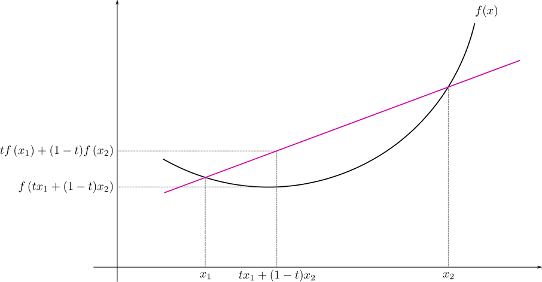

# Inequalities, convergences, and normal random samples

In this chapter, we lay more advanced groundwork for the upcoming inference chapters.
Here, we will take a look at the concept of *convergence* as applied to random variables. 
You would have come across convergence of sequences before, but when that sequence is random, does "convergence" even have a sensible meaning?
It turns out we can define such concepts even for random variables.
Establishing convergence concepts allows us to also establish very important limit theorems used frequently in statistics.

Also included in this chapter is a study of the distributions derived from normal random samples.
As the normal distributions is used all the time in inferential statistics, the properties of normal random samples has been studied extensively. 
In particular, normal random samples give rise to the $\chi^2$, $t$ and $F$ distributions--all of which I'm sure you have heard of in the context of statistical testing.
Here, we will take a look in detail as to how they are derived, and how we can use them when calculating probabilities of interest.


### Learning objectives {-}

::: {.learningobjectives}
By the end of this chapter, you will be able to:

- Apply probability inequalities and inequalities based on expectations to compute approximate bounds and in proving other mathematical theorems.
- Understand the notion of three types of convergences as applied to random variables, namely convergence in probability, convergence in distribution, and mean-square convergence.
- Be familiar with two important limit theorems in statistics: The (weak) Law of Large Numbers; and the Central Limit Theorem.
- Use Slutzky's theorem and the delta method in probability-based calculations and inference problems.
- Define and use the distributions derived from normal random samples: $\chi^2$, Student's $t$, and $F$ distributions.
:::

### Readings {-}

- Casella and Berger (2002)
    - Chapter 5, sections 5.1--5.3 and 5.5.
- Wasserman (2004)
    - All of chapter 4.
    - All of chapter 5.
- Topics not covered here: Order statistics, almost-sure convergence, consistency (will be covered in Part 4), strong LLN, multivariate delta method, Hoeffding's inequality, Mill's inequality, 


## Introduction

Statistical inference involves data points, which as we discussed previously, displays a duality between being information and also random variables.
Typically, collecting data $X_1,\dots,X_n$ in an experiment means recording several observations on a a particular variable of interest $X$.
For example.

- Time to failure for $n$ identical circuit boards.
- Yield (in tonnes) of $n$ seasonal harvest for *Laila* variety paddy.
- Voter preferences for $n$ individuals in the US.

We can **model** this mathematically by declaring $\bX = (X_1,\dots,X_n)^\top$ to be random variables sampled from a population whose pdf or pmf is $f_{\bX}(\bx)$.
We typically write
\[
(X_1,\dots,X_n)^\top \iid f_{\bX}.
\]

::: {.mynote}
There are two points to note here:

1. We have indeed treated all observations $\bX$ as being sampled from a multivariate distribution. In general this is the proper way of doing it, unless we impose a further assumption of independence and identical distributions (see next section).

2. In most practical situations, we usually collect more than one *kind* of data, e.g. demographic data for study participants age, weight, height, etc. This is called *multivariable data*. We will focus on *univariate* statistics in this course for the most part.

:::

<!-- ::: .{myalert} -->
<!-- We impose the distribution $f_{\bX}$ onto the data as an [assumption]{.ul}! -->
<!-- As the British statistician George Box once famously said, "all models are wrong, but some are useful". -->
<!-- ::: -->

### Independent and identical random variable

In an experiment, the samples are usually taken in such a way 

- that the value of one observation has no effect on or relationship with any of the other observations (i.e. $X_1,\dots,X_n$ are independent); and
- the pdf/pmf of each observation is $f(x)$ (i.e. identical).

In this case (remember definition of independence for pdfs),  
\[
f_{\bX}(x_1,\dots,x_n) = \prod_{i=1}^n f(x_i)
\]

In particular, if the population pdf/pmf is a member of a *parametric family*, say one of those introduced in Chapter 2, then we can write
\[
f_{\bX}(x_1,\dots,x_n|\theta) = \prod_{i=1}^n f(x_i|\theta).
\]
This is because identical distribution assumption would mean each of the random variables is assumed to come from the same family of distribution with the same parameter.
We could then use the random samples to *infer* about the (unknown) parameter $\theta$. More on this in the next chapter.

::: {.mycheck}
**Side note: Finite population sampling**

We have just defined sampling from an *infinite* population. Sometimes, sampling is done from a *finite* population, that is, the population consists only of possible observations $\{x_1,\dots,x_N \}$.

There are several approaches to this which may or may not yield independent samples:

- sampling with vs without replacement
- simple random sampling vs complex random sampling
- single-stage sampling vs multi-stage sampling
- etc.

Very important topic in **survey methodology**. 
For more details see C\&B §5.1, as well as 2019 lecture slides (Chapter 2).
In this course, we deal only with the infinite population model.
:::

### Statistic

Throughout the course we will refer to an object called a "statistic". Note the singular use of the word.

::: {.definition name="Statistic"}
A statistic is any function $T_n = T(X_1,\dots,X_n)$. It cannot depend on unknown parameters, only on observables.
:::

In essence, a statistic is a manipulation of information, usually in a way to condence the information from samples.
Suppose $X_1,\dots,X_n$ is a random sample with mean $\mu$ and variance $\sigma^2$.
Here are some examples of statistics (the first two are really common statistics)

- The sample mean 
\[
\bar X = \frac{1}{n}\sum_{i=1}^n X_i
\]

- The (unbiased) sample variance
\[
S^2 = \frac{1}{n-1}\sum_{i=1}^n (X_i-\bar X)^2
\]

- The maximum of the sample 
$$
\max(X_1,\dots,X_n)
$$

- Any value of the sample itself
$$
X_i
$$
These however, are **not** statistics, because they involve parameter values of the underlying probability distribution.

-  The quantity
$$
\frac{\bar X - \mu}{\sigma/\sqrt n}
$$

- Any expectation
$$
\E(g(X)) = \int g(x) f(x|\theta)\dint x
$$

Practically speaking, we can calculate statistics if we have the data points.
But we cannot calculate non-statistics because we have to ask ourselves "what is the value of $\theta$" in order to proceed!

Since the sample mean and sample variance are commonly used statistics, it's important to know the following properties:

::: {.lemma}
Let $X_1,\dots,X_n$ be a random variable with mean $\mu$ and variance $\sigma^2<\infty$. Then

- $\E(\bar X) = \mu$.
- $\Var(\bar X) = \frac{\sigma^2}{n}$.
- $\E(S^2)=\sigma^2$.
:::

The proof of this can be found in C\&B, Theorem 5.2.6.

::: {.mycheck}
Do try out the proof of this lemma by yourself. 
The first two should be doable by now, but perhaps the last one is a little bit challenging.
:::


### Sampling distribution

Realise that

- A statistic $T_n$ is itself a random variable. 
- If it is random, it has a distribution, even if we might not know what it is.
- Along with having a distribution, all of concepts and properties we discussed in Chapters 1 & 2 apply.

::: {.mycheck}
Think about the statement above, "a statistic $T_n$ is itself a random variable"--can you rationalise why this is? Suppose you collect some data and plug these values into a statistics function (e.g. the sample mean). Will the value of the sample mean be the same each time, or will it depend on the (random) values of the data?
:::

A very common theme in inferential statistics is to figure out what the distribution of $T_n$ is in repeated sampling. 
The reason for this is in parameteric statistics, the statistic $T_n$ may serve as an *estimator* for the true unknown value $\theta$.
But since we've established that $T_n$ itself is a random variable, and different samples will give different values, how do we convince ourselves that $T_n$ is actually a *good* estimator? 

One way perhaps is to consider the values of $T_n$ under *repeated sampling*, and whether its value is "typically close" to the true value $\theta$?
In the next chapter especially, we will take a look at this problem in detail.

### Large-sample approximation

Some statistics have easily-derived sampling distribution; others do not.
For instance, suppose each $X_i\sim\N(\mu,\sigma^2)$. Then it is well known that
\begin{equation}
\bar X \sim \N(\mu, \sigma^2/n). (\#eq:samplemeandist)
\end{equation}

::: {.mycheck}
The above fact \@ref(eq:samplemeandist) is very important and pops up all the time in statistics. Have a go at proving the distribution of the sample mean.
:::


Generally speaking statistics derived from normal random samples have 'easy' distributions (we'll see this later).
But what is the distribution of
\[
n^{-1}\sum_{i=1}^n \tan^{-1}(X_i)?
\]

If being exact is difficult, maybe we can compromise by using approximate distributions, which can be found by using *asymptotic* arguments.
That is, we consider the behaviour of the distribution of the complicated statistics $T_n$ as $n\to\infty$.
This is what we often refer to as its large-sample approximation.

But of course, we have to take care of the mathematics because when dealing with infinite quantities, a lot of things can go wrong.
What we need to establish is that the limiting behaviour of our statistics of interest actually do what we expect them to do.
For this, we need to study inequalities and convergences.

## Inequalities

Inequalities are useful tools in establishing various properties of statistical inference methods.
They may also provide estimates for probabilities with little assumption on probability distributions.

There are four main inequalities that we will learn:

- Markov's inequality
- Chebyshev's inequality
- Cauchy-Schwarz inequality 
- Jensen's inequality

### Markov's inequality

In probability theory, Markov's inequality gives an upper bound for the
probability that a *non-negative* random variable exceeds some positive constant.

::: {.lemma name="Markov's inequality"}
Let $X\geq 0$ be a non-negative random variable and $\E(X) < \infty$. Then, for any
$t>0$, $$\Pr(X\geq t) \leq \frac{\E(X)}{t}.$$
:::

Markov's inequality relate probabilities to expectations, and provides
bounds for the cumulative distribution function of a random variable.

::: {.proof}
Let $f(x)$ be the pdf of $X$. Since $X\geq 0$, $$\begin{aligned}
    \E(X) = \int_{-\infty}^{\infty} x\,f(x) \dint x &= \int_0^{\infty} x\,f(x) \dint x \\
    &= \int_0^t x\,f(x) \dint x + \int_t^\infty x\,f(x) \dint x \\
    &\geq \int_t^\infty x\,f(x) \dint x \\
    &\geq t\int_t^\infty f(x) \dint x \\
    &= t\Pr(X\geq t) 
  \end{aligned}$$
:::

<br>

::: {.corollary}
For any random variable $X$ and any constant $t>0$, $$\begin{aligned}
      \Pr(|X|\geq t) &\leq \frac{E|X|}{t} \ \ \ \text{ provided } E|X|<\infty \\
      \Pr(|X|\geq t) &\leq \frac{E\big(|X|^k\big)}{t^k} \ \ \ \text{ provided } E\big(|X|^k\big)<\infty
    \end{aligned}$$
:::

Note that there is no mistake in the corollary statement above (if you were wondering about whether there should be a power of $k$ in the probability statement).

::: {.mycheck}
Can you prove the corollary to Markov's inequality? The steps are similar to the proof of the original Markov's inequality.
:::


The tail probability $\Pr(|X|\geq t)$ is a useful measure in insurance and
risk management in finance. The more moments $X$ has, the smaller the
tail probabilities are.

### Chebyshev's inequality

In probability theory, Chebyshev's inequality guarantees that no more
than a certain fraction of values can be more than a certain distance
from the mean.

::: {.lemma name="Chebyshev's inequality"}
Suppose a random variable $X$ has mean $\mu$ and variance $\sigma^2$. Then, for any
$t>0$, $$\Pr(|X-\mu| \geq t\sigma) \leq \frac{1}{t^2}.$$
:::

::: {.mycheck}
The proof of Chebyshev's inequality follows directly from Markov's inequality. You will prove this in the exercises.
:::

Because it can be applied to completely arbitrary distributions (provided they have a known finite mean and variance), the inequality generally gives a [poor bound]{.ul}, compared to what might be deduced if more aspects are known about the distribution involved.

Note that 
\begin{align*}
\Pr(|X-\mu| \geq t\sigma)
&= \Pr\big(\{ X \leq \mu - t\sigma \} \cup \{ X \geq \mu + t\sigma \}\big) \\
&= 1 - \Pr( \mu - t\sigma \leq X \leq \mu + t\sigma ) \\
&= 1 - \Pr\big(|X-\mu| \leq t\sigma\big)
\end{align*}

::: {.example}
Suppose $X$ has mean 0 and variance 1. By Chebyshev's inequality,
$$\begin{aligned}
    \Pr(|X| \geq 1) &\leq 1.00 \\
    \Pr(|X| \geq 2) &\leq 0.25 \\
    \Pr(|X| \geq 3) &\leq 0.11 
  \end{aligned}$$ 

In contrast, suppose that we know that $X$ is normally
distributed. Then $$\begin{aligned}
    \Pr(|X| \geq 1) &\leq 0.318 \\
    \Pr(|X| \geq 2) &\leq 0.046 \\
    \Pr(|X| \geq 3) &\leq 0.003 
  \end{aligned}$$

Recall the 68-95-99.7 rule when we discussed the normal distribution in Chapter2.
:::

Calculate the above probabilities in `R`:

```{r chebyshev}
2 * (pnorm(-c(1, 2, 3)))
```


### Cauchy-Schwartz inequality 

This is a very useful inequality that crops up in many different areas of mathematics, such as linear algebra, analysis, probability theory, vector algebra, etc.

::: {.lemma name="Cauchy-Schwartz inequality"}
Let $E(X^2)<\infty$ and $E(Y^2)<\infty$. Then
$$|E(XY)|^2 \leq E(X^2)E(Y^2).$$
:::

Subtle point: $|E(XY)|^2 = \E^2(XY)$.

::: {.proof}
Consider the expectation $\E((tX+Y)^2)\geq 0$ for some constant $t\in\bbR$.
Expanding out, we have
\[
\E((tX+Y)^2) = \overbrace{\E(X^2)}^{a}t^2 + \overbrace{2\E(XY)}^{b}t+ \overbrace{\E(Y^2)}^{c}
\]
For some constants $a,b,c\in\bbR$, the polynomial $at^2 +bt + c$ remains non-negative iff $a\geq 0$ and the discriminant $b^2-4ac \leq 0$. Thus,
\[
4\E^2(XY) - 4\E(X^2)\E(Y^2) \leq 0,
\]
and dividing by 4 throughout, we have the desired result.
:::

As a consequence of the Cauchy-Schwartz inequality, we have the covariance inequality.

::: {.corollary name="The covariance inequality"}
Let $X$ and $Y$ be random variables. Then
$$\Var(Y) \geq \frac{\Cov(Y,X)\Cov(Y,X)}{\Var(X)}$$
:::

::: {.mycheck}
You will prove the covariance inequality in one of the exercises at the end of this chapter.
:::


### Jensen's inequality

Before discussing the next kind of inequality, we shall first discuss convex functions.

::: {.definition}

- A function $g$ is \textbf{convex} if for any $x,y$ and any
    $\alpha \in [0,1]$,
    $$g(\alpha x + (1-\alpha)y) \leq \alpha g(x) + (1-\alpha)g(y).$$

- If $g''(x)>0$ for all $x$, then $g$ is convex.

- A function $g$ is \textbf{concave} if $-g$ is convex.

:::

::: {.example}
Examples of convex functions: $g_1(x) = x^2$ and $g_2(x) = e^x$, since
$g_1''(x) = 2>0$ and $g_2(x)=e^x > 0$ for all $x$.


Examples of concave functions: $g_3(x) = -x^2$ and $g_4(x) = \log(x)$.
:::

```{r jensen, echo = FALSE, fig.align = "center", out.width = "80%"}

```


In the context of probability theory, we consider expectations of *convex* functions of random variables

::: {.lemma name="Jensen's inequality"}
Let $X$ be a random variable and $g$ a convex function. Then, $$\E\left[g(X) \right] \geq g\left(\E X \right)$$
:::


It follows directly from Jensen's inequality, the following:

- $\E(X^2) \geq \{\E(X)\}^2$
- $\E(1/X) \geq 1 / \E X$
- $\E(\log X) \geq \log (\E X)$

## Convergence of random variables

Recall the limits of sequences of real numbers $(a_n)$, $n\in\bbN$.

::: {.definition name="Limit of a real sequence"}
We call $a$ the limit of the real sequence $(a_n)$ if for each real
number $\epsilon>0$, $\exists$ a natural number $N(\epsilon)\in\bbN$ such that, for
every natural number $n\geq N$, we have $|a_n-a| < \epsilon$.
:::

We write $\lim_{n\to\infty} a_n = a$, or simply $a_n \to a$. This also
means that $|a_n-a| \to 0$ as $n\to\infty$. For every measure of
closeness $\epsilon$, the sequence's terms are eventually that close to
the limit.

Some examples:

-   If $a_n=c$ for some constant $c\in\bbR$, then $a_n\to c$.
-   If $a_n=1/n$, then $a_n\to 0$.
-   $\lim_{n\to\infty}(1+1/n)^n = e$.


```{r limits1, echo = FALSE, fig.height = 4}
plot.df <- tibble(x = 1:25)
plot.df$y <- 1 / (plot.df$x) ^ {1/1.2}
eps <- 0.15
ggplot() +
  geom_point(data = subset(plot.df, y >= eps), aes(x, y), 
             col = iprior::gg_col_hue(2)[1]) +
    geom_point(data = subset(plot.df, y <= eps), aes(x, y), 
             col = iprior::gg_col_hue(2)[2]) +
  geom_hline(yintercept = 0, linetype = "dashed", col = "grey60") +
  geom_hline(yintercept = c(eps, -eps)) +
  geom_vline(xintercept = 10, col = iprior::gg_col_hue(2)[2], linetype = "dotted") +
  coord_cartesian(ylim = c(-0.3, 0.5), xlim = c(3, 25)) +
  scale_y_continuous(breaks = c(-eps, 0, eps), 
                     labels = c(expression(a - epsilon), "a", expression(a + epsilon))) +
  labs(y = expression(a[n]), x = "n") +
  annotate("text", x = 10.5, y = 0.3, label = "N", col = iprior::gg_col_hue(2)[2]) +
  theme(#axis.text.y = element_blank(), axis.ticks.y = element_blank(),
        axis.text.x = element_blank(), axis.ticks.x = element_blank())
```


What if $(a_n)$ is a random sequence (i.e. their values are not deterministic)?
Does the concept of limits even make sense? 
Is it possible to "trap" the sequence between an upper and lower bound as the sequence progresses?
This is what we will be exploring in this section.

```{r limits2, echo = FALSE, fig.height = 4}
set.seed(123)
plot.df <- tibble(x = 1:25)
plot.df$y <- 1 / (plot.df$x) ^ {1/1.2} + rnorm(nrow(plot.df), sd = 0.1)
eps <- 0.15
ggplot() +
  geom_point(data = subset(plot.df, y >= eps), aes(x, y), 
             col = iprior::gg_col_hue(2)[1]) +
    geom_point(data = subset(plot.df, y <= eps), aes(x, y), 
             col = iprior::gg_col_hue(2)[2]) +
  geom_hline(yintercept = 0, linetype = "dashed", col = "grey60") +
  geom_hline(yintercept = c(eps, -eps)) +
  geom_vline(xintercept = 10, col = iprior::gg_col_hue(2)[2], linetype = "dotted") +
  coord_cartesian(ylim = c(-0.3, 0.45), xlim = c(3, 25)) +
  scale_y_continuous(breaks = c(-eps, 0, eps), 
                     labels = c(expression(a - epsilon), "a", expression(a + epsilon))) +
  labs(y = expression(a[n]), x = "n") +
  annotate("text", x = 10.6, y = 0.3, label = "N?", col = iprior::gg_col_hue(2)[2]) +
  theme(#axis.text.y = element_blank(), axis.ticks.y = element_blank(),
        axis.text.x = element_blank(), axis.ticks.x = element_blank())
```


We can in fact say similar things about sequences of **random variables**, e.g. $X$ is the limit of a sequence
$(X_n)$ if $|X_n - X|\to 0$ as $n\to\infty$. 
There are some subtle issues here:

1.  $|X_n-X|$ itself is a random variable, i.e. it takes difference values in the
    sample space $\Omega$. Therefore, $|X_n - X|\to 0$ should hold
    (almost) entirely on the sample space. This calls for a probability
    statement.

2.  Since random variable have distributions, we may also consider convergence of
    their distributions $F_{X_n}(x)\to F_X(x)$ for all $x$.

We need better tools to rigorously discuss the concept of convergence of random variables.
Let $X_1,X_2,\dots$ be a sequence of random variable, and $X$
be another random variable. The main types of convergence for random variable that we will study are as follows:

1. Convergence in probability
2. Convergence in distribution
3. Convergence in mean-square

### Convergence in probability

This is probably the most intuitive concept of what we would expect for a random variable to converge.

::: {.definition name="Convergence in probability"}
$X_n$ converges to $X$ in probability if for any constant $\epsilon>0$,
$$\lim_{n\to\infty} \Pr(|X_n-X|\geq\epsilon) = 0.$$ 
We write
$X_n\xrightarrow{\text{P}}X$, or $\plim_{n\to\infty}X_n = X$.
:::

An equivalent definition is
\[
  \lim_{n\to\infty}\Pr(|X_n-X| < \epsilon)  = 1.
\]

In words: "the probability of an 'unusual' outcome becomes smaller and smaller as the sequence progresses".
Here, $X$ may be a random variable or a constant.

::: {.example}
Let $X_i\iid \Unif(0,1)$. Define another random variable $Y_n=\min\{X_1,\dots,X_n\}$. Does $Y_n$ converge to something? Draw some samples:

```{r convprob}
set.seed(123)
X <- runif(20); Y <- rep(NA, 20)
for (i in 1:20) Y[i] <- min(X[1:i]) 
round(X, 2)
round(Y, 2)
```

A good guess with be $Y_n \to 0$, so let's prove this. 
We want to show that 
$$\Pr(|Y_n-0| \geq \epsilon)=\Pr(Y_n\geq \epsilon)\to 0$$ 
as $n\to \infty$. There are two cases, i) $\epsilon > 1$ or ii) $\epsilon \leq 1$. If i), then $\Pr(Y_n\geq \epsilon)=0$ and we are done. However, if $\epsilon \leq 1$, then
$$
\begin{aligned}
\Pr(Y_n\geq \epsilon) 
&= \Pr(\min\{X_1,\dots,X_n\} \geq \epsilon) \\
&=\Pr(X_1 \geq \epsilon, \dots, X_n \geq \epsilon) \\
&=\Pr(X_1\geq \epsilon)\cdots \Pr(X_n\geq \epsilon) \text{ by independence}\\
&=(1-\epsilon)^n \to 0
\end{aligned}
$$
as $n\to \infty$. Hence $Y_n \xrightarrow{\text{P}} 0$.
:::

Here's another way of thinking about convergence in probability.
Consider a random variable $X_n$ converging to $X$ as $n\to\infty$.
Suppose at every point $n$ we can draw a probability distribution curve of the random variable $X_n$. 
For small values of $n$, the curve might look flat, since very early on it's not converging yet.
But as the values of $n$ increases, we can steadily see that the curve becomes more concentrated around the value of $X$.
Eventually, it will be so concentrated around $X$ that the probability of $X_n$ taking values outside a certain band ($\pm\epsilon$) will be virtually zero.

```{r limits3, echo = FALSE, fig.height = 3.5}
set.seed(123)
n <- 100
x <- rnorm(n)
mu <- cumsum(x) / seq_along(x)
sd <- sqrt(1 / seq_along(x) ^ 1.65)
plot.df <- tibble(
  x = 1:n,
  y = mu
)
eps <- 0.15
epslim <- eps + 0.45
path.df <- segment.df <- NULL
for(x0 in c(1, 5, 10, 15, 20, 25)) {
  x <- seq(-epslim, epslim, length.out = 250)
  y <- dnorm(x, sd = sd[x0])
  path.df <- rbind(path.df, data.frame(x = y + x0, y = x, n = x0))
  segment.df <- rbind(segment.df, data.frame(x = x0, y = - epslim, xend = x0, 
                                             yend = epslim, n = x0))
}

ggplot() +
  geom_path(data = path.df, aes(x, y, group = n), col = iprior::gg_col_hue(2)[2], 
            alpha = 0.5) +
  geom_segment(data = segment.df, aes(x, y, xend = xend, yend = yend, group = n),
               col = iprior::gg_col_hue(2)[2], alpha = 0.5) +
  geom_point(data = subset(plot.df, y >= eps), aes(x, y), 
             col = iprior::gg_col_hue(2)[1]) +
  geom_point(data = subset(plot.df, y <= eps), aes(x, y), 
             col = iprior::gg_col_hue(2)[2]) +
  geom_hline(yintercept = 0, linetype = "dashed", col = "grey60") +
  geom_hline(yintercept = c(eps, -eps)) +

  coord_cartesian(xlim = c(1, 30)) +
  scale_y_continuous(breaks = c(-eps, 0, eps), 
                     labels = c(expression(X - epsilon), "X", expression(X + epsilon))) +
  labs(y = expression(X[n]), x = "n") +
  # annotate("text", x = 10.6, y = 0.3, label = "N?", col = iprior::gg_col_hue(2)[2]) +
  theme(#axis.text.y = element_blank(), axis.ticks.y = element_blank(),
        axis.text.x = element_blank(), axis.ticks.x = element_blank())
```

### Convergence in distribution

Instead of considering the convergence of the random variable itself, we consider the convergence of the *distribution* of the sequence of random variables.

::: {.definition name="Convergence in distribution"}
$X_n$ converges to $X$ in distribution if
$$\lim_{n\to\infty}F_{X_n}(x) = F_X(x).$$
We write
$X_n\xrightarrow{\text{D}}X$.
:::

- Again here $X$ may be a constant, since a constant is a random variable with probability mass concentrated on a single point.
- We can also write $X_n{\xrightarrow{\text{D}}} F_X$, where $F_X$ is the cdf of $X$. However, the notation $X_n{\xrightarrow{\text{P}}} F_X$ does not make sense!

Convergence in probability implies convergence in distribution, but [not the other way around]{.ul} (**unless** the limiting random variable is a point mass).

::: {.example}
Let $X\sim\N(0,1)$ and $X_n=-X$ for all $n \geq 1$. Then, clearly
$F_{X_n} \equiv F_{X}$ (by linearity of normal distributions). Hence,
$X_n\xrightarrow{\text{D}}X$.

However, $X_n$ does not converge in probability to $X$, as for any $\epsilon>0$,
$$\begin{aligned}
       \Pr(|X_n-X|\geq\epsilon) &= \Pr(2|X|\geq\epsilon) \\
       &= \Pr(|X|\geq\epsilon/2) > 0.
    \end{aligned}$$

So we cannot have that $\Pr(|X_n-X|\geq\epsilon) \to 0$ as $n\to\infty$.
:::

### Mean-square convergence 

In most practical situations, proving convergence in probability or distribution can be quite tough.
It is therefore more convenient to consider the mean-square convergence.

::: {.definition name="Mean-square convergence"}
$X_n$ converges in mean-square to $X$ if
$$\lim_{n\to\infty} \E\left[(X_n - X)^2 \right] = 0.$$
We write $X_n\xrightarrow{\text{m.s.}}X$.
:::

It follows that from Markov's inequality, 
$$\begin{aligned}
\Pr(|X_n-X|\geq \epsilon)
&= \Pr(|X_n-X|^2\geq \epsilon^2) \\
    &\leq \frac{\E\left[(X_n - X)^2 \right]}{\epsilon^2}
\end{aligned}$$ 
Therefore, if $X_n\xrightarrow{\text{m.s.}}X$, it also
holds that $X_n\xrightarrow{\text{P}}X$.


Convergence in mean-square implies convergence in probability, but [not the other way around]{.ul}.

::: {.example}
Let 
$$ X_n = 
    \begin{cases}
      n^2 &\text{w.p. } 1/n \\
      0 &\text{w.p. } 1- 1/n  
    \end{cases}$$ 
Then, for any $\epsilon>0$,
$\Pr(|X_n|\geq\epsilon) = \Pr(X_n = n^2) = 1/n \to 0$ as $n\to\infty$.
Hence, $X_n{\xrightarrow{\text{P}}}0$.

However, $$\E(X_n^2) = n^2 \cdot \Pr(X_n = n^2) + 0  \cdot \Pr(X_n = 0) = n \to \infty$$ hence $X_n$ does not converge in mean square to 0.
:::

### Relationship between convergences 

The following diagram ties the three notions of convergences for random variables together.

```{r, echo=FALSE, engine='tikz', out.width ="80%", fig.align = "center"}
\definecolor{navyblue}{RGB}{0, 47, 92}
\definecolor{charcoal}{RGB}{54,69,79}
\definecolor{gray}{RGB}{128, 128, 128}
\definecolor{solidpink}{HTML}{8E3B46}
\definecolor{queenpink}{HTML}{EAD1D6}
\definecolor{orangecrayola}{HTML}{FFD166}
\definecolor{paradisepink}{HTML}{EF476F}
\definecolor{myrtlegreen}{HTML}{346B61}
\definecolor{lightcyan}{HTML}{CCE8E3}
\usetikzlibrary{fit,positioning,shapes.geometric,decorations.pathreplacing,calc}
\begin{tikzpicture}[scale=0.9, transform shape]
\tikzstyle{obsvar}=[rectangle, thick, minimum size = 10mm,draw =black!80, node distance = 1mm]
\tikzstyle{connect}=[-latex, thick]
\node (A) at (0, 0) [rectangle,draw,minimum width=2cm,label=below:{\scriptsize Convergence in  mean-square},text width=2cm,align=center] {$X_n{\xrightarrow{\text{m.s.}}}X$};
\node (B) at (4, 0) [rectangle,draw,minimum width=2cm,label=below:{\scriptsize Convergence in probability},text width=2cm,align=center] {$X_n{\xrightarrow{\text{P}}}X$};
\node (C) at (8, 0) [rectangle,draw,minimum width=2cm,label=below:{\scriptsize Convergence in distribution},text width=2cm,align=center] {$X_n{\xrightarrow{\text{D}}}X$};

\draw[thick]
  (A) edge[->,double] (B) 
  (B) edge[->,double] (C)
  (C) edge[->,dotted,bend right,out=315,in=225] node [above] {{\small if $X$ is a constant}} (B);

\end{tikzpicture}
```

::: {.mycheck}
You can find the proof of the above statements in Wasserman (Theorem 5.4). The proof is fairly easy to follow but for brevity will not be repeated here.
:::

As we saw previously,

- Convergence in distribution does not imply convergence in probability.
- Convergence in probability does not imply convergence in mean-square.
- If $X_n \xrightarrow{\text{D}}c\in\bbR$ then $X_n \xrightarrow{\text{P}}c$.

It is typically easier to prove convergence in mean-square, which thus also implies convergence in probability and in distribution.

### Slutzky's Theorem

On another practical note, once we figure out that $X_n\to X$ in probability say, we are usually also interested in whether functions of $X_n$ also converge.
For instance, suppose we calculate two sample means $\bar X_n$ and $\bar Y_n$ from the same experiment.
Can we combine the two? I.e., does $\frac{1}{2}(\bar X_n + \bar Y_n)$ converge meaningfully?

Instead of trying to prove "manually" convergence for new functions of random variables, we have Slutzky's theorem to the rescue!


::: {.theorem name="Slutzky's Theorem"}
Let $X_n$, $Y_n$, $X$, and $Y$ be random variable, $g$ a continuous function, and
$c$ a real constant. Then,

- If $X_n{\xrightarrow{\text{P}}} X$ and $Y_n{\xrightarrow{\text{P}}} Y$,
    then

   - $X_n+Y_n{\xrightarrow{\text{P}}} X+Y$;
   - $X_nY_n{\xrightarrow{\text{P}}} XY$; and
   - $g(X_n){\xrightarrow{\text{P}}} g(X)$.


- If $X_n{\xrightarrow{\text{D}}} X$ and $Y_n{\xrightarrow{\text{D}}} c$, then

   -  $X_n+Y_n{\xrightarrow{\text{D}}} X+c$;
   - $X_nY_n{\xrightarrow{\text{D}}} cX$; and
   - $g(X_n){\xrightarrow{\text{D}}} g(X)$.
:::

::: {.myalert}
**Caution!** If $X_n{\xrightarrow{\text{D}}} X$ and
$Y_n{\xrightarrow{\text{D}}} Y$, it does \textbf{not} in general imply that
$X_n+Y_n{\xrightarrow{\text{D}}} X+Y$.
:::

Unfortunately the proof is not straightforward, so we shall skip it for now. 
Interested readers can definitely look up the proof in the suggested textbooks.

::: {.example}
Consider two sequences:

- $X_n = X$ where $X\sim\N(0,1$; and
- $Y_n = 2 + e^{-n}$.

Evidently $X_n \to \N(0,1)$ in distribution as $n\to\infty$, since all the values of $X_n$ are drawn from a standard normal.
Further, $Y_n$ itself is not a random variable--it is a regular sequence, and we can clearly see that $Y_n \to 2$ as $n\to\infty$.
Technically, we can still say $Y_n{\xrightarrow{\text{D}}} 2$, so Slutzky's theorem applies:

$$
Z_n = X_nY_n \xrightarrow{\text{D}} 2 \times \N(0,1) \equiv \N(0,4).
$$

Similarly,
$$
W_n = X_n + Y_n \xrightarrow{\text{D}} 2 + \N(0,1) \equiv \N(2,1).
$$
:::

<!-- The above example can be illustrated by drawing $N=10,000$ samples from each of $Z_n$ and $W_n$ for various values of $n$. -->

<!-- ```{r slutzky1, echo = FALSE} -->
<!-- N <- 10000 -->
<!-- n <- c(10, 50, 1000) -->

<!-- create_tab <- function(nn) { -->
<!--   tibble( -->
<!--     n = nn, -->
<!--     Xn = rnorm(N), -->
<!--     Yn = 2 + exp(-nn/1000) -->
<!--   ) %>% -->
<!--     mutate(XnYn = Xn * Yn, XnplusYn = Xn + Yn) -->
<!-- } -->
<!-- bind_rows( -->
<!--   create_tab(n[1]), -->
<!--   create_tab(n[2]), -->
<!--   create_tab(n[3]) -->
<!-- ) -> plot_df -->

<!-- ggplot(plot_df, aes(XnYn)) + -->
<!--   geom_histogram() + -->
<!--   facet_grid(n ~ .) -->

<!-- ``` -->


## Limit theorems

In this section, we'll cover two very important theorems in statistics: The Law of Large Numbers and The Central Limit Theorem.

### The (weak) Law of Large Numbers

Perhaps the best application of convergence in probability.

::: {.theorem name="The weak law of large numbers; WLLN"}
Let $X_1,X_2,\dots$ be iid random variables with mean $\mu$ and variance $\sigma^2$. 
Let $\bar X_n$ denote the sample mean, i.e. $$\bar X_n = \frac{1}{n}\sum_{i=1}^n X_i.$$ 
Then, as $n\to\infty$,
$$\bar X_n{\xrightarrow{\text{P}}} \mu.$$
:::

The LLN is very natural: When the sample size increases, the sample mean
becomes more and more close to the population mean. Furthermore, the
distribution of $\bar X_n$ degenerates to a single point distribution at $\mu$, the true mean.

::: {.proof}
Recall that $\E(\bar X_n)=\mu$ and $\Var(\bar X_n) = \sigma^2/n$.
Choose an $\epsilon >0$ such that $\epsilon=t\sigma/\sqrt{n}$.
By Chebyshev's inequality,
\begin{align*}
\Pr(|\bar X_n - \mu| \geq \overbrace{t\sigma/\sqrt{n}}^{\epsilon}) 
&\leq \frac{1}{t^2}\\
&=\frac{\sigma^2}{n\epsilon^2} \to 0
\end{align*}
as $n\to\infty$.
Hence, $\bar X_n{\xrightarrow{\text{P}}} \mu$.
:::

As an illustration of the WLLN, consider an experiment where we throw a six-sided die repeatedly and independently.
Let $X_1,X_2,\dots$ be the scores of the dice throws.
We know that the true mean is $\mu=3.5$.
Let's simulate some dice throws:

```{r dicethrow}
set.seed(123)
(X <- sample(6, size = 20, replace = TRUE))
Xbar <- cumsum(X) / seq_along(X)
round(Xbar, 2)
```

```{r dicethrowplot, echo = FALSE}
set.seed(123)
n <- 500
X <- sample(6, size = n, replace = TRUE)
Xbar <- rep(NA, n)
for (i in 1:n) Xbar[i] <- mean(X[1:i])
ggplot() +
  geom_hline(aes(yintercept = 3.5, linetype = "Theoretical")) +
  geom_line(aes(x = 1:n, y = Xbar, linetype = "Sample")) +
  scale_y_continuous(limits = c(1, 6), breaks = 1:6) +
  labs(x = "n", y = "Score", linetype = "Mean") +
  scale_linetype_manual(values = c("solid", "dotted")) +
  theme(legend.position = c(1, 0.05), legend.justification = c(1, 0))
```

::: {.mycheck}
It would be very good practice to work out the true mean ($\mu=3.5$) of the scores of the dice throws, using the formula for the expectations of discrete probability models.
:::

### The Central Limit Theorem 

The LLN assures us that $\bar X_n$ eventually will be indistinguishable from $\mu$ w.p. 1.
However, we would still be interested in the distribution of $\bar X_n$ in order to make *probabilistic statements* about $\bar X_n$.

::: {.theorem name="Central Limit Theorem; CLT"}
Let $X_1,\dots,X_n$ be iid random variable with mean $\mu$ and variance $\sigma^2$, and let $\bar X_n$ denote the sample mean. Then
\[
\bar Z_n := \frac{\bar X_n - \mu}{\sigma/\surd n} \xrightarrow{\text D} \N(0,1)
\]
as $n\to \infty$.
:::

In words: "the standardised sample mean $\bar Z_n$ is approximately standard normal when the sample size is large". 
This is remarkable because we assume nothing about the distribution of the individual $X_i$s!
The CLT is one of the reasons why the normal distribution is the most useful and important distribution in statistics.


Alternative statements for the CLT include

-   $\sqrt{n}(\bar X_n - \mu)/\sigma \approx \N(0,1)$
-   $\sqrt{n}(\bar X_n - \mu) \approx \N(0,\sigma^2)$
-   $\bar X_n - \mu \approx \N(0,\sigma^2/n)$\
-   $\bar X_n \approx \N(\mu,\sigma^2/n)$

Some other remarks:

- The CLT gives us information about the *variability* of the sample mean statistic in repeated sampling, see the slides after the next example.
- The CLT tells us nothing about the *accuracy* of any implied approximation for finite $n$.
- However, it still yields remarkably accurate approximations in many situations, even with modest $n$.
- A version of the proof involves mgfs, as you will see in the exercises.
- The CLT is responsible for the normal approximations to the binomial, Poisson, gamma, etc.!


::: {.example}
Recall the dice example above.
The CLT implies that 
\begin{equation}
\bar X_n \approx \N\left(3.5, \frac{105}{36n}\right), (\#eq:clteg)
\end{equation}
since $\Var(X_i)=105/36$.
:::

::: {.mycheck}
See that variance of 105/36 in the example above? Try and obtain this figure yourself using the usual definitions of variances, or better yet, employ the results from the binomial distribution.
:::

To illustrate this, we can take many samples of size $n$ and compute the sample mean for each
set, we then obtain many sample means. 
The standardised histogram of those samples resembles the normal pdf in \@ref(eq:clteg).

Here's the `R` code to replicate dice rolls and the sample means. 
The idea is to generate a sample of size $n$ of dice roll scores repeatedly `B` times.

```{r clteg1}
my_clt_fn <- function(n = 5, B = 10000) {
  res <- rep(NA, B)
  for (i in 1:B) {
    X <- sample(1:6, size = n, replace = TRUE)
    res[i] <- mean(X)
  }
  res
}
```

We can also use this to retrieve $\bar X_{20}=3.45$ using the same random seed.

```{r clteg2}
set.seed(123); my_clt_fn(n = 20, B = 1)
```


```{r clteg3, echo = FALSE}
my_clteg_plot <- function(N = 5) {
  normal.data <- data.frame(x = seq(1, 6, length = 100))
  normal.data$y <- dnorm(normal.data$x, mean = 3.5, sd = sqrt(105 / (36 * N)))
  
  the.binwidth <- ifelse(N <= 10, 0.3, 0.1)
  
  ggplot(data.frame(x = my_clt_fn(n = N))) +
    geom_histogram(aes(x = x, y = stat(density)), binwidth = the.binwidth,
                   fill = NA, col = "grey30") +
    geom_line(data = normal.data, aes(x, y), col = iprior::gg_col_hue(1), size = .9) +
    scale_x_continuous(breaks = 1:6) +
    coord_cartesian(xlim = c(1, 6)) +
    labs(y = "Density", x = "Score", title = paste0("n = ", N))
}
p1 <- my_clteg_plot(5)
p2 <- my_clteg_plot(10)
p3 <- my_clteg_plot(30)
p4 <- my_clteg_plot(200)
cowplot::plot_grid(p1, p2, p3, p4, ncol = 2)
```

### Gauging the error of sample mean estimator

The CLT can be used as a quick way to obtain confidence statements for the sample mean.
A natural estimator for the population mean $\mu=\E(X_i)$ is the sample mean $\bar X_n$. 
By the CLT, we can easily gauge the error of this estimation as follows:
$$\begin{aligned}
    \Pr(|\bar X_n-\mu| > \epsilon)
    &= \Pr(\big|\overbrace{\sqrt{n}(\bar X_n - \mu)/\sigma}^{\approx\N(0,1)} \big| > \sqrt{n}\epsilon/\sigma) \\
    &\approx 2\big(1-\Phi(\sqrt{n}\epsilon/\sigma)\big)
  \end{aligned}$$

So with $\epsilon$, $n$, and $\sigma$ given, we can find the value $\Phi(\sqrt{n}\epsilon/\sigma)$ from the standard normal table.
For instance, let $\epsilon := 2\sigma/\sqrt{n} = 2 \sqrt{\Var(\bar X_n)}$^[You might be wondering why I chose this value. It's totally abitrary. It allows us to rearrange the probability statement in order to make use of the CLT to bound the probability statement within 2 standard deviations from the mean.]. 
Then
$$
\begin{aligned}
\Pr(|\bar X_n-\mu| \leq \epsilon) 
&= 1 - \Pr(|\bar X_n-\mu| > \epsilon) \\
&\approx 2\Phi(2) - 1\\
&=0.954
\end{aligned}
$$

Hence, if one estimates $\mu$ by $\bar X_n$, and repeats it a large number of times, about 95% of times, $\mu$ is within $2 \times \text{s.d.}(\bar X_n)$ distance away from $\bar X_n$

::: {.mycheck}
Does this look familiar to you? Recall the "68-95-99.7" rule! 
:::


### CLT with $\sigma^2$ unknown

Typically, $\sigma^2 = \Var(X_i)$ is unknown in practice. 
We estimate it using the (unbiased) sample variance estimator
$$S_n^2 = \frac{1}{n-1} \sum_{i=1}^n (X_i - \bar X_n)^2$$


Note that the estimate of $\sqrt{\Var(\bar X_n)} = \sigma/\surd n$, given by $S_n/\surd n$, is called the **standard error** of the sample mean. 
In full,
$$\text{SE}(\bar X_n) = \frac{1}{n(n-1)}\sum_{i=1}^n (X_i - \bar X_n)^2$$


In fact, it still holds that as $n\to\infty$,
$$\frac{\bar X_n - \mu}{S_n\big/\surd n} \xrightarrow{\text D} \N(0,1)$$
which implies that replacing $\sigma$ with $S_n$ in CLT applications yields the same results. Phew!

## Delta method

We may be interested in the distribution of a transformation of a random variable instead of the actual random variable itself. 
For this, we use the delta method.

::: {.theorem name="The delta method"}
Suppose that $X_n$ is a sequence of random variable satisfying $\sqrt n(X_n - \mu)/\sigma {\xrightarrow{\text{D}}} \N(0,1)$.
Let $g$ be a differentiable function s.t. $g'(\mu)\neq 0$. Then
\[
\frac{\sqrt n \big(g(X_n)-g(\mu)\big)}{|g'(\mu)|\sigma} {\xrightarrow{\text{D}}} \N(0,1).
\]
:::

In other words,
\[
  X_n \approx \N\left( \mu, \sigma^2/n \right) \hspace{1em} \Rightarrow g(X_n) \approx \N \left( g(\mu), (g'(\mu))^2\sigma^2/n \right).
\]

::: {.example}
Suppose we observe $X_1,\dots,X_n\sim\Bern(p)$.
A reasonable estimator for $p$ is the sample mean $\hat p := \bar X_n = n^{-1}\sum_{i=1}^n X_i$.
According to the CLT, $\hat p \approx (p, p(1-p)/n)$ for large $n$, since $\Var(X_i)=p(1-p)$.


Another popular parameter is $\frac{p}{1-p}$, the \textit{odds}. 
This is a transformation of $p$ using $g:p \mapsto \frac{p}{1-p}$, for which $g'(p) = \frac{1}{(1-p)^2}$.
Using the delta method, we deduce that
\[
\frac{\hat p}{1-\hat p} \approx \N \left(\frac{p}{1-p}, \frac{p}{n(1-p)^3}  \right).
\]
:::

We'll definitely make use of the delta method in the next chapter, when we consider point estimation.

## Normal random samples

Given that the normal distribution is very often used, the properties of normal random samples have been studied extensively.

::: {.theorem #propertynormalsamp}
Let $\{X_1,\dots,X_n \}$ be a sample from $\N(\mu,\sigma^2)$, and let

$$\bar X = \frac{1}{n}\sum_{i=1}^n X_i, \hspace{2em} 
    S^2 =  \frac{1}{n-1}\sum_{i=1}^n (X_i - \bar X)^2, \hspace{1em} 
    \text{ and } \hspace{1em} \text{SE}(\bar X) = S/\sqrt{n}.$$ 

Then,

- $\bar X$ and $S^2$ are independent random variables
- $\bar X \sim \N(\mu,\sigma^2/n)$
- $(n-1)S^2/\sigma^2 \sim \chi^2_{n-1}$
- $\frac{\sqrt n (\bar X - \mu)}{S} = \frac{\bar X - \mu}{\text{SE}(\bar X)} \sim t_{n-1}$
:::

The above theorem mentions two kinds of distribution (that you may have heard of) but we are yet to discuss.
We'll circle back to the proof othis theorem after covering the $\chi^2$ and $t$ distributions.

### $\chi^2$-distribution 

The $\chi^2$-distribution is an important distribution in statistics. 
It is closely linked with the normal, Student's $t$ and $F$ distributions. Inference for the variance parameter $\sigma^2$ relies on $\chi^2$-distributions. 
More importantly, most goodness-of-fit tests are based on $\chi^2$-distributions.

::: {.definition #chisq name="\(\chi^2\)-distribution"}

Let $Z_1,\dots,Z_k \iid \N(0,1)$, i.e. each $Z_i$ has pdf $f(z_i) = (2\pi)^{-1/2}e^{-z_i^2/2}$ for $i=1,\dots,k$. 
Then,
$$X = Z_1^2 + \dots + Z_k^2 = \sum_{i=1}^k Z_i^2$$ 
follows a $\chi^2$-distribution with $k\in\bbN$ degrees of freedom. 
We write
$X \sim \chi^2_k$.
:::


Out of curiosity, the pdf of a $\chi^2_k$ distribution is $f(x) = Cx^{k/2-1}e^{-x/2}$, where the normalising constant $C$ is equal to $2^{-k/2}\Gamma^{-1}(k/2)$ ($\Gamma(\cdot)$ is the gamma function).
The form of the pdf is less important to know than the definition of $\chi^2_k$ distribution given in Definition \@ref(def:chisq).


Here are some important properties of the $\chi^2_k$ distribution.

-   $X$ has support over $[0,\infty)$.
-   $\E(X)=k$.
-   $\Var(X) = 2k$.
-   If $X_1\sim\chi^2_{k_1}$ and $X_2\sim\chi^2_{k_2}$, and
    $X_1 \perp X_2$, then $X_1+X_2\sim \chi^2_{k_1+k_2}$.

::: {.mycheck}
There is a question at the end of this chapter where you will prove the above statements.
:::

Pdf of $\chi^2_k$ 

```{r chisqdist, echo = FALSE}
plot.df <- tibble(x = seq(-0.5, 8, by = 0.01))
plot.df$`1` <- dchisq(plot.df$x, df = 1)
plot.df$`2` <- dchisq(plot.df$x, df = 2)
plot.df$`3` <- dchisq(plot.df$x, df = 3)
plot.df$`6` <- dchisq(plot.df$x, df = 6)
plot.df$`9` <- dchisq(plot.df$x, df = 9)
plot.df <- reshape2::melt(plot.df, id = "x")
ggplot() +
  geom_line(data = subset(plot.df, x > 0), aes(x = x, y = value, col = variable)) +
  geom_line(data = subset(plot.df, x <= 0), aes(x = x, y = value, col = variable),
            linetype = "dotted") +
  geom_line(data = subset(plot.df, x < 0), aes(x = x, y = value, col = variable)) +
  labs(y = expression(f[X](x)), col = "k") +
  coord_cartesian(ylim = c(0, 0.5))
```

Probabilities such as

$$\Pr(\chi_k^2 \leq x) = \int_0^x f_X(\tilde x) \dint \tilde x$$ where $f_X$ is the pdf of $\chi^2_k$ cannot be found in closed form. 
Instead, the integral is calculated using  computer approximations for the integral above. 
In `R`,

```{r chisqprob}
pchisq(2, df = 3)
```

Alternatively, statistical tables are used. 
You will find tables for percentiles of the $\chi^2$-distribution. 
That is, you are able to find the value of $x:=\chi^2_k(\alpha)$ such that

$$\Pr(\chi_k^2 \leq x) = \int_0^x f_X(\tilde x) \dint \tilde x = A = 1-\alpha$$
for various values of $A$ and $k$.


::: {.example}
Let $Y_1,\dots,Y_n\iid \N(\mu,\sigma^2)$. 
Then, $Z_i = \frac{Y_i-\mu}{\sigma} \sim \N(0,1)$, and hence

$$\frac{1}{\sigma^2} \sum_{i=1}^n (Y_i-\mu)^2 = \sum_{i=1}^n Z_i^2 \sim \chi^2_n .$$

Note that 
\begin{equation}
    \frac{1}{\sigma^2} \sum_{i=1}^n (Y_i-\mu)^2
    = \frac{1}{\sigma^2} \sum_{i=1}^n (Y_i-\bar Y_n)^2 +  \frac{n}{\sigma^2} (\bar Y_n -\mu)^2. (\#eq:chisqdecomp)
\end{equation}
  
Since $\bar Y_n \sim \N(\mu, \sigma^2/n)$, it must be that
$\frac{n}{\sigma^2} (\bar Y_n -\mu)^2 \sim \chi^2_1$.
Thus, by the properties of the $\chi^2$-distribution, the decomposition in \@ref(eq:chisqdecomp) may be written as
$\chi^2_n = \chi^2_{n-1} + \chi^2_{1}$.
In particular, we now know
$$\frac{1}{\sigma^2} \sum_{i=1}^n (Y_i-\bar Y_n)^2 \sim \chi^2_{n-1} .$$
:::


###  Student's $t$-distribution 

This is another important distribution in
statistics, because:

-   The $t$-test is a widely used distribution for statistical tests in many
    application.
-   Confidence intervals for normal mean with unknown variance may be
    constructed based on the $t$-distribution.

::: {.definition name="\(t\)-distribution"}
Suppose we have two random variable $Z\sim\N(0,1)$ and  $X\sim\chi^2_k$ such that $X$ and $Z$ are independent.
Then, the distribution of the random variable
$$T = \frac{Z}{\sqrt{X/k}}$$ is called the $t$-distribution with $k\in\bbN$
degrees of freedom. We write $T\sim t_k$.
:::


The pdf for $T \sim t_k$ is given by
$$f(t) \propto \left(1 + \frac{t^2}{k} \right)^{-\frac{k+1}{2}},$$ but
once again the actual form of the pdf is not as important as the
definition of the $t$-distribution.


Some important properties of the $t$-distribution:

-   $T$ is continuous and symmetric over $(-\infty,\infty)$.
-   $\E(T)=0$, provided $\E(|T|) < \infty$ ($k>1$).
-   $\Var(T) = \frac{k}{k-2}$.
-   Technically, $k\in\bbR$, but we will usually deal with $k\in\bbN$.

Pdf of $t_k$

```{r tdist, echo = FALSE}
plot.df <- tibble(x = seq(-4, 4, by = 0.01))
plot.df$`0.5` <- dt(plot.df$x, df = .5)
plot.df$`1` <- dt(plot.df$x, df = 1)
# plot.df$`2` <- dt(plot.df$x, df = 2)
plot.df$`3` <- dt(plot.df$x, df = 5)
plot.df$`Infinite` <- dnorm(plot.df$x)
plot.df <- reshape2::melt(plot.df, id = "x")
ggplot(plot.df, aes(x, value, col = variable, linetype = variable)) +
  geom_line() + 
  labs(y = expression(f[X](x)), col = "k", linetype = "k") +
  scale_linetype_manual(values = c(rep("solid", 3), "dashed"))
```

```{r student, echo = FALSE, fig.align = "center", out.width = "60%", fig.cap = "William Sealy Gosset. 13 June 1876 -- 16 October 1937."}
knitr::include_graphics("figure/student.jpg")
```

The $t$-distribution^[Explore the $t$-distribution vs normal distribution here:
https://eripoll12.shinyapps.io/t_Student/] has what is known as **heavy tails**. 
That is, if $T\sim t_k$, its mgf is undefined and hence $\E(|T|^k) = \infty$. 
Comparing this to the normal distribution:
    $X\sim\N(\mu,\sigma^2)$, $\E(|X|^k) < \infty$ for any $k>0$.
This 'heavy-tails' property is a useful property in modelling
abnormal phenomena or outliers (e.g. in financial or insurance data).
c.f. "robust statistics"


The connection between the $t_k$ distribution and the normal distribution, is that the $t_k$ actually approaches the standard normal as the degrees of freedom increases.

::: {.lemma}
 $t_k \xrightarrow{\text{D}} \N(0,1)$ as $k\to\infty$.
:::

::: {.proof}
If $X\sim\chi^2_k$, then by definition
    $X = Z_1^2 + \dots + Z_k^2$, where $Z_i\iid\N(0,1)$. By the LLN,
    $$\frac{X}{k} = \frac{Z_1^2 + \dots + Z_k^2}{k} \xrightarrow{\text{P}} \E(Z_1^2) = 1.$$
    as $k\to\infty$. Therefore, $\sqrt{X/k} \xrightarrow{\text{P}} 1$, and
    in particular,
    $$T = \frac{Z}{\sqrt{X/k}} \xrightarrow{\text{D}} \N(0,1)$$
    following Slutzky's theorem.
:::

### Proof of Theorem \@ref(thm:propertynormalsamp)

Back to this theorem. Let's prove it.

::: {.proof}
ii. follows directly from properties of normal distributions, and
earlier we showed that $\frac{1}{\sigma^2}\sum_{i=1}^n (X_i - \bar X)^2 \sim \chi^2_{n-1}$ which settles iii.

To prove i., consider any $X_j$, $j\in\{1,\dots,n\}$ and
$\Cov( X_j - \bar X, \bar X)$: $$\begin{aligned}
    \Cov( X_j - \bar X, \bar X)
    &= \Cov( X_j, \bar X) - \Cov(\bar X, \bar X) \\
    &= \Cov\left(X_j, \frac{1}{n}\sum_{i=1}^n X_i\right) - \Var(\bar X) \\
    &= \frac{1}{n} \sum_{i=1}^n \Cov(X_j,X_i) - \sigma^2/n = \sigma^2 /n - \sigma^2 /n = 0
  \end{aligned}$$ 
  Since the covariance is zero and they are normal, they
are independent.

Following this, if $\bar X$ is independent of $X_j - \bar X$ for
any $j$, it stands to reason that $\bar X$ is also independent of
$\tilde \bX = (X_1-\bar X,\dots,X_n-\bar X)^\top$, and also of
$$\tilde\bX^\top\tilde\bX = 
    \begin{pmatrix}
      X_1-\bar X &
      \cdots &
      X_n-\bar X
    \end{pmatrix}
    \begin{pmatrix}
      X_1-\bar X \\
      \vdots \\
      X_n-\bar X
    \end{pmatrix}
    = \sum_{i=1}^n (X_i - \bar X)^2 = (n-1)S^2,$$ and thus also of
$S^2$. Here we used the fact that if $X \perp Y_i$, then $g(X)\perp g(Y_i)$,
and also $g(X) \perp \{g(Y_1) + \cdots + g(Y_n)\}$.

Finally, putting everything together,
$$\frac{\overbrace{\sqrt n(\bar X - \mu)/\sigma}^{\N(0,1)}}{\sqrt{\frac{\overbrace{(n-1)S^2/\sigma^2}^{\chi^2_{n-1}}}{n-1}}}
    = \frac{\bar X - \mu}{S/\sqrt{n}}
    = \frac{\bar X - \mu}{\text{SE}(\bar X)} \sim t_{n-1}.$$

:::


This is why for normal distributions where $\sigma^2$ is unknown,
and is estimated by the unbiased sample variance $s^2$, the standardised
sample mean follows a $t$-distribution! This gives rise to the $t$-test.

### $F$-distribution 

The $F$-distribution is another notable distribution in
statistics. It commonly arises as the null distribution of a test
statistic, particularly in the analysis of variance (ANOVA).

::: {.definition name="\(F\)-distribution"}
Let $X_1 \sim \chi^2_{k_1}$ and $X_2 \sim \chi^2_{k_2}$. 
Then, the distribution of $$Y = \frac{X_1/k_1}{X_2/k_2}$$ is called the $F$-distribution with $(k_1,k_2)$ degrees of freedom. 
We write $Y\sim F_{k_1,k_2}$.
:::

Not even going to bother writing down the pdf! See for yourself:
https://en.wikipedia.org/wiki/F-distribution. 
Remember the definition, though.

Some important properties of the $F$-distribution:

-   $Y$ is continuous and has support over $[0,\infty)$, provided
    $k_1>1$.
-   $\E(Y)=\frac{k_2}{k_2 - 2}$, provided $k_2>2$.
-   $\Var(Y) = \frac{2k_2^2(k_1+k_2-2)}{k_1(k_2-2)^2(k_2-4)}$, provided
    $k_2>4$.
-   Technically, $k_1,k_2\in\bbR_{>0}$, but we will usually deal with
    $k_1,k_2\in\bbN$.
-   If $Y\sim F_{k_1,k_2}$, then $Y^{-1}\sim F_{k_2,k_1}$.
-   If $T\sim t_{k}$, then $T^2 \sim F_{1,k}$.

::: {.mycheck}
Attempt to prove some of these in the exercises!
:::


```{r Fdist, echo = FALSE}
plot.df <- tibble(x = seq(-0.5, 5, by = 0.01))
plot.df$`(1,1)` <- df(plot.df$x, 1, 1)
plot.df$`(2,1)` <- df(plot.df$x, 2, 1)
plot.df$`(5,2)` <- df(plot.df$x, 5, 2)
plot.df$`(10,1)` <- df(plot.df$x, 10, 1)
plot.df$`(100,100)` <- df(plot.df$x, 100, 100)
plot.df <- reshape2::melt(plot.df, id = "x")
ggplot() +
  geom_line(data = subset(plot.df, x > 0), aes(x = x, y = value, col = variable)) +
  geom_line(data = subset(plot.df, x <= 0), aes(x = x, y = value, col = variable),
            linetype = "dotted") +
  geom_line(data = subset(plot.df, x < 0), aes(x = x, y = value, col = variable)) +
  labs(y = expression(f[Y](y)), x = "y", 
       col = expression("(" * k[1] * "," * k[2] *")")) +
  coord_cartesian(ylim = c(0, 2))
```

### The analysis of variance

The ANOVA, despite its name, is a (collection of) methods used to analyse differences among group means in a sample. 

```{r anovasamp, echo = FALSE, fig.height = 2}
set.seed(456)
n <- 25
y1 <- rnorm(n, mean = 1)
y2 <- rnorm(n, mean = 1.5)
y3 <- rnorm(n, mean = 1)
y4 <- rnorm(n, mean = 3)
plot.df <- rbind(
  tibble(y = y1, group = "j = 1"),
  tibble(y = y2, group = "j = 2"),
  tibble(y = y3, group = "j = 3"),
  tibble(y = y4, group = "j = 4")
)
dummy.df <- data.frame(
  group = paste0("j = ", 1:4),
  Z = c(mean(y1), mean(y2), mean(y3), mean(y4))
)
ggplot(plot.df, aes(x = 0, y = y, col = group)) +
  geom_jitter() +
  geom_hline(data = dummy.df, aes(yintercept = Z, col = group)) +
  geom_hline(yintercept = mean(c(y1, y2, y3, y4)), linetype = "dotted",
             col = "grey50") +
  facet_grid(. ~ group) +
  labs(x = NULL, y = expression(y[ij])) +
  theme(axis.text.x = element_blank(), axis.ticks.x = element_blank(),
        legend.position = "none") +
  coord_cartesian(xlim = c(-2, 2))
```


The setup is as follows:
Let $Y_{ij}\sim\N(\mu_j,\sigma^2)$, $i=1,\dots,n_j$ and $j=1,\dots,m$ with both $\mu_j$ and $\sigma^2$ unknown. 
Let $n=\sum_{j=1}^m n_j$ be the total sample size. 
Define 

- the grand mean $\bar Y = n^{-1}\sum_{i,j} Y_{ij}$; and
- the group means $\bar Y_j = n_j^{-1} \sum_{i=1}^{n_j} Y_{ij}$, $j=1,\dots,m$. 


Consider the "total sum of squares" $TSS = \sum_{i,j}(Y_{ij} - \bar Y)^2$, which can be decomposed into $$TSS = 
  \overbrace{\sum_{i,j} (Y_{ij} - \bar Y_j)^2}^{WSS} +
  \overbrace{\sum_{j} n_j(\bar Y_j - \bar Y)^2}^{BSS}$$ where 
  
  
- $WSS$ is the "within sum of squares" (how much variation among individuals
in each group); and
- $BSS$ is the "between sum of squares" (how much
variation in the mean among groups).

There is a concept of *degrees of freedom*: $n-1$ in the TSS, $m-1$ in
the BSS, and therefore $n-m$ in the WSS.

This gives rise to the ANOVA table:

  Source                     SS                    d.f.                          MSS                                                               F-statistic
  --------- ------------------------------------- ------- ------------------------------------------------- ------------------------------------------------------------------------------------------
  Between    $\sum_{j} n_j(\bar Y_j - \bar Y)^2$   $m-1$   $\frac{\sum_{j} n_j(\bar Y_j - \bar Y)^2}{m-1}$   $\frac{\sum_{j} n_j(\bar Y_j - \bar Y)^2/(m-1)}{\sum_{i,j} (Y_{ij} - \bar Y_j)^2/(n-m)}$
  Within     $\sum_{i,j} (Y_{ij} - \bar Y_j)^2$    $n-m$   $\frac{\sum_{i,j} (Y_{ij} - \bar Y_j)^2}{n-m}$   
  Total        $\sum_{i,j}(Y_{ij} - \bar Y)^2$     $n-1$                                                    

Suppose we want to test the hypothesis that all group means are identical (i.e. $\mu_j=\mu, \forall j$), what is the distribution of $F$?

We have seen that
$$TSS/\sigma^2 = \frac{1}{\sigma^2}\sum_{i,j}(Y_{ij} - \bar Y)^2 \sim \chi^2_{n-1}.$$
In fact, we can also show similarly that
$$WSS/\sigma^2 =\frac{1}{\sigma^2}\sum_{i,j} (Y_{ij} - \bar Y_j)^2 \sim \chi^2_{n-m}.$$
Using these two facts, we deduce that
$$BSS/\sigma^2=\frac{1}{\sigma^2}\sum_{j} n_j(\bar Y_j - \bar Y)^2 \sim \chi^2_{m-1}$$
from the property of $\chi^2$-distributions.

So now, $$\begin{aligned}
    F = \frac{\text{mean }BSS}{\text{mean }WSS} = \frac{ \overbrace{1/\sigma^2\sum_{j} n_j(\bar Y_j - \bar Y)^2}^{\chi^2_{m-1}} / (m-1)}{ \overbrace{1/\sigma^2\sum_{i,j}(Y_{ij} - \bar Y_j)^2}^{\chi^2_{n-m}} / (n-m)}
  \end{aligned}$$ is a ratio of two $\chi^2$-distributions, which means
that $F$ follows an $F$-distribution with $(m-1,n-m)$ degrees of
freedom.

<!-- ### The analysis of variance -->

<!-- Stop to think What happens when there are only two groups ($m=2$)? -->

<!-- -   What is the distribution of $\chi^2_1$ equal to? -->

<!-- -   What is the distribution of the test statistic $F$? -->

<!-- -   What is the distribution of $\sqrt F$? -->


```{r fisher, echo = FALSE, fig.align = "center", out.width = "50%", fig.cap = "Sir Ronald Aylmer Fisher. 17 February 1890 -- 29 July 1962."}

```

## Exercises

1. In this exercise, you will prove the central limit theorem using moment generating functions. Let $X_1,X_2,\dots$ be a sequence of iid random variables with mean $\E(X_i)=\mu$ and variance $\Var(X_i)=\sigma^2>0$, and whose mgfs exist in a neighbourhood of 0 (i.e., $M_{X_i}(t)$ exists for $|t|<h$ for some positive $h$).

   (a) Define $Y_i=(X_i-\mu)/\sigma$, and let $M_Y(t)$ denote the common mgf of the $Y_i$s. Show that $M_Y^{(0)} = 1$, $M_Y^{(1)} = 0$, and $M_Y^{(2)} = 1$.
   
   (b) Using the properties of mgfs, show that the mgf of $Z := \frac{\sqrt n(\bar X_n - \mu)}{\sigma}$ is given by
    \begin{equation}\label{eq:clt}
    	  M_Z(t) = \big(M_Y(t/\sqrt n) \big)^n.
    \end{equation}
    
   (c) Recall that the Taylor series expansion of a real function $g(x)$ around $a\in\bbR$ is given by the power series
    \[
      g(x) = \sum_{k=0}^\infty \frac{g^{(k)}}{k!}(x-a)^k = g(a) + \frac{g'(a)}{1!}(x-a) + \frac{g''(a)}{2!}(x-a)^2 + \cdots .
    \]  	
    By Taylor expanding $M_Y(t/\sqrt n)$ about 0, show that 
    \[
    M_Y(t/\sqrt n)  = 1 + \frac{(t/\sqrt n)^2}{2!} + R_n
    \]
    where $R_n$ is a remainder term from the Taylor series. 
    
   (d) Hence, using the fact that $nR_n\to 0$ as $n\to\infty$, show that the limiting distribution of $Z$ is $\N(0,1)$.

2. (a) Suppose we have a sequence $X_1,X_2,\dots$ of iid random variables with $\E(X_i)=\mu$ and $\Var(X_i)=\sigma^2<\infty$. Show that the statistic $S_n^2 = \frac{1}{n-1}\sum_{i=1}^n(X_i-\bar X_n)^2$, where $\bar X_n$ is the sample mean, is an **unbiased** and **consistent** estimator for $\sigma^2$ (i.e. it converges in probability to $\sigma^2$). *Hint: Show that $S_n^2 = c_n n^{-1}\sum_{i=1}^n X_i^2 - d_n \bar X_n^2$ where $c_n,d_n \to 1$ as $n\to\infty$. Apply the LLN to $n^{-1}\sum_{i=1}^n X_i^2$ and to $\bar X_n^2$. Then use Slutzky's theorem.*

   (b) Using Slutzky's theorem, show that
    \[
      \frac{\sqrt n(\bar X_n - \mu)}{S_n} \xrightarrow{\text{ D }} \N(0,1).
    \]
   *Hint: First argue that $\sigma/S_n  \xrightarrow{\text{P}} 1$ using Slutzky's theorem. You may use the fact that $g(x)=c/\sqrt{x}$ is continuous for $x>0$, where $c\in\bbR_{>0}$ is a constant. Then use the CLT.*

3. Suppose that $\bar X$ and $S^2$ are calculate from an iid random sample $X_1,\dots,X_n$ with $\Var(X_i)=\sigma^2$. We know that $\E(S^2)=\sigma^2$ from Q2(a). Prove that $\E(S)\leq \sigma$. *Hint: Use Jensen's inequality.*

4. Fill in the details of the proof of the delta method: Suppose that $X_n$ is a sequence of random variables satisfying $\sqrt n (X_n-\mu)/\sigma \xrightarrow{\text{D}}\N(0,1)$, and let $g$ be a differentiable function s.t. $g'(\mu)\neq 0$.

   (a) Show that $X_n \xrightarrow{\text{P}} \mu$ in probability.
   
   (b) Show, using Slutzky's theorem, that 
    \[
      \frac{\sqrt n(g(X_n) - g(\mu))  }{|g'(\mu)|\sigma} \xrightarrow{\text{ D }} \N(0,1).
    \]
   *Hint: Use the Taylor approximation $g(X_n)\approx g(\mu)+g'(\mu)(X_n-\mu)$.*

5. Let $\{X_1,\dots,X_n\}$ be a random sample from a $\N(\mu,\sigma^2)$ population.

   (a) Let $M=\sum_{i=1}^n (X_i - \bar X)^2$, where $\bar X$ is the sample mean. Work out the distribution of $M/\sigma^2$.
   
   (b) Let $\alpha = 0.05$. Using the $\chi^2$ probability tables, determine the values of $\chi^2_{14}(\alpha/2)$ and  $\chi^2_{14}(1-\alpha/2)$, i.e. the top and bottom $\alpha/2$ point of the $\chi^2_{14}$ distribution where $\Pr\big(Y > \chi^2_{k}(a)\big) = a$ when $Y\sim\chi^2_k$.
   
6. Suppose that we plan to take a random sample of size $n$ from a normal distribution with mean $\mu$ and standard deviation $\sigma=2$.

   (a) Suppose $\mu=4$ and $n=20$. 
   
       i. What is the probability that the mean $\bar X$ of the sample is greater than 5? 
      
       ii. What is the probability that $\bar X$ is smaller than 3? 
       
       iii. What is $\Pr(|\bar X - \mu| \leq 1)$ in this case?
   
   (b) How large should $n$ be in order that $\Pr(|\bar X - \mu| \leq 0.5) \geq 0.95$ for every possibly value of $\mu$?
   
   (c) It is claimed that the true value of $\mu$ is 5 in a population. A random sample of size $n=100$ is collected from this population, and the mean for this sample is $\bar X=5.8$. Based on the result in (b), what would you conclude from this value of $\bar X$?
   
7. In all of the following sub-questions, use only probability tables and distributional properties of the relevant random variables to calculate the required probabilities.

   (a) If $Z$ is a random variable with a standard normal distribution, what is $\Pr(Z^2 < 3.841)$?

   (b) Suppose that $X_1$ and $X_2$ are independent $\N(0,4)$ random variables. Compute $\Pr(X_1^2 < 36.84 - X_2^2)$.
 
   (c) Suppose that $X_1,X_2,X_3\iid\N(0,1)$, while $Y$ independently follows a $\chi^2_5$ distribution. Compute $\Prob(X_1^2+X_2^2 < 7.236Y - X_3^2)$.
   
8. Let $X_i$, $i=1,2,3$ be independent with $\N(i,i^2)$ distributions.
For each of the following situations, use the $X_i$s to construct a statistic with the indicated distribution:

   (a) $\chi^2$-distribution with 3 degrees of freedom;
   
   (b) $t$-distribution with 2 degrees of freedom; and
   
   (c) $F$-distribution with 1 and 2 degrees of freedom.  
   
9. Let $\{Y_{ij}\}$ be sample from $\N(\mu_j,\sigma^2)$, $i=1,\dots,n_j$ and $j=1,\dots,m$. In total there are $n=\sum_{j=1}^m n_j$ samples. Further, let $S = \sum_{i=1}^{n_j}\sum_{j=1}^m (Y_{ij} - \bar Y)^2$, where $\bar Y = \frac{1}{n}\sum_{i=1}\sum_{j=1}^m Y_{ij}$.

   (a) Define the sample group means to be $\bar Y_j = \frac{1}{n_j}\sum_{i=1}^{n_j} Y_{ij}$. Add and subtract the sample group mean $\bar Y_j$ into the squared sum in $S$ to show that
    $$
    \sum_{i=1}^{n_j}\sum_{j=1}^m (Y_{ij} - \bar Y)^2 = \sum_{i=1}^{n_j}\sum_{j=1}^m (Y_{ij} - \bar Y_j)^2 + \sum_{j=1}^m n_j (\bar Y_j-\bar Y)^2
    $$
   (b) What is the distribution of $\bar Y$ and $\bar Y_j$? 
   
   (c) Assuming that $\mu_j=\mu$, for all $j=1,\dots,m$ and using your answer to (b), determine then the following distributions
       
       i. $\frac{1}{\sigma^2}\sum_{i=1}^{n_j}\sum_{j=1}^m (Y_{ij} - \mu)^2$  
       
       ii. $\frac{n}{\sigma^2}(\bar Y - \mu)^2$ 
       
       iii. $\frac{1}{\sigma^2}\sum_{i=1}^{n_j}\sum_{j=1}^m (Y_{ij} - \bar Y)^2$
       
       iv. $\frac{1}{\sigma^2}\sum_{j=1}^m n_j (\bar Y_j-\mu)^2$  
       
       v. $\frac{1}{\sigma^2}\sum_{i=1}^{n_j}\sum_{j=1}^m (Y_{ij} - \bar Y_j)^2$
       
      *Hint: Use the sum of squares decomposition with $\bar Y$ and $\bar Y_j$, and then use the properties of $\chi^2$-distributions.*
    
10. This question relates to the normal approximations of several commonly used distributions.
Let $X_1,\dots,X_n\iid f(x)$. Answer the following questions in cases where $f(x)$ is the pmf/pdf of $\Bern(p)$, $\Pois(\lambda/n)$, and $\Gamma(\alpha/n,\beta)$:

    (a) What is the distribution of $Y=\sum_{i=1}^n X_i$?
   
    (b) Using the CLT, what is the (approximate) distribution of $Y/n$?
   
    (c) What can you then say about the distribution of $Y$ as $n\to\infty$?	


### Hand-in questions {-}

1. (a) State and prove Chebyshev's inequality for a random variable $X$. **[3 marks]**

   (b) Let $Y$ be a random variable with mean $\mu = 50$ and variance $\sigma^2=25$. Find the bounds on the probability of the random variable having a value between 40 and 60. **[2 marks]**

2. (a) Let $X\sim\chi^2_k$. Prove that $\E(X) = k$ and $\Var(X)=2k$. **[2 marks]**

   (b) If $X_1\sim\chi^2_{k_1}$, $X_2\sim\chi^2_{k_2}$, and $X_1 \perp X_2$, show that $X_1+X_2 \sim \chi^2_{k_1+k_2}$. **[2 marks]**
   
3. Let $\lambda_n=1/n$ for $n=1,2,\dots$. Let $X_n\sim\Pois(\lambda_n)$.

   (a) Show that $X_n\xrightarrow{\text P}0$ as $n\to\infty$. **[2 marks]**
   
   (b) Let $Y_n=nX_n$. Show that $Y_n\xrightarrow{\text P}0$ as $n\to\infty$. **[2 marks]**
   
4. Let $\bar X_n$ and $S_n^2$ be the usual mean and variance statistics for the sample $X_1,\dots,X_n$. Suppose that a new observation $X_{n+1}$ becomes available, show that

   (a) $\bar X_{n+1}=(X_{n+1} + n\bar X_n) / (n+1)$. **[1 mark]**
   
   (b) $nS_{n+1}^2=(n-1)S_n^2 + n(X_{n+1}-\bar X_n)^2 / (n+1)$ **[3 marks]**


