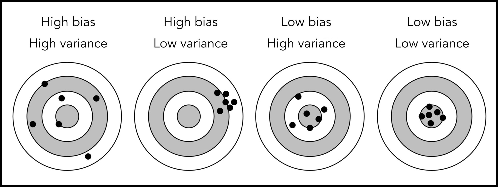

# (PART) Inference {-}

# Point estimation

### Learning objectives {-}

::: {.learningobjectives}
By the end of this chapter, you will be able to:

- do this
- do that
- and this
:::

### Readings {-}

- Casella and Berger (2002)
    - Chapter 6, sections 6.1, 6.2 (excluding 6.2.3 and 6.2.4), and 6.3 (excluding 6.3.2).
    - Chapter 7, sections 7.1, 7.2 (excluding 7.2.3 and 7.2.4), and 7.3 (excluding 7.3.4).
    - Chapter 10, sections 10.1 (excluding 10.1.4).
- Wasserman (2004)
    - Chapter 6, sections 6.1, 6.2, 6.3.1
    - Chapter 9, sections 9.1--9.5, 9.7--9.9
- Topics not covered here: Ancillary statistics, complete statistics, Basu's theorem, the formal likelihood principle, Bayes estimators, the EM algorithm, loss function optimality, equivariance of MLE, (asymptotic) relative efficiency, bootstrap se, robustness, $M$-estimators.

## The likelihood

Consider a statistical model for a random vector $\bX = (\bX_1,\dots,\bX_n)^\top$ whose distribution depends on (an unknown) parameter $\theta$.

- Write $f(\bx|\theta)$ for the joint pdf/pmf of $\bX$ when $\theta$ is **known**.
- Then, given $\bX=\bx$ is observed, the function of $\theta$ defined by
\[
L(\theta|\bx) = f(\bx|\theta)
\]
is called the *likelihood function* for $\theta$ based on data $\bx$.

Note the key distinction between

- $f$, which is considered *a function of $\bx$* (and, for example, must sum or integrate to 1)
- $L$, which is considered *a function of $\theta$*.

::: {.myalert}
For any fixed value of $\theta$, say $\theta=\theta_1$, $L(\theta_1|\bx)$ is a *statistic*--a scalar-valued transformation of the observed values of $\bX=\bx$.
:::

The purpose of $L(\theta|\bx)$ is to compare the *plausibility* of different candidate values of $\theta$, given the observed data $\bx$.

If $L(\theta_1|\bx) > L(\theta_2|\bx)$, then the data $\bx$ were more likely to occur under the hypothesis that $\theta=\theta_1$ than under the hypothesis that $\theta=\theta_2$. In that sense, $\theta_1$ is a more plausible value than $\theta_2$ for the unknown parameter $\theta$.

::: {.example}
Consider a sequence of $n$ coin tosses, and let $X_i$ denote the outcome of the $i$th coin toss. Assume that $X_i\sim\Bern(p)$, where $p$ is the probability of heads. We know that the total number of heads $\sum_{i=1}^n X_i$ is distributed $\Bin(n,p)$. 

Suppose the outcome of $n=10$ coin tosses happens to be 
$$\bx = \{H, T, H, T, T, H, H, T, H, H \}.$$ 
Then $L(0.6|\bx) > L(0.5|\bx)$.
:::

### Calculating the likelihood

In `R`, the function `dbinom()` computes the pmf for the binomial distribution. That is, suppose that we have $X\sim\Bin(10,0.6)$ and we wanted to calculate $\Pr(X=x)$ we type

```{r calclik1, }
dbinom(x = 0:10, size = 10, prob = 0.6) %>% 
    round(digits = 4)
```

Since $L(\theta|\bx) = f(\bx|\theta)$, we use the same `dbinom()` to calculate the likelihood, except now we are interested in the value of the likelihood of a range of parameter values $p\in[0,1]$ given a particular occurrence (e.g. getting 6 heads):

```{r calclik2}
dbinom(x = 6, size = 10, prob = seq(0, 1, by = 0.1)) %>% 
    round(digits = 4)
```

Plot of the likelihood

```{r likeg1, echo = FALSE, fig.height = 8, out.width = "80%", fig.align = "center"}
ggplot(data.frame(x = 0:10, y = dbinom(0:10, 10, 0.6)), aes(x, y)) +
  geom_bar(stat = "identity") +
  scale_x_continuous(breaks = c(0:10)) +
  labs(x = "Number of heads, x", y = "f(x|p)",
       title = "Pmf of Bin(10,p) given fixed p") -> p1

set.seed(123)
dat <- rbinom(10, 1, 0.7)
x <- seq(0, 1, by = 0.01)
y <- dbinom(sum(dat), size = 10, x)

ggplot(data.frame(x = x, y = y), aes(x, y)) +
  geom_line() +
  scale_x_continuous(breaks = seq(0, 1, by = 0.2)) +
  labs(x = "Probability of heads, p", y = "L(p|x)",
       title = "Likelihood of Bin(10,p) given fixed data x") -> p2

cowplot::plot_grid(p1, p2, ncol = 1)
```

### Likelihood ratio

::: {.definition name="Likelihood ratio"}
The relative plausibility of candidate parameter values, $\theta_1$ and $\theta_2$ say, is measured by the likelihood ratio

\[
\frac{L(\theta_1|\bx)}{L(\theta_2|\bx)}
\]
:::

Interpretation: for example, if $\frac{L(\theta_1|\bx)}{L(\theta_2|\bx)} = 10$, then the observed data $\bx$ were 10 times more likely under truth $\theta_1$ than under truth $\theta_2$.

The use of *likelihood ratios* to compare the plausibility of different $\theta$ values means that any constant factor in the likelihood--that is, any factor not depending on $\theta$--can be neglected.

::: {.example}
Suppose $X_i\sim\Pois(\lambda)$ independently ($i=1,\dots,n$) and we have observed $\bX=\bx$. 
Here,
\begin{align*}
L(\lambda|\bx) = f(x_1,\dots,x_n|\lambda)
&= \prod_{i=1}^n \frac{e^{-\lambda}\lambda^{x_i}}{x_i!} \\
&= \const \times e^{-n\lambda}\lambda^{\sum_{i=1}^n x_i}
\end{align*}


- The product $\frac{1}{x_1!}\cdots \frac{1}{x_n!}$ are not needed, since they do not involve $\lambda$.
- The non-constant part of the likelihood depends on $\bx$ only through $T(\bx)=\sum_{i=1}^n x_i$.


:::

As a remark, the function $T(\bx)=\sum_{i=1}^n x_i$ is called a *sufficient statistic* for $\theta$: the value of $T(\bx)$ is all that is needed in order to compute the likelihood (ignoring constants)!

### Log likelihood

In practice, especially when observations are independent, it is usually most convenient to work with the (natural) logarithm of the likelihood,
\[
l(\theta) = \log L(\theta|\bx),
\]
since this converts products into sums, which are easier to
handle.

::: {.example}
$n$ independent Poisson continued. 
\begin{align*}
l(\lambda|\bx) 
&= \log \prod_{i=1}^n \frac{e^{-\lambda}\lambda^{x_i}}{x_i!} \\
&= \const -n\lambda + \left( \sum_{i=1}^n x_i \right)\log\lambda
\end{align*}

:::


In terms of the log likelihood, then, any two candidate values of $\theta$ are compared via the log-likelihood-ratio,

\[
 \log \frac{L(\theta_1|\bx)}{L(\theta_2|\bx)} = l(\theta_1) - l(\theta_2) 
\]

On the log scale, it is additive constants that can be ignored.

## Sufficiency

We have introduced the notion of *sufficient statistic* already, informally, as a data summary that provides all that is needed in order to compute the likelihood.
Here we will give a formal definition, and then prove the factorization theorem, which

- provides a straightforward way of checking whether a particular statistic is sufficient
- allows a sufficient statistic, to be identified by simple inspection of the likelihood function (as we did in the example of $n$ Poissons)

::: {.definition}
A statistic $T(\bX)$ is said to be a sufficient  statistic for $\theta$ if the conditional distribution of $\bX$, given the value of $T(\bX)$, does not depend on $\theta$.
:::

In this precise sense, a sufficient statistic $T(\bX)$ carries all of the information about $\theta$ that is contained in $\bX$. 
The notion is that, given the observed value $T(\bx)$ of $T(\bX)$, all further knowledge about $\bx$ is uninformative about $\theta$.

In particular, this is useful for data reduction: if $T(\bX) \in \bbR$ is a scalar sufficient statistic, then all of the information in $\{X_1,\dots,X_n\}$ relating to $\theta$ is contained in the single-number summary $T(\bX)$.

### The factorisation theorem

It is difficult to use the definition to check if a statistic is sufficient or to find a sufficient statistic. Luckily, there is a theorem that makes it easy to find sufficient statistics.

::: {.theorem}
A statistic $T(\bX)$ is sufficient for $\theta$ if and only if, for all $\bx$ and $\theta$,
$$
f(\bx|\theta) = h(\bx)g(T(\bx)|\theta)
$$
:::

That is to say, the density $f$ can be factored into a product such that one factor $h$ does not depend on $\theta$, and the other factor, which *does* depend on $\theta$, depends on $\bx$ only through the sufficient statistic $T(\bx)$.

::: {.example}
Let $X_1,\dots,X_n$ be an independent random sample from $\N(\mu,1)$. The pdf of $\bX$ can be written
\begin{align*}
f(\bx|\mu) 
&= \frac{1}{(2\pi)^{n/2}}\exp\left(-\half \sum_{i=1}^n(x_i-\mu)^2 \right) \\
&= \frac{1}{(2\pi)^{n/2}}\exp\left(-\half \sum_{i=1}^n(x_i-\bar x + \bar x -\mu)^2 \right) \\
&= 
\underbrace{\frac{1}{(2\pi)^{n/2}}\exp\left(-\half \sum_{i=1}^n(x_i-\bar x)^2 \right)}_{h(\bx)} \hspace{0.5em} 
\underbrace{\exp\left(-\frac{n}{2}(\bar x - \mu)^2 \right) 
\vphantom{  \frac{1}{(2\pi)^{n/2}}\exp\left(-\half \sum_{i=1}^n(x_i-\bar x)^2 \right)  }}_{g(\bar x|\mu)}
\end{align*}
Therefore, $\bar X$ is a sufficient statistic.
:::

::: {.example}
A town has bus routes numbered $1,2,\dots,\theta$, with $\theta$ being unknown. 
Naqiyyah spends a day observing bus numbers and collects data $X_i$, $i=1,\dots,n$, representing them. 

Each $X_i$ has pmf $f(x|\theta) = \Pr(X=x) = 1/\theta$, so the joint pmf (assuming independence of the observations) is
\[
f(\bx|\theta) =
\begin{cases}
\frac{1}{\theta^n} &\max(x_1,\dots,x_n) \leq \theta \\
0 &\text{otherwise}
\end{cases}
\]
Hence, if we let $T(\bx) = \max(x_1,\dots,x_n)$ then

\[
f(\bx|\theta) =
\overbrace{1 \vphantom{\frac{\ind_{t \leq \theta}(t)}{\theta^n}} }^{h(\bx)} 
\cdot
\overbrace{\frac{\ind_{t \leq \theta}(t)}{\theta^n}}^{g(t|\theta))},
\]
which implies that $T(\bX)=\max(X_1,\dots,X_n)$ is a sufficient statistic for $\theta$.

:::

### Minimal sufficient statistic

There clearly is no unique sufficient statistic in any problem.
For if $T(\bX)$ is a scalar sufficient statistic, then, for example

i. $s(T(\bX))$ is sufficient, for every1-1 function $s(\cdot)$.
ii. The pair $\{T(\bX),X_1\}$ is sufficient too.
iii. The full data set $\{X_1,\dots,X_n\}$ is *always* (trivially) sufficient.

::: {.mycheck}
Use the factorisation theorem to check these assertions, or convince yourself with suitable examples!
:::

The idea of a *minimal* sufficient statistic is to eliminate redundancy of the kind evident in ii. or iii. (but not i.) above, in order to achieve *maximal* reduction of the data from $\bX$ to $T(\bX)$.


::: {.definition name="Minimal sufficient statistic"}
A sufficient statistic $S(\bx)$ is said to be minimal sufficient if, for any other sufficient statistic $T(\bx)$, $S(\bX)$ is a function of $T(\bX)$. I.e., there exists a function $k$ such that $S(\bx)=k(T(\bx))$.
:::

Intuitively, a minimal sufficient statistic most efficiently captures all possible information about the parameter $\theta$.

The definition is clear enough in its meaning, but is not constructive: it does not help us to *find* a minimal sufficient statistic in any given situation.
For this, we have the following theorem.

::: {.theorem name="Lehmann-Scheffé"}
$T(\bx)$ is minimal sufficient if for every sample points $\bx$ and $\by$,
\[
\frac{f(\bx|\theta)}{f(\by|\theta)} \text{ is constant in $\theta$ } \Leftrightarrow T(\bx) = T(\by)
\]
:::

::: {.example}
Consider the r.v.s $X_1,\dots,X_n \iid \Unif(\theta,\theta+1)$. The joint pdf of $\bX$ is 
\[
f(\bx|\theta) =
\begin{cases}
1 & \theta < x_1,\dots,x_n < \theta+1 \\
0 & \text{otherwise}
\end{cases}
\]
This can be usefully re-expressed as
\begin{align*}
f(\bx|\theta) &= 1 \cdot \ind_{\{x_1,\dots,x_n > \theta\}}(\bx)\ind_{\{ x_1,\dots,x_n < \theta+1\}}(\bx) \\
&= 1 \cdot \ind_{t_1=\min(x_i)>\theta}(t_1)\ind_{t_2=\max(x_i)<\theta+1}(t_2) \\
&= \underbrace{1 \vphantom{\ind_{\{t_1>\theta \}}} }_{h(\bx)} \cdot 
\underbrace{\ind_{\{t_1>\theta \} \cap \{t_2<\theta+1 \}}}_{g(t_1,t_2|\theta)}
\end{align*}


We clearly see that the two-component statistic
\[
  T(\bX) = \big(\min(X_1,\dots,X_n), \max(X_1,\dots,X_n) \big)
\]
is sufficient. Furthermore, for any two sample points $\bx$ and $\by$, $f(\bx|\theta)/f(\by|\theta)$ takes the constant value 1 (for all $\theta$ for which the ratio is defined) iff both $\min(x_i)=\min(y_i)$ and $\max(x_i)=\max(y_i)$.


This suggests that $T(\bX)$ is a minimal sufficient statistic for this problem. Note than then the minimal sufficient statistic in a one-parameter problem is not necessarily a scalar!
:::

::: {.myalert}
Obviously, if a sufficient statistic is scalar, then it must be minimal!
:::

## Point estimators

Recall: $X_1,\dots,X_n\sim f(x|\theta)$ is a random sample, where $f$ is known but the parameter $\theta$ of the pdf is unknown. Often, we may specify $\theta\in\Theta$, where $\Theta$ is the *parameter space*. 
Note that $\theta$ may be a vector $\theta=(\theta_1,\dots,\theta_p)^\top$.

::: {.example}
For $\N(\mu,\sigma^2)$, $\theta = (\mu,\sigma^2)^\top$, so $p=2$ and $\Theta = \bbR \times \bbR_{\geq 0}$.

For $\Pois(\lambda)$, $\theta=\lambda$ and $\Theta=\bbR_{\geq 0}$.

:::

The goal of **point estimation**:

> Provide a single "best guess" of $\theta$, based on observations $X_1,\dots,X_n$.

Formally, we may write

$$
\hat\theta = T(X_1,\dots,X_n) = T(\bX)
$$

as a point estimator for $\theta$, where $T(\bX)$ is a statistic.


::: {.mycheck}
We use the term "estimator" to denote the function that gives the estimate. 
On the other hand, an "estimate" is the realised value of the estimator function.
In other words, the estimator $T(\bX)$ is a *random variable*, whereas the estimate $T(\bx)$ is a realised value for the observed data $\bX=\bx$.
:::

::: {.mycheck}
The standard convention is to denote estimators/estimates of parameters with hats on the respective symbols (e.g. $\hat\theta$), whereas true values do not have hats (c.f.
$\theta$ or $\theta_0$).
:::

A good estimator should make $|\hat\theta-\theta|$ as small as possible, despite

i. $\theta$ being unknown; and

ii. the value of $\hat\theta$ changes with the sample observed.

We will make use of the sampling properties of the r.v. $\hat\theta$ to quantify (and qualify) its worth as an estimator for $\theta$.

We will consider three main aspects of point estimation

1. General methods for *finding* a point estimator
    a. Method of moments (MOM)
    b. Method of maximum likelihood (ML)

2. Methods for *assessing the performance* of point estimators
    a. Bias
    b. Variance
    c. Mean squared error

3. Large sample properties of estimators

## Method of moments

::: {.definition name="Method of moments estimator"}
Suppose that $U(\bX)$ is any statistic such that
\[
  \E\big(U(\bX)\big) = m(\theta)
\]
where $m(\cdot)$ is invertible. Then
\[
  \hat\theta = m^{-1}\big(U(\bX)\big)
\]
is called the method of moments (MOM) estimator of $\theta$ based on $U$.
:::

The moment here is the mean, i.e. the first moment, of $U(\bX)$. A more precise name for this estimator would be 'the MOM estimator based on the first moment of $U$'.

There are two main situations where moments other than the first moment are needed:

1. **When $m(\theta)$ either does not involve $\theta$, or is otherwise not invertible.** We might then consider using instead the second moment, $\E(U^2) = m_2(\theta)$, say. If $m_2(\theta)$ is invertible, then MOM based on $U_2$ can be used in order to define an estimator. 

2. **When $\theta=(\theta_1,\dots,\theta_p)^\top$ is a vector.** I.e., there is more than one unknown parameter. The number of moments used (the number of equations to solve) must be equal to the dimensionality of $\theta$ (the number of unknowns).

::: {.example}

Let $X_1,\dots,X_n\iid\Unif(0,\theta)$. Consider $U(\bX) = \bar X_n = n^{-1}\sum_{i=1}^n X_i$, the sample mean. Then, since $\E(X_i)=\theta/2$, we have
\begin{align*}
\E\big(U(\bX) \big) 
&= \E\left(\frac{1}{n} \sum_{i=1}^n X_i \right) \\
&= \frac{1}{n} \sum_{i=1}^n \E\left( X_i \right) = \theta/2.
\end{align*}

So the MOM estimator of $\theta$ based on $U$ is $\hat\theta = 2\bar X_n$.

```{r mom1}
theta <- 3
(X <- runif(50, min = 0, max = theta)) %>% 
    round(3)
2 * mean(X)  # MOM estimator
```

:::

::: {.example}
Let $X_1,\dots,X_n\iid\Pois(\lambda)$. Consider, for example, $U(\bX)=\sum_{i=1}^n [X_i=0]$, the number of zeroes found in the sample. Then, since
\begin{align*}
\E([X_i=0]) 
&= \sum_{k=0}^\infty [k=0]\Pr(X_i=k) \\
&= \Pr(X_i=0) \\
&= e^{-\lambda},
\end{align*}
we have that $\E\big( U(\bX) \big) = \sum_{i=1}^n \E([X_i=0]) = ne^{-\lambda}$. Hence, the MOM estimator for $\lambda$ based on $U$ is 
$$
\hat\lambda = -\log(U/n).
$$
:::

## Method of maximum likelihood

::: {.definition name="Maximum likelihood (ML) estimator"}
The ML estimator of $\theta$ is $\hat\theta$ which is such that
$$
\hat\theta = \argmax_{\theta\in\Theta} L(\theta|\bX)
$$
:::

That is, the ML estimator is the value of $\theta$ which is the most likeliest value as judged by the likelihood function, given the data that was observed. 
We are interested in the peak of the graph of $L(\theta|\bX)$ against $\theta$.

In practice, $\hat\theta$ is most often found by locating the maximum of the *log-likelihood* $l(\theta|\bX) = \log L(\theta|\bX)$, which is computationally and algebraically simpler.

Unfortunately, uniqueness is not guaranteed. But in many 'standard' statistical models, the MLE *is* uniquely defined by the likelihood function.


```{r mleunique, echo = FALSE, fig.height = 3}
x <- seq(-5, 8, length = 100)
fx1 <- 0.25 * dnorm(x, mean = -2, sd = .7) + .75 * dnorm(x, mean = 3, sd = 1.5)
a <- 3
fx2 <- (pnorm((x + a - 1.5) / (0.2 * sqrt(2))) - pnorm((x - a - 1.5) / (0.2 * sqrt(2)))) / (4 * a)
  
ggplot(data.frame(x = x, y = fx1), aes(x, y)) +
  geom_line() +
  labs(y = expression(L(theta)), x = expression(theta), title = "Multimodal likelihood") +
  theme(axis.ticks = element_blank(), axis.text = element_blank()) -> p1
ggplot(data.frame(x = x, y = fx2), aes(x, y)) +
  geom_line() +
  labs(y = expression(L(theta)), x = expression(theta), title = "Flat plateau likelihood") +
  theme(axis.ticks = element_blank(), axis.text = element_blank()) -> p2
cowplot::plot_grid(p1, p2)
```

### Finding the MLE

Typically we locate $\hat\theta$ by solving $l'(\hat\theta)=0$, and then checking that the stationary point is a maximum. Several points on this:

- This still leaves open the possibility that the likelihood has multiple local maxima, at each of which the derivative is zero. It is wise to check $\l(\theta)$ for multimodal behaviour, e.g. by drawing a sketch of the function.

- This strategy works for 'simple' enough problems, e.g. unidimensional parameters, or multidimensional parameter situations which reduce to complete information system (sets of simultaneous equations).

- Numerical methods can be employed if explicit analytical forms for the MLE cannot be found. These estimators are found more often by iterative procedures built into computer software (e.g. Newton-Raphson, Fisher scoring, quasi-Newton, gradient descent, conjugate gradients, etc.).

- Even then we might run into numerical issues (e.g. flat likelihood, multimodality, precision issues, etc.).

::: {.example}
Suppose that $Y_1,\dots,Y_n$ is an iid random sample from
$\N(\mu,1)$, with $\mu$  unknown. Then,
the log-likelihood function is $$\begin{aligned}
     l(\mu)
     &= \log \left\{(\sqrt{2\pi})^{-n} e^{-\sum_{i=1}^n (Y_i-\mu)^2/2} \right\} \\
     &= \const 
     -\frac{1}{2}\sum_{i=1}^n  (Y_i-\mu)^2
     \end{aligned}$$ 
     
The derivative with respect to $\mu$ gives us
$$\begin{aligned}
       l'(\mu) = \frac{1}{2}\sum_{i=1}^n  (Y_i-\mu)
     \end{aligned}$$

Equating this to zero gives the MLE for $\mu$ $$\begin{aligned}
       \frac{1}{2}\sum_{i=1}^n  (Y_i-\mu) &= 0 \\
       \sum_{i=1}^n Y_i - n\mu  &= 0 \\
       \Rightarrow \mu &= \frac{1}{n}\sum_{i=1}^n Y_i =: \bar Y_n
     \end{aligned}$$ Thus, $\hat\mu=\bar Y_n$.
:::

Finding the MLE numerically

```{r mlenumerical}
X <- rnorm(n = 100, mean = 8, sd = 1)
mean(X)

# Optimising the likelihood function
lik <- function(theta) -sum(dnorm(x = X, mean = theta, sd = 1, log = TRUE))
theta0 <- 1  # starting value
res <- optim(par = theta0, fn = lik, method = "BFGS", lower = -Inf, 
             upper = Inf)
res$par
```

::: {.mycheck}

Sometimes, a sketch of $l(\theta)$ reveals that the MLE does not satisfy $l'(\hat\theta)=0$.
Let $X_1,\dots,X_n\iid\Unif(0,\theta)$. Then the pdf of $\bX$ is $f(\bx|\theta) = 1/\theta^n$ for $X_1,\dots,X_n < \theta$. The likelihood is therefore
\[
L(\theta|\bX) = \begin{cases}
\frac{1}{\theta^n} &\theta > \max(X_1,\dots,X_n) \\
0 &\text{otherwise}
\end{cases}
\]
which is maximised at $\hat\theta = \max(X_1,\dots,X_n)$.


```{r uniflik, echo = FALSE, fig.height = 1.8}
set.seed(123)
n <- 20
x <- runif(n, max = 1)
theta1 <- c(0.9, max(x))
theta2 <- seq(max(x), 1.1, length = 100)

ggplot() +
  geom_line(data = data.frame(x = theta1, y = c(0, 0)), aes(x, y)) +
  geom_line(data = data.frame(x = theta2, y = 1 / theta2 ^ n), aes(x, y)) +
  geom_segment(aes(x = max(x), xend = max(x), y = 0, yend = 1 / max(x) ^ n),
               linetype = "dashed", col = "grey60") +
  scale_x_continuous(breaks = max(x), labels = expression(hat(theta))) +
  labs(x = expression(theta), y = expression(L(theta))) +
  theme(axis.ticks.y = element_blank(), axis.text.y = element_blank(),
        axis.title.x = element_text(hjust = 1, vjust = 7))
```

:::


### Invariance of MLE

The MLE is invariant under parameter transformation:

\begin{lemma}[Invariance of MLE]
Suppose $\bX\sim f(\bx|\theta)$, and $\psi=\psi(\theta)$ is a
one-to-one transformation. Let $\hat\theta$ be the MLE for $\theta$,
i.e. $$\hat\theta = \argmax_\theta L(\theta|\bX).$$ Then, the MLE for
$\psi$ is $$\hat\psi = \psi(\hat\theta).$$
\end{lemma}

::: {.example}
Let $\hat\pi$ be the MLE for $\pi$ after observing data
$X_1,\dots,X_n\iid \Bern(\pi)$. The log-odds of an event happening is
given by $\nu = \log\big(\pi/\log(1-\pi)\big)$, which is a one-to-one
transformation of $\pi$. Therefore, the MLE for $\nu$ is given by
$$\hat\nu = \log \frac{\hat\pi}{1-\hat\pi}.$$

Note that $\hat\psi$ can be infinite-valued, if $\hat\theta=0$ or $\hat\theta=1$.

:::

## Evaluating estimators

An estimator is assessed through its distribution in repeated sampling from the assumed model.
A 'good' estimator of an unknown parameter $\theta$ is a function $T(\bX)$ which typically, in repeated sampling, takes values that are close to the true value of $\theta$, whatever the true value of $\theta$ may be.
We discuss three such properties:

1. Bias
2. Variance
3. Mean squared error

### Bias

::: {.definition name="Bias"}
The bias of an estimator $\hat\theta$ is defined to be
$$\text{Bias}_\theta(\hat\theta) = \E_\theta(\hat\theta) - \theta.$$
:::

- The subscript $\theta$ makes clear the fact that the expectation is taken under the distribution using $\theta$ as the true value of the parameter.
- When $\E_\theta(\hat\theta) = \theta$,
$\text{Bias}_\theta(\hat\theta)=0$ for all possible values of $\theta$,
and in this case $\hat\theta$ is called an **unbiased estimator** for $\theta$.
- Small bias, and even unbiasedness, is desirable.

### Variance and standard error

::: {.definition name="Variance"}
The variance of an estimator $\hat\theta$ is defined to be
$$\Var_{\theta}(\hat\theta)=\E_\theta\left[\big(\hat\theta - \E(\hat\theta)\big)^2\right]$$
:::

This just uses the regular definition of the variance for random variables.

::: {.definition name="Standard error"}
The standard error of the estimator $\hat\theta$ is defined as the standard deviation of the variance of the estimator, i.e.
$$\text{se}(\hat\theta) = \sqrt{\Var_\theta(\hat\theta)}$$
:::

Obviously, we desire an estimator whose variability (in repeated sampling) is low.


::: {.mycheck}

These two properties measure different things about estimators:

- Bias is a measure of *accuracy*.
- Variance is a measure of *precision*.

```{r biasvariance, echo = FALSE, fig.align = "center", out.width = "80%", fig.cap = "The difference between bias and variance."}

```

:::

### Mean squared error

:::{.definition name="Mean squared error of estimator"}
The MSE of the estimator $\hat\theta$ is defined as
$$\text{MSE}_\theta(\hat\theta) = \E_\theta\left[(\hat\theta - \theta)^2 \right] = \{\text{Bias}_\theta(\hat\theta) \}^2 + \Var_\theta(\hat\theta).$$
:::

::: {.mycheck}
As an exercise, prove the bias-variance decomposition above. Hare some hints on how to get started:

- hint 1
- hint 2
:::

There is a clear and direct relationship between the MSE of an estimator, and its bias and variance. For a given MSE,

- Reducing the bias of an estimator implies that its variance will increase.

- Conversely, reducing the variance of an estimator implies that bias will increase.

This is known as the **bias-variance** trade-off. It is typically impossible to do both simultaneously.


::: {.myalert}
The bias-variance trade-off does not mean an estimator with low bias **and** low variance is impossible to achieve.It simply means *improving* one aspect of an estimator will worsen it in the other aspect.
:::

::: {.example}
Let $X_1,\dots,X_n\iid\Unif(0,\theta)$. We previously found two different estimators for $\theta$:

- MLE: $\hat\theta_{ML} = \max_i(X_i)$
- MOM: $\hat\theta_{MOM} = 2\bar X$

Let us examine these in terms of bias, variance and mse.

Clearly $\hat\theta_{MOM}$ is unbiased:
$\E(\hat\theta_{MOM}) = 2\E(\bar X) = 2\E(X_i) = 2\times \theta/2 = \theta$.

For the bias of $\hat\theta_{ML}$, let's first get the pdf (of $\hat\theta_{ML}$). Proceed via the cdf:
\begin{align*}
F_{\hat\theta_{ML}}(x) = \Pr(\hat\theta_{ML} < x) = \Pr(\max(X_1,\dots,X_n) < x) &= \prod_{i=1}^n \Pr(X_i<x) 
= \left(\frac{x}{\theta}\right)^n 
\end{align*}

Then, differentiating this gives us the pdf $f_{\hat\theta_{ML}}(x) = nx^{n-1}/\theta^n$.
So now we find the mean:
$$
\E \hat\theta_{ML} = \int_0^\theta x \frac{nx^{n-1}}{\theta^n}\dint x =\left[\frac{nx^{n+1}}{\theta^n(n+1)} \right]_0^\theta = \frac{n\theta}{n+1}
$$
Therefore, the bias is $\text{Bias}(\hat\theta_{ML})=-\theta/(n+1)\neq 0$. Note that this tends to 0 as $n\to\infty$, but can be substantial when $n$ is small.

For $\hat\theta_{MOM}$, we have
$$
\Var(\hat\theta_{MOM}) = 4\Var(\bar X) = \frac{4\Var(X_i)}{n} = \frac{\theta^2}{3n}.
$$
Note that $\Var(\hat\theta_{MOM})\to 0$ as $n\to\infty$ at the rate of $1/n$. This is typical behaviour of 'good' estimators.

For $\hat\theta_{ML}$:

\begin{align*}
\Var(\hat\theta_{ML})
= \E(\hat\theta_{ML}^2) - \E^2(\hat\theta_{ML}) 
&= \int_0^\theta x^2 \frac{nx^{n-1}}{\theta^n}\dint x - \frac{n^2\theta^2}{(n+1)^2} \\
&= \theta^2 \left(\frac{n}{(n+1)^2(n+2)} \right)
\end{align*}
so $\Var(\hat\theta_{ML})\to 0$ as $n\to\infty$ but at a faster rate of $1/n^2$.

For $\hat\theta_{MOM}$, we have
$$
\text{MSE}(\hat\theta_{MOM}) = \Var(\hat\theta_{MOM}) = \frac{\theta^2}{3n}.
$$

For $\hat\theta_{ML}$:

\begin{align*}
\text{MSE}(\hat\theta_{ML})
= \text{Bias}(\hat\theta_{ML}^2) + \Var(\hat\theta_{ML}) 
&= \theta^2\left( \frac{n}{(n+1)^2(n+2)} + \frac{1}{(n+1)^2} \right). 
\end{align*}


Notice that since $\text{MSE}(\hat\theta_{MOM})$ is $o(1/n)$ and $\text{MSE}(\hat\theta_{ML})$ is $o(1/n^2)$, 

$$\text{MSE}(\hat\theta_{ML}) \leq \text{MSE}(\hat\theta_{MOM})$$ 

for all $n$ (and tends to 0 as $n\to\infty$). So $\hat\theta_{ML}$, even though it is biased, is clearly to be preferred on the basis of MSE.

:::

## Cramér-Rao lower bound (CRLB)

It is difficult to find an estimator which simultaneously is low in bias and variance. 
If we instead focus on a class of *unbiased* estimators, then we have a theorem to benchmark their performance.

::: {.theorem #crlb name="Cramér-Rao inequality for unbiased estimators"}
Let $\bX\sim f(\bx|\theta)$ satisfying some regularity conditions^[These regularity conditions are essentially that we are able to switch the order of integration and differentiation, and that the $\Var_\theta(\hat\theta)<\infty$. See Thm 7.3.9 of C\&B.] 
Let $\hat\theta=\hat\theta(\bX)$ be an \textbf{unbiased} estimator, i.e. $\E_\theta(\hat\theta)=\theta$. 
Then, for any $\theta\in\Theta$, 

$$\Var_\theta(\hat\theta) \geq \frac{1}{\E_\theta\left[\left(\frac{\partial}{\partial \theta} \log f(\bX|\theta) \right)^2\right]}.$$
:::

If an estimator's variance is close to the CRLB, it can be regarded as *efficient*. 
A class of estimators achieving the CRLB are said to be *optimal*, known as the *minimum variance unbiased estimator (MVUE)*. Although, the CRLB is not necessarily achieved by any estimator.

::: {.proof}

The proof is an application of the Cauchy-Schwarz inequality via the covariance inequality 
$$
\Var(Y) \geq \frac{\{\Cov(Y,U)\}^2}{\Var(U)}
$$


for r.v.s $U$ and $Y$. We consider the more general case for **biased** estimators $\hat\theta(\bX)$.
Let 

\begin{align*}
U &= l'(\theta) = \frac{\partial}{\partial \theta} \log f(\bX|\theta) \\
Y &= \hat\theta(\bX)
\end{align*}

Firstly, we note that $\Var(U)=\E(U^2)$ since $\E(U)=0$:
$$
\E(U) = \int\frac{\frac{\partial}{\partial \theta} f(\bx|\theta)}{\cancel{f(\bx|\theta)}} \cancel{f(\bx|\theta)} \dint \bx = \frac{\partial}{\partial \theta} \int f(\bx|\theta) \dint x = 0.
$$

Further, because $\E(U)=0$, we have $\Cov(Y,U)=\E(UY)-\E(U)\E(Y) = \E(UY)$, and so
\begin{align*}
\Cov(Y,U) = \E \left(Y \cdot \frac{\partial}{\partial \theta} \log f(\bX|\theta) \right)
&= \E \left(Y \cdot \frac{\frac{\partial}{\partial \theta} f(\bX|\theta)}{f(\bX|\theta)} \right)\\
&= \int \hat\theta(\bx)  \frac{\frac{\partial}{\partial \theta} f(\bx|\theta)}{\cancel{f(\bx|\theta)}} \cancel{f(\bx|\theta)} \dint \bx \\
&= \frac{\partial}{\partial \theta} \left[ 
\int \hat\theta(\bx)  f(\bx|\theta) \dint \bx
\right] \\
&= \frac{\partial}{\partial \theta} \E[\hat\theta(\bX)] = \psi'(\theta).
\end{align*}

Here, we have assumed that the expectation of $\hat\theta(\bX)$ is not $\theta$ but some function of $\theta$, $\psi(\theta)$ say, since the estimator is biased.

We have now proved the general case of the CRLB which states
\[
\Var(\hat\theta) \geq \frac{\left[\psi'(\theta) \right]^2}{\E\left[\left(\frac{\partial}{\partial \theta} \log f(\bX|\theta) \right)^2\right]}.
\]
For unbiased estimators, $\psi(\theta)=\theta$, and hence
$$
\psi'(\theta) = \frac{\partial}{\partial\theta}(\theta) = 1,
$$
which completes the proof.

:::

::: {.myalert}

Remark: The derivative of the log-likelihood, $S(\theta) = \frac{\partial}{\partial \theta} \log f(\bX|\theta)$, is known as the *score function*. The property that $\E(S(\theta))=0$ is fundamental to the theory of maximum likelihood.

:::


### Fisher information

The quantity in the RHS denominator of Theorem \@ref(thm:crlb) is known as the *information number* or *Fisher information*.

::: {.definition name="Fisher information (unidimensional)"}
Let $\bX\sim f(\bx|\theta)$, where $\theta\in\bbR$.
The Fisher information is defined to be the expectation of the second
moment of the score function, i.e.
$$\cI(\theta) = \E\left[ \left( \frac{\partial}{\partial \theta} \log f(\bX|\theta) \right)^2 \right] \in \bbR$$
:::

In simple terms, the Fisher information measures the amount of information that an observable random variable $\bX$ carries about an unknown parameter $\theta$ of the statistical model that models $\bX$.

::: {.myalert}
The Fisher information for multidimensional parameters can be defined similarly (c.f. Fisher information matrix).
:::

::: {.lemma}
Let $\bX\sim f(\bx|\theta)$, where $\theta\in\bbR$, and $S(\theta)=\frac{\partial}{\partial \theta} \log f(\bX|\theta)$. Under certain regularity conditions,

- $\E [S(\theta)] = 0$.
- $\cI(\theta) = \Var[S(\theta)]$.
- $\cI(\theta) = -\E[S'(\theta)]$.  

:::

::: {.mycheck}
To be proven in Ex. sheet 4!
:::

::: {.lemma name="Fisher information is additive"}
Let $X_1,\dots,X_n\iid f(x|\theta)$. Suppose $\cI_1(\theta)$ is the Fisher information from a single observation $X_i$, i.e. $\cI_1(\theta) = -\E[l''(\theta|X_i)]$. Then the full Fisher information is $\cI(\theta) = n\cI_1(\theta)$.
:::

::: {.proof}
$$
\cI(\theta) = -\E[l''(\theta|\bX)] = -\E\left[\sum_{i=1}^n l''(\theta|X_i)\right]
$$
:::

::: {.example}
Let $X_1,\dots,X_n\iid\N(\mu,\sigma^2)$. Let $\hat\mu=\bar X_n$; then $\Var(\hat\mu)=\sigma^2/n$. The score function is given as
\[
l'(\mu|\bX) = \frac{\partial}{\partial\mu} \left(\const - \sum_{i=1}^n \frac{(X_i-\mu)^2}{2\sigma^2} \right) = \sum_{i=1}^n \frac{X_i-\mu}{\sigma^2},
\]
while the Fisher information is obtained as
\[
\cI(\mu) = \Var\big(l'(\mu|\bX)\big) = \sum_{i=1}^n \Var\left(\frac{X_i-\mu}{\sigma^2} \right) = \sum_{i=1}^n\frac{\Var(X_i)}{\sigma^4} = \frac{n}{\sigma^2}.
\]
Hence, the CRLB is $\sigma^2/n$, and the estimator $\hat\mu=\bar X_n$ achieves it. Therefore, $\bar X_n$ is the MVUE of $\mu$.
:::

### Variance reduction: Rao-Blackwellisation

We can reduce the variance of an unbiased estimator by conditioning on a sufficient statistic.

::: {.theorem name="Rao-Blackwell"}
Suppose that $U(\bX)$ is unbiased for $\theta$, and $S(\bX)$ is sufficient for $\theta$.
Then the function of $S$ defined by
$$
\phi(S) = \E_\theta(U|S)
$$

- is a statistic, i.e. $\phi(S)$ does not involve $\theta$;
- is an unbiased statistic, i.e. $\E(\phi(S)) = \theta$; and
- has $\Var_\theta(\phi(S)) \leq \Var_\theta (U)$, with equality iff $U$ is itself a function of $S$.
:::

In other words, $\phi(S)$ is a uniformly better unbiased estimator for $\theta$.
Thus the Rao-Blackwell theorem provides a systematic method of variance reduction for an estimator that is not a function of the sufficient statistic.


::: {.proof}
Since $S$ is sufficient, the distribution of $\bX$ given $S$ does not involve $\theta$, and hence $\E_\theta(U(\bX)|S)$ does not involve $\theta$. Further, $\E(\phi(S)) = \E\left[ \E(U|S) \right] = \E(U) = \theta$.

To prove the last part, note that

\begin{align*}
\Var(U) 
&= \E\left[ \Var(U|S) \right] + \Var\left[ \E(U|S) \right] \\
&= \E\left[ \Var(U|S) \right] + \Var(\phi(S)) \\
&\geq \Var(\phi(S))
\end{align*}

with equality iff $\Var(U|S) =0$, i.e. iff $U$ is a function of $S$.


::: 

::: {.example}
Suppose we have data $X_1,\dots,X_n\iid\Pois(\lambda)$ pertaining to the number of road accidents per day, and we want to estimate the probability of having no accidents $\theta = e^{-\lambda}=\Pr(X_i=0)$.


An unbiased estimator  of $\theta$ is 

\[
U(\bX) = \begin{cases}
1 & X_1 =0 \\
0 & \text{otherwise}
\end{cases}
\]
But this is likely to be a poor estimator, since it ignores $X_2,X_3,\dots,X_n$.


We can see that $S(\bX)=\sum_{i=1}^n X_i$ is sufficient since the joint pdf can be expressed as
\[
f(\bx|\lambda) = \frac{1}{x_1!\cdots x_n!} \cdot e^{-n\lambda}\lambda^{\sum_{i=1}^nx_i}.
\]

Now apply the Rao-Blackwell theorem:
\begin{align*}
\phi(S) = \E(U|S) = \E\Big(U \, \Big| \, \sum_{i=1}^n X_i = S  \Big) 
&= \Pr\Big(X_1=0  \, \Big| \, \sum_{i=1}^n X_i = S  \Big)\\
&= \left(1 - \frac{1}{n} \right)^S,
\end{align*}
where the conditional probability in the last step comes from the Poisson-binomial relationship (see Ex sheet 2, Q11: Suppose $X_i\iid\Pois(\lambda_i)$, then $X_1\big|(\sum_{i=1}^nX_i=N)\sim\Bin(N,\pi)$, where $\pi=\lambda_1/\sum_{i=1}^n \lambda_i$).


By the Rao-Blackwell theorem, $\Var(\phi)<\Var(U)$ (strict inequality since $U$ is not a function of $S$), so prefer $\phi(S)$ over $U$ as an estimator.


But is $\phi(S)=(1-1/n)^S$ unbiased? This is guaranteed by the RB theorem. Check: Since $S\sim\Pois(n\lambda)$ (sum of Poisson r.v.s is Poisson), we get
\begin{align*}
\E(\phi(S)) &= \sum_{s=0}^\infty \left(1 - \frac{1}{n} \right)^s  \frac{e^{-n\lambda}(n\lambda)^s}{s!}\times e^{-\lambda}e^{\lambda} \\
&= e^{-\lambda} \sum_{s=0}^\infty \underbrace{\frac{e^{-\lambda(n-1)}[\lambda(n-1)]^s}{s!}}_{\text{pmf of }\Pois(\lambda(n-1))} = e^{-\lambda}.
\end{align*}
A similar calculation can give us the variance of this estimator.
:::

## Large sample properties of estimators

All of the criteria we have considered thus far have been finite-sample criteria. 
In contrast, we might consider asymptotic properties which describe the behaviour as sample size becomes infinite.

We shall discuss three properties:

1. Consistency
2. Efficiency
3. Asymptotic normality

In particular, we shall see that ML estimators are (generally) consistent, efficient (achieves CRLB), and has an asymptotic normal distribution.

### Consistency

::: {.definition name="Consistent estimator"}
An estimator $\hat\theta_n := \hat\theta(X_1,\dots,X_n)$ is a consistent estimator for $\theta$ if $\hat\theta_n \to \theta$ in probability as $n\to\infty$.
:::

Consistency is a natural condition for a reasonable estimator as
$\hat\theta_n$ should converge to $\theta$ if we have a (theoretically)
infinite amount of information. Therefore, a **non-consistent estimator
should not be used in practice!**

A practical way of checking consistency is to check mean square convergence: If $\hat\theta_n \xrightarrow{m.s.} \theta$ then $\hat\theta_n$ is consistent (since convergence in mean square implies convergence in probability). Further, since
$$
\text{MSE}(\hat\theta_n) = \E\left[(\hat\theta_n-\theta)^2 \right] = \left\{\text{Bias}(\hat\theta_n)\right\}^2 + \Var(\hat\theta_n), 
$$
we can also check that both the bias and variance converges to 0.

### Consistency vs unbiasedness 

Consistency and bias are two distinct concepts:

-   Unbiasedness ($\E(\hat\theta_n) = \theta$) is a statement about the
    expected value of the *sampling distribution* of the estimator.

-   Consistency ($\plim_{n\to\infty}\hat\theta_n = \theta$) is a statement relating to the sequence of estimators $\hat\theta_1, \hat\theta_2, \dots$. It tells us
    where the estimator is tending to as the
    sample size increases.

Both are desirable properties of estimators, though it might be possible
for one to be satisfied but not the other (see next example).
As mentioned, and as we shall see, we are probably better off using a consistent but biased estimator rather than an inconsistent but unbiased estimator.

::: {.example}
Let $X_1,\dots,X_n$ be a sample from $\N(\mu,\sigma^2)$. Consider the following estimators for $\mu$ and $\sigma^2$:

- $\hat\mu=X_1$; and
- $\hat\sigma^2=n^{-1}\sum_{i=1}^n (X_i-\bar X_n)^2$


The estimator $\hat\mu$ is unbiased since $\E(X_1)=\mu$, but it is not consistent since the distribution of $\hat\mu$ is always $\N(\mu,\sigma^2)$ and will never concentrate around $\mu$ even with infinite sample size.

It is a fact that
$\E(\hat\sigma^2) = \frac{n-1}{n}\sigma^2$, which shows that $\hat\sigma^2$
is biased in finite samples, but this bias vanishes as $n\to\infty$. We can also show
$$\Var(\hat\sigma^2) = \frac{2\sigma^4(n-1)}{n^2} \to 0$$ as
$n\to\infty$. Therefore, $\text{MSE}(\hat\sigma^2)\to 0$, and
$\hat\sigma^2$ is therefore consistent.

:::

### Consistency of MLEs

::: {.theorem #consistentmle name="Consistency of MLE"}
Let $X_1,\dots,X_n \iid f(x|\theta)$, and let $\hat\theta_n:=\argmax_\theta L(\theta|\bX)$ denote the MLE of $\theta$. Let $\psi(\theta)$ be a continuous function of $\theta$. Under certain regularity conditions, we have that for every $\epsilon >0$ and every $\theta\in\Theta$,
\[
\lim_{n\to\infty} \Pr(|\psi(\hat\theta_n) - \psi(\theta)| \geq \epsilon) = 0.
\]
That is, $\psi(\hat\theta_n)$ is a consistent estimator of $\psi(\theta)$.
:::

In particular, consider the identity function $\psi(\theta)=\theta$. Then the theorem states that the MLE $\hat\theta_n$ is consistent. Some notes:

- The regularity conditions mentioned can be found in Miscellanea 10.6.2 of C\&B.
- The above theorem is stating the result for unidimensional $\theta$, but there are similar multidimensional statements too.
- We shall defer the proof until we discuss asymptotic normality.

### Efficiency

Efficiency of an estimator concerns the (asymptotic) variance of an estimator.
The CRLB gives the benchmark for efficiency.

::: {.definition name="Asymptotic efficiency"}
A sequence of estimators $\hat\theta_n := \hat\theta(X_1,\dots,X_n)$ is said to be asymptotically efficient for a parameter $\theta$ if 
\[
\sqrt n \big(\hat\theta_n - \theta \big) \xrightarrow{\text D} \N\big(0, v(\theta)\big),
\]
as $n\to\infty$, where $v(\theta)$ is the Cramér-Rao lower bound 
\[
v(\theta) = \frac{1}{\E\left[\left(\frac{\partial}{\partial \theta} \log f(X_1|\theta) \right)^2\right]} = \cI_1(\theta)^{-1}.
\]
:::

Some remarks:

- The property that $a_n \big(\hat\theta_n - \theta \big)$ converges in distribution to $\N(0,\sigma^2)$ is called *asymptotic normality*, and $\sigma^2$ is called the *asymptotic variance*.
- An asymptotically efficient estimator has its asymptotic variance achieving the CRLB. 

### Asymptotic normality and consistency

The phrase 'efficient and consistent' is somewhat redundant, because efficiency is defined only when the estimator is asymptotically normal, and as we shall show, asymptotic normality implies consistency.

:::{.lemma}
Suppose that $\hat\theta_n$ is an estimator for $\theta$ such that
$$
\frac{\sqrt n(\hat\theta_n - \theta)}{\sigma} \xrightarrow{\text D} \N(0,1)
$$
then $\hat\theta_n$ is consistent for $\theta$.
:::

::: {.proof}
Notice that
\[
\hat\theta_n - \theta = \frac{\sigma}{\sqrt n}\frac{\sqrt n(\hat\theta_n - \theta)}{\sigma} \xrightarrow{\text D} 0
\]
by Slutzky's theorem. Thus, $\hat\theta_n -\theta \xrightarrow{\text P} 0$ which implies $\hat\theta_n \xrightarrow{\text P} \theta$, and hence $\hat\theta_n$ is consistent.
:::

### Efficiency of MLE

We've seen that MLEs are consistent. Under even stronger regularity conditions, we find that they are also efficient.

::: {.theorem name="Asymptotic efficiency of MLE"}
Let $X_1,\dots,X_n \iid f(x|\theta)$, and let $\hat\theta_n:=\argmax_\theta L(\theta|\bX)$ denote the MLE of $\theta$. Under certain regularity conditions, we have that 
\[
\sqrt n (\hat\theta_n - \theta ) \xrightarrow{\text D} \N\big(0, \cI_1(\theta)^{-1}\big), 
\]
where $\cI_1(\theta)$ is the (unit) Fisher information for $\theta$. That is, $\hat\theta_n$ is a consistent and asymptotically efficient estimator for $\theta$.
:::

In fact, this theorem also holds more widely--the restriction to iid cases presents a simple proof, but is not essential. 

::: {.proof name="Sketch"}
Taylor expand the score $l'(t|\bX)$ about the parameter value $\theta$:
\[
l'(t|\bX) = l'(\theta|\bX) + (t - \theta)l''(\theta|\bX) 
\]
(ignoring the higher order terms). Evaluate this at the maxima $t=\hat\theta_n$, we get
\begin{align*}
\cancelto{0}{l'(\hat\theta_n|\bX)} &= l'(\theta|\bX) + (\hat\theta_n - \theta)l''(\theta|\bX) \\
\Rightarrow \sqrt n(\hat\theta_n - \theta) &= -\frac{\frac{1}{\sqrt n}l'(\theta|\bX)}{\frac{1}{n}l''(\theta|\bX)}
\end{align*}

As one of the exercises at the end of this chapter, you will show that
\begin{gather*}
-\frac{1}{\sqrt n}l'(\theta|\bX) \xrightarrow{\text D} \N\big(0,\cI_1(\theta)\big)\\
\text{and}\\
\frac{1}{n}l''(\theta|\bX) \xrightarrow{\text P} \cI_1(\theta),
\end{gather*}
Using Slutzky's theorem, we get
\[
\sqrt n(\hat\theta_n - \theta) = -\frac{\frac{1}{\sqrt n}l'(\theta|\bX)}{\frac{1}{n}l''(\theta|\bX)} \xrightarrow{\text D} \N\big(0,\cI_1(\theta)^{-1}\big)
\] 
:::

### Efficiency of transformations of MLE

Let $\psi(\theta)$ be a continuous function of $\theta$.
Using the delta method, the following result can be obtained:
\[
\sqrt n \big(\psi(\hat\theta_n) - \psi(\theta)\big) \xrightarrow{\text D} \N\big(0, |\psi'(\theta)|^2v(\theta)\big).
\]
This is assuming that $\psi(\cdot)$ is differentiable at the value $\theta$.

Therefore, the transformed MLE $\psi(\hat\theta)$ is a consistent and asymptotically efficient estimator of $\psi(\theta)$.
Look back to the proof of the CRLB above and notice that the asymptotic variance of $\psi(\hat\theta_n)$ is exactly the general version of the CRLB (using the unit Fisher information):

\[
v(\theta) = \frac{\left[\psi'(\theta) \right]^2}{\cI_1(\theta)}.
\]

### Application of asymptotic normality

The practical implication of the theorem is that the repeated-sampling distribution of $\hat\theta_n$, in large samples, is approximately
\[
\hat\theta \approx \N\left(\theta, \cI(\theta)^{-1} \right).
\]
In particular, we can calculate an *approximate standard error* for $\hat\theta$ by estimating the quantity $\cI(\theta)$. Two choices:

1. The obvious 'plug-in' estimator using the *expected* Fisher information
\[
\text{se}(\hat\theta_n) \approx 1\Big/\sqrt{\cI(\hat\theta_n)}.
\]
This is not usually the best choice, however.

2. It is better (and generally more accurate) to use instead the *observed* Fisher information
\[
\text{se}(\hat\theta_n) \approx 1\Big/\sqrt{-l''(\hat\theta_n|\bX)},
\]
which is based directly on the curvature of the log-likelihood of $\hat\theta$.


::: {.example}
Suppose that $X_1,\dots,X_n\iid\Pois(\lambda)$. Then

\begin{align*}
l(\lambda|\bX) &= \const - n\lambda +\sum_{i=1}^n X_i \log \lambda \\
l'(\lambda|\bX) &= - n +\sum_{i=1}^n X_i / \lambda \\ 
-l''(\lambda|\bX) &=  \sum_{i=1}^n X_i / \lambda^2 \mycomment{(the observed Fisher information)}
\end{align*}
Hence $l'(\lambda)=0$ is solved at $\hat\lambda_n = \sum_{i=1}^n X_i / n =: \bar X_n$.

The large-sample variance of $\hat\lambda_n$ is 
\[
\cI(\theta)^{-1} = \E\left[-l''(\lambda|\bX) \right]^{-1} = \lambda^2 \big/ \E\bigg(\sum_{i=1}^n X_i\bigg) = \lambda^2 / n\lambda = \lambda /n.
\]

As a note, this variance is actually exact, since $\Var(\hat\lambda)=\Var(\bar X_n)=\Var(X_i)/n=\lambda/n$.

The estimated standard error for $\hat\lambda_n$ is
\[
\text{se}(\hat\lambda_n) \approx 1\Big/\sqrt{-l''(\hat\lambda_n|\bX)} = 1\Big/\sqrt{n\hat\lambda_n/\hat\lambda^2} = \sqrt{\hat\lambda_n/n}.
\]
:::

::: {.myalert}
In this example, the plug-in estimator for $\cI(\theta)$ happens to be the same as the observed information $-l''(\hat\theta)$. Sometimes this happens, sometimes they are different.
:::

## Exercises

1. Let $X$ be a sample of size 1 from a $\N(0,\sigma^2)$ population. Is $|X|$ a sufficient statistic for $\sigma$?

2. Let $X_1,\dots,X_n$ be independent random variables with pdf
$$
f_{X_i}(x|\theta) = \begin{cases}
	\exp(i\theta - x) &x\geq i\theta \\
	0	&\text{otherwise}
\end{cases}
$$
for $i=1,\dots,n$. Prove that $T=\min(X_i/i)$ is a sufficient statistic for $\theta$.

3. Let $X_1,\dots,X_n$ be a random sample from a distribution whose pdf is $f(x|\theta)=(2\pi)^{-1/2}\exp(-(x-\theta)^2/2)$ for $x,\theta\in\bbR$. Find a minimal sufficient statistic for $\theta$. \textit{Hint: Use Theorem 10 in the lecture slides}.

4. Show that 

   (a) the statistic $(\sum_i X_i, \sum_i X_i^2)$ is sufficient, but not minimal sufficient, in the $\N(\mu,\mu)$ family;
   
   (b) the statistic $\sum_i X_i^2$ is minimal sufficient in the  $\N(\mu,\mu)$ family; and
   
   (c) the statistic $(\sum_i X_i, \sum_i X_i^2)$ is minimal sufficient in the $\N(\mu,\mu^2)$ family.

5. One observation is taken on a discrete random variable $X$ with pmf $f(x|\theta)$ where $\theta\in\{1,2,3\}.$ Find the MLE of $\theta$.

| $x$ | $f(x|\theta=1)$ | $f(x|\theta=2)$ | $f(x|\theta=3)$ |
|-----|-----------------|-----------------|-----------------|
| 0   | 1/3             | 1/4             | 0               |
| 1   | 1/3             | 1/4             | 0               |
| 2   | 0               | 1/4             | 1/4             |
| 3   | 1/6             | 1/4             | 1/2             |
| 4   | 1/6             | 0               | 1/4             |

6. Let $X_1,\dots,X_n$ be iid with one of two pdfs. If $\theta=0$, then
$$
f(x|\theta) = \begin{cases}
	1 & 0<x<1 \\
	0 &\text{otherwise}
\end{cases}
$$
while if $\theta=1$,
$$
f(x|\theta) = \begin{cases}
	1/(2\sqrt x) & 0<x<1 \\
	0 &\text{otherwise}.
\end{cases}
$$
Find the MLE of $\theta$.

7. Let $X_1,\dots,X_n$ be iid with pmf 
$$
f(x|\theta) = \theta^x (1-\theta)^{1-x}
$$
for $x\in\{0,1\}$ and $0<\theta<1/2$.


	(a) Find the MLE of $\theta$, and the MOM estimator based on $\bar X$.
	
	(b) Find the mean squared error of each of the estimators.
	
	(c) Which estimator is preferred? Justify your choice.

8. If $X_1,\dots,X_n$ are iid $\N(\mu,\sigma^2)$, show that the MLEs are 
$$
\hat\mu =\bar X \hspace{2em}\text{and}\hspace{2em} \hat\sigma^2 = \frac{n-1}{n}S^2,
$$
and obtain the bias, variance and mean squared error of each estimator.

9. Let $Y_1,\dots,Y_n$ be a sample from a Poisson distribution with mean $\theta>0$ unknown.

   (a) Let $Y=Y_1+\dots+Y_n$. Find the mean and variance of the distribution of $Y$. *Hint: Find out the mgf of $Y$.*
   
   (b) Obtain the MLE for $\theta$ and its standard error.
   
   (c) Suppose now that only the first $m$ ($m<n$) observations of the sample are known explicitly, while for the other $n-m$ only their sum, $Z$ say, is known. Determine the MLE of $\theta$.

10. Let $X_1,\dots,X_n$ be a sample from $\Unif(0,\theta)$ where $\theta>0$ is an unknown parameter. Find the MLE $\hat\theta$ for $\theta$. Derive the distribution for $\hat\theta$ and therefore show that $\hat\theta$ is a consistent estimator in the sense that $\hat\theta \xrightarrow{\text P}\theta$ when $n\to\infty$. *Hint: $\Pr(\max_i X_i \leq y)=\prod_{i} \Pr(X_i\leq y)$.*

11. Let $X_1,\dots,X_n$ be a random sample from a Bernoulli distribution, i.e. $\Pr(X_i=1)=p=1-\Pr(X_i=0)$ for $i=1,\dots,n$ where $p\in(0,1)$ is unknown. Let $\theta=p^2.$

    (a) Find the Cramér-Rao lower bound for the variance of unbiased estimators for $\theta$.
    
    (b) Find the MLE $\hat\theta$ for the parameter $\theta$.
   
    (c) Show that $\E(\hat\theta) \neq \theta$.	
    
12. Prove Lemma 28 in the lecture slides: Let $\bX\sim f(\bx|\theta)$, where $\theta\in\bbR$, and $S(\theta)=\frac{\partial}{\partial \theta} \log f(\bX|\theta)$. Prove that under certain regularity conditions (which you may assume to hold),

    (a) $\E [S(\theta)] = 0$
    
    (b) $\cI(\theta) = \Var[S(\theta)]$
    
    (c) $\cI(\theta) = -\E[S'(\theta)]$
    
13. Suppose that $X_1,\dots,X_n\sim\Pois(\lambda)$. Let $\theta=e^{-\lambda}=\Pr(X_i=0)$. Consider two estimators for $\theta$:

    a. $$
        U(\bX) = \begin{cases}
        	1 &X_1=0 \\
        	0 & \text{otherwise}
        \end{cases}
        $$
    
    b. $$\phi(\bX)=\left(1-\frac{1}{n} \right)^{\sum_{i=1}^n X_i}$$

    Using the fact that $S=\sum_{i=1}^n X_i\sim\Pois(n\lambda)$, show that $\Var(\phi)<\Var(U)$.

14. (a) Show that 
    $$
    \frac{1}{\sqrt n} l'(\theta|\bX) = \sqrt n\left(\frac{1}{n} \sum_{i=1}^n W_i \right)
    $$	
    where $W=\frac{\partial f(X_i|\theta)/\partial\theta }{f(X_i|\theta)}$ has mean 0 and variance $\cI_1(\theta)$. Here $\cI_1(\theta)$ is the unit Fisher information, i.e. the Fisher information obtained from a single observation $X_1$. Now use the central limit theorem to establish the convergence to $\N(0,\cI_1(\theta))$.
    
    (b) Show that 
      $$
      -\frac{1}{n} l''(\theta|\bX) = \frac{1}{n} \sum_{i=1}^n W_i^2 - \frac{1}{n} \sum_{i=1}^n\frac{\partial^2 f(X_i|\theta)/\partial\theta^2 }{f(X_i|\theta)}
      $$
      and that the mean of the first piece is $\cI_1(\theta)$ and the mean of second piece is 0. Apply the WLLN.

15. Let $X_1,\dots,X_n\iid\Unif(0,\theta)$. In the lectures, we found the MLE $\hat\theta=\max\{X_1,\dots,X_n\}$ to be a biased estimator, with $\text{Bias}(\hat\theta)=-\theta/(n+1)\neq 0$.

    (a) Find a **bias-corrected** version of $\hat\theta$ (call it $\hat\phi$), of the form $\hat\phi=c\hat\theta$ for a suitably chosen constant $c$.
    
    (b) What is the variance of the estimator $\hat\phi$?
    
    (c) In the lectures we found that 
      $$
      \text{MSE}(\hat\theta)=\theta^2\left(\frac{n}{(n+1)^2(n+2)} + \frac{1}{(n+1)^2} \right).
      $$
        Find the mse of $\hat\phi$ and compare it with the mse of $\hat\theta$.

    

### Hand-in questions {-}

1. If $X_1,\dots,X_n$ is a random sample from the $\Gamma(\alpha,\beta)$ distribution, with $\alpha$ known, find the MLE of $\beta$. **[3 marks]**

2.  Let $X_1,\dots,X_n$ be a random sample from the pdf $f(x|\theta)=\theta x^{-2}$ for $0 < \theta \leq x < \infty$.

    (a) What is a sufficient statistic for $\theta$? **[3 marks]**
    
    (b) Find the MLE of $\theta$. **[4 marks]**
    
3. Let $X_1,\dots,X_n$ be a random sample from $\N(\mu,\sigma^2)$. Find the Fisher information for $\mu$ and $\sigma^2$. *Hint: It may be easier to consider $\theta=\sigma^2$ in your calculations.* **[4 marks]**


