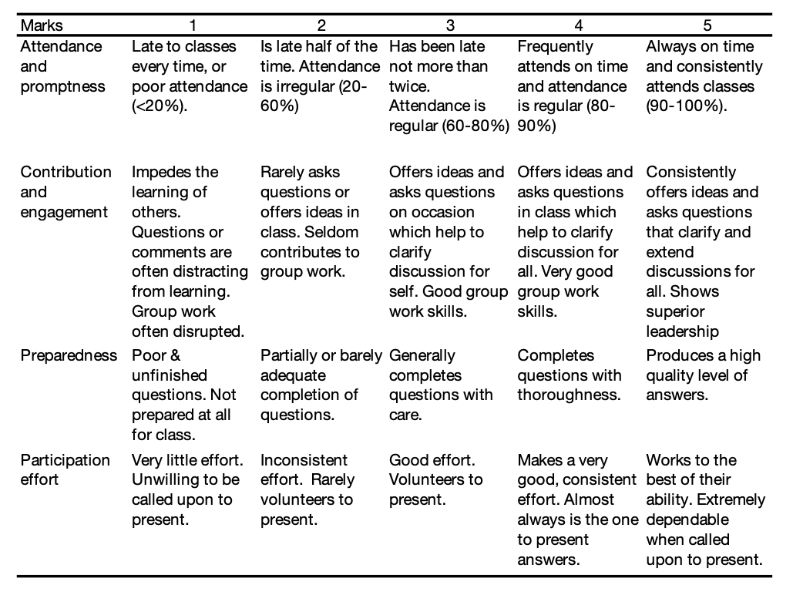

--- 
title: "SM-4331 Advanced Statistics"
author: "Dr Haziq Jamil"
date: "`r Sys.Date()`"
site: bookdown::bookdown_site
documentclass: book
bibliography: [book.bib, packages.bib, syllabus.bib]
# url: your book url like https://bookdown.org/yihui/bookdown
# cover-image: path to the social sharing image like images/cover.jpg
description: |
  Course notes for SM-4331 Advanced Statistics (UBD).
link-citations: yes
# github-repo: rstudio/bookdown-demo
---

# About {-}

```{r setup, include = FALSE}
library(tidyverse)
knitr::opts_chunk$set(fig.height = 4, fig.width = 7, out.width = "100%")
```

Updated for 2021/22 session.


```{r dates_bib, include = FALSE}
mon <- as.Date("2021-01-11")
# fri <- as.Date("2016-01-08")

advdate <- function(obj, adv) {
 tmon <- obj + 7*(adv-1)
 tfri <- obj + 6 + 7*(adv-1)
 tmon <- format(tmon, format="%d/%m")
 tfri <- format(tfri, format="%d/%m")
 zadv <- sprintf("%02d", ifelse(adv >=8, adv - 1, adv))
 
 if (adv == 8) {
   tmp <- paste0(tmon," -- ",tfri, ": Mid-semester Break")
 }
 else if (adv == 16) {
   tmp <- paste0(tmon," -- ",tfri, ": Revision Week")
 }
 else {
    tmp <- paste("Week ", zadv, sep='',", ", tmon," -- ",tfri)
 }
 return(tmp)
}

library(RefManageR)
# library(knitcitations)
# library(rcrossref)
bib <- ReadBib("syllabus.bib")
BibOptions(bib.style = "authoryear")
```


Welcome to SM-4331! 
This is a Level 4 Major Option module weighing 4 MCs. 
Students typically take this module in their fourth year (final or penultimate semester). 
It is highly recommended for students having a strong interest in statistics and probability, especially students whose final year project involves a statistical component.
SM-2205 Intermediate Statistics is a pre-requisite for this module, for which all students should have taken. 
SM-4331 Advanced Statistics complements SM-4337 Applied Statistics and SM-4339 Survival Analysis very nicely, so it will be beneficial to take these modules together.

This class is all about deepening your understanding about statistical inference.
There will be an emphasis on the mathematical aspects and theorem proving of important statistical concepts, and less on practical applications (this is left for SM-4337). 
Thus, it is a class about asking the question 'why?', rather than 'how?'.
However, most concepts introduced will be accompanied with `R` code for students to explore in their own time.
By the end of this module, hopefully, students will appreciate and be able to understand why things work the way they do in the statistical world.

Past student feedback on this module is that it is on the difficult side.
Well, it is *advanced* statistics, after all. 
Taking past feedback into account, I have redesigned this module to make it so that students get to follow the content better.
For more details, see the Class Philosophy section below.


## Module content {-}

*See the end of the document for the full module contents*

We will first revisit in further detail the fundamental building blocks of mathematical statistics, beginning with set theory, probability theory and probability distributions.
We will also learn about convergences of random variables in order to understand several very important results in statistics (e.g. the law of large numbers and the central limit theorem).
The syllabus then focusses on the three important statistical inference activities: point estimation, interval estimation, and hypothesis testing.
To cap things off, we will tackle linear regression, arguably the most important statistical tool at a practitioner's disposal, from a mathematical aspect.


## Readings {-}

I estimate that you will probably only absorb 40% of the material through my lectures alone. 
Please supplement your understanding by reading the texts. 
These books are written by professors and course instructors who have uncountably more experience than I have, and are more able to explain the statistical concepts much better than I ever could.
I used these books myself during my undergraduate years so I trust they will beneficial for you as they were for me!

#### Mandatory {-}

```{r, echo = FALSE, results = "asis"} 
thisbib <- bib["casella2002statistical", "wasserman2013all"]
paste0("- ", sapply(thisbib, function(x) paste0(capture.output(x), collapse = "")), collapse = "\n") %>% cat()
``` 


#### Optional {-}

```{r, echo = FALSE, results = "asis"} 
thisbib <- bib["pawitan2001all", "degroot2012probability"]
paste0("- ", sapply(thisbib, function(x) paste0(capture.output(x), collapse = "")), collapse = "\n") %>% cat()
``` 

## Class Format {-}

*See the end of the document for the full schedule*

Blended learning (mixture of face-to-face and online teaching). As per current university guidelines, I am instructed to conduct at least 40% of the course through online learning. Therefore, the format is as follows:

- **Video lectures**. Each topic will be presented via videos released incrementally topic by topic. You may view these at your leisure, but you should aim to complete the viewings before the next set of videos are released. You are encouraged to take notes. There will not be any face-to-face or Zoom lectures.

- **Tutorials**. We will have a 2-hour tutorial class (face-to-face) every other week. You will volunteer or be called upon to present the answers to the exercises. Another format we might do is "breakout sessions" where you split into small groups and tutor each other.

- **Breather/Recap sessions**. We will dedicate a 2-hour face-to-face class every other week to recap the completed part. During these sessions, you will have the opportunity to clarify any concept or idea that you are still unsure of. No new materials will be taught, it is only for answering questions. You may not ask about the "starred" questions in the tutorials directly.

Two weekly sessions are timetabled: *Tuesdays 1410-1600* and *Wednesdays 1150-1340*. Tuesday sessions will be for tutorials and Wednesdays for breather/recap sessions.
Note that since we are doing video lectures, we will only see each other every other week.
Classes will be in FOS 2.18, unless otherwise told.

## Assessment {-}

#### Formative assessment {-}

- 1 $\times$ mock exam in Week 14
- Exercise sheets

#### Summative assessment {-}

- **60% examination**: Closed-book, real-life and invigilated with "typical" worked out solutions type questions. The scheduled date for the exam is *Tuesday, 4 May 2021, 2.00-4.00pm* at Chancellor Hall (more details closer to the date). Answer 4 out of 5 questions. Calculators are allowed. A minimal formulae sheet will be provided, as well as statistical tables.

- **20% topical tests**: Open-book, multiple choice format, online submission through Canvas. There will be seven tests in total, corresponding to each topic/part of the module. In total, there are 100 equally weighted questions (0.2 points each) so each test will have 10-15 questions depending on the topic. Each test will be available as soon as a new topic is taught, and will be available until the next topic is taught. You may take the test at any time in between. You will have 12 hours to complete the test once you start it. **NO RETAKES**.

- **10% tutorials**: There are 7 planned tutorial sessions, corresponding to 7 exercise sheets. The majority of the questions are for practice (formative assessment), but there will 1-3 "starred" questions which you will have to hand in for grading. The total marks for all of these star questions will be 100, which then counts for 10% of the overall summative mark.

- **10% participation**: I will give you marks based on your participation during tutorial sessions, breather/recap sessions, as well as online Canvas discussion groups. The marks will reflect your participation level for the entire semester. The rubric is found in the table below.

- **(BONUS) 5% notes**: If you take notes for this course, you may submit them to me for grading. I will grade based on aesthetics (tidiness, organisation, readability) as well as content (did you grasp the key concepts? did you do all the little "green checks" from the lectures?). Check the schedule for submission dates.



## Key Data {-}

```{r studentperfdata, include = FALSE}
plot.df <- readxl::read_excel("data/sm4331data.xlsx")
plot.df$Grade <- factor(plot.df$Grade, levels = c("F", "P", "D", "D+", "C", "C+", "B", "B+", "A", "A+"))

# Average class size
plot.df %>% group_by(Year) %>% summarise(n = n()) -> tmp
avg.class.size <- mean(tmp$n)

# Latest class
tmp1 <- table(subset(plot.df, Year == "2020S2")$Grade)
latest.class <- tibble(Grade = names(tmp1), prop = tmp1 / sum(tmp1)) 
latest.class$Grade <- factor(latest.class$Grade, 
                             levels = c("F", "P", "D", "D+", "C", "C+", "B", "B+", "A", "A+"))
```

- Past class sizes: `r paste(tmp$Year, tmp$n, sep = " = ")` (avg: `r avg.class.size`)
- SFE grade average: 3.7 / 5.0 (`r iprior::dec_plac(100 * 3.7 / 5, 1)` %)

```{r studentperf, echo = FALSE}
ggplot(plot.df) +
  geom_bar(data = plot.df, aes(x = Grade, y = (..count..) / sum(..count..))) +
  geom_line(data = latest.class, aes(Grade, prop, group = 1, col = "2020S2"), 
            size = 0.9) +
  scale_x_discrete(drop = FALSE) +
  scale_y_continuous(labels = scales::percent) +
  theme_classic() +
  labs(y = "Proportion of students", 
       title = "Student performance from 2016/17 to 2020/21 combined",
       col = NULL) +
  theme(legend.position = c(0.92, 0.65))
```
\newpage

# Syllabus {-}


## Full Module Contents {-}

#### 1 Probability theory primer {-}
    
1. Elementary set theory
    - Sample space
    - Elementary set operations
2. Probability
    - Axiomatic probability
    - Derived probability results
    - Conditional probability
    - Bayes Theorem
    - Independent events
3. Random variables
    - Definition
    - Distribution functions
    - Identically distributed random variables
    - Continuous and discrete random variables
    - Probability functions
4. Multiple random variables
    - Bivariate distributions
    - Marginal distributions
    - Conditional distributions
    - Independent random variables
5. Expectation
    - Expected values
    - Expectations of functions of random variables
    - Properties of expectations
    - Variance, covariance, correlation
    - Properties of variances and covariances
    - Variance-covariance matrix
    - Conditional expectations
    - Law of total expectations and variance

#### 2 Commonly used probability models {-}

1. Moment generating functions
    - Definitions, properties and usage
2. Discrete models
    - Point mass, uniform, Bernoulli, binomial, geometric, negative binomial, Poisson distributions
    - Definitions and properties
3. Continuous models
    - Uniform, exponential, gamma, beta, normal distributions
    - Definitions and properties
4. Some relationships
    - Poisson & binomial
    - Poisson & exponential
    - Normal approximations
    
#### 3 Inequalities, convergences and normal random samples {-}

1. Inequalities
    - Probability inequalities (Markov's, Chebyshev's)
    - Inequalities for expectations (Cauchy-Schwartz, Jensen's)
2. Convergence of random variables
    - Limits of real sequences
    - Types of convergences for random variables (convergence in probability, distribution and mean-square)
    - Two limit theorems (The Law of Large Numbers and the Central Limit Theorem)
    - The Delta method
3. Normal samples
    - Random samples
    - Normal random samples (properties)
    - Derived distributions ($\chi^2$, $t$ and $F$ distribution)
    
#### 4 Point estimation {-}

1. Likelihood and sufficiency
    - Likelihood, likelihood ratio, log likelihood
    - Sufficient statistic
    - The factorisation theorem
    - Minimal sufficient statistic

2. Point estimators
    - Definition
    - Method of moments
    - Method of maximum likelihood
    - Invariance of MLE
    - Numerical computation of MLE

3. Evaluating estimators
    - Mean squared error, bias and variance
    - Best unbiased estimators
    - Cramer-Rao inequality
    - Fisher information
    - Rao-Blackwell Theorem

4. Large sample properties of the MLE
    - Consistency
    - Efficiency
    - Asymptotic normality

#### 5 Hypothesis testing {-}

1. A general paradigm
    - Identify a test statistic
    - Measure the strength of the evidence 
    - Likelihood ratio tests

2. The Neyman-Pearson approach
    - Terminology (critical regions, simple/composite, one/two-sided tests)
    - Performance of a test (size, power)
    - $p$-values
    - Type I and II errors
    - Neyman-Pearson lemma
    - Uniformly most powerful tests
    - $p$-values are uniform
    
3. Approximate tests
    - Large-sample distribution of likelihood ratio statistic
    - Wald test

#### 6 Interval estimation {-}

1. Intervals and plausible values
    - Confidence regions and intervals
    - Size/length
    - Coverage probability
    
2. Methods for obtaining confidence regions
    - Pivots
    - Inversion of a hypothesis test

3. Approximate confidence regions
    - Wald interval
    - Likelihood interval
    - Bootstrap confidence interval

#### 7 Linear regression {-}

1. Linear regression model
    - Aims and objectives
    - Definitions and assumptions
    
2. Model fitting and diagnosis
    - Least squares and maximum likelihood
    - Properties of the least squares estimator
    - Fitted values and residuals
3. Inference
    - Hypothesis tests ($t$-test, $F$-test, Wald test)
    - ANOVA as a linear model
    - Prediction
4. Model selection
    - Criteria (coefficient of determination, train/test error, Mallow's $C_p$, AIC, BIC)
    - Stepwise regression


## Class Schedule {-}

I endeavour to prepare the course materials (lecture slides, exercise sheets, etc.) well in advanced of the schedule.
Should you feel the desire to read through those (even the exercise sheets!) prior to viewing the videos, by all means follow your instincts.
The compulsory readings for each part are detailed at the beginning of the lecture slides, so please take a note of those.

#### `r advdate(mon, 1)`: (1) Probability theory primer {-}

- Video lectures

    1. Part 0.1: Introduction to SM-4331 (Admin)
    2. Part 0.2: Introduction to SM-4331 (About statistics)
    3. Part 1.1: Set theory and probability
    4. Part 1.2: Random variables
    5. Part 1.3: Multiple random variables
    6. Part 1.4: Expectations

- *Online test 1 due*

#### `r advdate(mon, 2)`: (2) Commonly used probability models {-}

- Video lectures

    1. Part 2.1: Introduction and moment generating functions
    2. Part 2.2: Discrete models
    3. Part 2.3: Continuous models
    4. Part 2.4: Some relationships

#### `r advdate(mon, 3)`: Tutorial and recap Parts 1 & 2 {-}

- [Tuesday 1410-1600] Tutorial class, exercise sheets 1 & 2

- [Wednesday 1150-1340] Breather/Recap class

- *Submit star solutions 1 & 2*

- *Online test 2 due*

#### `r advdate(mon, 4)`: (3) Inequalities, convergences and normal random samples {-}

- Video lectures

    1. Part 3.1: Inequalities
    2. Part 3.2: Convergence of random variables
    3. Part 3.3: Sampling from the normal distribution

#### `r advdate(mon, 5)`: Tutorial and recap Part 3 {-}

- [Tuesday 1410-1600] Tutorial class, exercise sheets 3

- [Wednesday 1150-1340] Breather/Recap class

- *Submit star solutions 3*

- *Online test 3 due*

#### `r advdate(mon, 6)`: (4) Point estimation {-}

- Video lectures

    1. Part 4.1: Likelihood and sufficiency
    2. Part 4.2: Point estimators
    3. Part 4.3: Evaluating estimators
    4. Part 4.4: Large sample properties of the MLE

#### `r advdate(mon, 7)`: Tutorial and recap Part 4 {-}

- [Tuesday 1410-1600] Tutorial class, exercise sheets 4

- [Wednesday 1150-1340] Breather/Recap class *[Present your notes to me in class]*

- *Submit star solutions 4*

- *Online test 4 due*

#### `r advdate(mon, 8)` {-}

*No classes and videos. Take a break!*

#### `r advdate(mon, 9)`: (5) Hypothesis testing {-}

- Video lectures

    1. Part 5.1: A general paradigm
    2. Part 5.2: The Neyman-Pearson approach
    3. Part 5.3: Approximate tests

#### `r advdate(mon, 10)`: Tutorial and recap Part 5 {-}

- [Tuesday 1410-1600] Tutorial class, exercise sheets 5

- [Wednesday 1150-1340] Breather/Recap class

- *Submit star solutions 5*

- *Online test 5 due*

#### `r advdate(mon, 11)`: (6) Interval estimation {-}

- Video lectures

    1. Part 6.1: Intervals and plausible values
    2. Part 6.2: Methods for obtaining confidence regions
    3. Part 6.3: Approximate confidence regions

#### `r advdate(mon, 12)`: Tutorial and recap Part 6 {-}

- [Tuesday 1410-1600] Tutorial class, exercise sheets 6

- [Wednesday 1150-1340] Breather/Recap class

- *Submit star solutions 6*

- *Online test 6 due*

#### `r advdate(mon, 13)`: (7) Linear regression {-}

- Video lectures

    1. Part 7.1: The linear regression model
    2. Part 7.2: Model fitting and diagnosis
    3. Part 7.3: Inference from the linear regression model
    4. Part 7.4: Model selection

#### `r advdate(mon, 14)`: Tutorial and recap Part 7 {-}

*Ramadhan starts on Tue 13/4/21, which will be a public holiday (TBC)*

- [Tuesday 1410-1600] Tutorial class, exercise sheets 7 **[possibly needs replacement]**

- [Wednesday 1150-1340] Breather/Recap class 

- *Submit star solutions 7*

- *Online test 7 due*

#### `r advdate(mon, 15)`: Mock exam {-}

- [Tuesday 1410-1600] *Mock exam, 2 hrs* (possible that this is online, TBC)

- [Wednesday 1150-1340] Discussion of mock exam solutions
 
#### `r advdate(mon, 16)` {-}

- [Tuesday 1410-1600] Revision class (if required, TBC)


#### Exam {-}


- 4/5/21 1400-1600 SM-4331 Exam
- *(Optional) Submit your notes for grading*


## Teaching Philosophy {-}

- I have split the contents into seven parts (previously five) in an effort to be more organised. 
The first two parts should be familiar to everyone so they serve really as a 'revision' of past learning.

- I have now made readings **compulsory**.
Obviously, I have no control of whether you do or do not read the recommended texts, but there will be many, many prompts along the way suggesting you do so.
Sometimes, you will find that key ideas are missing from my lectures, or I simply say "the proof is in C\&B, Thm 5.2.6".
I leave *some* things out **intentionally by design**, and there is a full expectation that you fill in the gaps by yourself **by reading** the selected texts.
If you find the lecture slides to be sparse, that's because they're slides, not notes!
Feel free (and you are highly encouraged) to write your own notes (and will be rewarded for it too).

- I am ensuring that we have at least 2 hours of tutorials for each topic. For each topic, I am also introducing "breather/recap classes" (the name is still TBC, I'm not very creative). The idea is to give some breathing space for everyone to recap and make sure the important concepts in the topic are fully understood before moving to the next topic. The format will be a 2-hour face-to-face contact time, similar to office hours, where you get the opportunity to ask questions and clarify things. No new materials will be taught, I will only answer your questions. Incidentally this will replace the unpopular office hour slots I typically reserve for this module.

- I am moving away from the traditional "2 $\times$ tests + 1 $\times$ exam" type of assessment. As the module can be quite challenging, I have designed the assessments in a manner that rewards **hard-working** students and **talented** students alike. There will also be more opportunities to earn points. Key details are

    - *Introduction of topical tests.* Yes, you read that right--there will be **seven** topical tests, but these are open-book MCQs completed online (on Canvas) at a slow pace. They will hopefully encourage you to read more! 
    - *Assessed tutorials.* For each tutorial, there are 2-3 "starred" questions which will be graded.
    - *Participation.* I will give you marks based on your participation in key activities including tutorial sessions, breather/recap sessions and Canvas discussions.
    - *(Bonus) Show me your notes!* I will give bonus marks if you submit to me your (physical or digital) notes that you have written. 
    - *(Not assessed) Mock exam.* We will stop lectures a week early and reserve the final week (not revision week) for you to complete an optional, non-assessed mock exam so that you can familiarise yourself with the real exam.

  With all of these changes, I hope to reduce the burden of being extremely busy at the middle and end of semester due to assignments and tests. Instead, expect to be constantly engaged throughout albeit at a moderate capacity.

- As mentioned, I try to include as many `R` code as I can so that you will be able to copy and paste this into your own `R` terminal to explore by yourself. I trust that this will be a very helpful learning aid for everyone. 

## Incidental Learning Outcomes {-}

Besides the core content of mathematical statistics that we will cover in this module, I really hope my students will be able to realise the following incidental learning outcomes:

1. To be able to present your arguments in a logical and cohesive manner, at the same time gain confidence in public speaking.

2. To train you to **read more**. I simply cannot emphasise enough how important reading is to your intellectual development. It will undoubtedly also improve your grammar and expand your vocabulary. Need some inspirational quotes? Here are several:

    - *A reader lives a thousand lives before he dies. The man who never reads lives only one.*
    - *Reading is the gateway skill that makes all other learning possible.* 
    - *She read books as one would breathe air, to fill up and live.*
    - *A book is a device to light the imagination.*

3. To connect statistical theory with applied computation via exploration of `R` code. If you've never learnt a programming language before, now is a good time to start. Sometimes the code is given so you can just copy and paste into an `R` terminal and see what happens for yourself!

4. To be self-independent in your studies. I understand that attending weekly, physical classes gives you a form of structure, makes you comfortable. Having video lectures that you can view in your own time is the opposite of this. Moreover, there are no notes to be had. This is an opportunity to instil self-discipline in yourself if you haven't had any to begin with, or to strengthen it if you've had some! If you stick to the schedule, complete all the tasks, you will do well.

## Miscellanea {-}

  - [A Twitter thread on education resources](https://twitter.com/danialAhamdani/status/1332679355756003332)
  - [Taking Good Notes](http://svmiller.com/blog/2014/09/taking-good-notes/)
  - [Fun with Attendance and Grades (i.e. Students Should Attend Class)](http://svmiller.com/blog/2016/05/fun-with-attendance-grades/)


# Course Policy {-}

Here I detail several policies pertaining to my course that I have in place.

## Communication Policy {-}

I am usually quick to respond to student e-mails, despite receiving about a gazillion of them each day. Perhaps it is partly due to my dislike of leaving things unattended and obsession to get things moving (this is my problem, not yours). 
In an effort to preserve my mental health, perhaps have a think first whether that e-mail is necessary. Here are some guidelines.

- If you are unable to come to tutorials or recap/breather class, and you're afraid of losing participation marks, then you are responsible for giving me a **note in hard copy** that documents the reason for the missed class. An e-mail is unnecessary unless the impromptu absence involved missing an exam.

- If you are emailing for an extension (star questions) or a remake (topical tests), the answer is always "no". The deadlines are flexible already as it is, so schedule your time accordingly.

- If you missed a class and wanted to know what was discussed, I sincerely think you're missing the point. The classes are meant for you to ask the questions and for me to see your level of understanding. By not being there you miss out on both counts. 

- If you have a question about the syllabus, perhaps read this syllabus.

- If you have a genuine question about the course contents, sure you could e-mail me. But why not post it up as a Canvas discussion and earn points?

I do not give out my WhatsApp number to my students. I think there should be clear boundaries between students and instructors, and this, in my opinion crosses that boundary. I have e-mail on my phone (for better or worse) so it really makes no difference if you WhatsApp or if you e-mail. E-mail communication is official, which means that you are accountable for what you say to me, and more importantly for what I say to you. Note that Canvas message is equal to e-mail.

## Attendance Policy {-}

#### Students {-}

I understand that sometimes unexpected things come about that delays us or prevents us altogether from class. Really, I do--I have spent 9 years in formal tertiary training learning about random events.
However, I also believe that *those who want to will make time, and those who don't want to will make excuses*.
So unless there is an excusable reason for your absence (or tardiness) then your participation marks will be affected. 

#### Teacher {-}

Ah, the life of an early-career academic. 
I often get asked what exactly does a professor do? 
Well, we split our time between research, teaching and admin work, often not in equal parts unfortunately. 
What this means for you is that sometimes there are "urgent" non-teaching matters that apparently require my attention, which may happen to clash with our schedule.
I don't expect this to happen very often (in the last 4 semesters I have only had to cancel/reschedule classes due to these reasons: marshall duties during convocation, UBD open day, Wawasan 2035 meeting, research travel).
But if they do, I promise that

- I will firstly do my best to keep our scheduled time together. Quite frankly, I'd rather talk about statistics with you than anything else.
- Failing that, I will keep you informed well ahead of time.
- I will reschedule the missed hours at a suitable time for everyone's benefit.

## Conduct {-}

- The medium of instruction is english. This means that I will officially lecture in english, converse in english, and write in english. I expect you to do the same. This is often misconstrued as shying away from our mother tongue (malay), but I assure you my intentions are noble. The majority of students will converse in anything other than proper english outside my class, so for the little time we spend together, at the very least you can get to practice your language skills.

- I intend to provide a safe and conducive environment for learning for my students, especially in tutorial classes. This means that you will not be ridiculed for making mistakes, or not knowing things, or forgetting things, etc. The purpose is to genuinely gauge your developmental level, and the only way I can do that is if you try. We will also not rudely interject or diminish each other's ideas, or worse yet, each other's character. Please be respectful.

- I expect each one of you to do the tests by yourself. This means no collaborative work, although it's fine to "Google" stuff if you need to or consult a dictionary for some tricky words. You may think, well it is open-book after all, so why can't we discuss among ourselve the solutions? Here's a secret: The tests are not meant to test your knowledge or ability, they are there to *force* you to refer back to your notes and reading materials :) Together with the note-writing process, these tests will reinforce the mind-map you have created in your brain, allowing you better recall, so you'll do better in the exam, which you are sitting for by yourself. Trust the process, trust me, and don't cheat.

## Learning Management System {-}

I'm a believer in LM systems like Canvas. Therefore this is the main avenue for me to distribute learning materials (slides, exercise sheets, solutions, etc.) as well as post announcements.
Canvas has an app for students that you may wish to download onto your smartphones (you can get notifications too). 
Alternatively, keep checking Canvas on your computers on a regular basis.

Canvas will also be the avenue for submissions. 
COVID-19 has made me realise that I much prefer marking on my iPad.
If you can upload a PDF copy of your work (I'm referring to the "starred" tutorial questions) that would be really great. 
Otherwise, you may drop a hard copy of your work into my pigeonhole.

# Exam tips {-}


*Disclaimer: This writeup is meant to give you rough guidance as to what to expect on the SM-4331 examination, as well as provide any advice which you may find useful while sitting for the exam. DO NOT take this guide as ABSOLUTE and EXHAUSTIVE--I do not guarantee that the things listed here will come out in the exam, and conversely nor the things that are not listed will not come out in the exam. USE AT YOUR OWN RISK.*

#### Exam format {-}

There are four questions on the exam, and full marks are obtained by answer only three out of these four questions. Each question contains multiple subparts. You have 2 hours to complete the exam. You should spend about 40 minutes per question.

The questions are very much like the tutorial questions. There are no MCQ type questions like in the quizzes. Partial marks can always be obtained by attempting parts of the quesions or subquestions. I value logic, presentation and coherence of your arguments over your ability to spit out facts from textbook. So be sure to communicate your ideas well, and don't just "drop equations" here and there. The harder it is for me to follow your idea, the less likely I will be able to award you marks for your effort.

Parts of the question may ask for definitions, proofs or descriptions of procedures. E.g. Define the term *consistency*, or show that XXX, or describe how you would construct an interval based on XXX. 

You will be provided a copy of relevant statistical tables, as well as a formula sheet. The formula sheet contains the pdf/pmf of the common distributions that we have learnt, their mean and variances too. The exception is the $t$, $\chi^2$ and $F$ distribution--you will need to memorise these separately. Also given are all the formula you will need relating to simple linear regression. 

#### How to study {-}

- A good indicator that you will do well in the exams is whether or not you could do the hand-in questions in the tutorial sheets **unguided**. If you have had help with them when submitting them to me, try redoing them again, and see if you are able to do them.

- The non hand-in questions are generally more challenging than the hand-in questions. So if you're able to do those, you're golden.

- There really is no way around this, you have to attempt more questions to get better at them. Practice is very important. C&B provides many exercises for you to do, go ahead and attempt them as much as you can.

#### Tips {-}

Here are some tips that might be useful to you.

1. If you see a sum of squares, e.g. $\sum (y_i-\mu)^2$ or similar, you should be tempted to do the "add and subtract $\bar y$" trick and see if it simplifies matters.

2. You should learn how to plot basic graphs such as $y^2$, $e^x$, $e^{-x}$, $\log x$, $1/\log x$, $xe^{-x}$, etc. *without* the use of a calculator. There are many guides available online and on YouTube. Generally, you want to find some interesting points on the graph (intercepts, turning points) and understand whether the function is increasing or decreasing in certain directions.

3. Practice deriving means, variances, mgfs, etc. of the distributions that we have learnt.

4. You are expected to know simple proofs that we have gone through in the lectures. Generally speaking, these are the ones that don't take up more than 2 lecture slides.

5. It's perfectly fine to use abbreviations, provided these are the common abbreviations that we have used in this module or commonly known in mathematics, e.g. MLE, pdf, pmf, iff, wlog, etc.

6. It's OK to skip the indices of sums or products, provided there is no confusion regarding them. For instance, $\sum_i X_i^2$ or even $\sum X_i^2$ is fine, but 
$\sum Y_{ij}$ is not--are you summing over $i$ or over $j$?

#### Topic guidance {-}

As a rule of thumb, *everything* covered in lectures is examinable. 
But you will notice that this course revolves around Topics 4, 5, 6 which are point estimation, hypothesis testing and confidence intervals. 
It is safe to say that the meat of the exam questions will be about these 3 topics. 
Topics 1, 2 and 3 serve as foundations for 4, 5 and 6--so in essence they must not be ignored entirely.
That is, choosing to focus on 4, 5, 6 only without caring for 1, 2, 3 and even 7 is a bad strategy.

You might realise some subjects are not really "exam material". For instance, how could you possibly be asked to calculate a bootstrap interval without access to a computer? Or how could you fit a linear model when it is typically done in R? My response is even if it is not feasible to do these things on pen and paper, you might still be asked about *procedures*. E.g. Describe how you would construct a bootstrap interval etc. Alternatively, maybe the statistics of interest will be given to you, and all you're left to do is to apply them.

#### On the likelihood {-}

By now you should realise how important the subject of likelihood is to frequentist statistics. Every new chapter we turn (after topics 1, 2, 3) involve the likelihood. This is the bread and butter of statistics and therefore SM-4331. You must know

- What the likelihood is and how to obtain it
- How to derive the MLE
- Properties of the MLE
- Fisher information, Cramer-Rao etc.
- Things you can do with the MLE (i.e. confidence intervals, asymptotic tests, etc.)

Make sure you are comfortable with finding the MLE of **ANY** pdf thrown at you, whether you have seen it before or you have not seen it. Remember the two techniques: does it have an indicator function? or can you just differentiate it directly?


```{r include=FALSE}
# automatically create a bib database for R packages
knitr::write_bib(c(
  .packages(), 'bookdown', 'knitr', 'rmarkdown'
), 'packages.bib')
```
