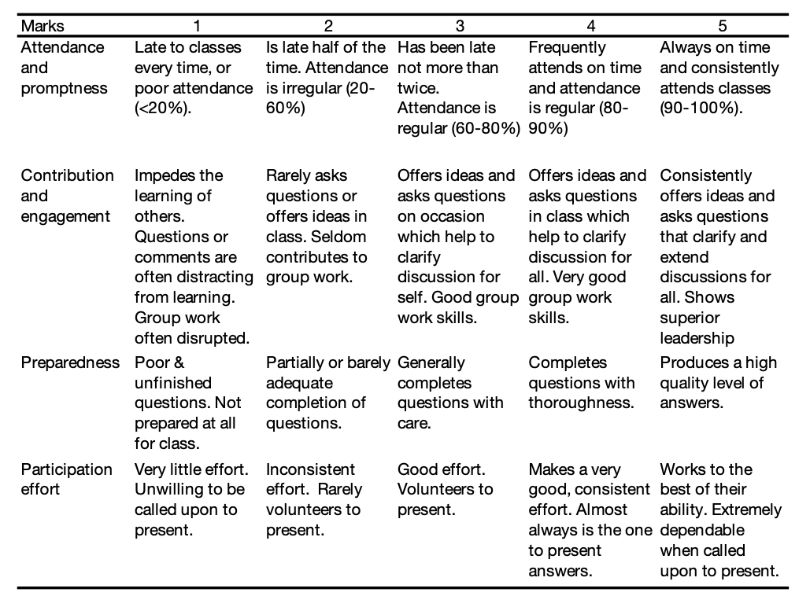

--- 
title: "SM-4331 Advanced Statistics"
author: "Dr Haziq Jamil"
date: "`r Sys.Date()`"
site: bookdown::bookdown_site
documentclass: book
bibliography: [book.bib, packages.bib, syllabus.bib]
# url: your book url like https://bookdown.org/yihui/bookdown
# cover-image: path to the social sharing image like images/cover.jpg
description: |
    Course notes for SM-4331 Advanced Statistics (UBD).
link-citations: yes
# github-repo: rstudio/bookdown-demo
---

# About {-}

```{r maths_shortcuts, echo = FALSE, include = knitr::is_html_output()}
# When the knitr output is HTML, then load these convenient maths shortcuts
knitr::asis_output(readLines("maths.tex"))
```

```{r setup, include = FALSE}
library(tidyverse)
library(ggpubr)
knitr::opts_chunk$set(fig.height = 4, fig.width = 7, out.width = "100%", 
                      fig.align = "center")
knitr::opts_chunk$set(dev.args=list(bg="transparent"))
theme_set(theme_classic())
theme_update(panel.background = element_rect(fill = "transparent", colour = NA),
             plot.background = element_rect(fill = "transparent", colour = NA))
```

```{r render_badge, echo = FALSE, include = knitr::is_html_output()}
knitr::asis_output("")
```

```{r dates_bib, include = FALSE}
mon <- as.Date("2021-01-11")
# fri <- as.Date("2016-01-08")

advdate <- function(obj, adv) {
 tmon <- obj + 7*(adv-1)
 tfri <- obj + 6 + 7*(adv-1)
 tmon <- format(tmon, format="%d/%m")
 tfri <- format(tfri, format="%d/%m")
 zadv <- sprintf("%02d", ifelse(adv >=8, adv - 1, adv))
 
 if (adv == 8) {
   tmp <- paste0(tmon," -- ",tfri, ": Mid-semester Break")
 }
 else if (adv == 16) {
   tmp <- paste0(tmon," -- ",tfri, ": Revision Week")
 }
 else {
    tmp <- paste("Week ", zadv, sep='',", ", tmon," -- ",tfri)
 }
 return(tmp)
}

library(RefManageR)
# library(knitcitations)
# library(rcrossref)
bib <- ReadBib("syllabus.bib")
BibOptions(bib.style = "authoryear")
```

*Updated for 2021/22 session.*

These are the course notes for SM-4331 Advanced Statistics, a fourth-year module taken by students at Universiti Brunei Darussalam (UBD).
The course covers the mathematical theory behind statistical inference concepts.

## Contents {-}

Welcome to SM-4331! 
This is a Level 4 Major Option module weighing 4 MCs. 
Students typically take this module in their fourth year (final or penultimate semester). 
It is highly recommended for students having a strong interest in statistics and probability, especially students whose final year project involves a statistical component.
SM-2205 Intermediate Statistics is a pre-requisite for this module, for which all students should have taken. 
SM-4331 Advanced Statistics complements SM-4337 Applied Statistics and SM-4339 Survival Analysis very nicely, so it will be beneficial to take these modules together.

This class is all about deepening your understanding about statistical inference.
There will be an emphasis on the mathematical aspects and theorem proving of important statistical concepts, and less on practical applications (this is left for SM-4337). 
Thus, it is a class about asking the question 'why?', rather than 'how?'.
However, most concepts introduced will be accompanied with `R` code for students to explore in their own time.
By the end of this module, hopefully, students will appreciate and be able to understand why things work the way they do in the statistical world.

Past student feedback on this module is that it is on the difficult side.
Well, it is *advanced* statistics, after all. 
Taking past feedback into account, I have redesigned this module to make it so that students get to follow the content better.
For more details, see the Class Philosophy section below.

### Goals {-}

We will first revisit in further detail the fundamental building blocks of mathematical statistics, beginning with set theory, probability theory and probability distributions.
We will also learn about convergences of random variables in order to understand several very important results in statistics (e.g. the law of large numbers and the central limit theorem).
The syllabus then focusses on the three important statistical inference activities: point estimation, interval estimation, and hypothesis testing.
To cap things off, we will tackle linear regression, arguably the most important statistical tool at a practitioner's disposal, from a mathematical aspect.

### Incidental learning outcomes {-}

Besides the core content of mathematical statistics that we will cover in this module, I really hope my students will be able to realise the following incidental learning outcomes:

1. To be able to present your arguments in a logical and cohesive manner, at the same time gain confidence in public speaking.

2. To train you to **read more**. I simply cannot emphasise enough how important reading is to your intellectual development. It will undoubtedly also improve your grammar and expand your vocabulary. Need some inspirational quotes? Here are several:

    - *A reader lives a thousand lives before he dies. The man who never reads lives only one.*
    - *Reading is the gateway skill that makes all other learning possible.* 
    - *She read books as one would breathe air, to fill up and live.*
    - *A book is a device to light the imagination.*

3. To connect statistical theory with applied computation via exploration of `R` code. If you've never learnt a programming language before, now is a good time to start. Sometimes the code is given so you can just copy and paste into an `R` terminal and see what happens for yourself!

4. To be self-independent in your studies. I understand that attending weekly, physical classes gives you a form of structure, makes you comfortable. Having video lectures that you can view in your own time is the opposite of this. Moreover, there are no notes to be had. This is an opportunity to instil self-discipline in yourself if you haven't had any to begin with, or to strengthen it if you've had some! If you stick to the schedule, complete all the tasks, you will do well.

## Module information {-}

### Class format {-}

Blended learning (mixture of face-to-face and online teaching). As per current university guidelines, I am instructed to conduct at least 40% of the course through online learning. Therefore, the format is as follows:

- **Video lectures**. Each topic will be presented via videos released incrementally topic by topic. You may view these at your leisure, but you should aim to complete the viewings before the next set of videos are released. You are encouraged to take notes. There will not be any face-to-face or Zoom lectures.

- **Tutorials**. We will have a 2-hour tutorial class (face-to-face) every other week. You will volunteer or be called upon to present the answers to the exercises. Another format we might do is "breakout sessions" where you split into small groups and tutor each other.

- **Breather/Recap sessions**. We will dedicate a 2-hour face-to-face class every other week to recap the completed part. During these sessions, you will have the opportunity to clarify any concept or idea that you are still unsure of. No new materials will be taught, it is only for answering questions. You may not ask about the "starred" questions in the tutorials directly.

Two weekly sessions are timetabled: *Tuesdays 1410-1600* and *Wednesdays 1150-1340*. Tuesday sessions will be for tutorials and Wednesdays for breather/recap sessions.
Note that since we are doing video lectures, we will only see each other every other week.
Classes will be in FOS 2.18, unless otherwise told.

### Assessment {-}

#### Formative assessment {-}

- 1 $\times$ mock exam in Week 14
- Exercise sheets

#### Summative assessment {-}

- **60% examination**: Closed-book, real-life and invigilated with "typical" worked out solutions type questions. The scheduled date for the exam is *Tuesday, 4 May 2021, 2.00-4.00pm* at Chancellor Hall (more details closer to the date). Answer 4 out of 5 questions. Calculators are allowed. A minimal formulae sheet will be provided, as well as statistical tables.

- **20% topical tests**: Open-book, multiple choice format, online submission through Canvas. There will be seven tests in total, corresponding to each topic/part of the module. In total, there are 100 equally weighted questions (0.2 points each) so each test will have 10-15 questions depending on the topic. Each test will be available as soon as a new topic is taught, and will be available until the next topic is taught. You may take the test at any time in between. You will have 12 hours to complete the test once you start it. **NO RETAKES**.

- **10% tutorials**: There are 7 planned tutorial sessions, corresponding to 7 exercise sheets. The majority of the questions are for practice (formative assessment), but there will 1-3 "starred" questions which you will have to hand in for grading. The total marks for all of these star questions will be 100, which then counts for 10% of the overall summative mark.

- **10% participation**: I will give you marks based on your participation during tutorial sessions, breather/recap sessions, as well as online Canvas discussion groups. The marks will reflect your participation level for the entire semester. The rubric is found in the table below.

- **(BONUS) 5% notes**: If you take notes for this course, you may submit them to me for grading. I will grade based on aesthetics (tidiness, organisation, readability) as well as content (did you grasp the key concepts? did you do all the little "green checks" from the lectures?). Check the schedule for submission dates.



### Key data {-}

```{r studentperfdata, include = FALSE}
plot.df <- readxl::read_excel("data/sm4331data.xlsx")
plot.df$Grade <- factor(plot.df$Grade, levels = c("F", "P", "D", "D+", "C", "C+", "B", "B+", "A", "A+"))

# Average class size
plot.df %>% group_by(Year) %>% summarise(n = n()) -> tmp
avg.class.size <- mean(tmp$n)

# Latest class
tmp1 <- table(subset(plot.df, Year == "2020S2")$Grade)
latest.class <- tibble(Grade = names(tmp1), prop = tmp1 / sum(tmp1)) 
latest.class$Grade <- factor(latest.class$Grade, 
                             levels = c("F", "P", "D", "D+", "C", "C+", "B", "B+", "A", "A+"))
```

- Past class sizes: `r paste(tmp$Year, tmp$n, sep = " = ")` (avg: `r avg.class.size`)
- SFE grade average: 3.7 / 5.0 (`r iprior::dec_plac(100 * 3.7 / 5, 1)` %)

```{r studentperf, echo = FALSE}
ggplot(plot.df) +
  geom_bar(data = plot.df, aes(x = Grade, y = (..count..) / sum(..count..))) +
  geom_line(data = latest.class, aes(Grade, prop, group = 1, col = "2020S2"), 
            size = 0.9) +
  scale_x_discrete(drop = FALSE) +
  scale_y_continuous(labels = scales::percent) +
  theme_classic() +
  labs(y = "Proportion of students", 
       title = "Student performance from 2016/17 to 2020/21 combined",
       col = NULL) +
  theme(legend.position = c(0.92, 0.65))
```

## Course policy {-}

Here I detail several policies pertaining to my course that I have in place.

### Communication policy {-}

I am usually quick to respond to student e-mails, despite receiving about a gazillion of them each day. Perhaps it is partly due to my dislike of leaving things unattended and obsession to get things moving (this is my problem, not yours). 
In an effort to preserve my mental health, perhaps have a think first whether that e-mail is necessary. Here are some guidelines.

- If you are unable to come to tutorials or recap/breather class, and you're afraid of losing participation marks, then you are responsible for giving me a **note in hard copy** that documents the reason for the missed class. An e-mail is unnecessary unless the impromptu absence involved missing an exam.

- If you are emailing for an extension (star questions) or a remake (topical tests), the answer is always "no". The deadlines are flexible already as it is, so schedule your time accordingly.

- If you missed a class and wanted to know what was discussed, I sincerely think you're missing the point. The classes are meant for you to ask the questions and for me to see your level of understanding. By not being there you miss out on both counts. 

- If you have a question about the syllabus, perhaps read this syllabus.

- If you have a genuine question about the course contents, sure you could e-mail me. But why not post it up as a Canvas discussion and earn points?

I do not give out my WhatsApp number to my students. I think there should be clear boundaries between students and instructors, and this, in my opinion crosses that boundary. I have e-mail on my phone (for better or worse) so it really makes no difference if you WhatsApp or if you e-mail. E-mail communication is official, which means that you are accountable for what you say to me, and more importantly for what I say to you. Note that Canvas message is equal to e-mail.

### Attendance policy {-}

#### Students {-}

I understand that sometimes unexpected things come about that delays us or prevents us altogether from class. Really, I do--I have spent 9 years in formal tertiary training learning about random events.
However, I also believe that *those who want to will make time, and those who don't want to will make excuses*.
So unless there is an excusable reason for your absence (or tardiness) then your participation marks will be affected. 

#### Teacher {-}

Ah, the life of an early-career academic. 
I often get asked what exactly does a professor do? 
Well, we split our time between research, teaching and admin work, often not in equal parts unfortunately. 
What this means for you is that sometimes there are "urgent" non-teaching matters that apparently require my attention, which may happen to clash with our schedule.
I don't expect this to happen very often (in the last 4 semesters I have only had to cancel/reschedule classes due to these reasons: marshall duties during convocation, UBD open day, Wawasan 2035 meeting, research travel).
But if they do, I promise that

- I will firstly do my best to keep our scheduled time together. Quite frankly, I'd rather talk about statistics with you than anything else.
- Failing that, I will keep you informed well ahead of time.
- I will reschedule the missed hours at a suitable time for everyone's benefit.

### Conduct {-}

- The medium of instruction is english. This means that I will officially lecture in english, converse in english, and write in english. I expect you to do the same. This is often misconstrued as shying away from our mother tongue (malay), but I assure you my intentions are noble. The majority of students will converse in anything other than proper english outside my class, so for the little time we spend together, at the very least you can get to practice your language skills.

- I intend to provide a safe and conducive environment for learning for my students, especially in tutorial classes. This means that you will not be ridiculed for making mistakes, or not knowing things, or forgetting things, etc. The purpose is to genuinely gauge your developmental level, and the only way I can do that is if you try. We will also not rudely interject or diminish each other's ideas, or worse yet, each other's character. Please be respectful.

- I expect each one of you to do the tests by yourself. This means no collaborative work, although it's fine to "Google" stuff if you need to or consult a dictionary for some tricky words. You may think, well it is open-book after all, so why can't we discuss among ourselve the solutions? Here's a secret: The tests are not meant to test your knowledge or ability, they are there to *force* you to refer back to your notes and reading materials :) Together with the note-writing process, these tests will reinforce the mind-map you have created in your brain, allowing you better recall, so you'll do better in the exam, which you are sitting for by yourself. Trust the process, trust me, and don't cheat.

### Learning Management System {-}

I'm a believer in LM systems like Canvas. Therefore this is the main avenue for me to distribute learning materials (slides, exercise sheets, solutions, etc.) as well as post announcements.
Canvas has an app for students that you may wish to download onto your smartphones (you can get notifications too). 
Alternatively, keep checking Canvas on your computers on a regular basis.

Canvas will also be the avenue for submissions. 
COVID-19 has made me realise that I much prefer marking on my iPad.
If you can upload a PDF copy of your work (I'm referring to the "starred" tutorial questions) that would be really great. 
Otherwise, you may drop a hard copy of your work into my pigeonhole.

## Resources {-}

### This course {-}

- My lecture slides
- This book

### Textbooks {-}

I estimate that you will probably only absorb 40% of the material through my lectures alone. 
Please supplement your understanding by reading the texts. 
These books are written by professors and course instructors who have uncountably more experience than I have, and are more able to explain the statistical concepts much better than I ever could.
I used these books myself during my undergraduate years so I trust they will beneficial for you as they were for me!

```{r, echo = FALSE, results = "asis"} 
thisbib <- bib["casella2002statistical", "wasserman2013all"]
paste0("- ", sapply(thisbib, function(x) paste0(capture.output(x), collapse = "")), collapse = "\n") %>% cat()
``` 


```{r, echo = FALSE, results = "asis"} 
thisbib <- bib["pawitan2001all", "degroot2012probability"]
paste0("- ", sapply(thisbib, function(x) paste0(capture.output(x), collapse = "")), collapse = "\n") %>% cat()
``` 

### Miscellaneous {-}

- [A Twitter thread on education resources](https://twitter.com/danialAhamdani/status/1332679355756003332)
- [Taking Good Notes](http://svmiller.com/blog/2014/09/taking-good-notes/)
- [Fun with Attendance and Grades (i.e. Students Should Attend Class)](http://svmiller.com/blog/2016/05/fun-with-attendance-grades/)

Really recommended:

- [All About that Bayes: Probability, Statistics, and the Quest to Quantify Uncertainty](https://youtu.be/eDMGDhyDxuY). Talk by Dr. Kristin Lennox on YouTube.

- https://www.qualitydigest.com/inside/standards-column/secret-foundation-statistical-inference-120115.html
